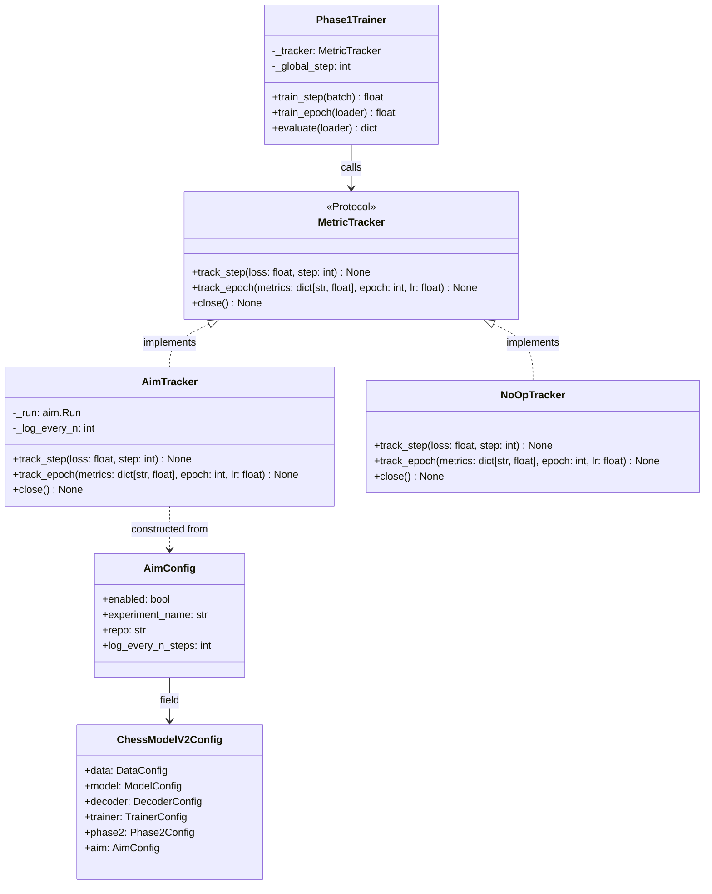
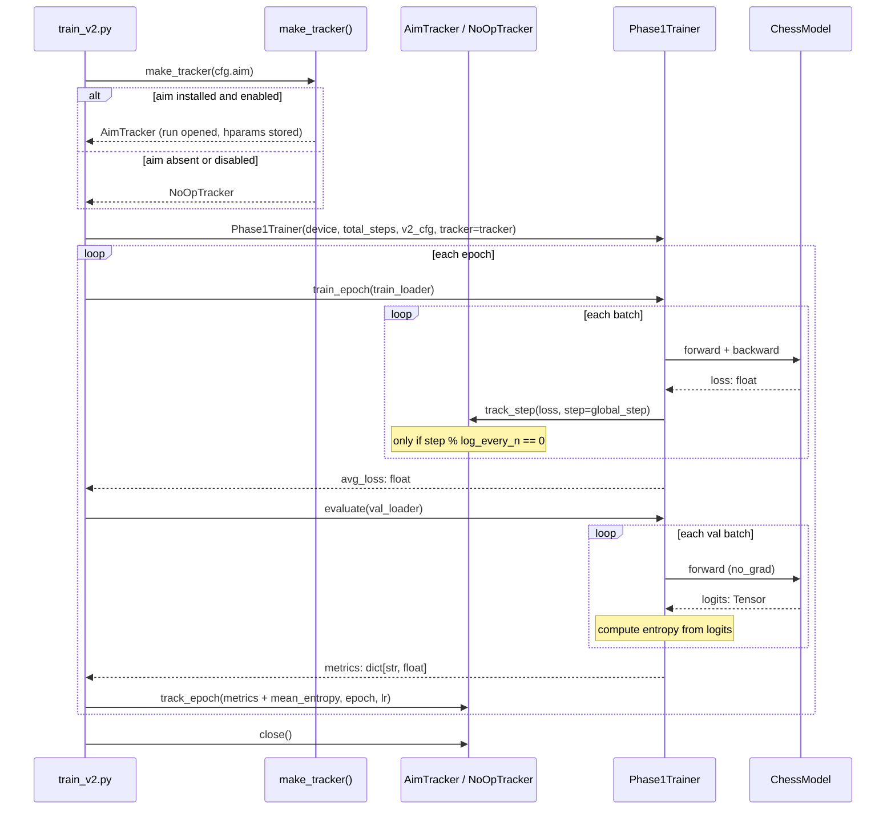

# Aim Experiment Tracking Integration — Design

## Problem Statement

The chess-sim training pipeline (`scripts/train_v2.py` + `Phase1Trainer`) logs metrics
exclusively through Python's `logging` module, producing ephemeral text output with no
persistent storage, no step-level granularity, and no entropy tracking. Without a
structured experiment store, comparing runs across hyperparameter sweeps or dataset
sizes requires manual log parsing. The `aim` open-source experiment tracker provides a
local SQLite/RocksDB backend with a web UI and Python SDK; integrating it now, while the
project is still pre-Phase-2, costs minimal coupling and yields immediate observability
benefits.

---

## Feasibility Analysis

| Approach | Pros | Cons | Verdict |
|---|---|---|---|
| **A. Wrap `aim.Run` behind a `MetricTracker` Protocol** — `AimTracker` implements the Protocol; `NoOpTracker` is the fallback. Training script injects the tracker. | Full decoupling; aim is optional; testable in isolation; no changes to `Phase1Trainer` internals beyond accepting a tracker argument | Requires adding a `tracker` argument to `train_epoch` / `evaluate` (or passing it at construction time) | **Accept** |
| **B. Subclass `Phase1Trainer` as `TrackedPhase1Trainer`** — override `train_step` / `train_epoch` / `evaluate` to inject aim calls | Keeps base class pristine; Python-idiomatic inheritance | Deep subclassing of a concrete class is fragile; callers must know which subclass to instantiate; harder to swap trackers | Reject — fragile hierarchy |
| **C. Decorate existing methods with an `@aim_track` decorator at call-site** — monkey-patch aim tracking onto `train_step` / `train_epoch` | Minimal diffs; no new classes | Decorators that mutate external state (aim run) are a cross-cutting concern misuse; impossible to test without live aim; relies on closure capture of `Run` object | Reject — non-testable |
| **D. Direct `aim.Run` calls inside `Phase1Trainer`** — hard-code aim inside the trainer | Minimal abstraction | Tight coupling; any non-aim environment (CI, unit tests) requires `aim` to be installed; no optional path | Reject — no backward compat |

**aim API surface used (confirmed via hypothesis script):**

| API | Usage |
|---|---|
| `aim.Run(experiment=, repo=, log_system_params=False, capture_terminal_logs=False)` | Create one Run per training session |
| `run.track(value, name=, step=, epoch=)` | Log any scalar metric |
| `run["hparams"] = dict` | Store hyperparameters as run metadata |
| `run.close()` | Flush and seal the run |

---

## Chosen Approach

Approach A is accepted. A `MetricTracker` Protocol defines `track_step`, `track_epoch`,
and `close`. `AimTracker` wraps `aim.Run` and implements the Protocol. `NoOpTracker` is
a zero-dependency fallback used when `aim` is absent or `AimConfig.enabled=False`. A
module-level factory function `make_tracker(cfg: AimConfig) -> MetricTracker` handles
the import guard and returns the appropriate implementation. The training script receives
the tracker at construction and calls it explicitly at known points (after each step, at
end of each epoch). `Phase1Trainer` gains an optional `tracker` constructor parameter
typed as `MetricTracker | None`; when `None`, training is completely unaffected.

---

## Architecture

### Static structure



### Runtime sequence (one training session)



---

## Component Breakdown

### `chess_sim/tracking/__init__.py` (new module)

- **Responsibility:** Exports `MetricTracker`, `AimTracker`, `NoOpTracker`, `make_tracker`.
- **Key interfaces:**
  ```python
  class MetricTracker(Protocol):
      def track_step(self, loss: float, step: int) -> None: ...
      def track_epoch(
          self,
          metrics: dict[str, float],
          epoch: int,
          lr: float,
      ) -> None: ...
      def close(self) -> None: ...
  ```
- Testable in isolation: `NoOpTracker` requires zero dependencies.

### `chess_sim/tracking/aim_tracker.py` (new file)

- **Responsibility:** Wraps `aim.Run`; logs step-level and epoch-level scalars.
- **Key interface:**
  ```python
  class AimTracker:
      def __init__(self, cfg: AimConfig) -> None: ...
      # Opens aim.Run; stores cfg.experiment_name, cfg.repo
      # Calls run["hparams"] = {...} once at construction

      def track_step(self, loss: float, step: int) -> None: ...
      # Calls run.track(loss, name="train_loss", step=step)
      # only when step % cfg.log_every_n_steps == 0

      def track_epoch(
          self,
          metrics: dict[str, float],
          epoch: int,
          lr: float,
      ) -> None: ...
      # Iterates metrics dict; calls run.track(v, name=k, epoch=epoch)
      # Also calls run.track(lr, name="lr", epoch=epoch)

      def close(self) -> None: ...
      # Calls run.close()
  ```
- Testable: inject a `MagicMock` for `aim.Run` in unit tests; assert `track` call count.

### `chess_sim/tracking/noop_tracker.py` (new file)

- **Responsibility:** Silent fallback; all methods are `pass` bodies.
- **Key interface:** Same as `MetricTracker` Protocol above.
- Testable: confirm all methods exist and accept correct argument types.

### `chess_sim/tracking/factory.py` (new file)

- **Responsibility:** Single public entry point; handles the import guard.
- **Key interface:**
  ```python
  def make_tracker(cfg: AimConfig) -> MetricTracker:
      """Return AimTracker when aim is installed and cfg.enabled,
      else return NoOpTracker. Never raises ImportError."""
  ```
- Logic:
  1. If `cfg.enabled` is `False` → return `NoOpTracker()`.
  2. Try `import aim`. On `ImportError` → log warning, return `NoOpTracker()`.
  3. On success → return `AimTracker(cfg)`.
- Testable: monkeypatch `sys.modules["aim"]` in unit tests.

### `chess_sim/config.py` (modified)

- **Responsibility:** Add `AimConfig` dataclass; add `aim` field to `ChessModelV2Config`; update `load_v2_config`.
- **Key additions:**
  ```python
  @dataclass
  class AimConfig:
      enabled: bool = False
      experiment_name: str = "chess_v2"
      repo: str = ".aim"
      log_every_n_steps: int = 50
  ```
  `ChessModelV2Config` gains:
  ```python
  aim: AimConfig = field(default_factory=AimConfig)
  ```
  `load_v2_config` gains:
  ```python
  aim=AimConfig(**raw.get("aim", {})),
  ```
- Backward compatible: `AimConfig` has `enabled=False` default, so existing YAML files
  that omit the `aim` section train without aim.

### `chess_sim/training/phase1_trainer.py` (modified)

- **Responsibility:** Accept optional `tracker: MetricTracker` at construction;
  maintain `_global_step: int`; call tracker at the correct points.
- Constructor change (typed signature only):
  ```python
  def __init__(
      self,
      device: str = "cpu",
      total_steps: int = 10_000,
      v2_cfg: ChessModelV2Config | None = None,
      tracker: MetricTracker | None = None,
  ) -> None:
      ...
      self._tracker: MetricTracker = tracker or NoOpTracker()
      self._global_step: int = 0
  ```
- `train_step` change: after `self.scheduler.step()`, increment `_global_step` and call
  `self._tracker.track_step(loss, self._global_step)`.
- `train_epoch` change: no additional changes — step-level tracking happens inside
  `train_step`.
- `evaluate` change: compute `mean_entropy` from logits before returning; include it in
  the returned `dict` under key `"mean_entropy"`.
  ```python
  # Entropy computation (pseudocode only)
  probs = softmax(logits, dim=-1)          # shape (B, T, V)
  log_probs = log_softmax(logits, dim=-1)
  entropy = -(probs * log_probs).sum(-1)   # (B, T)
  mean_H = entropy[mask].mean().item()     # exclude PAD
  ```
- Testable: pass a `MagicMock` tracker; assert `track_step` call count equals number of
  batches; assert `track_epoch` receives `mean_entropy` key.

### `scripts/train_v2.py` (modified)

- **Responsibility:** Call `make_tracker(cfg.aim)`, pass tracker to `Phase1Trainer`,
  call `tracker.close()` in a `try/finally` block.
- Change is additive: three new lines (construct tracker, pass to trainer, close).
- `track_epoch` is called in the existing epoch loop after `trainer.evaluate`.

### YAML (`configs/train_v2_hdf5_10k.yaml`) (extended, optional)

New optional section:
```yaml
aim:
  enabled: true
  experiment_name: chess_v2_hdf5_10k
  repo: .aim
  log_every_n_steps: 50
```
Omitting the section is valid; `AimConfig` defaults apply.

---

## Test Cases

| ID | Scenario | Input | Expected Outcome | Edge? |
|---|---|---|---|---|
| T1 | `make_tracker` with aim installed and `enabled=True` | `AimConfig(enabled=True)` | Returns `AimTracker` instance | No |
| T2 | `make_tracker` with `enabled=False` | `AimConfig(enabled=False)` | Returns `NoOpTracker`; no aim import attempted | No |
| T3 | `make_tracker` when `aim` absent from `sys.modules` | monkeypatch `aim` import to raise `ImportError` | Returns `NoOpTracker`; emits a warning log; no exception propagated | Yes |
| T4 | `AimTracker.track_step` respects `log_every_n_steps` | `log_every_n_steps=10`; call `track_step` 25 times | `run.track` called exactly 2 times (steps 10, 20) | No |
| T5 | `AimTracker.track_step` at step 0 | step=0 | `run.track` not called (0 % N == 0 but step 0 is pre-training; guard: `step > 0 and step % n == 0`) | Yes |
| T6 | `AimTracker.track_epoch` logs all metric keys | `metrics={"val_loss":1.0, "val_accuracy":0.5, "mean_entropy":1.2}`, `epoch=3`, `lr=1e-4` | `run.track` called 4 times (3 metrics + lr) with correct `epoch` arg | No |
| T7 | `AimTracker` stores hparams on construction | `AimConfig(experiment_name="test")` | `run["hparams"]` is set once during `__init__` | No |
| T8 | `NoOpTracker` never raises | any valid metric dict | All methods return `None`; no exception | No |
| T9 | `Phase1Trainer` with `tracker=None` trains normally | default construction | `_tracker` resolves to `NoOpTracker`; no import error | No |
| T10 | `Phase1Trainer._global_step` increments per batch | 3-batch mock loader | `_tracker.track_step` called with steps 1, 2, 3 | No |
| T11 | `evaluate` returns `mean_entropy` key | mock val loader with known logits | returned dict contains `"mean_entropy"` as a finite float | No |
| T12 | `AimConfig` loads from YAML `aim:` section | YAML with `log_every_n_steps: 100` | `AimConfig.log_every_n_steps == 100` | No |
| T13 | `load_v2_config` on YAML missing `aim:` section | existing `train_v2_hdf5_10k.yaml` unmodified | `cfg.aim == AimConfig()` (defaults); no error | Yes |
| T14 | Entropy is zero for a perfectly peaked distribution | logits with one entry = 1e6 | `mean_entropy < 0.001` | Yes |
| T15 | `tracker.close()` called even when training raises | inject exception in epoch 2 | `close()` invoked via `finally` in `train_v2.py` | Yes |

---

## Coding Standards

- **DRY** — entropy computation lives in a single private helper
  `_mean_entropy(logits: Tensor, mask: Tensor) -> float` in `phase1_trainer.py`.
  No duplication between `evaluate` and any future eval scripts.
- **Decorators** — `@log_metrics` on `train_step` / `train_epoch` is preserved; aim
  tracking is injected via explicit method calls (not a new decorator) because it carries
  mutable run state that decorators should not own.
- **Typing** — all new signatures carry full type annotations. `MetricTracker` is a
  `typing.Protocol`; no bare `Any`. `AimConfig` fields are primitive types only.
- **Comments** — all doc-strings and inline comments remain within 280 characters.
- **`unittest` first** — `tests/test_aim_tracking.py` is written before any
  implementation; it covers T1-T15 above using `MagicMock` for `aim.Run`.
- **New dependency** — `aim>=3.17` must be added to `requirements.txt` with justification
  comment: `# aim: experiment tracking UI; optional at runtime (NoOpTracker fallback)`.
  The package must be listed; absence at runtime is handled by the import guard, not by
  removing it from requirements.

---

## Open Questions

1. **Aim repo location** — should `.aim/` live at the project root (default in the design)
   or alongside HDF5 data under `data/`? The implementor should confirm with the team to
   avoid committing the aim repo to git accidentally (`.gitignore` update required).

2. **Hparam dict content** — the design stores all fields of `AimConfig` + key fields
   from `TrainerConfig` and `ModelConfig`. Confirm the exact field list to avoid
   accidentally logging sensitive paths (e.g., `hdf5_path`).

3. **Step-0 guard** — T5 specifies `step > 0` as the guard to avoid logging an
   un-initialized step. If the team prefers logging step 0 (useful for baseline loss),
   change the guard to `step % n == 0`.

4. **Entropy context field** — aim's `run.track` accepts a `context` kwarg for
   grouping metrics (e.g., `context={"split": "val"}`). Confirm whether the team wants
   context tagging or flat metric names before implementation, as this affects the aim UI
   dashboard layout.

5. **Multi-GPU / DDP future** — if the project moves to `DistributedDataParallel`, only
   rank-0 should create an `AimTracker`; other ranks should receive a `NoOpTracker`. The
   factory `make_tracker` should accept an optional `rank: int = 0` argument to
   future-proof this; implementors can leave it as `pass` for now.

6. **`train_v2.py` CLI flag** — consider adding `--no-aim` as a CLI override that sets
   `cfg.aim.enabled = False` without requiring a YAML edit. This is a quality-of-life
   decision deferred to the implementor.
