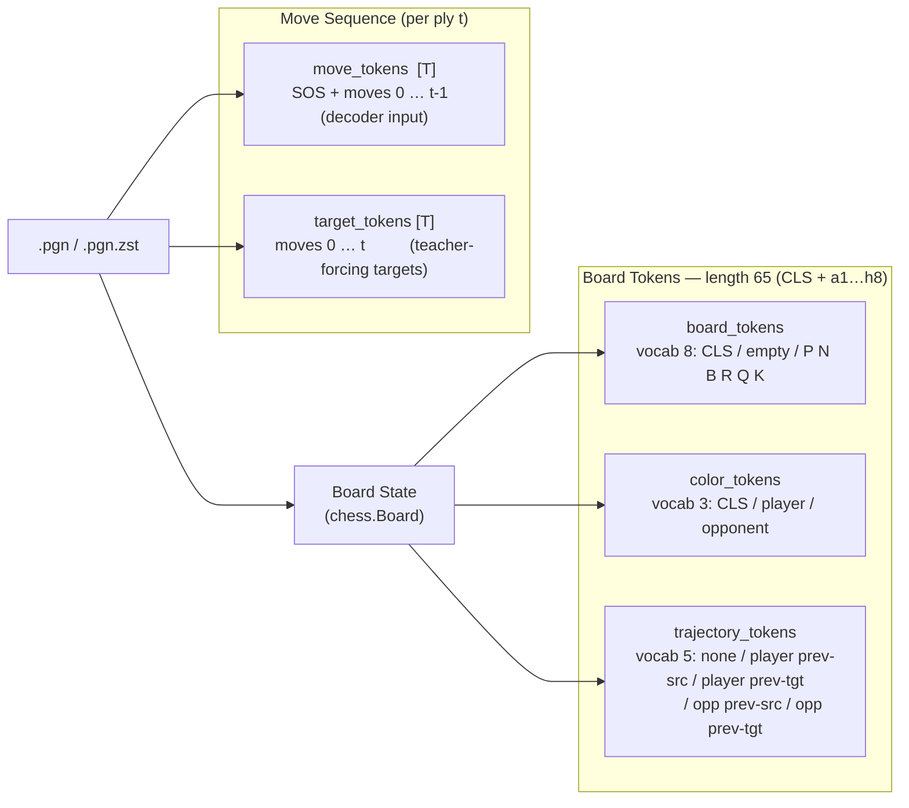
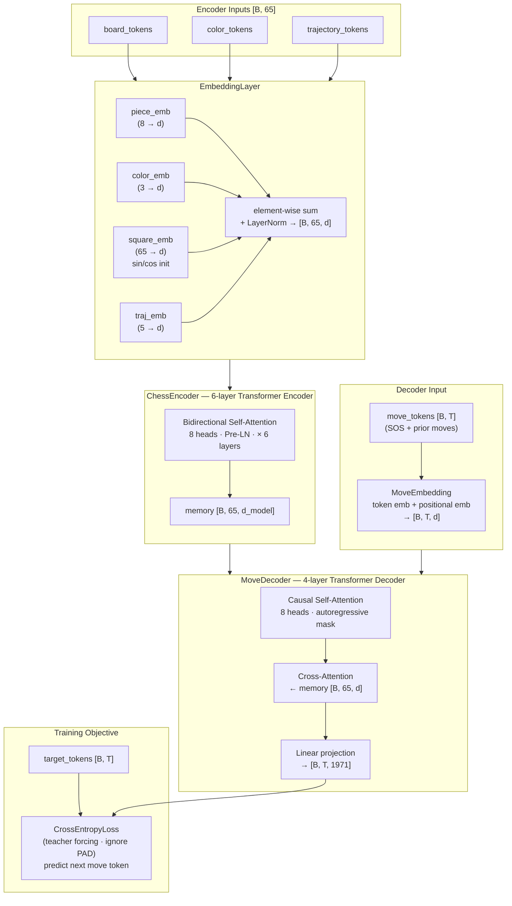
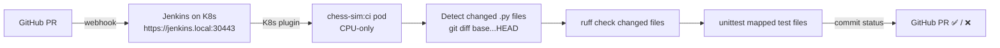
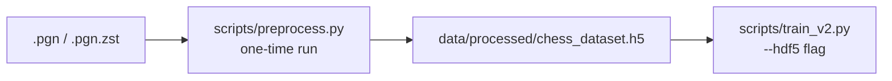
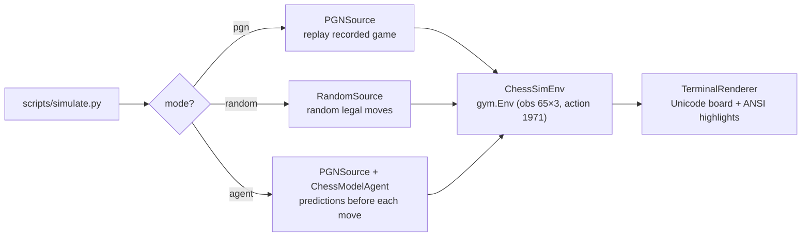

# chess-sim

An encoder-decoder transformer for chess move prediction. The model treats move generation as a sequence-to-sequence translation problem: a 6-layer encoder reads the board state as a 65-token sequence (CLS + 64 squares, three parallel streams), producing a 65×d_model memory; a 4-layer autoregressive decoder cross-attends to that memory while generating the game's move sequence token-by-token from a 1971-token vocabulary. Trained with teacher forcing and cross-entropy loss.

## Architecture Overview

### Token Construction



### Model Architecture & Training Objective



### Token Sequence

Each board is encoded as 65 tokens: `[CLS, a1, b1, ..., h8]`.

| Stream | Vocab | Meaning |
|--------|-------|---------|
| `board_tokens` | 8 | Piece type: 0=CLS, 1=empty, 2=pawn, 3=knight, 4=bishop, 5=rook, 6=queen, 7=king |
| `color_tokens` | 3 | Piece ownership: 0=empty/CLS, 1=player, 2=opponent |
| `trajectory_tokens` | 5 | Last-move roles: 0=none/CLS, 1=player prev src, 2=player prev tgt, 3=opp prev src, 4=opp prev tgt |

> `square_emb` is an internal positional embedding (65 positions, sin/cos geometric initialization) and is not passed as external input.

### Model Hyperparameters

| Parameter | Value |
|-----------|-------|
| `d_model` | 256 |
| `nhead` | 8 |
| `num_layers` | 6 |
| `dim_feedforward` | 1024 |
| `dropout` | 0.1 |
| `max_seq_len` | 65 |

---

## CI Pipeline

Every PR triggers a Jenkins build on the Kubernetes cluster (`10.0.0.169`).
The pipeline lints and tests only the Python files that changed in the PR,
inside an ephemeral K8s pod built from `ghcr.io/<user>/chess-sim:ci`.



### Accessing Jenkins

Jenkins is exposed via an nginx ingress controller with TLS termination.

| URL | Port | Notes |
|-----|------|-------|
| `https://jenkins.local:30443` | 30443 | Primary HTTPS entry point (requires hosts entry) |
| `https://10.0.0.169:30443` | 30443 | Direct IP access — no hosts entry needed |
| `http://10.0.0.169:30080` | 30080 | Legacy direct NodePort (HTTP only) |

**Add to `/etc/hosts`** on every machine that will use the hostname:
```
10.0.0.169  jenkins.local
```

**Suppress the browser certificate warning** by trusting the home-lab CA once:
```bash
kubectl get secret jenkins-ca-secret -n cert-manager \
  -o jsonpath='{.data.tls\.crt}' | base64 -d > jenkins-ca.crt
# Import jenkins-ca.crt into your OS / browser CA trust store.
```

### Infrastructure overview

All Jenkins infrastructure is Helm-managed and stored under `jenkins/`.

| File | Purpose |
|------|---------|
| `jenkins/values.yaml` | Jenkins Helm values — NodePort 30080 for direct HTTP access |
| `jenkins/ingress-controller-values.yaml` | nginx ingress — NodePort 30180 (HTTP) / 30443 (HTTPS) |
| `jenkins/cert-manager-values.yaml` | cert-manager with CRDs bundled |
| `jenkins/tls.yaml` | Self-signed CA ClusterIssuer, leaf Certificate, and Ingress |
| `jenkins/pod-template.yaml` | K8s agent pod spec (chess-sim + jnlp containers) |
| `jenkins/job-config.xml` | Jenkins job XML — imported via `create-job.groovy` |

**Install or reinstall the full stack:**
```bash
HELM=/home/sombersomni/bin/helm

# 1. Jenkins
$HELM repo add jenkins https://charts.jenkins.io
$HELM upgrade --install jenkins jenkins/jenkins \
    --namespace jenkins --create-namespace \
    --values jenkins/values.yaml

# 2. nginx ingress controller
$HELM repo add ingress-nginx https://kubernetes.github.io/ingress-nginx
$HELM upgrade --install ingress-nginx ingress-nginx/ingress-nginx \
    --namespace ingress-nginx --create-namespace \
    --values jenkins/ingress-controller-values.yaml

# 3. cert-manager
$HELM repo add jetstack https://charts.jetstack.io
$HELM upgrade --install cert-manager jetstack/cert-manager \
    --namespace cert-manager --create-namespace \
    --values jenkins/cert-manager-values.yaml

# 4. TLS resources (wait for cert-manager pods first)
kubectl wait --for=condition=ready pod \
    -l app.kubernetes.io/instance=cert-manager \
    -n cert-manager --timeout=120s
kubectl apply -f jenkins/tls.yaml
```

### CI image versioning

The CI image (`Dockerfile.ci`) contains only Python deps — no source code.
Rebuild and push a new version whenever **`requirements.txt`, the base image,
or the system packages change**.

| Tag | Example | Use |
|---|---|---|
| `ci-vMAJOR.MINOR.PATCH` | `ci-v1.0.0` | Pinned release — use this in `jenkins/pod-template.yaml` |
| `ci-sha-<7>` | `ci-sha-a3f9c1` | Immutable per-commit tag, always pushed alongside the version tag |
| `ci-latest` | `ci-latest` | Convenience alias; never pin K8s manifests to this |

**Build, tag, and push:**
```bash
VERSION=ci-v1.0.0
SHA=ci-sha-$(git rev-parse --short HEAD)
REPO=ghcr.io/$(gh api user --jq .login)/chess-sim

gh auth token | docker login ghcr.io -u $(gh api user --jq .login) --password-stdin

docker build -f Dockerfile.ci \
    -t ${REPO}:${VERSION} \
    -t ${REPO}:${SHA} \
    -t ${REPO}:ci-latest .

docker push ${REPO}:${VERSION}
docker push ${REPO}:${SHA}
docker push ${REPO}:ci-latest
```

After pushing, update `jenkins/pod-template.yaml` to the new
`ci-vX.Y.Z` tag and commit both changes together.

---

## Setup

### Prerequisites

- Python 3.10+
- `virtualenv`

### Install

```bash
cd chess-sim
virtualenv .venv
source .venv/bin/activate
pip install -r requirements.txt
pip install -e .
```

---

## Linting

This project uses [ruff](https://docs.astral.sh/ruff/) for linting. Configuration lives in `pyproject.toml`.

### Rules enforced

| Code | Category | What it catches |
|------|----------|----------------|
| `E` | pycodestyle errors | Line too long (>88 chars), bad whitespace, indentation |
| `W` | pycodestyle warnings | Trailing whitespace on lines |
| `F` | pyflakes | Unused imports, undefined names |
| `ANN` | flake8-annotations | Missing type annotations on args and return types |
| `I` | isort | Unsorted or ungrouped imports |

`tests/` is exempt from `ANN` rules.

### Run the linter

```bash
source .venv/bin/activate

# Check for violations
python -m ruff check .

# Auto-fix safe issues (unused imports, import ordering)
python -m ruff check . --fix

# Summary by rule code
python -m ruff check . --statistics
```

---

## Running Tests

All tests are CPU-only and deterministic.

```bash
# Activate virtual environment first
source .venv/bin/activate

# Run the full test suite
python -m unittest discover -s tests -p "test_*.py"

# Run a specific test file
python -m unittest tests.test_encoder
python -m unittest tests.test_trainer
python -m unittest tests.test_dataset
```

Test coverage spans T01–T20 (core components), T26–T40 (trajectory/encoder integration), and TEV01–TEV14 (evaluation metrics).

| File | Tests |
|------|-------|
| `tests/test_tokenizer.py` | T01–T04: BoardTokenizer correctness |
| `tests/test_embedding.py` | T05–T08: EmbeddingLayer output shapes and dtype |
| `tests/test_encoder.py` | T09–T12: ChessEncoder forward pass and gradient flow |
| `tests/test_heads.py` | T13–T14: PredictionHeads output shapes |
| `tests/test_loss.py` | T15–T16: LossComputer correctness |
| `tests/test_trainer.py` | T19: train_step, checkpoint roundtrip |
| `tests/test_dataset.py` | T17, T20: DataLoader dtypes and move labels |
| `tests/test_reader.py` | StreamingPGNReader streaming |
| `tests/test_sampler.py` | ReservoirSampler uniform sampling |
| `tests/test_chess_encoder.py` | T26–T40: trajectory tokens, embedding init priors, gradient flow, structural subtyping |
| `tests/test_evaluate.py` | TEV01–TEV14: Shannon entropy, top-1 accuracy, per_head_ce, GameEvaluator integration, winner_color, winners_only filtering |
| `tests/env/test_chess_sim_env.py` | T1–T12: PGNSource, RandomSource, ChessSimEnv spaces, ChessModelAgent, TerminalRenderer, gymnasium env_checker |

---

## Data Pipeline

### 1. Stream games from a `.zst` PGN file

```python
from pathlib import Path
from chess_sim.data.reader import StreamingPGNReader

reader = StreamingPGNReader()
for game in reader.stream(Path("lichess_db.pgn.zst")):
    process(game)
```

### 2. Sample games uniformly at random

```python
from chess_sim.data.sampler import ReservoirSampler

sampler = ReservoirSampler()
games = sampler.sample(reader.stream(path), n=1_000_000)
```

### 3. Tokenize a board position

```python
import chess
from chess_sim.data.tokenizer import BoardTokenizer

tok = BoardTokenizer()
board = chess.Board()
result = tok.tokenize(board, chess.WHITE)

# result.board_tokens  -> list[int] of length 65
# result.color_tokens  -> list[int] of length 65
```

### 3b. Generate trajectory tokens

```python
from chess_sim.data.tokenizer_utils import make_trajectory_tokens
import chess

# move_history is populated as the game is replayed with board.push(move)
move_history: list[chess.Move] = []
trajectory_tokens = make_trajectory_tokens(move_history)

# trajectory_tokens: list[int] of length 65
# index 0 = CLS = 0 (always)
# values: 0=none, 1=player prev src, 2=player prev tgt,
#         3=opp prev src, 4=opp prev tgt
```

### 4. Build a dataset and DataLoader

```python
from torch.utils.data import DataLoader
from chess_sim.data.dataset import ChessDataset
from chess_sim.types import TrainingExample

examples: list[TrainingExample] = [...]  # produced by preprocessing pipeline
train_ds, val_ds = ChessDataset.split(examples, train_frac=0.95)

loader = DataLoader(train_ds, batch_size=256, shuffle=True, num_workers=4)
```

---

## Data Preparation (V2 — HDF5 preprocessing)

Training from raw PGN is slow because every run re-parses and tokenizes games on the CPU.
Run the preprocessor **once** to write all tokenized turn records into an HDF5 file;
subsequent training runs read pre-baked integer arrays directly.



### Step 1 — Edit the config

Copy and edit `configs/preprocess_v2.yaml`:

```yaml
input:
  pgn_path: data/raw/lichess_db_standard_rated_2013-01.pgn.zst
  max_games: 0          # 0 = all games; set e.g. 10000 to cap for testing

output:
  hdf5_path:        data/processed/chess_dataset.h5
  chunk_size:       1000   # write-buffer flush threshold (rows)
  compression:      gzip
  compression_opts: 4      # 1=fast, 9=smallest
  max_seq_len:      512    # padded move sequence length

filter:
  min_elo:      0     # skip games where both players are below this Elo
  min_moves:    5     # skip very short/incomplete games
  max_moves:    512   # skip abnormally long games
  winners_only: false # true = skip draws, include only decisive games

split:
  train: 0.95
  val:   0.05

processing:
  workers: 4   # parallel game-parser processes
```

### Step 2 — Run preprocessing (once)

```bash
source .venv/bin/activate

# Full dataset
python -m scripts.preprocess --config configs/preprocess_v2.yaml

# Quick smoke test (100 games, custom output)
python -m scripts.preprocess \
    --config configs/preprocess_v2.yaml \
    --pgn data/raw/lichess_db_standard_rated_2013-01.pgn.zst \
    --max-games 100 \
    --output data/processed/chess_dataset_small.h5
```

| Flag | Description |
|------|-------------|
| `--config` | Path to `preprocess_v2.yaml` (required) |
| `--pgn` | Override `input.pgn_path` |
| `--output` | Override `output.hdf5_path` |
| `--max-games` | Override `input.max_games` |

The script prints progress every 10 000 games and runs `HDF5Validator` automatically
on completion. It will raise a `ValueError` and exit non-zero if the output file fails
schema validation.

### Step 3 — Train from HDF5

```bash
python -m scripts.train_v2 \
    --config configs/train_v2_10k.yaml \
    --hdf5 data/processed/chess_dataset.h5
```

The `--hdf5` flag (or `data.hdf5_path` in YAML) switches the DataLoader from
`PGNSequenceDataset` to `ChessHDF5Dataset`. Omit the flag and training falls back to
on-the-fly PGN parsing as before.

### HDF5 file schema

Each row is one board state at a specific game ply.

| Dataset | Shape | Dtype | Description |
|---------|-------|-------|-------------|
| `board_tokens` | `[N, 65]` | `uint8` | Piece type per square (CLS at index 0) |
| `color_tokens` | `[N, 65]` | `uint8` | Piece ownership per square |
| `trajectory_tokens` | `[N, 65]` | `uint8` | Last-2-move trajectory roles |
| `move_tokens` | `[N, 512]` | `uint16` | Decoder input: SOS + prior moves (padded) |
| `target_tokens` | `[N, 512]` | `uint16` | Decoder targets (padded) |
| `move_lengths` | `[N]` | `uint16` | Actual sequence length before padding |
| `outcome` | `[N]` | `int8` | +1 win / 0 draw / -1 loss (player-to-move) |
| `turn` | `[N]` | `uint16` | 0-indexed ply within the game |
| `game_id` | `[N]` | `uint32` | Parent game index |

Split groups: `train/` and `val/` (default 95/5 split, deterministic by `game_id`).

---

## Training

### Single training step (programmatic)

```python
from chess_sim.training.trainer import Trainer

# CPU for development, 'cuda' for full training
trainer = Trainer(device="cuda")

for batch in loader:
    loss = trainer.train_step(batch)  # logs loss + lr to stdout
```

### Full epoch

```python
avg_loss = trainer.train_epoch(loader)
print(f"Epoch loss: {avg_loss:.4f}")
```

### Save and load checkpoints

```python
from pathlib import Path

trainer.save_checkpoint(Path("checkpoints/epoch_01.pt"))

# Resume from checkpoint
trainer.load_checkpoint(Path("checkpoints/epoch_01.pt"))
```

Checkpoint files store `encoder` and `heads` state dicts. The optimizer and scheduler state are not saved — checkpoints are intended for inference and fine-tuning, not resuming mid-training.

---

## Running a Forward Pass

```python
import torch
from chess_sim.model.encoder import ChessEncoder
from chess_sim.model.heads import PredictionHeads

enc = ChessEncoder().eval()
heads = PredictionHeads().eval()

# board_tokens, color_tokens, trajectory_tokens: [B, 65] long tensors
board_tokens = torch.zeros(1, 65, dtype=torch.long)
color_tokens = torch.zeros(1, 65, dtype=torch.long)
trajectory_tokens = torch.zeros(1, 65, dtype=torch.long)

with torch.no_grad():
    encoder_out = enc(board_tokens, color_tokens, trajectory_tokens)
    preds = heads(encoder_out.cls_embedding)

# preds.src_sq_logits  -> [B, 64]
# preds.tgt_sq_logits  -> [B, 64]

src_sq = preds.src_sq_logits.argmax(dim=-1)   # predicted source square
tgt_sq = preds.tgt_sq_logits.argmax(dim=-1)   # predicted target square
```

---

## Scripts

### Preprocess PGN to HDF5 (run once before V2 training)

```bash
source .venv/bin/activate

python -m scripts.preprocess --config configs/preprocess_v2.yaml
```

See [Data Preparation](#data-preparation-v2--hdf5-preprocessing) above for full options.

---

### Train from a PGN file (V1)

```bash
# Activate virtual environment first
source .venv/bin/activate

# Train from a plain PGN file
python -m scripts.train_real --pgn data/games.pgn --epochs 10 --checkpoint checkpoints/run_01.pt

# Train from a compressed PGN (.zst)
python -m scripts.train_real --pgn data/lichess_db.pgn.zst --epochs 10 --checkpoint checkpoints/run_01.pt

# Winners-only filtering (skips draws; only uses positions where the winning side is to move)
python -m scripts.train_real --pgn data/games.pgn --winners-only --checkpoint checkpoints/winner_run.pt

# Synthetic games (no PGN file required)
python -m scripts.train_real --num-games 100 --epochs 5 --checkpoint checkpoints/synthetic_run.pt
```

### Simulate a game in the terminal

Replay a recorded game, generate a random playthrough, or watch the model predict moves in real time — all in the terminal without a display server.



**Three modes:**

| Mode | Requires | What you see |
|------|----------|--------------|
| `pgn` | PGN file | Board after each recorded move |
| `random` | — | Board after each random legal move |
| `agent` | PGN + checkpoint | Agent's top-N predictions *before* each move, then the actual move |

**Sample terminal output (agent mode):**

```
8 ♜ ♞ ♝ ♛ ♚ ♝ ♞ ♜   Ply 2  -  e7e5
7 ♟ ♟ ♟ ♟ . ♟ ♟ ♟   Phase: opening
6 . . . . . . . .   Material: 0
5 . . . . ♟ . . .
4 . . . . ♙ . . .   Move history:
3 . . . . . . . .     1. e2e4
2 ♙ ♙ ♙ ♙ . ♙ ♙ ♙     2. e7e5
1 ♖ ♘ ♗ ♕ ♔ ♗ ♘ ♖
  a b c d e f g h   -- Agent Predictions --
                      1. e7e5    42.1%  ✓ correct
                      2. c7c5    18.3%
                      3. g8f6     9.7%
```

Yellow highlight = source square · Cyan highlight = target square

```bash
source .venv/bin/activate

# PGN replay (no model needed)
python -m scripts.simulate --mode pgn \
    --pgn data/lichess_db_standard_rated_2013-01.pgn.zst \
    --game-index 0 \
    --tick-rate 0.5

# Random playthrough
python -m scripts.simulate --mode random --tick-rate 0.3

# Agent prediction mode (shows top-3 before each move)
python -m scripts.simulate --mode agent \
    --pgn data/lichess_db_standard_rated_2013-01.pgn.zst \
    --checkpoint checkpoints/chess_v2_1k.pt \
    --tick-rate 1.0 \
    --top-n 3

# Use ASCII pieces instead of Unicode (e.g. for narrow terminals)
python -m scripts.simulate --mode random --no-unicode
```

| Flag | Default | Description |
|------|---------|-------------|
| `--config` | — | Path to `configs/simulate.yaml` (all flags below override it) |
| `--mode` | — | `pgn` \| `random` \| `agent` (required) |
| `--pgn` | — | Path to `.pgn` or `.pgn.zst` file |
| `--game-index` | `0` | Zero-based game index in the PGN |
| `--checkpoint` | — | Path to `.pt` checkpoint (agent mode only) |
| `--tick-rate` | `0.5` | Seconds to pause between plies |
| `--top-n` | `3` | Number of agent predictions to show |
| `--max-plies` | `200` | Truncation limit for random mode |
| `--no-unicode` | — | Use ASCII piece symbols (`P N B R Q K`) |

The environment also satisfies the `gymnasium.Env` interface (`obs=(65,3) float32`, `action=Discrete(1971)`) so any compatible policy can be plugged in directly.

---

### Launch the GUI viewer

Visually step through a game with a split-panel window: left = animated board, right = per-ply loss/accuracy/entropy stats and a PCA scatter of the model's learned piece embeddings.

```bash
source .venv/bin/activate

python -m scripts.gui.viewer \
    --pgn data/games.pgn \
    --checkpoint checkpoints/winner_run_01.pt \
    --game-index 0
```

| Flag | Default | Description |
|------|---------|-------------|
| `--pgn` | `data/games.pgn` | Path to `.pgn` or `.pgn.zst` file |
| `--checkpoint` | `checkpoints/winner_run_01.pt` | Path to trained `.pt` checkpoint |
| `--game-index` | `0` | Zero-based index of the game to view |

**Controls:** use the `◀ Prev` / `Next ▶` buttons or drag the slider to navigate plies. The board highlights the actual move's source square (yellow border) and target square (orange border). The right panel updates automatically with per-head CE loss, top-1 accuracy (✓/✗), Shannon entropy, and a mean-entropy bar.

---

### Evaluate a trained checkpoint

```bash
python -m scripts.evaluate \
    --checkpoint checkpoints/run_01.pt \
    --pgn data/games.pgn \
    --game-index 0 \
    --top-n 3
```

Output includes a per-ply table with CE loss, top-1 accuracy, and Shannon entropy for each prediction head (src, tgt), plus an aggregate summary with the top-N highest-entropy positions.

Use `--winners-only` to evaluate only positions where the winning player is to move (mirrors the training flag).

---

## Project Structure

```
chess-sim/
├── chess_sim/
│   ├── protocols.py          # Structural type protocols (Tokenizable, Embeddable, Encodable, Predictable, Trainable, Samplable)
│   ├── types.py              # NamedTuple containers: TokenizedBoard (board_tokens, color_tokens), TrainingExample, ChessBatch, EncoderOutput, PredictionOutput, LabelTensors
│   ├── utils.py              # winner_color(): chess.pgn.Game -> Optional[chess.Color]
│   ├── data/
│   │   ├── tokenizer.py          # BoardTokenizer: chess.Board -> TokenizedBoard
│   │   ├── tokenizer_utils.py    # make_trajectory_tokens(): shared trajectory helper
│   │   ├── reader.py             # StreamingPGNReader: .zst -> chess.pgn.Game iterator
│   │   ├── sampler.py            # ReservoirSampler: uniform sampling (Vitter's Algorithm R)
│   │   ├── dataset.py            # ChessDataset: torch Dataset + split(train_frac=0.9)
│   │   ├── pgn_sequence_dataset.py # PGNSequenceDataset + PGNSequenceCollator (V2 on-the-fly)
│   │   └── hdf5_dataset.py       # ChessHDF5Dataset: reads pre-baked HDF5; hdf5_worker_init
│   ├── preprocess/
│   │   ├── parse.py          # GameParser: chess.pgn.Game -> list[RawTurnRecord]
│   │   ├── writer.py         # HDF5Writer: buffers + flushes to resizable h5py datasets
│   │   ├── validate.py       # HDF5Validator: post-write schema + value-range checks
│   │   └── preprocess.py     # HDF5Preprocessor: multiprocessing orchestrator
│   ├── model/
│   │   ├── embedding.py      # EmbeddingLayer: piece + color + square + trajectory -> [B, 65, 256]
│   │   ├── encoder.py        # ChessEncoder: BERT-style transformer (6 layers)
│   │   └── heads.py          # PredictionHeads: 2x Linear(256, 64)
│   ├── env/
│   │   ├── __init__.py       # Protocols: SimSource, Policy, TerminalRenderable; NamedTuples: StepInfo, MovePrediction, RenderContext
│   │   ├── sources.py        # PGNSource (PGN replay) and RandomSource (random legal moves)
│   │   ├── chess_sim_env.py  # ChessSimEnv(gym.Env): obs=(65,3) float32, action=Discrete(1971)
│   │   ├── terminal_renderer.py # TerminalRenderer: Unicode board + ANSI highlights + prediction panel
│   │   └── agent_adapter.py  # ChessModelAgent: wraps ChessModel into Policy protocol
│   └── training/
│       ├── loss.py           # LossComputer: CrossEntropy x2 (src + tgt)
│       └── trainer.py        # Trainer: AdamW + CosineAnnealingLR; decorators: @log_metrics, @device_aware, @timed
├── scripts/
│   ├── __init__.py
│   ├── preprocess.py         # CLI: PGN → HDF5 (run once before V2 training)
│   ├── simulate.py           # CLI: terminal game simulation (pgn / random / agent modes)
│   ├── train_v2.py           # CLI: V2 encoder-decoder training (--hdf5 or --pgn)
│   ├── train_real.py         # CLI: V1 encoder training from PGN or synthetic games
│   ├── evaluate.py           # CLI: per-move evaluation with GameEvaluator
│   └── gui/
│       ├── __init__.py       # Protocols: Renderable, Navigable, GameSource
│       ├── formatters.py     # Pure helpers: _fmt_loss, _fmt_acc, _fmt_entropy
│       ├── game_controller.py# GameController: tkinter-free GameSource implementation
│       ├── board_panel.py    # BoardPanel(tk.Frame): animated board + ply navigation
│       ├── stats_panel.py    # StatsPanel(tk.Frame): metrics table + embedding scatter
│       └── viewer.py         # ChessViewer root window + main() CLI entry point
├── tests/
│   ├── utils.py              # Shared test fixtures (make_synthetic_batch, make_training_examples, etc.)
│   ├── test_*.py             # Unit tests T01–T20
│   ├── test_chess_encoder.py # Integration tests T26–T40
│   └── test_evaluate.py      # Evaluation tests TEV01–TEV14
├── checkpoints/              # Trained model .pt files
├── data/                     # PGN files (gitignored)
├── requirements.txt
└── chess_encoder_final_design.md  # Full architecture design document
```

---

## Key Design Notes

**Player-perspective prediction**
Each ply is predicted from the side-to-move's perspective using two heads: `src_sq` (which piece moves) and `tgt_sq` (where it goes). When it's Black's turn, the board is tokenized with Black as "player" and White as "opponent" — the model always sees itself as the player. This simplifies the learning task compared to separate player/opponent heads.

**Pre-Layer-Norm (Pre-LN) architecture**
`TransformerEncoderLayer` is configured with `norm_first=True` to ensure stable gradient flow on CPU with PyTorch 2.x's scaled dot-product attention backend.

**Square indexing**
Squares are always encoded in fixed geometric order: a1=index 1, b1=index 2, ..., h8=index 64. The board is never flipped. The `color_tokens` stream conveys whose pieces are whose relative to the player to move.

**Trajectory tokens**
The fourth embedding stream encodes the role of each square in the last 2 half-moves via `_make_trajectory_tokens(move_history)` in `scripts/train_real.py`. Vocabulary is 5 bins: 0=none/CLS, 1=player previous source, 2=player previous target, 3=opponent previous source, 4=opponent previous target. Opponent marks overwrite player marks on collision (semantically correct for captures). `trajectory_emb: nn.Embedding(5, 256)`.

**`--winners-only` training and evaluation flag**
Both `scripts/train_real.py` and `scripts/evaluate.py` accept `--winners-only`. When set, only board positions where the game's winner is to move are included; draws are excluded entirely. Uses `winner_color()` from `chess_sim/utils.py`.
