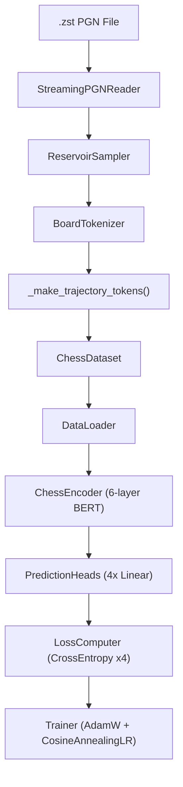

# chess-sim

A BERT-style transformer encoder for chess position understanding. The model encodes board states as token sequences and predicts the next move's source and target squares — for both the current player and their opponent.

## Architecture Overview



### Token Sequence

Each board is encoded as 65 tokens: `[CLS, a1, b1, ..., h8]`.

| Stream | Vocab | Meaning |
|--------|-------|---------|
| `board_tokens` | 8 | Piece type: 0=CLS, 1=empty, 2=pawn, 3=knight, 4=bishop, 5=rook, 6=queen, 7=king |
| `color_tokens` | 3 | Piece ownership: 0=empty/CLS, 1=player, 2=opponent |
| `trajectory_tokens` | 5 | Last-move roles: 0=none/CLS, 1=player prev src, 2=player prev tgt, 3=opp prev src, 4=opp prev tgt |

> `square_emb` is an internal positional embedding (65 positions, sin/cos geometric initialization) and is not passed as external input.

### Model Hyperparameters

| Parameter | Value |
|-----------|-------|
| `d_model` | 256 |
| `nhead` | 8 |
| `num_layers` | 6 |
| `dim_feedforward` | 1024 |
| `dropout` | 0.1 |
| `max_seq_len` | 65 |

---

## Setup

### Prerequisites

- Python 3.10+
- `virtualenv`

### Install

```bash
cd chess-sim
virtualenv .venv
source .venv/bin/activate
pip install -r requirements.txt
pip install -e .
```

---

## Running Tests

All tests are CPU-only and deterministic.

```bash
# Activate virtual environment first
source .venv/bin/activate

# Run the full test suite
python -m unittest discover -s tests -p "test_*.py"

# Run a specific test file
python -m unittest tests.test_encoder
python -m unittest tests.test_trainer
python -m unittest tests.test_dataset
```

Test coverage spans T01–T20 (core components), T26–T40 (trajectory/encoder integration), and TEV01–TEV14 (evaluation metrics).

| File | Tests |
|------|-------|
| `tests/test_tokenizer.py` | T01–T04: BoardTokenizer correctness |
| `tests/test_embedding.py` | T05–T08: EmbeddingLayer output shapes and dtype |
| `tests/test_encoder.py` | T09–T12: ChessEncoder forward pass and gradient flow |
| `tests/test_heads.py` | T13–T14: PredictionHeads output shapes |
| `tests/test_loss.py` | T15–T16, T18: LossComputer with ignore_index=-1 |
| `tests/test_trainer.py` | T19: train_step, checkpoint roundtrip |
| `tests/test_dataset.py` | T17, T18, T20: DataLoader dtypes and opponent labels |
| `tests/test_reader.py` | StreamingPGNReader streaming |
| `tests/test_sampler.py` | ReservoirSampler uniform sampling |
| `tests/test_chess_encoder.py` | T26–T40: trajectory tokens, 4-stream embedding, geometric init, gradient flow, structural subtyping |
| `tests/test_evaluate.py` | TEV01–TEV14: Shannon entropy, top-1 accuracy, per_head_ce, GameEvaluator integration, winner_color, winners_only filtering |

---

## Data Pipeline

### 1. Stream games from a `.zst` PGN file

```python
from pathlib import Path
from chess_sim.data.reader import StreamingPGNReader

reader = StreamingPGNReader()
for game in reader.stream(Path("lichess_db.pgn.zst")):
    process(game)
```

### 2. Sample games uniformly at random

```python
from chess_sim.data.sampler import ReservoirSampler

sampler = ReservoirSampler()
games = sampler.sample(reader.stream(path), n=1_000_000)
```

### 3. Tokenize a board position

```python
import chess
from chess_sim.data.tokenizer import BoardTokenizer

tok = BoardTokenizer()
board = chess.Board()
result = tok.tokenize(board, chess.WHITE)

# result.board_tokens  -> list[int] of length 65
# result.color_tokens  -> list[int] of length 65
```

### 3b. Generate trajectory tokens

```python
from scripts.train_real import _make_trajectory_tokens
import chess

# move_history is populated as the game is replayed with board.push(move)
move_history: list[chess.Move] = []
trajectory_tokens = _make_trajectory_tokens(move_history)

# trajectory_tokens: list[int] of length 65
# index 0 = CLS = 0 (always)
# values: 0=none, 1=player prev src, 2=player prev tgt,
#         3=opp prev src, 4=opp prev tgt
```

### 4. Build a dataset and DataLoader

```python
from torch.utils.data import DataLoader
from chess_sim.data.dataset import ChessDataset
from chess_sim.types import TrainingExample

examples: list[TrainingExample] = [...]  # produced by preprocessing pipeline
train_ds, val_ds = ChessDataset.split(examples, train_frac=0.95)

loader = DataLoader(train_ds, batch_size=256, shuffle=True, num_workers=4)
```

---

## Training

### Single training step (programmatic)

```python
from chess_sim.training.trainer import Trainer

# CPU for development, 'cuda' for full training
trainer = Trainer(device="cuda")

for batch in loader:
    loss = trainer.train_step(batch)  # logs loss + lr to stdout
```

### Full epoch

```python
avg_loss = trainer.train_epoch(loader)
print(f"Epoch loss: {avg_loss:.4f}")
```

### Save and load checkpoints

```python
from pathlib import Path

trainer.save_checkpoint(Path("checkpoints/epoch_01.pt"))

# Resume from checkpoint
trainer.load_checkpoint(Path("checkpoints/epoch_01.pt"))
```

Checkpoint files store `encoder` and `heads` state dicts. The optimizer and scheduler state are not saved — checkpoints are intended for inference and fine-tuning, not resuming mid-training.

---

## Running a Forward Pass

```python
import torch
from chess_sim.model.encoder import ChessEncoder
from chess_sim.model.heads import PredictionHeads

enc = ChessEncoder().eval()
heads = PredictionHeads().eval()

# board_tokens, color_tokens, trajectory_tokens: [B, 65] long tensors
board_tokens = torch.zeros(1, 65, dtype=torch.long)
color_tokens = torch.zeros(1, 65, dtype=torch.long)
trajectory_tokens = torch.zeros(1, 65, dtype=torch.long)

with torch.no_grad():
    encoder_out = enc(board_tokens, color_tokens, trajectory_tokens)
    preds = heads(encoder_out.cls_embedding)

# preds.src_sq_logits  -> [B, 64]
# preds.tgt_sq_logits  -> [B, 64]
# preds.opp_src_sq_logits -> [B, 64]
# preds.opp_tgt_sq_logits -> [B, 64]

src_sq = preds.src_sq_logits.argmax(dim=-1)   # predicted source square
tgt_sq = preds.tgt_sq_logits.argmax(dim=-1)   # predicted target square
```

---

## Scripts

### Train from a PGN file

```bash
# Activate virtual environment first
source .venv/bin/activate

# Train from a plain PGN file
python -m scripts.train_real --pgn data/games.pgn --epochs 10 --checkpoint checkpoints/run_01.pt

# Train from a compressed PGN (.zst)
python -m scripts.train_real --pgn data/lichess_db.pgn.zst --epochs 10 --checkpoint checkpoints/run_01.pt

# Winners-only filtering (skips draws; only uses positions where the winning side is to move)
python -m scripts.train_real --pgn data/games.pgn --winners-only --checkpoint checkpoints/winner_run.pt

# Synthetic games (no PGN file required)
python -m scripts.train_real --num-games 100 --epochs 5 --checkpoint checkpoints/synthetic_run.pt
```

### Evaluate a trained checkpoint

```bash
python -m scripts.evaluate \
    --checkpoint checkpoints/run_01.pt \
    --pgn data/games.pgn \
    --game-index 0 \
    --top-n 3
```

Output includes a per-ply table with CE loss, top-1 accuracy, and Shannon entropy for each of the four prediction heads, plus an aggregate summary with the top-N highest-entropy positions.

Use `--winners-only` to evaluate only positions where the winning player is to move (mirrors the training flag).

---

## Project Structure

```
chess-sim/
├── chess_sim/
│   ├── protocols.py          # Structural type protocols (Tokenizable, Embeddable, Encodable, Predictable, Trainable, Samplable)
│   ├── types.py              # NamedTuple containers: TokenizedBoard (board_tokens, color_tokens), TrainingExample, ChessBatch, EncoderOutput, PredictionOutput, LabelTensors
│   ├── utils.py              # winner_color(): chess.pgn.Game -> Optional[chess.Color]
│   ├── data/
│   │   ├── tokenizer.py      # BoardTokenizer: chess.Board -> TokenizedBoard
│   │   ├── reader.py         # StreamingPGNReader: .zst -> chess.pgn.Game iterator
│   │   ├── sampler.py        # ReservoirSampler: uniform sampling (Vitter's Algorithm R)
│   │   └── dataset.py        # ChessDataset: torch Dataset + split(train_frac=0.9)
│   ├── model/
│   │   ├── embedding.py      # EmbeddingLayer: piece + color + square + trajectory -> [B, 65, 256]
│   │   ├── encoder.py        # ChessEncoder: BERT-style transformer (6 layers)
│   │   └── heads.py          # PredictionHeads: 4x Linear(256, 64)
│   └── training/
│       ├── loss.py           # LossComputer: CrossEntropy x4 with ignore_index=-1
│       └── trainer.py        # Trainer: AdamW + CosineAnnealingLR; decorators: @log_metrics, @device_aware, @timed
├── scripts/
│   ├── __init__.py
│   ├── train_real.py         # CLI: end-to-end training from PGN or synthetic games
│   └── evaluate.py           # CLI: per-move evaluation with GameEvaluator
├── tests/
│   ├── utils.py              # Shared test fixtures (make_synthetic_batch, make_training_examples, etc.)
│   ├── test_*.py             # Unit tests T01–T20
│   ├── test_chess_encoder.py # Integration tests T26–T40
│   └── test_evaluate.py      # Evaluation tests TEV01–TEV14
├── checkpoints/              # Trained model .pt files
├── data/                     # PGN files (gitignored)
├── requirements.txt
└── chess_encoder_final_design.md  # Full architecture design document
```

---

## Key Design Notes

**Opponent labels use `ignore_index=-1`**
The last move in a game has no opponent response. The model uses `opp_src_sq=-1` and `opp_tgt_sq=-1` as sentinel values, which `nn.CrossEntropyLoss(ignore_index=-1)` skips during loss computation.

**Pre-Layer-Norm (Pre-LN) architecture**
`TransformerEncoderLayer` is configured with `norm_first=True` to ensure stable gradient flow on CPU with PyTorch 2.x's scaled dot-product attention backend.

**Square indexing**
Squares are always encoded in fixed geometric order: a1=index 1, b1=index 2, ..., h8=index 64. The board is never flipped. The `color_tokens` stream conveys whose pieces are whose relative to the player to move.

**Trajectory tokens**
The fourth embedding stream encodes the role of each square in the last 2 half-moves via `_make_trajectory_tokens(move_history)` in `scripts/train_real.py`. Vocabulary is 5 bins: 0=none/CLS, 1=player previous source, 2=player previous target, 3=opponent previous source, 4=opponent previous target. Opponent marks overwrite player marks on collision (semantically correct for captures). `trajectory_emb: nn.Embedding(5, 256)`.

**`--winners-only` training and evaluation flag**
Both `scripts/train_real.py` and `scripts/evaluate.py` accept `--winners-only`. When set, only board positions where the game's winner is to move are included; draws are excluded entirely. Uses `winner_color()` from `chess_sim/utils.py`.
