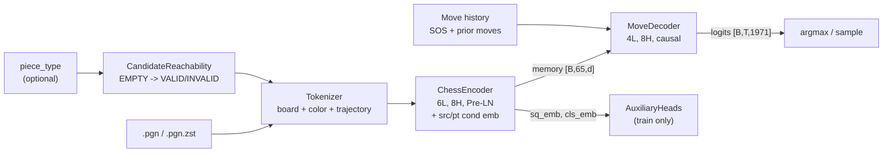
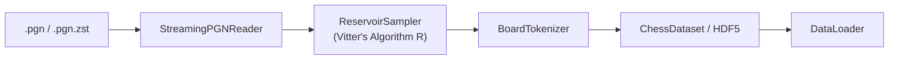
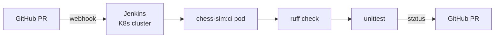

# chess-sim

**An encoder-decoder transformer for chess move prediction, trained via supervised learning on PGN master games and fine-tuned with offline reinforcement learning.**


---

## Overview

chess-sim treats chess move generation as sequence-to-sequence translation. A 6-layer transformer encoder reads the board state as a 65-token sequence (CLS + 64 squares across three parallel embedding streams), producing a $65 \times d$ memory tensor. A 4-layer autoregressive decoder cross-attends to that memory and generates moves token-by-token from a 1971-token vocabulary.

Two training paths are supported:

| Path | Script | Loss | Data |
|------|--------|------|------|
| **Supervised Learning (SL)** | `scripts/train_v2.py` | Cross-entropy with teacher forcing | PGN / HDF5 |
| **Offline RL** | `scripts/train_rl_v4.py` | Cross-entropy | PGN master games (HDF5) |

**Current best checkpoint:** `chess_v2_1k.pt` -- $d_\text{model}=128$, 94.9% validation accuracy, 2.8M parameters.

---

## Architecture

### Encoder-Decoder Pipeline



### Token Construction

Each board position is encoded as 65 tokens in three parallel streams:

| Stream | Vocab | Description |
|--------|-------|-------------|
| `board_tokens` | 9 | Piece type: 0=CLS, 1=empty, 2=pawn, 3=knight, 4=bishop, 5=rook, 6=queen, 7=king, 8=invalid\_empty |
| `color_tokens` | 3 | Ownership: 0=empty/CLS, 1=player (side-to-move), 2=opponent |
| `trajectory_tokens` | 5 | Last-move roles: 0=none, 1=player prev src, 2=player prev tgt, 3=opp prev src, 4=opp prev tgt |

> **Note:** `square_emb` is an internal positional embedding (65 positions, sin/cos geometric init) -- not an external input stream.

### Embedding Layer

Six learned embeddings are summed element-wise and normalized:

$$\mathbf{h}_i = \text{LayerNorm}\!\Big(\mathbf{E}_{\text{piece}}[b_i] + \mathbf{E}_{\text{color}}[c_i] + \mathbf{E}_{\text{square}}[i] + \mathbf{E}_{\text{traj}}[t_i] + \mathbf{E}_{\text{src}}[\sigma] + \mathbf{E}_{\text{pt\_cond}}[\tau]\Big)$$

where $b_i$, $c_i$, $t_i$ are the piece, color, and trajectory token at position $i \in \{0, \ldots, 64\}$, $\sigma$ is the selected source-square index (broadcast across all 65 positions, 0 = no conditioning), and $\tau$ is the piece-type conditioning token (broadcast, 0 = no conditioning, 1--7 = piece type). Both $\mathbf{E}_{\text{src}}$ and $\mathbf{E}_{\text{pt\_cond}}$ are zero-initialized so they act as no-ops until trained.

### Model Hyperparameters

| Component | `d_model` | Heads | Layers | FFN dim | Dropout |
|-----------|-----------|-------|--------|---------|---------|
| Encoder | 128 | 8 | 6 | 512 | 0.1 |
| Decoder | 128 | 8 | 4 | 512 | 0.1 |

> **Note:** The default `ModelConfig` specifies $d_\text{model}=256$, but the current best checkpoint uses $d_\text{model}=128$ (3.6x fewer parameters with only 0.7% accuracy loss vs. 256).

**Move vocabulary:** 1971 tokens covering all legal UCI move strings (including promotions).

### Candidate Piece Conditioning

The model supports an optional two-stage generation mode: (1) the caller selects a `piece_type` (1--6, matching `chess.PieceType`), and (2) the model predicts the destination with a restricted action space.

When `piece_type` is provided:

1. **Board token rewriting.** `CandidateReachabilityMapper` computes which empty squares are reachable by any friendly piece of that type via `board.pseudo_legal_moves`. `build_candidate_board_tokens` then splits `EMPTY` (idx 1) into `VALID_EMPTY` (idx 1, reachable) and `INVALID_EMPTY` (idx 8, unreachable), giving the encoder a richer input signal.
2. **Embedding broadcast.** `piece_type_cond_emb` (vocab size 8, zero-init) injects a per-type conditioning vector into all 65 token embeddings.
3. **Legal mask narrowing.** `PieceTypeMoveLUT` holds a static `[7, 1971]` bool tensor mapping each piece type to the subset of move-vocab entries whose from-square contains that piece type on the starting board. At inference, the legal mask is AND-ed with the LUT row for the selected type.

Controlled by `ModelConfig.use_candidate_conditioning: bool = False` (board token rewriting) and `ModelConfig.use_src_conditioning: bool = False` (embedding + mask narrowing).

### Auxiliary Heads

Three lightweight linear heads provide denser gradient signal to the encoder during training. They are instantiated only when `rl.use_aux_heads = True` and are never used at inference.

| Head | Input | Output | Loss |
|------|-------|--------|------|
| `capture_target_head` | `square_embeddings` $[B, 64, D]$ | $[B, 64]$ | Binary cross-entropy (per-square capture target) |
| `move_category_head` | `cls_embedding` $[B, D]$ (detached) | $[B, 7]$ | 7-class cross-entropy (quiet, castle, promotion, capture subtypes) |
| `phase_head` | `cls_embedding` $[B, D]$ (detached) | $[B, 3]$ | 3-class cross-entropy (opening / endgame / midgame) |

The capture head receives un-detached square embeddings so its gradients flow into the encoder backbone. The CLS-based heads (category, phase) use detached embeddings by default to avoid destabilizing the encoder with noisy auxiliary gradients.

Total loss with auxiliary heads:

$$\mathcal{L} = \mathcal{L}_{\text{CE}} + \lambda_{\text{cap}}\,\mathcal{L}_{\text{capture}} + \lambda_{\text{cat}}\,\mathcal{L}_{\text{category}} + \lambda_{\text{phase}}\,\mathcal{L}_{\text{phase}}$$

---

## Training: Supervised Learning

The SL path trains the decoder with teacher forcing, minimizing cross-entropy between predicted and actual moves:

$$\mathcal{L}_{\text{CE}} = -\frac{1}{T}\sum_{t=1}^{T} \log p_\theta\!\big(m_t \mid m_{<t},\, \mathbf{s}\big)$$

where $m_t$ is the ground-truth move at ply $t$, $m_{<t}$ is the move prefix, and $\mathbf{s}$ is the encoder memory from the board state.

Optional label smoothing ($\epsilon$) redistributes probability mass to non-target tokens, reducing overfitting on small datasets.

```bash
source .venv/bin/activate

# Train from HDF5 (recommended -- preprocessed data, fast I/O)
python -m scripts.train_v2 --config configs/train_v2_10k.yaml --hdf5 data/processed/chess_dataset.h5

# Train from raw PGN (on-the-fly tokenization)
python -m scripts.train_real --pgn data/games.pgn --epochs 10 --checkpoint checkpoints/run_01.pt
```

### Checkpoint Results

| Checkpoint | Data | $d_\text{model}$ | Epochs | Val Loss | Val Acc |  Params |
|---|---|---|---|---|---|---|
| `chess_v2_1k.pt` | 1k games | 128 | 20 | 0.229 | **94.9%** |  2.8M |
| `chess_v2_10k.pt` | 10k games | 128 | 20 | 2.606* | 62.4% |  2.8M |

*\*Val loss inflated by `label_smoothing=0.1` -- not directly comparable to unsmoothed runs.*

---

## Training: Offline RL

The offline RL path trains on master PGN games preprocessed into HDF5. The pipeline uses **plain cross-entropy** -- the same loss as the SL path -- applied to all plies (winner, loser, and draw alike). Game outcome labels are stored in the HDF5 file and used for stratified evaluation metrics, but do **not** influence the training loss. When `use_aux_heads` is enabled, three auxiliary losses (capture target, move category, game phase) are added to the main CE loss to provide denser encoder supervision (see [Auxiliary Heads](#auxiliary-heads)).

### Loss Function

$$\mathcal{L}_{\text{CE}} = -\frac{1}{N}\sum_{i=1}^{N} \log p_\theta\!\big(m_i \mid \mathbf{s}_i\big)$$

where $m_i$ is the ground-truth move and $\mathbf{s}_i$ is the encoder memory for board state $i$. Optional label smoothing ($\epsilon$) can be applied via `label_smoothing` in the config.

When auxiliary heads are enabled (`use_aux_heads: true`), the total training loss becomes:

$$\mathcal{L} = \mathcal{L}_{\text{CE}} + \lambda_{\text{cap}}\,\mathcal{L}_{\text{capture}} + \lambda_{\text{cat}}\,\mathcal{L}_{\text{category}} + \lambda_{\text{phase}}\,\mathcal{L}_{\text{phase}}$$

where $\lambda_{\text{cap}} = 0.5$, $\lambda_{\text{cat}} = 0.2$, $\lambda_{\text{phase}} = 0.05$ by default.

### HDF5 Dataset

The `PGNRewardPreprocessor` replays PGN games, encodes each ply, and writes an HDF5 file. The `ChessRLDataset` loads this file and yields 5-tuples per sample.

| Dataset | Shape | Dtype | Description |
|---------|-------|-------|-------------|
| `board` | `[N, 65, 3]` | `float32` | Board + color + trajectory tokens |
| `color_tokens` | `[N, 65]` | `uint8` | Piece ownership per square |
| `target_move` | `[N]` | `int64` | Ground-truth move vocab index |
| `game_id` | `[N]` | `uint32` | Parent game index |
| `ply_idx` | `[N]` | `uint16` | 0-indexed ply within the game |
| `outcome` | `[N]` | `int8` | +1 win / 0 draw / -1 loss (eval only) |
| `legal_mask` | `[N, 1971]` | `bool` | Legal move mask for structural masking |

### Running RL Training

```bash
source .venv/bin/activate
python -m scripts.train_rl_v4 --config configs/train_rl_v4.yaml
```

### RL Configuration (`configs/train_rl_v4.yaml`)

```yaml
data:
  pgn:       data/lichess_db_standard_rated_2013-01.pgn.zst
  max_games: 10000

model:
  d_model:         128
  n_heads:         8
  n_layers:        6
  dim_feedforward: 512
  dropout:         0.1

decoder:
  d_model:         128
  n_heads:         8
  n_layers:        4
  dim_feedforward: 512
  dropout:         0.1
  max_seq_len:     512
  move_vocab_size: 1971

rl:
  learning_rate:        0.0001
  weight_decay:         0.01
  warmup_fraction:      0.05
  decay_start_fraction: 0.5
  min_lr:               0.00001
  gradient_clip:        1.0
  epochs:               100
  checkpoint:           checkpoints/chess_rl_v4.pt
  resume:               ""
  label_smoothing:      0.0
  train_color:          white
  use_structural_mask:  true
  max_plies_per_game:   150
  hdf5_path:            data/chess_rl_v4.h5
  batch_size:           512
  num_workers:          4
  val_split_fraction:   0.1
  hdf5_chunk_size:      1024
  use_aux_heads:        true
  lambda_capture:       0.5
  lambda_category:      0.2
  lambda_phase:         0.05

aim:
  enabled:           true
  experiment_name:   chess_rl_v4_aux_10k_100ep
  repo:              .aim
  log_every_n_steps: 10
```

### LR Schedule

The RL trainer uses a three-phase schedule:

$$\text{lr}(t) = \begin{cases}
\text{lr}_{\max} \cdot \frac{t}{t_{\text{warmup}}} & t < t_{\text{warmup}} \\[4pt]
\text{lr}_{\max} & t_{\text{warmup}} \le t < t_{\text{decay}} \\[4pt]
\text{lr}_{\min} + \tfrac{1}{2}(\text{lr}_{\max} - \text{lr}_{\min})\!\left(1 + \cos\!\left(\pi \cdot \frac{t - t_{\text{decay}}}{t_{\text{total}} - t_{\text{decay}}}\right)\right) & t \ge t_{\text{decay}}
\end{cases}$$

where $t_{\text{warmup}} = \lfloor \texttt{warmup\_fraction} \cdot t_{\text{total}} \rfloor$ and $t_{\text{decay}} = \lfloor \texttt{decay\_start\_fraction} \cdot t_{\text{total}} \rfloor$.

---

## Evaluation

```bash
python -m scripts.evaluate \
    --checkpoint checkpoints/chess_v2_1k.pt \
    --pgn data/games.pgn \
    --game-index 0 \
    --top-n 3
```

Output includes a per-ply table with CE loss, top-1 accuracy, and Shannon entropy $H$ for each prediction head:

$$H = -\sum_{i=1}^{V} p_i \log p_i$$

where $V = 1971$ is the move vocabulary size. Higher entropy indicates the model is less certain about the move.

Use `--winners-only` to restrict evaluation to positions where the winning player is to move.

---

## Data Pipeline



### 1. Stream games

```python
from chess_sim.data.reader import StreamingPGNReader
reader = StreamingPGNReader()
for game in reader.stream(Path("lichess_db.pgn.zst")):
    process(game)
```

### 2. Sample uniformly at random

```python
from chess_sim.data.sampler import ReservoirSampler
sampler = ReservoirSampler()
games = sampler.sample(reader.stream(path), n=1_000_000)
```

### 3. Tokenize a board position

```python
import chess
from chess_sim.data.tokenizer import BoardTokenizer

tok = BoardTokenizer()
board = chess.Board()
result = tok.tokenize(board, chess.WHITE)
# result.board_tokens  -> list[int], length 65
# result.color_tokens  -> list[int], length 65
```

### 4. Generate trajectory tokens

```python
from chess_sim.data.tokenizer_utils import make_trajectory_tokens
trajectory_tokens = make_trajectory_tokens(move_history)
# list[int], length 65; values in {0,1,2,3,4}
```

### 5. Build a DataLoader

```python
from torch.utils.data import DataLoader
from chess_sim.data.dataset import ChessDataset

train_ds, val_ds = ChessDataset.split(examples, train_frac=0.95)
loader = DataLoader(train_ds, batch_size=256, shuffle=True, num_workers=4)
```

---

## Data Preparation (HDF5 Preprocessing)

Training from raw PGN is slow (re-parses every run). The preprocessor writes all tokenized records to HDF5 once; subsequent runs read pre-baked integer arrays.

```bash
source .venv/bin/activate

# Full dataset
python -m scripts.preprocess --config configs/preprocess_v2.yaml

# Smoke test (100 games)
python -m scripts.preprocess \
    --config configs/preprocess_v2.yaml \
    --max-games 100 \
    --output data/processed/chess_dataset_small.h5
```

### HDF5 Schema

Each row is one board state at a specific game ply.

| Dataset | Shape | Dtype | Description |
|---------|-------|-------|-------------|
| `board_tokens` | `[N, 65]` | `uint8` | Piece type per square (CLS at index 0) |
| `color_tokens` | `[N, 65]` | `uint8` | Piece ownership per square |
| `trajectory_tokens` | `[N, 65]` | `uint8` | Last-2-move trajectory roles |
| `move_tokens` | `[N, 512]` | `uint16` | Decoder input: SOS + prior moves (padded) |
| `target_tokens` | `[N, 512]` | `uint16` | Decoder targets (padded) |
| `move_lengths` | `[N]` | `uint16` | Actual sequence length before padding |
| `outcome` | `[N]` | `int8` | +1 win / 0 draw / -1 loss (player-to-move) |
| `turn` | `[N]` | `uint16` | 0-indexed ply within the game |
| `game_id` | `[N]` | `uint32` | Parent game index |

Split groups: `train/` and `val/` (default 95/5 split, deterministic by `game_id`).

---

## Terminal Simulation

Replay games, generate random playthroughs, or watch the model predict moves in real time.

```
8 r n b q k b n r   Ply 2  -  e7e5
7 p p p p . p p p   Phase: opening
6 . . . . . . . .   Material: 0
5 . . . . p . . .
4 . . . . P . . .   Move history:
3 . . . . . . . .     1. e2e4
2 P P P P . P P P     2. e7e5
1 R N B Q K B N R
  a b c d e f g h   -- Agent Predictions --
                      1. e7e5    42.1%  correct
                      2. c7c5    18.3%
                      3. g8f6     9.7%
```

| Mode | Command | Description |
|------|---------|-------------|
| `pgn` | `--mode pgn --pgn data/games.pgn.zst` | Replay a recorded game |
| `random` | `--mode random` | Random legal moves |
| `agent` | `--mode agent --pgn ... --checkpoint ...` | Model predictions before each move |

```bash
source .venv/bin/activate

# PGN replay
python -m scripts.simulate --mode pgn \
    --pgn data/lichess_db_standard_rated_2013-01.pgn.zst \
    --game-index 0 --tick-rate 0.5

# Agent prediction mode
python -m scripts.simulate --mode agent \
    --pgn data/lichess_db_standard_rated_2013-01.pgn.zst \
    --checkpoint checkpoints/chess_v2_1k.pt \
    --tick-rate 1.0 --top-n 3
```

| Flag | Default | Description |
|------|---------|-------------|
| `--config` | -- | Path to `configs/simulate.yaml` |
| `--mode` | -- | `pgn` / `random` / `agent` (required) |
| `--pgn` | -- | Path to `.pgn` or `.pgn.zst` file |
| `--game-index` | `0` | Zero-based game index in the PGN |
| `--checkpoint` | -- | Path to `.pt` checkpoint (agent mode) |
| `--tick-rate` | `0.5` | Seconds between plies |
| `--top-n` | `3` | Number of predictions to display |
| `--max-plies` | `200` | Truncation limit (random mode) |
| `--no-unicode` | -- | Use ASCII piece symbols |

The environment satisfies `gymnasium.Env` (`obs=(65,3) float32`, `action=Discrete(1971)`).

---

## GUI Viewer

Step through a game visually: animated board on the left, per-ply metrics (loss, accuracy, entropy) and PCA embedding scatter on the right.

```bash
source .venv/bin/activate
python -m scripts.gui.viewer \
    --pgn data/games.pgn \
    --checkpoint checkpoints/chess_v2_1k.pt \
    --game-index 0
```

Controls: `Prev` / `Next` buttons or drag the slider.

---

## Setup

### Prerequisites

- Python 3.10+
- `virtualenv`

### Install

```bash
cd chess-sim
virtualenv .venv
source .venv/bin/activate
pip install -r requirements.txt
pip install -e .
```

---

## Linting

Uses [ruff](https://docs.astral.sh/ruff/) (configured in `pyproject.toml`).

| Code | Category | What it catches |
|------|----------|----------------|
| `E` | pycodestyle errors | Line length (>88 chars), whitespace, indentation |
| `W` | pycodestyle warnings | Trailing whitespace |
| `F` | pyflakes | Unused imports, undefined names |
| `ANN` | flake8-annotations | Missing type annotations (`tests/` exempt) |
| `I` | isort | Unsorted imports |

```bash
source .venv/bin/activate
python -m ruff check .           # Check
python -m ruff check . --fix     # Auto-fix safe issues
python -m ruff check . --statistics  # Summary by rule
```

---

## Tests

All tests are CPU-only and deterministic.

```bash
source .venv/bin/activate
python -m unittest discover -s tests -p "test_*.py"
```

| File | Coverage |
|------|----------|
| `tests/test_tokenizer.py` | T01--T04: BoardTokenizer correctness |
| `tests/test_embedding.py` | T05--T08: EmbeddingLayer shapes and dtype |
| `tests/test_encoder.py` | T09--T12: ChessEncoder forward pass and gradients |
| `tests/test_heads.py` | T13--T14: PredictionHeads output shapes |
| `tests/test_loss.py` | T15--T16: LossComputer correctness |
| `tests/test_trainer.py` | T19: train_step, checkpoint roundtrip |
| `tests/test_dataset.py` | T17, T20: DataLoader dtypes and move labels |
| `tests/test_reader.py` | StreamingPGNReader streaming |
| `tests/test_sampler.py` | ReservoirSampler uniform sampling |
| `tests/test_chess_encoder.py` | T26--T40: trajectory tokens, embedding init, gradient flow |
| `tests/test_evaluate.py` | TEV01--TEV14: entropy, accuracy, per-head CE, GameEvaluator |
| `tests/env/test_chess_sim_env.py` | T1--T12: PGNSource, RandomSource, ChessSimEnv, gymnasium env_checker |
| `tests/test_candidate_conditioning.py` | CandidateReachabilityMapper, board token rewriting, PieceTypeMoveLUT, embedding conditioning, model forward/predict with piece\_type |
| `tests/test_aux_heads.py` | T1--T13: AuxiliaryHeads shapes/losses/detach, compute\_phase\_labels, trainer integration, dataset src\_square, preprocessor |
| `tests/test_batch_aux_compute.py` | Per-batch capture\_map and move\_category computation |
| `tests/test_src_move_lut.py` | SrcMoveLUT filtering and legal mask narrowing |
| `tests/test_rsce_v4.py` | PGNRLTrainerV4 train\_step, epoch metrics, checkpoint roundtrip |

---

## CI Pipeline

Every PR triggers a Jenkins build on the Kubernetes cluster (`10.0.0.169`).



### Accessing Jenkins

| URL | Port | Notes |
|-----|------|-------|
| `https://jenkins.local:30443` | 30443 | Primary HTTPS (requires `/etc/hosts` entry) |
| `https://10.0.0.169:30443` | 30443 | Direct IP access |
| `http://10.0.0.169:30080` | 30080 | Legacy HTTP NodePort |

Add to `/etc/hosts`:
```
10.0.0.169  jenkins.local
```

Trust the home-lab CA:
```bash
kubectl get secret jenkins-ca-secret -n cert-manager \
  -o jsonpath='{.data.tls\.crt}' | base64 -d > jenkins-ca.crt
# Import jenkins-ca.crt into your OS / browser CA trust store.
```

### Infrastructure

All Jenkins infrastructure is Helm-managed under `jenkins/`.

| File | Purpose |
|------|---------|
| `jenkins/values.yaml` | Jenkins Helm values |
| `jenkins/ingress-controller-values.yaml` | nginx ingress (HTTPS on 30443) |
| `jenkins/cert-manager-values.yaml` | cert-manager with CRDs |
| `jenkins/tls.yaml` | Self-signed CA, leaf cert, Ingress |
| `jenkins/pod-template.yaml` | K8s agent pod spec |
| `jenkins/job-config.xml` | Jenkins job XML |

<details>
<summary>Install or reinstall the full stack</summary>

```bash
HELM=/home/sombersomni/bin/helm

# 1. Jenkins
$HELM repo add jenkins https://charts.jenkins.io
$HELM upgrade --install jenkins jenkins/jenkins \
    --namespace jenkins --create-namespace \
    --values jenkins/values.yaml

# 2. nginx ingress controller
$HELM repo add ingress-nginx https://kubernetes.github.io/ingress-nginx
$HELM upgrade --install ingress-nginx ingress-nginx/ingress-nginx \
    --namespace ingress-nginx --create-namespace \
    --values jenkins/ingress-controller-values.yaml

# 3. cert-manager
$HELM repo add jetstack https://charts.jetstack.io
$HELM upgrade --install cert-manager jetstack/cert-manager \
    --namespace cert-manager --create-namespace \
    --values jenkins/cert-manager-values.yaml

# 4. TLS resources
kubectl wait --for=condition=ready pod \
    -l app.kubernetes.io/instance=cert-manager \
    -n cert-manager --timeout=120s
kubectl apply -f jenkins/tls.yaml
```

</details>

### CI Image Versioning

The CI image (`Dockerfile.ci`) contains only Python deps. Rebuild when `requirements.txt`, base image, or system packages change.

| Tag | Example | Use |
|---|---|---|
| `ci-vMAJOR.MINOR.PATCH` | `ci-v1.0.0` | Pinned release (use in pod-template) |
| `ci-sha-<7>` | `ci-sha-a3f9c1` | Immutable per-commit tag |
| `ci-latest` | `ci-latest` | Convenience alias (never pin to this) |

```bash
VERSION=ci-v1.0.0
SHA=ci-sha-$(git rev-parse --short HEAD)
REPO=ghcr.io/$(gh api user --jq .login)/chess-sim

gh auth token | docker login ghcr.io -u $(gh api user --jq .login) --password-stdin

docker build -f Dockerfile.ci \
    -t ${REPO}:${VERSION} \
    -t ${REPO}:${SHA} \
    -t ${REPO}:ci-latest .

docker push ${REPO}:${VERSION}
docker push ${REPO}:${SHA}
docker push ${REPO}:ci-latest
```

After pushing, update `jenkins/pod-template.yaml` to the new `ci-vX.Y.Z` tag.

---

## Project Structure

```
chess-sim/
├── chess_sim/
│   ├── config.py              # Typed dataclass configs (YAML-loadable)
│   ├── protocols.py           # Structural type protocols
│   ├── types.py               # NamedTuple containers
│   ├── utils.py               # winner_color() helper
│   ├── data/
│   │   ├── tokenizer.py       # BoardTokenizer: Board -> TokenizedBoard
│   │   ├── tokenizer_utils.py # make_trajectory_tokens()
│   │   ├── reader.py          # StreamingPGNReader: .zst -> Game iterator
│   │   ├── sampler.py         # ReservoirSampler (Vitter's Algorithm R)
│   │   ├── dataset.py         # ChessDataset + train/val split
│   │   ├── pgn_sequence_dataset.py  # V2 on-the-fly PGN dataset
│   │   ├── hdf5_dataset.py    # ChessHDF5Dataset (pre-baked HDF5)
│   │   ├── move_tokenizer.py  # UCI string <-> vocab index
│   │   ├── move_vocab.py      # 1971-token move vocabulary
│   │   ├── candidate_reachability_mapper.py  # EMPTY -> VALID/INVALID split
│   │   ├── piece_type_move_lut.py  # [7,1971] piece-type move filter
│   │   ├── capture_map_builder.py  # Per-square capture target labels
│   │   └── move_category_builder.py  # 7-class move category labels
│   ├── model/
│   │   ├── embedding.py       # EmbeddingLayer (piece+color+square+traj+src+pt_cond)
│   │   ├── encoder.py         # ChessEncoder (6-layer transformer)
│   │   ├── decoder.py         # MoveDecoder (4-layer, causal)
│   │   ├── chess_model.py     # ChessModel (top-level encoder-decoder)
│   │   ├── heads.py           # PredictionHeads (src/tgt square)
│   │   ├── auxiliary_heads.py # AuxiliaryHeads (capture, category, phase)
│   │   └── value_heads.py     # ActionConditionedValueHead (RL)
│   ├── env/
│   │   ├── sources.py         # PGNSource, RandomSource
│   │   ├── chess_sim_env.py   # ChessSimEnv(gym.Env)
│   │   ├── terminal_renderer.py  # Unicode board + ANSI highlights
│   │   └── agent_adapter.py   # ChessModelAgent (Policy protocol)
│   └── training/
│       ├── trainer.py         # SL Trainer (AdamW + cosine LR)
│       ├── loss.py            # LossComputer (CE x2)
│       ├── pgn_rl_trainer_v4.py  # V4 offline RL trainer (CE loss)
│       └── pgn_replayer.py       # PGN game -> OfflinePlyTuple list
├── scripts/
│   ├── preprocess.py          # PGN -> HDF5 (run once)
│   ├── train_v2.py            # V2 SL training
│   ├── train_real.py          # V1 SL training
│   ├── train_rl_v4.py         # V4 offline RL training
│   ├── evaluate.py            # Per-move evaluation
│   ├── simulate.py            # Terminal simulation
│   └── gui/                   # Tkinter game viewer
├── configs/                   # YAML configuration files
├── checkpoints/               # Trained .pt files (gitignored)
├── data/                      # PGN files (gitignored)
├── tests/                     # Unit tests (T01-T40, TEV01-TEV14)
├── requirements.txt
└── chess_encoder_final_design.md
```

---

## Key Design Decisions

**Player-perspective prediction.** Each ply is predicted from the side-to-move's perspective. When it is Black's turn, the board is tokenized with Black as "player" and White as "opponent." The model always sees itself as the player.

**Pre-Layer-Norm (Pre-LN).** `TransformerEncoderLayer` uses `norm_first=True` for stable gradient flow with PyTorch 2.x's scaled dot-product attention.

**Square indexing.** Fixed geometric order: a1=1, b1=2, ..., h8=64. The board is never flipped; `color_tokens` convey piece ownership relative to the side-to-move.

**Trajectory tokens.** The trajectory stream encodes the role of each square in the last two half-moves. Opponent marks overwrite player marks on collision (correct for captures).

**`--winners-only` / `--winners-side` flags.** Training and evaluation can filter to positions where the game's winner is to move. `winners_side=true` keeps all plies from draws (both players are non-losers) while skipping loser plies from decisive games.

**Security.** All `torch.load()` calls use `weights_only=True` to prevent pickle-based arbitrary code execution. All YAML loading uses `yaml.safe_load()`.
