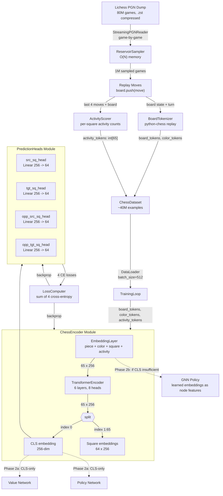
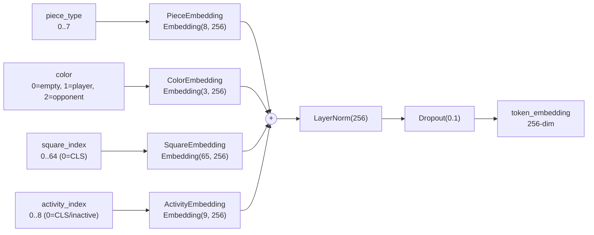
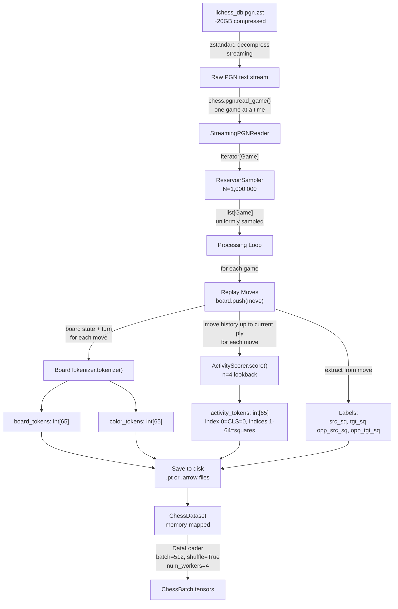
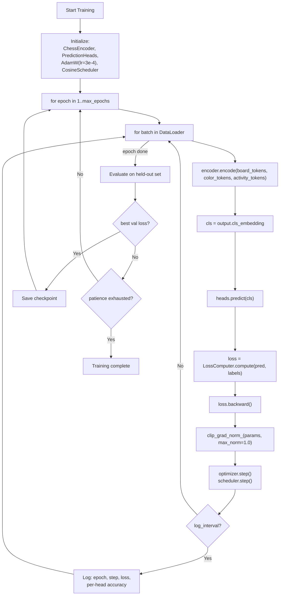

# Chess Transformer Encoder -- Design

## Problem Statement

The chess-sim project needs a foundation model that produces rich, contextual embeddings of chess board states for downstream tasks (value network, policy network, MCTS evaluation). Classical engines hand-craft evaluation features; neural engines learn implicitly from self-play. This encoder takes a third path: learning the language of chess analytically from master games using a BERT-style transformer, producing representations where strategic concepts emerge as geometric structure in embedding space. The encoder must be trainable on commodity hardware (single GPU) and produce embeddings usable by multiple downstream heads without retraining the backbone.

---

## Feasibility Analysis

| Approach | Pros | Cons | Verdict |
|----------|------|------|---------|
| **A. BERT-style encoder, CLS + 64 squares, 4 space-prediction heads** | Minimal vocabulary (8 tokens); natural CLS pooling for global state; per-square embeddings for local reasoning; well-understood architecture; ~4.8M params fits single GPU; piece identity is implicit from board state — no redundant piece heads needed | No autoregressive move sequence modeling; CLS-only heads ignore per-square information for move selection | **Accept** |
| **B. GPT-style decoder, autoregressive move generation** | Directly models move sequences; natural for policy head | Requires causal masking that breaks full-board attention; harder to extract static board embeddings; training requires move-sequence tokenization not just board snapshots | Reject -- misaligned with embedding-first goal |
| **C. Graph Neural Network over piece-square graph** | Captures adjacency and attack structure naturally; variable-size input | Non-standard architecture; fewer pretrained baselines; harder to integrate with downstream transformer-based heads; custom batching logic | Reject -- engineering complexity too high for v1 |
| **D. CNN over 8x8 board image** | Spatial inductive bias is built in; AlphaZero precedent | Fixed receptive field limits long-range piece interaction; no natural CLS equivalent; harder to produce per-square embeddings | Reject -- transformer attention handles long-range better |

---

## Chosen Approach

Approach A is accepted. A BERT-style transformer encoder over a 65-token sequence (CLS + 64 squares) with additive embedding composition (piece + color + square + activity) and four space-prediction heads (player src/tgt squares + opponent src/tgt squares) provides the best balance of simplicity, expressiveness, and alignment with downstream tasks. Piece identity is derived as a joint probability: since the board state is known, predicting a source square implicitly identifies the piece at that square — `P(piece | src_sq, board) = 1`. This eliminates redundant piece-type classification heads while preserving full move information. The architecture totals ~4.8M parameters, trainable on a single GPU. The two-task objective (predict both the player's move and the opponent's response) forces the CLS embedding to compress a richer global board representation capturing the strategic intentions of both sides simultaneously. A fourth embedding stream — activity — encodes how "hot" each square has been in the last 4 plies, giving the transformer direct access to recent-play context without requiring it to infer momentum from static board state alone.

---

## Architecture

### Diagram 1 -- Full System Overview



*Caption: End-to-end data flow from raw PGN to trained encoder. `ActivityScorer` runs alongside `BoardTokenizer` during preprocessing, consuming the last 4 moves per ply. Solid lines are Phase 1 (pretraining). Dashed lines are Phase 2 (downstream, out of scope). Phase 2a uses CLS sequences only. Phase 2b falls back to GNN with learned embedding table weights as node features if CLS-only is insufficient.*

---

### Diagram 2 -- Embedding Composition Detail



*Caption: Four independent embedding tables are summed element-wise, then normalized and dropped out. CLS uses piece_type=0 (CLS token), color=0 (empty), square_index=0, activity_index=0 (always 0 — no activity applies to the CLS position). Activity vocabulary covers 0–8; 9 bins span the maximum score range of 4 moves × 2 pts/move.*

---

### Diagram 3 -- Training Sequence Diagram

```mermaid
sequenceDiagram
    participant DL as DataLoader
    participant ENC as ChessEncoder
    participant EMB as EmbeddingLayer
    participant TF as TransformerEncoder
    participant PH as PredictionHeads
    participant LC as LossComputer
    participant OPT as AdamW Optimizer

    DL->>ENC: batch(board_tokens, color_tokens, activity_tokens, labels)
    ENC->>EMB: forward(board_tokens, color_tokens, activity_tokens)
    EMB-->>TF: embeddings [B, 65, 256]
    TF-->>ENC: encoded [B, 65, 256]
    ENC->>ENC: cls = encoded[:, 0, :]
    ENC->>PH: forward(cls)
    PH-->>LC: 4 logit tensors
    LC->>LC: sum(CE(sq_logits_i, sq_labels_i) for i in 1..4)
    LC-->>OPT: total_loss scalar
    OPT->>OPT: zero_grad, loss.backward, step
    OPT-->>ENC: updated parameters
```

*Caption: Single training step sequence. `activity_tokens` flows through the batch alongside `board_tokens` and `color_tokens`. The encoder and heads share the backward pass through the combined loss.*

---

### Diagram 4 -- Class Structure

```mermaid
classDiagram
    class Tokenizable {
        <<Protocol>>
        +tokenize(board: chess.Board, turn: chess.Color) TokenizedBoard
    }

    class Scorable {
        <<Protocol>>
        +score(moves: list~chess.Move~, board: chess.Board, n: int) list~int~
    }

    class Embeddable {
        <<Protocol>>
        +embed(board_tokens: Tensor, color_tokens: Tensor, activity_tokens: Tensor) Tensor
    }

    class Encodable {
        <<Protocol>>
        +encode(board_tokens: Tensor, color_tokens: Tensor, activity_tokens: Tensor) EncoderOutput
    }

    class Predictable {
        <<Protocol>>
        +predict(cls_embedding: Tensor) PredictionOutput
    }

    class Trainable {
        <<Protocol>>
        +train_step(batch: ChessBatch) float
    }

    class Samplable {
        <<Protocol>>
        +sample(stream: Iterator~Game~, n: int) list~Game~
    }

    class BoardTokenizer {
        +tokenize(board: chess.Board, turn: chess.Color) TokenizedBoard
    }

    class ActivityScorer {
        +score(moves: list~chess.Move~, board: chess.Board, n: int) list~int~
    }

    class EmbeddingLayer {
        +piece_emb: Embedding
        +color_emb: Embedding
        +square_emb: Embedding
        +activity_emb: Embedding
        +layer_norm: LayerNorm
        +dropout: Dropout
        +embed(board_tokens: Tensor, color_tokens: Tensor, activity_tokens: Tensor) Tensor
    }

    class ChessEncoder {
        +embedding: EmbeddingLayer
        +transformer: TransformerEncoder
        +encode(board_tokens: Tensor, color_tokens: Tensor, activity_tokens: Tensor) EncoderOutput
    }

    class PredictionHeads {
        +src_sq_head: Linear
        +tgt_sq_head: Linear
        +opp_src_sq_head: Linear
        +opp_tgt_sq_head: Linear
        +predict(cls_embedding: Tensor) PredictionOutput
    }

    class LossComputer {
        +compute(predictions: PredictionOutput, labels: LabelTensors) Tensor
    }

    class ReservoirSampler {
        +sample(stream: Iterator~Game~, n: int) list~Game~
    }

    class StreamingPGNReader {
        +stream(path: Path) Iterator~Game~
    }

    class ChessDataset {
        +examples: list~TrainingExample~
        +__getitem__(idx: int) ChessBatch
        +__len__() int
    }

    class Trainer {
        +encoder: ChessEncoder
        +heads: PredictionHeads
        +optimizer: AdamW
        +train_step(batch: ChessBatch) float
        +train_epoch(loader: DataLoader) float
    }

    Tokenizable <|.. BoardTokenizer
    Scorable <|.. ActivityScorer
    Embeddable <|.. EmbeddingLayer
    Encodable <|.. ChessEncoder
    Predictable <|.. PredictionHeads
    Trainable <|.. Trainer
    Samplable <|.. ReservoirSampler

    ChessEncoder --> EmbeddingLayer : owns
    Trainer --> ChessEncoder : owns
    Trainer --> PredictionHeads : owns
    Trainer --> LossComputer : uses
    ChessDataset --> BoardTokenizer : uses
    ChessDataset --> ActivityScorer : uses
    StreamingPGNReader --> ReservoirSampler : feeds
```



*Caption: Static class structure with Protocol-based interfaces. `ActivityScorer` implements the new `Scorable` protocol. `EmbeddingLayer` gains a fourth embedding table (`activity_emb`) and an updated `embed()` signature. `ChessDataset` uses both `BoardTokenizer` and `ActivityScorer` during preprocessing.*

---

### Diagram 5 -- Data Pipeline Detail



*Caption: Data pipeline from compressed PGN to batched training tensors. `ActivityScorer.score()` is called for every move alongside `BoardTokenizer.tokenize()`, consuming the full move history up to the current ply and returning a length-65 integer vector. Preprocessing runs once; training loads from disk.*

---

### Diagram 6 -- Training Loop Flowchart



*Caption: Training loop with gradient clipping, cosine LR schedule, validation-based checkpointing, and early stopping. The `encode()` call now takes all three token streams including `activity_tokens`.*

---

## Component Breakdown

### 1. `BoardTokenizer`

- **Responsibility:** Converts a `chess.Board` into the 65-token integer sequence (board_tokens + color_tokens) from the current player's perspective.
- **Protocol:** `Tokenizable`
- **Key interface:**
  ```
  tokenize(board: chess.Board, turn: chess.Color) -> TokenizedBoard
  ```
  where `TokenizedBoard` is a `NamedTuple(board_tokens: list[int], color_tokens: list[int])`.
- **Color normalization:** The board is always encoded from the perspective of the player to move. The player's pieces receive color index 1, the opponent's pieces receive color index 2, empty squares receive color index 0.
- **Square ordering:** a1=0, b1=1, ..., h8=63 (python-chess default). No board flipping — the board is always encoded from the starting perspective regardless of whose turn it is. Square semantics are stable (e4 always means e4). The color embedding stream handles the player/opponent distinction.
- **Testability:** Pure function, no side effects. Tested with known board positions.

### 1b. `ActivityScorer`

- **Responsibility:** Computes per-square activity scores from the last N moves of game history, producing a length-65 integer vector that encodes how frequently each square served as the source of a move or capture.
- **Protocol:** `Scorable`
- **Key interface:**
  ```
  score(moves: list[chess.Move], board: chess.Board, n: int = 4) -> list[int]
  ```
  Returns `activity_tokens` of length 65. Index 0 is CLS (always 0). Indices 1–64 map to squares a1–h8 (python-chess square index + 1). Values are integers in 0–8; any computed value above 8 is clamped to 8.
- **Algorithm:**
  1. Take the last `min(n, len(moves))` moves from the move history.
  2. Initialize `activity_tokens = [0] * 65`.
  3. For each move in that window: add 1 to `activity_tokens[move.from_square + 1]`.
  4. If the move was a capture — the board state *before* that move had a piece at `move.to_square` — add 1 more to `activity_tokens[move.from_square + 1]`.
  5. Clamp all values to 8: `min(v, 8)` per element.
- **Score vocabulary:** 0–8 (9 distinct values). Maximum score of 8 is reached when the same square executes 4 consecutive capturing moves (4 moves × 2 pts = 8).
- **CLS position:** Always 0. No board square corresponds to the CLS token.
- **Board parameter usage:** The `board` parameter provides pre-move state to determine whether a move was a capture. The scorer does not mutate the board.
- **Testability:** Pure function. Tested with known move sequences and hand-computed expected outputs.

### 2. `EmbeddingLayer` (nn.Module)

- **Responsibility:** Composes four learned embedding streams (piece, color, square, activity) into a single token embedding per position, applies LayerNorm and Dropout.
- **Protocol:** `Embeddable`
- **Key interface:**
  ```
  embed(board_tokens: Tensor[B, 65], color_tokens: Tensor[B, 65], activity_tokens: Tensor[B, 65]) -> Tensor[B, 65, 256]
  ```
- **Internal structure:**
  - `piece_emb: nn.Embedding(8, 256)` -- vocabulary: CLS=0, EMPTY=1, PAWN=2, KNIGHT=3, BISHOP=4, ROOK=5, QUEEN=6, KING=7
  - `color_emb: nn.Embedding(3, 256)` -- EMPTY=0, PLAYER=1, OPPONENT=2
  - `square_emb: nn.Embedding(65, 256)` -- index 0 = CLS position, 1..64 = board squares
  - `activity_emb: nn.Embedding(9, 256)` -- vocabulary 0..8; consistent with other embedding tables; 9 bins cover the full score range
  - `layer_norm: nn.LayerNorm(256)`
  - `dropout: nn.Dropout(0.1)`
- **Composition formula:** `LayerNorm(Dropout(piece_emb + color_emb + square_emb + activity_emb))`
- **Square embedding initialization:** Optionally initialized with 2D coordinate encodings (`rank * 8 + file` decomposed into sin/cos) to provide a geometric prior. Allowed to drift during training.
- **Testability:** Verified by asserting output shape and checking that different piece types produce different embeddings. Also verify that `activity_emb(0)` differs from `activity_emb(8)` after initialization.

### 3. `ChessEncoder` (nn.Module)

- **Responsibility:** Runs the full forward pass from tokens to contextualized embeddings (CLS + 64 square outputs).
- **Protocol:** `Encodable`
- **Key interface:**
  ```
  encode(board_tokens: Tensor[B, 65], color_tokens: Tensor[B, 65], activity_tokens: Tensor[B, 65]) -> EncoderOutput
  ```
  where `EncoderOutput` is a `NamedTuple(cls_embedding: Tensor[B, 256], square_embeddings: Tensor[B, 64, 256])`.
- **Internal structure:**
  - `embedding: EmbeddingLayer`
  - `transformer: nn.TransformerEncoder(layer, num_layers=6)` where layer is `nn.TransformerEncoderLayer(d_model=256, nhead=8, dim_feedforward=1024, dropout=0.1, batch_first=True)`
- **Testability:** Forward pass with random inputs verifies output shapes. Gradient flow verified by checking that `loss.backward()` populates all parameter gradients.

### 4. `PredictionHeads` (nn.Module)

- **Responsibility:** Maps the CLS embedding to four square-prediction outputs (player src/tgt + opponent src/tgt). Piece identity is derived from the board state at the predicted source square — no separate piece heads needed.
- **Protocol:** `Predictable`
- **Key interface:**
  ```
  predict(cls_embedding: Tensor[B, 256]) -> PredictionOutput
  ```
  where `PredictionOutput` is a `NamedTuple(src_sq_logits: Tensor[B, 64], tgt_sq_logits: Tensor[B, 64], opp_src_sq_logits: Tensor[B, 64], opp_tgt_sq_logits: Tensor[B, 64])`.
- **Joint probability for piece identity:** `P(piece, src_sq | board) = P(piece | src_sq, board) * P(src_sq | board)`. Since the board state is known, `P(piece | src_sq, board) = 1` — the piece type is deterministic given the square. The model only needs to learn `P(src_sq | board)`.
- **Internal structure:** Four independent `nn.Linear(256, 64)` layers. No shared parameters between heads.
- **Testability:** Verified by asserting output shapes (all `[B, 64]`) and that each head produces independent gradients.

### 5. `LossComputer`

- **Responsibility:** Computes the combined cross-entropy loss across all four heads.
- **Key interface:**
  ```
  compute(predictions: PredictionOutput, labels: LabelTensors) -> Tensor
  ```
  where `LabelTensors` is a `NamedTuple(src_sq: Tensor[B], tgt_sq: Tensor[B], opp_src_sq: Tensor[B], opp_tgt_sq: Tensor[B])`.
- **Loss formula:** `loss = CE(src_sq) + CE(tgt_sq) + CE(opp_src_sq) + CE(opp_tgt_sq)` with equal weights (1.0 each). No per-head weighting — establish vanilla model first.
- **Entropy-based loss for low-rated games:** For games flagged as low-rated, maximize entropy (push predictions toward uniform distribution) instead of minimizing CE. This teaches the model to move *away* from bad play patterns. Exact mechanism TBD (see Open Questions).
- **Testability:** Verified with known logits and labels against hand-computed CE values.

### 6. `StreamingPGNReader`

- **Responsibility:** Streams games one at a time from a `.zst`-compressed PGN file without loading the full file into memory.
- **Key interface:**
  ```
  stream(path: Path) -> Iterator[chess.pgn.Game]
  ```
- **Decompression:** Uses `zstandard` library for streaming `.zst` decompression. Wraps the decompressed byte stream in a `TextIOWrapper` for `chess.pgn.read_game()`.
- **Testability:** Verified with a small test PGN file (3-5 games).

### 7. `ReservoirSampler`

- **Responsibility:** Selects N games uniformly at random from a stream of unknown length using O(N) memory.
- **Protocol:** `Samplable`
- **Key interface:**
  ```
  sample(stream: Iterator[Game], n: int) -> list[Game]
  ```
- **Algorithm:** Standard reservoir sampling (Vitter's Algorithm R). For each game `i` in the stream: if `i < N`, append to reservoir; else generate `j = randint(0, i)`, and if `j < N`, replace `reservoir[j]`.
- **Testability:** Verified by running on a stream of known length and checking that sample distribution is approximately uniform (chi-squared test).

### 8. `ChessDataset` (torch.utils.data.Dataset)

- **Responsibility:** Stores preprocessed training examples and serves them as batched tensors.
- **Key interface:**
  ```
  __getitem__(idx: int) -> ChessBatch
  __len__() -> int
  ```
  where `ChessBatch` is a `NamedTuple(board_tokens: Tensor[65], color_tokens: Tensor[65], activity_tokens: Tensor[65], src_sq: int, tgt_sq: int, opp_src_sq: int, opp_tgt_sq: int)`.
- **Storage:** Preprocessed examples are saved to disk as `.pt` files (or Apache Arrow/Parquet for larger scale). The dataset memory-maps from disk at training time.
- **Train/val split:** 95% train, 5% validation. Split at the game level (not example level) to prevent data leakage from consecutive board states.
- **Testability:** Verified by loading a small dataset and checking tensor shapes and dtypes. Also verify that `activity_tokens` dtype is `torch.long` and values are in 0–8.

### 9. `Trainer`

- **Responsibility:** Orchestrates the training loop: forward pass, loss computation, backward pass, optimization, logging, checkpointing.
- **Protocol:** `Trainable`
- **Key interface:**
  ```
  train_step(batch: ChessBatch) -> float  # returns loss value
  train_epoch(loader: DataLoader) -> float  # returns avg epoch loss
  ```
- **Optimizer:** AdamW with lr=3e-4, weight_decay=0.01.
- **Scheduler:** Cosine annealing with warmup (1000 steps linear warmup).
- **Gradient clipping:** `clip_grad_norm_(params, max_norm=1.0)`.
- **Checkpointing:** Saves model state when validation loss improves.
- **Early stopping:** Patience of 3 epochs without improvement.
- **Logging decorator:** A `@log_metrics` decorator handles metric logging (loss, per-head accuracy, learning rate) to avoid polluting the training loop with logging logic.
- **Device management:** A `@device_aware` decorator handles `.to(device)` calls, defaulting to GPU when available, CPU for unit tests.
- **Testability:** `train_step` is tested in isolation with a single synthetic batch, verifying that loss decreases after one step.

---

## Data Structures

```
TokenizedBoard = NamedTuple:
    board_tokens:    list[int]  # length 65, values 0..7
    color_tokens:    list[int]  # length 65, values 0..2
    activity_tokens: list[int]  # length 65, values 0..8; index 0 (CLS) always 0

TrainingExample = NamedTuple:
    board_tokens:    list[int]  # length 65
    color_tokens:    list[int]  # length 65
    activity_tokens: list[int]  # length 65, values 0..8
    src_sq:          int        # 0..63
    tgt_sq:          int        # 0..63
    opp_src_sq:      int        # 0..63, or -1 if last move in game
    opp_tgt_sq:      int        # 0..63, or -1 if last move in game

ChessBatch = NamedTuple:
    board_tokens:    Tensor[B, 65]  # torch.long
    color_tokens:    Tensor[B, 65]  # torch.long
    activity_tokens: Tensor[B, 65]  # torch.long, values 0..8
    src_sq:          Tensor[B]      # torch.long
    tgt_sq:          Tensor[B]      # torch.long
    opp_src_sq:      Tensor[B]      # torch.long; -1 = ignore_index
    opp_tgt_sq:      Tensor[B]      # torch.long; -1 = ignore_index

EncoderOutput = NamedTuple:
    cls_embedding:     Tensor[B, 256]
    square_embeddings: Tensor[B, 64, 256]

PredictionOutput = NamedTuple:
    src_sq_logits:     Tensor[B, 64]
    tgt_sq_logits:     Tensor[B, 64]
    opp_src_sq_logits: Tensor[B, 64]
    opp_tgt_sq_logits: Tensor[B, 64]

LabelTensors = NamedTuple:
    src_sq:     Tensor[B]
    tgt_sq:     Tensor[B]
    opp_src_sq: Tensor[B]
    opp_tgt_sq: Tensor[B]
```

---

## Hyperparameters

| Parameter | Value | Rationale |
|-----------|-------|-----------|
| `d_model` | 256 | Sufficient expressiveness for 8-token vocab; keeps param count at ~4.8M |
| `n_heads` | 8 | 256/8 = 32-dim per head; standard ratio |
| `n_layers` | 6 | Matches BERT-base depth-to-width ratio scaled down |
| `d_ff` | 1024 | 4x d_model, standard FFN expansion |
| `dropout` | 0.1 | Standard regularization |
| `max_seq_len` | 65 | CLS + 64 squares, fixed |
| `batch_size` | 512 | Fits in ~4GB GPU memory with this param count |
| `learning_rate` | 3e-4 | Standard for AdamW on transformers of this scale |
| `weight_decay` | 0.01 | Mild L2 regularization |
| `warmup_steps` | 1000 | ~1 epoch warmup at batch_size=512 over 40M examples |
| `max_epochs` | 10 | Early stopping at patience=3 |
| `gradient_clip` | 1.0 | Prevents gradient explosion |
| `num_workers` | 4 | DataLoader parallelism |
| `reservoir_size` | 1,000,000 | Games sampled per training run |
| `activity_vocab_size` | 9 | Scores 0–8; covers max 4 moves × 2 pts/move |
| `lookback_window` | 4 | Plies of history used for activity scoring |
| **Total params** | **~4,795,024** | Validated via hypothesis script (activity_emb adds 9×256=2,304 params) |

---

## Test Cases

| ID | Scenario | Input | Expected Outcome | Edge? |
|----|----------|-------|------------------|-------|
| T01 | Tokenize initial position as White | `chess.Board()`, turn=WHITE | board_tokens[0]=0 (CLS), board_tokens[1]=5 (ROOK at a1); color_tokens[1]=1 (PLAYER) | No |
| T02 | Tokenize initial position as Black | `chess.Board()`, turn=BLACK | No flip; board_tokens[1] encodes a1 (WHITE ROOK); color_tokens[1]=2 (OPPONENT since Black is to move) | No |
| T03 | Tokenize empty square | Board with empty e4 | board_tokens[e4_idx]=1 (EMPTY), color_tokens[e4_idx]=0 (EMPTY) | No |
| T04 | Embedding output shape | batch of 4, seq_len=65 | Output tensor shape = (4, 65, 256) | No |
| T05 | Encoder output shape | batch of 4 | cls_embedding: (4, 256), square_embeddings: (4, 64, 256) | No |
| T06 | Prediction heads output shape | cls_embedding of shape (4, 256) | src_sq: (4, 64), tgt_sq: (4, 64), opp_src_sq: (4, 64), opp_tgt_sq: (4, 64) | No |
| T07 | Loss computation correctness | Known logits + labels | Loss matches hand-computed CE within 1e-5 tolerance | No |
| T08 | Loss decreases after one train step | Random batch, two forward passes | loss_after < loss_before | No |
| T09 | Gradient flow to all parameters | One backward pass | All encoder + head parameters have non-None, non-zero gradients | No |
| T10 | Reservoir sampler uniformity | Stream of 10,000 items, sample 100, repeat 1,000 times | Each item appears with frequency ~100/10,000 (chi-squared p > 0.01) | No |
| T11 | Reservoir sampler with N > stream length | Stream of 50 items, sample 100 | Returns all 50 items | Yes |
| T12 | Streaming PGN reader yields valid games | Small test PGN with 3 games | Iterator yields exactly 3 `chess.pgn.Game` objects | No |
| T13 | Color normalization consistency | Same position, tokenized as White then Black | board_tokens identical (no flip); color indices swap (1 <-> 2) for all occupied squares | No |
| T14 | Promotion handling | Board where pawn promotes to queen | src_sq = pawn's square, tgt_sq = promotion square; piece identity (PAWN) derived from board state at src_sq | Yes |
| T15 | En passant tokenization | Board with en passant capture available | Target square is the en passant square (not the captured pawn's square) | Yes |
| T16 | Castling tokenization | Board where king castles | src_sq = king's square (e1/e8), tgt_sq = king's destination (g1 or c1); piece identity (KING) derived from board state at src_sq | Yes |
| T17 | Opponent label extraction | Move pair (e4, e5) at move 1 | For the board before e4: opp_src_sq=e7_index, opp_tgt_sq=e5_index | No |
| T18 | Last move in game has no opponent label | Final move of a game | opp_src_sq and opp_tgt_sq are set to ignore_index (-1) | Yes |
| T19 | Checkpoint save and reload | Train, save, reload, forward pass | Outputs are identical before save and after reload | No |
| T20 | DataLoader produces correct dtypes | Load one batch | board_tokens: torch.long, color_tokens: torch.long, activity_tokens: torch.long, labels: torch.long | No |
| T21 | ActivityScorer: no history | Empty move list | All activity_tokens = 0 (index 0 = CLS = 0; all square indices = 0) | No |
| T22 | ActivityScorer: single non-capture move | One move from e2 to e4 | activity_tokens[e2_sq_idx] = 1, all others 0 | No |
| T23 | ActivityScorer: capture adds bonus | One capturing move from d5 to e4 (piece at e4 before move) | activity_tokens[d5_sq_idx] = 2 | No |
| T24 | ActivityScorer: lookback capped at 4 | 6-move history; last 4 moves all originate from d1 | activity_tokens[d1_sq_idx] = 4 (only last 4 plies counted) | No |
| T25 | ActivityScorer: score clamped at 8 | Artificially constructed score exceeding 8 for a square | activity_tokens max value = 8 for that square | Yes |

---

## Coding Standards

The engineering team adheres to these standards for all modules in this design:

- **DRY:** All four heads are identical `nn.Linear(256, 64)` layers. Since they share the same architecture, consider a factory or loop-based construction (e.g., `nn.ModuleList([nn.Linear(256, 64) for _ in range(4)])`). If head logic grows beyond a single linear layer, extract a shared `SquareHead` class.
- **Decorators for cross-cutting concerns:**
  - `@log_metrics` -- wraps `train_step` and `train_epoch` to emit structured logs without cluttering business logic.
  - `@device_aware` -- handles tensor device placement. Use CPU for unit tests, GPU for training/evaluation.
  - `@timed` -- optional performance decorator for profiling data pipeline stages.
- **Typing everywhere:** All function signatures include full type annotations. Use `Tensor` with shape comments (e.g., `Tensor  # [B, 65, 256]`). No bare `Any`.
- **Protocols over ABCs:** Use `typing.Protocol` for `Tokenizable`, `Scorable`, `Embeddable`, `Encodable`, `Predictable`, `Samplable`, `Trainable`. Concrete classes implement these implicitly (structural subtyping).
- **NamedTuples for data containers:** `TokenizedBoard`, `TrainingExample`, `ChessBatch`, `EncoderOutput`, `PredictionOutput`, `LabelTensors` are all `NamedTuple` types. Immutable, typed, self-documenting.
- **Comments:** 280 characters max. If more context is needed, the code is unclear.
- **Unit tests required:** Every component has corresponding tests. The `Trainer` is tested with synthetic data on CPU. The data pipeline is tested with a small PGN fixture.
- **No new dependencies without justification.** Required dependencies:
  - `torch` -- transformer implementation and training
  - `python-chess` -- PGN parsing and board state management
  - `zstandard` -- streaming decompression of `.zst` files

---

## Dependencies

| Package | Version | Justification |
|---------|---------|---------------|
| `torch` | >=2.0 | Core ML framework; provides nn.TransformerEncoder, DataLoader, optimizers |
| `python-chess` | >=1.9 | PGN parsing, move legality, board state management; no viable alternative |
| `zstandard` | >=0.21 | Streaming decompression of Lichess .zst dumps; stdlib has no zstd support |

---

## Resolved Decisions

1. **Opponent label for the last move in a game:** Use `ignore_index=-1` in `nn.CrossEntropyLoss` so the opponent square heads skip terminal-move examples. No vocabulary change needed.

2. **Board perspective:** No flipping. The board is always encoded from the starting perspective (a1=0, h8=63) regardless of whose turn it is. The color embedding stream distinguishes player vs opponent pieces. This keeps square semantics stable — e4 always means e4 — and lets the model learn color-conditioned spatial reasoning through the color embeddings rather than geometric transformation.

3. **Per-head loss weighting:** Equal weights (1.0 each), no optional weighting. Establish that the vanilla model works first before introducing tuning knobs.

4. **Preprocessing once vs. on-the-fly:** Preprocess once to disk. ~40M examples at ~200 bytes each is ~8GB on disk, acceptable.

5. **Handling promotions:** No special handling. The model predicts src_sq and tgt_sq only. With sufficient training examples, the promotion relationship should be learned implicitly from board state context.

6. **Rating filter on sampled games:** No filtering — train on all games regardless of rating. For low-rated games (blunders), maximize entropy instead of minimizing cross-entropy. This pushes the learned distribution away from bad play and toward good play, baked into the board state representation. Implementation: flag games by rating bracket and invert the CE loss sign (or use `1 - softmax` target) for low-rated examples.

7. **Downstream fine-tuning strategy:** Per-square output embeddings are treated as noise and discarded downstream. The valuable learned representations are: (a) the CLS token embedding (global board state), (b) the learned square embeddings from the embedding table, and (c) the learned piece embeddings from the embedding table. Phase 2 plan: first attempt using only CLS token sequences. If insufficient, build a GNN using the learned embedding table weights as node features for policy training.

8. **Mixed precision training:** Start with FP32 on RTX 4070 Super (12GB VRAM). At ~4.8M params and batch_size=512, memory should be comfortable. Monitor VRAM usage and switch to mixed precision only if needed.

9. **Activity embedding design:** Per-square activity scores are computed from the last 4 plies by `ActivityScorer`. Scores are discretized into 9 bins (0–8) and embedded via `nn.Embedding(9, 256)` — consistent with other embedding tables. Raw integer counts are used without normalization to preserve ordinal semantics; the model learns relative importance through the embedding weights. The `activity_emb` stream is summed with the other three streams before LayerNorm. CLS position always receives score 0 because it has no corresponding board square.

---

## Open Questions

1. **Validation metric:** Beyond loss, track top-1 accuracy for each of the four heads. Also track top-5 accuracy as a secondary metric, since multiple moves may be reasonable in a given position.

2. **Data versioning:** Lichess dumps are monthly snapshots. Pin the exact dump URL (e.g., `lichess_db_standard_rated_2024-01.pgn.zst`) in a config file to ensure reproducibility across training runs.

3. **Entropy-based loss for low-rated games:** The exact mechanism for "maximize entropy on bad games" needs specification. Options: (a) negate the CE loss for low-rated games, (b) use a rating-based loss weight that flips sign below a threshold, (c) use a KL divergence target that pushes toward uniform distribution for bad games. Requires experimentation.
