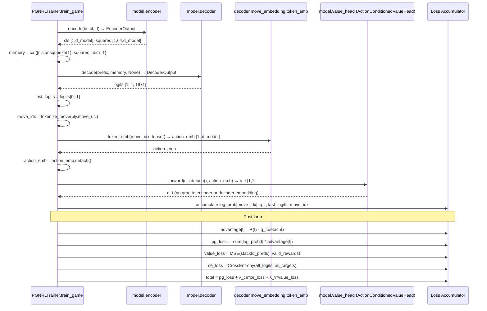
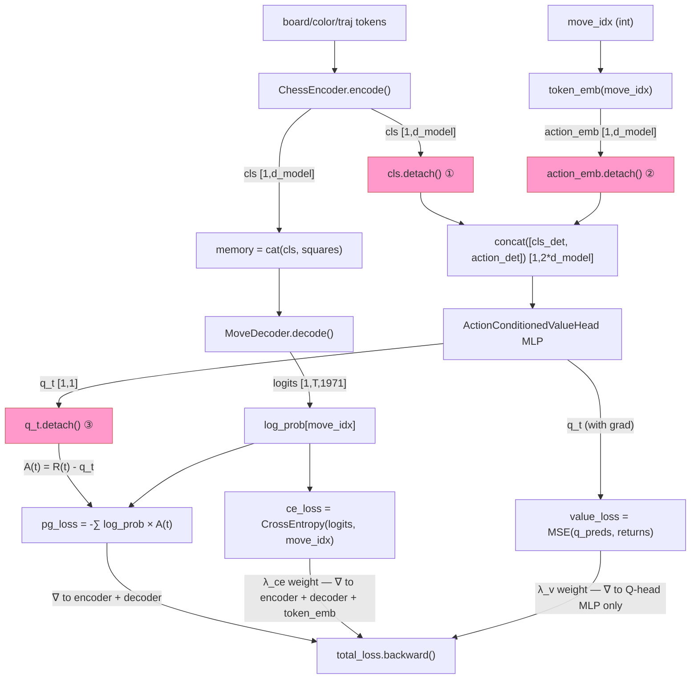

# Action-Conditioned Value Head Q(S, A_teacher) — Design

---

## Problem Statement

The current offline RL trainer maintains a critic `V(S_t)` that predicts the expected
discounted return from board state `S_t` alone. In this offline setting the game
trajectory is entirely fixed by the teacher's recorded moves: the student never acts —
it only observes the teacher's move and receives a reward signal derived from the game
outcome. The advantage `A(t) = R(t) − V(S_t)` therefore asks "how surprising was the
return relative to this board state?" but the board state is only half the picture.
What actually determines the return trajectory is the pair `(S_t, A_teacher_t)`: the
position *and* the specific move the teacher chose to play. A state-only critic cannot
distinguish a brilliant sacrifice from a passive pawn push at the same board position —
both map to the same `V(S_t)`. Replacing `V(S)` with a Q-function `Q(S, A_teacher)`
conditions the critic on the information that actually governs the trajectory, reducing
baseline variance and aligning the advantage signal with the teacher's causal structure.

---

## Feasibility Analysis

All information required by the new head is already available inside `train_game` at
the point where the value estimate is needed:

- `cls` — produced by `_encode_and_decode` (already on device, shape `[1, d_model]`).
- `move_idx` — computed from `MoveTokenizer.tokenize_move(ply.move_uci)` one line
  later in the existing ply loop.
- Token embedding table — `model.decoder.move_embedding.token_emb`, an
  `nn.Embedding(1971, d_model)` already resident in the model's parameter set.

| Approach | Pros | Cons | Verdict |
|----------|------|------|---------|
| **A. Concat fusion MLP: `[cls; token_emb(move_idx)]` → `2*d_model` → scalar** (chosen) | Reuses existing token embedding weights; no new embedding parameters; concat is the simplest and most interpretable fusion; two-layer MLP matches existing `ReturnValueHead` architecture | Input dimension doubles (`2*d_model`); hidden layer is larger; positional embedding omitted (single-token lookup, position is meaningless here) | Accept |
| **B. Additive fusion: `cls + token_emb(move_idx)` → `d_model` → scalar** | Same parameter count as current head; no architecture change to MLP layers | Addition assumes state and action live in the same semantic subspace — unjustified; cannot model interactions where both signals are jointly required | Reject |
| **C. Cross-attention: cls attends to action embedding** | Principled attention-based fusion; works naturally when action is a sequence | Single-token action makes cross-attention degenerate (1-query, 1-key, 1-value); all overhead, no benefit over concat | Reject |
| **D. Full separate action embedding table (new weights)** | Complete independence from decoder's evolving embedding | Doubles action embedding parameters; the decoder's `token_emb` already learns a rich move representation trained by CE loss — duplicating it wastes capacity and breaks weight coupling | Reject |
| **E. State-only baseline with reward normalization** | No new components; reduces variance through reward standardization instead | Does not address the causal misalignment: the baseline still ignores which move was taken; reward normalization is complementary, not a substitute | Reject |

Option D is rejected because `token_emb` is a live parameter trained jointly by CE
loss — it already encodes quality information about each move. Sharing it with the
Q-head is free alignment, not a coupling risk. Option B is rejected because additive
fusion conflates the signal from two semantically different spaces.

---

## Chosen Approach

`ActionConditionedValueHead` is a two-layer MLP that accepts a concatenation of the
detached CLS board embedding and the teacher's move embedding (also detached from
the position encoding path), projecting from `2 * d_model` to a scalar Q-value.
The move embedding is obtained by a direct index into
`model.decoder.move_embedding.token_emb` — the same `nn.Embedding(1971, d_model)`
table trained by the CE loss — using the teacher's `move_idx` as the key. No new
embedding weights are introduced. The Q-head replaces `ReturnValueHead` as the sole
critic in `ChessModel.value_head`; the old class is removed. The advantage formula
updates from `A(t) = R(t) − V(S_t)` to `A(t) = R(t) − Q(S_t, A_teacher_t)`,
and the value MSE trains the Q-head to predict `R(t)` given the pair
`(S_t, A_teacher_t)`. The `_encode_and_decode` helper is extended to return
`move_idx` alongside `last_logits` and `cls`, so the ply loop has all three
quantities available without an additional forward pass.

---

## Architecture

### Static Structure

```mermaid
classDiagram
    class ActionConditionedValueHead {
        -_fc1: nn.Linear
        -_relu: nn.ReLU
        -_fc2: nn.Linear
        +__init__(d_model: int) None
        +forward(cls_emb: Tensor, action_emb: Tensor) Tensor
    }

    class ChessModel {
        +encoder: ChessEncoder
        +decoder: MoveDecoder
        +value_head: ActionConditionedValueHead
        +move_token_emb() nn.Embedding
        +forward(...) Tensor
    }

    class MoveDecoder {
        +move_embedding: MoveEmbedding
        +decode(move_tokens, memory, mask) DecoderOutput
    }

    class MoveEmbedding {
        +token_emb: nn.Embedding
        +pos_emb: nn.Embedding
        +embed_moves(move_tokens) Tensor
    }

    class PGNRLTrainer {
        -_model: ChessModel
        +train_game(game) dict[str, float]
        -_encode_and_decode(bt, ct, tt, prefix) tuple
    }

    ChessModel *-- ActionConditionedValueHead : value_head
    ChessModel *-- MoveDecoder
    MoveDecoder *-- MoveEmbedding
    MoveEmbedding *-- "token_emb\n nn.Embedding(1971, d_model)" : owns
    PGNRLTrainer --> ChessModel : trains
    ActionConditionedValueHead ..> MoveEmbedding : reads token_emb via ChessModel.move_token_emb()
```

_Figure 1. Static ownership. `ActionConditionedValueHead` is owned by `ChessModel` as
`value_head`. It receives embeddings from the decoder's token table via the
`move_token_emb()` property, keeping the reference stable across checkpoints._

---

### Training Data Flow (per-ply)



_Figure 2. Per-ply sequence with Q-head. Three detach boundaries are now present:
`cls.detach()` (encoder isolation), `action_emb.detach()` (decoder embedding
isolation), and `q_t.detach()` before the advantage computation (Q-head isolation
from pg\_loss)._

---

### Gradient Flow



_Figure 3. Gradient flow. Pink nodes are detach boundaries. Detach ① isolates the
encoder from value MSE gradients. Detach ② isolates the decoder's `token_emb` from
value MSE gradients (CE loss still trains `token_emb` via the un-detached logit path).
Detach ③ prevents Q-head gradients from flowing through the advantage into pg\_loss._

---

## Component Breakdown

### `ActionConditionedValueHead` (`chess_sim/model/value_heads.py` — replaces `ReturnValueHead`)

- **Responsibility**: Estimate the Q-value `Q(S_t, A_teacher_t)` from a detached
  board embedding and a detached action embedding.
- **Key interface**:
  ```
  class ActionConditionedValueHead(nn.Module):
      def __init__(self, d_model: int) -> None: ...
      def forward(self, cls_emb: Tensor, action_emb: Tensor) -> Tensor:
          # cls_emb:    [B, d_model] — caller must detach
          # action_emb: [B, d_model] — caller must detach
          # returns:    [B, 1] scalar Q-value estimate
  ```
- **Internal layers**:
  - `_fc1: nn.Linear(2 * d_model, d_model // 2)`
  - `_relu: nn.ReLU()`
  - `_fc2: nn.Linear(d_model // 2, 1)`
- **Fusion**: `concat([cls_emb, action_emb], dim=-1)` → shape `[B, 2*d_model]`
  before `_fc1`. No additional gating or normalization.
- **Contract**: the head performs no detach internally. Both detach calls are the
  caller's responsibility and must carry inline comments. This keeps the head
  testable with attached tensors.
- **Testability**: `ActionConditionedValueHead(128).forward(rand(4, 128), rand(4, 128))`
  must return shape `[4, 1]`, dtype `float32`, all values finite.

---

### `ChessModel` (`chess_sim/model/chess_model.py` — modified)

- **Responsibility**: Top-level assembly; exposes a stable reference to the decoder's
  token embedding table for use by the Q-head caller.
- **Changes**:
  1. Replace `ReturnValueHead` import with `ActionConditionedValueHead`.
  2. Change `self.value_head = ReturnValueHead(...)` to
     `self.value_head = ActionConditionedValueHead(model_cfg.d_model)`.
  3. Add read-only property:
     ```
     @property
     def move_token_emb(self) -> nn.Embedding:
         # Returns decoder's token embedding table (1971, d_model).
         return self.decoder.move_embedding.token_emb
     ```
- **Why a property**: the property is a zero-overhead reference; it avoids string-path
  access in the trainer (`model.decoder.move_embedding.token_emb`) and hides the
  internal module hierarchy from callers.
- **`forward()` signature**: unchanged — returns `[B, T, 1971]` logits.
- **Checkpoint safety**: `ActionConditionedValueHead` has a different `_fc1` input
  dimension (`2*d_model` vs `d_model`) — checkpoints from the old `ReturnValueHead`
  will fail `load_state_dict` with shape mismatches. See Open Questions §1.
- **Testability**: `hasattr(model, "value_head")` and
  `isinstance(model.value_head, ActionConditionedValueHead)`; `model.move_token_emb`
  returns the same object as `model.decoder.move_embedding.token_emb`.

---

### `PGNRLTrainer._encode_and_decode` (`chess_sim/training/pgn_rl_trainer.py` — modified)

- **Responsibility**: Shared helper for the encoder→decoder forward path; now also
  resolves the teacher's `move_idx` so the Q-head caller has all three quantities
  from a single call site.
- **Updated signature**:
  ```
  def _encode_and_decode(
      self,
      bt: Tensor,
      ct: Tensor,
      tt: Tensor,
      prefix: Tensor,
      move_uci: str,
  ) -> tuple[Tensor, Tensor, int | None]:
      # Returns (last_logits [1, vocab], cls [1, d_model], move_idx | None)
      # move_idx is None when tokenize_move raises KeyError.
  ```
- **Rationale**: Moving the `tokenize_move` call inside the helper collapses the
  existing `try/except` block in the ply loop, reduces duplication between
  `train_game` and future callers, and ensures the three return values are computed
  atomically. The `None` sentinel replaces the `continue` pattern at the call site.
- **Testability**: Pass a known UCI string (`"e2e4"`); assert `move_idx` is a valid
  integer in `[0, 1970]`. Pass an unknown string; assert `move_idx is None`.

---

### `PGNRLTrainer.train_game` (`chess_sim/training/pgn_rl_trainer.py` — modified)

- **Responsibility**: Execute one offline REINFORCE + Q-critic update for a single PGN
  game.
- **Changes to the ply loop**:
  1. Call updated `_encode_and_decode(bt, ct, tt, prefix, ply.move_uci)`.
  2. On `move_idx is None`, skip ply (`continue`); otherwise proceed.
  3. Look up action embedding:
     ```
     midx_t = tensor([move_idx], dtype=long, device=device)
     action_emb = model.move_token_emb(midx_t)  # [1, d_model]
     # detach: value MSE must not train token_emb via Q-head path
     action_emb = action_emb.detach()
     ```
  4. Call Q-head:
     ```
     q_t = model.value_head(cls.detach(), action_emb)  # [1, 1]
     q_preds.append(q_t.squeeze())
     ```
  5. Rename `v_preds` → `q_preds` throughout (rename is load-bearing for clarity;
     the advantage formula is otherwise identical).
- **Post-loop**: `advantage = valid_rewards − stack(q_preds).detach()` — unchanged
  in structure; variable renamed.
- **Return dict**: `"value_loss"` and `"mean_advantage"` keys are unchanged; the
  values now reflect Q-head output rather than V-head output.
- **Testability**: All tensors on CPU in unit tests; mock `model.move_token_emb` to
  return a fixed `[1, d_model]` tensor.

---

### `RLConfig` (`chess_sim/config.py` — no change required)

The `lambda_value` field added by the previous `ReturnValueHead` design is reused
unchanged. No new hyperparameters are needed: the Q-head has the same
MSE weighting contract as the V-head it replaces.

---

### `configs/train_rl.yaml` — no change required

`lambda_value: 1.0` is already present. No new YAML keys are introduced.

---

## Test Cases

| ID | Scenario | Input | Expected Outcome | Edge? |
|----|----------|-------|------------------|-------|
| T24 | `ActionConditionedValueHead` forward shape | `ActionConditionedValueHead(128).forward(rand(4,128), rand(4,128))` | Output shape `[4, 1]`, dtype `float32` | No |
| T25 | `ActionConditionedValueHead` all outputs finite | Same as T24 | `torch.isfinite(out).all()` is `True` | No |
| T26 | Encoder gradient isolation via `cls.detach()` | Forward with attached cls, check `cls.grad` after backward on Q-head output | `cls.grad` is `None` (no grad flows to encoder) | No |
| T27 | Decoder `token_emb` gradient isolation via `action_emb.detach()` | Forward with attached `action_emb`, backward on Q-head MSE | `action_emb.grad` is `None` | No |
| T28 | Q-head grad does not enter `pg_loss` via advantage | Compute advantage with `q_t.detach()`; check `q_t.grad` after pg_loss backward | `q_t.grad` is `None` | No |
| T29 | `ChessModel.move_token_emb` returns correct object | `ChessModel()` constructed | `model.move_token_emb is model.decoder.move_embedding.token_emb` | No |
| T30 | `move_token_emb` output shape | `model.move_token_emb(tensor([42]))` | Shape `[1, d_model]` | No |
| T31 | `_encode_and_decode` returns valid `move_idx` for known UCI | Call with `move_uci="e2e4"` | Returned `move_idx` is `int` in `[0, 1970]` | No |
| T32 | `_encode_and_decode` returns `None` for unknown UCI | Call with `move_uci="zzzz"` | Returned `move_idx is None` | Yes |
| T33 | `train_game` returns `value_loss` key (Q-head) | Scholar's Mate game, default config | `"value_loss"` in returned dict; `value_loss >= 0.0` | No |
| T34 | `train_game` returns `mean_advantage` key (Q-head) | Scholar's Mate game | `math.isfinite(metrics["mean_advantage"])` | No |
| T35 | Integration: mock model returns correct loss keys | Mock `ChessModel` with fixed `forward`, `move_token_emb`, `value_head` outputs | `train_game` dict contains `total_loss`, `pg_loss`, `ce_loss`, `value_loss`, `mean_advantage` | No |
| T36 | Q-head `_fc1` input dimension is `2 * d_model` | `ActionConditionedValueHead(128)._fc1.in_features` | `256` | No |
| T37 | Checkpoint round-trip includes Q-head weights | Save then load `PGNRLTrainer` checkpoint | Loaded `model.value_head._fc1.weight` is bit-for-bit equal to original | No |

---

## Coding Standards

The implementor must observe the following before opening a PR:

- **DRY**: The `_encode_and_decode` helper absorbs the `tokenize_move` call,
  eliminating the `try/except KeyError` block that previously appeared inline in
  `train_game`. There must be exactly one call site for `tokenize_move` inside
  `_encode_and_decode`.
- **Naming**: rename `v_preds` → `q_preds` throughout `train_game` to reflect the
  Q-function semantics. This rename must be consistent across all list declarations,
  appends, and stack calls.
- **Decorators**: the `@property move_token_emb` on `ChessModel` uses no caching;
  it is a direct reference return. A `@functools.cached_property` is unnecessary —
  the attribute lookup is O(1).
- **Typing**:
  - `_encode_and_decode` returns `tuple[Tensor, Tensor, int | None]` — all three
    components must be typed in the signature.
  - `q_preds: list[Tensor]` declared at ply-loop top alongside `log_probs`.
  - `action_emb: Tensor` typed at assignment.
- **Comments**: each of the three detach sites must carry a ≤ 280-character inline
  comment. Suggested text:
  - `cls.detach()` — "value MSE must not reshape encoder representations"
  - `action_emb.detach()` — "value MSE must not train token_emb via Q-head path; CE loss trains token_emb separately"
  - `q_t.detach()` — "prevent Q-head gradient from flowing through advantage into pg_loss"
- **`unittest` before implementation**: T24–T37 must exist as failing tests before any
  production file changes are made.
- **No new dependencies**: `nn.Linear`, `nn.ReLU`, `nn.Embedding`, `F.mse_loss`, and
  `torch.cat` are all already imported — no `requirements.txt` change needed.
- **Ruff compliance**: run `python -m ruff check . --fix` after all changes; the `ANN`
  rules apply to all non-test source files; line limit is 88 characters.

---

## Open Questions

1. **Checkpoint backward compatibility**: `ActionConditionedValueHead._fc1` has
   `in_features = 2 * d_model`, while the old `ReturnValueHead._fc1` has
   `in_features = d_model`. Shape mismatches will cause `load_state_dict` to raise
   `RuntimeError`. The implementor must choose: (a) add `strict=False` to
   `load_checkpoint` with a logged warning and fresh Q-head weights, or (b) bump
   the checkpoint version key and reject mismatched checkpoints at load time. Option
   (a) is operationally simpler for the current training run; option (b) is safer
   long-term. Stakeholder decision required before implementation.

2. **Should `action_emb` be detached from the Q-head?** The design specifies
   `action_emb.detach()` before the Q-head receives it, so that value MSE gradients
   cannot update `token_emb` via the Q-head path. CE loss continues to train
   `token_emb` unimpeded. The alternative — allowing Q-head MSE to also update
   `token_emb` — could introduce conflicting gradient directions between CE and MSE
   objectives. The detach is the conservative choice; engineering team should
   experiment with the attached variant after the baseline is established.

3. **`move_idx` out of vocabulary**: `MoveTokenizer.tokenize_move` raises `KeyError`
   for UCI strings not in the 1971-token vocabulary. This is handled by the `None`
   sentinel path in `_encode_and_decode`. The engineering team must verify whether
   any master PGN games contain moves (e.g., promotions to rook or bishop) that are
   absent from the vocabulary and quantify the skip rate. A high skip rate would
   indicate a vocabulary coverage gap that affects both CE and Q-head training.

4. **Advantage normalization**: standard REINFORCE implementations normalize advantages
   by their running standard deviation. The current design does not mandate this.
   Engineering team should inspect the `mean_advantage` metric in Aim over the first
   five epochs and revisit if variance is large.

5. **`sample_visuals` and `evaluate` Q-value display**: neither method uses the value
   head. `sample_visuals` could optionally display `Q(S_t, A_teacher_t)` alongside
   the reward for debugging. This is a follow-up concern — no change required in this
   design iteration.

6. **Token embedding warm-start for Q-head**: the `token_emb` table is already
   trained by CE loss by the time Q-head gradients arrive. If a resume checkpoint
   is loaded with `strict=False` (Open Question §1), the Q-head MLP starts from
   random initialization while `token_emb` is fully trained. This mismatch may cause
   large early Q-errors. Engineering team should consider a brief Q-head-only warmup
   phase (freeze encoder + decoder, train Q-head alone) or simply accept that the
   Q-head will self-calibrate within the first epoch.
