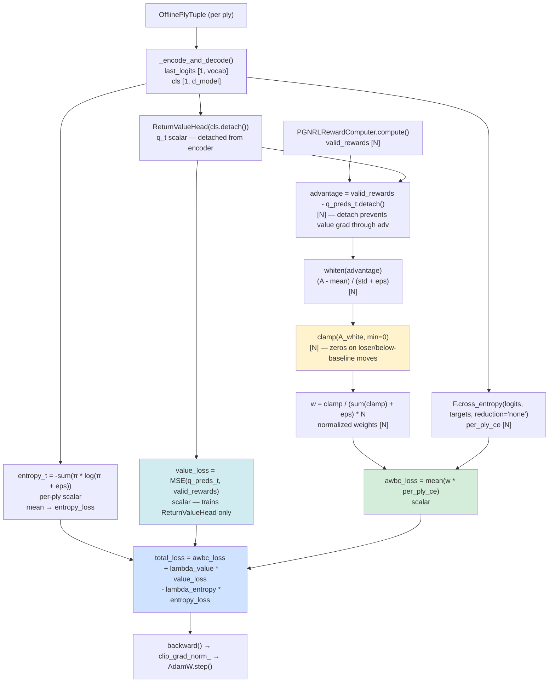
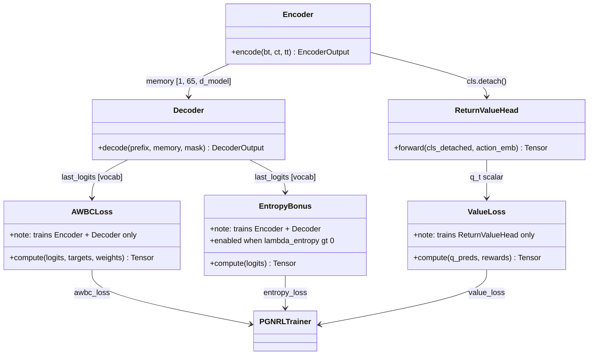

# Advantage-Weighted Behavioral Cloning (AWBC) Loss — Design

## Problem Statement

The current offline RL trainer in `PGNRLTrainer.train_game()` combines three
loss terms: `pg_loss` (REINFORCE policy gradient), `ce_loss` (uniform cross-
entropy over all plies), and `value_loss` (critic MSE). The CE term applies
identically to every teacher move regardless of game outcome, which directly
opposes the policy gradient on losing plies — CE says "increase probability
of this move" while PG says "decrease it." With reward magnitudes of ±10 and
advantage whitening, PG dominates but CE wastes gradient bandwidth fighting
it. AWBC resolves the conflict by replacing both `pg_loss` and `ce_loss` with
a single per-ply CE term gated by a clamped advantage weight, so that only
moves with positive advantage receive an imitation signal.

---

## Feasibility Analysis

| Approach | Pros | Cons | Verdict |
|---|---|---|---|
| **A. AWBC: `clamp(A,min=0) * per_ply_ce`** | Eliminates CE/PG conflict; single gradient path; no sign ambiguity; standard offline RL technique (used in AWR, MARWIL) | Requires pre-normalized advantage (critic must converge first or early epochs get sparse signal); no intrinsic entropy regularization | **Accept** |
| **B. Filtered CE (winner-plies only)** | Simple; removes losing-ply CE signal; keeps code change minimal | Still uniform over winning plies regardless of advantage magnitude; wastes signal when a winner ply had a poor move; does not unify with PG | **Reject** — partial fix, not principled |
| **C. Keep PG, drop CE entirely** | Simplest change; eliminates conflict | High gradient variance without supervised anchor; prone to policy collapse early in training on sparse rewards | **Reject** — loses all behavioral anchoring |
| **D. Keep both, gate CE by `is_winner_ply`** | Moderate fix; matches original design intent from earlier iteration | Still binary; ignores advantage magnitude; two conflicting gradient paths remain for winning plies with negative advantage | **Reject** — structurally identical problem |
| **E. AWBC + entropy bonus `-λ_H * H(π)`** | Full set: advantage-gated imitation + explicit collapse prevention | Adds one hyperparameter; entropy sign convention must be enforced carefully | **Accept as extension of A** |

Approach A is the primary recommendation. Approach E extends it with an
optional entropy bonus and is designed as an additive flag (`lambda_entropy`)
that defaults to `0.0`, making it backward-compatible.

**AWBC feasibility in the offline PGN setting**: the `PGNRLRewardComputer`
already produces a `ReturnValueHead` baseline, yielding advantages
`A(t) = R(t) - V(t)` before AWBC is applied. When `A(t) > 0` the model
under-predicted return — the move was better than expected — and imitation is
safe. When `A(t) <= 0` the move was at or below baseline, and the weight clamp
suppresses it to zero, causing the model to neither imitate nor explicitly
penalize it. This property is exactly the "filter-then-imitate" mechanism used
in Advantage-Weighted Regression (AWR) and MARWIL. No new dependencies are
needed; `F.cross_entropy(reduction='none')` is already in PyTorch.

**Risk — sparse signal in early training**: if the critic is untrained, all
advantages are near-random. The clamp `max(A, 0)` will admit roughly 50 % of
plies by chance, giving a reasonable warm-start. Whitening remains in place
before clamping to keep scale invariant to reward magnitude.

---

## Chosen Approach

AWBC replaces `pg_loss + lambda_ce * ce_loss` with a single loss term that
computes per-ply cross-entropy with `reduction='none'`, multiplies by
`clamp(whitened_advantage, min=0)`, normalizes by the sum of weights to
prevent collapse when few plies have positive advantage, and optionally
subtracts an entropy bonus. The `value_loss` term is kept unchanged because
the critic must remain trained to produce the advantages AWBC depends on.
The total loss becomes:

```
awbc_loss  = mean( w(t) * ce(t) )
           where w(t) = clamp(A_white(t), min=0) / (sum(clamp(A_white, min=0)) + ε)
                        × N                     ← re-scale so mean weight ≈ 1
entropy    = -sum( π(a|s) * log(π(a|s) + ε) )  ← scalar per ply, mean over plies
total_loss = awbc_loss + lambda_value * value_loss - lambda_entropy * mean(entropy)
```

The advantage whitening step (`(A - mean) / (std + ε)`) that currently
precedes `pg_loss` is preserved unchanged; it runs before clamping. The
`lambda_ce`, `pg_loss`, and `ce_loss` fields are deprecated but retained
as zero-valued in the metrics dict for backward-compatible Aim logging until
the next major config cleanup.

---

## Architecture

### Loss Computation Graph (new `train_game` inner loop)



_Figure 1. New loss computation graph inside `train_game`. The advantage path
(left branch) produces normalized non-negative weights. The CE path (right
branch) produces per-ply imitation losses. AWBC is their product. The value
loss path trains only `ReturnValueHead` through the MSE branch — the two
`detach()` boundaries are preserved from the existing design._

---

### Gradient Flow by Component



_Figure 2. Static component relationships. `cls.detach()` is the load-bearing
boundary that keeps `value_loss` from modifying encoder weights. AWBC and
entropy train encoder + decoder jointly; `value_loss` trains `ReturnValueHead`
only._

---

## Component Breakdown

### `chess_sim/config.py` — `RLConfig` dataclass

- **Responsibility**: declare all training hyperparameters; enforce invariants in
  `__post_init__`.
- **Changes**:
  - Add `lambda_awbc: float = 1.0` — overall scale on the AWBC term (replaces the
    implicit scale of 1.0 on `pg_loss`).
  - Add `lambda_entropy: float = 0.0` — entropy bonus coefficient; `0.0` disables it.
  - Add `awbc_eps: float = 1e-8` — denominator epsilon in weight normalization.
  - Deprecate (but retain) `lambda_ce: float = 0.5` — kept in `__post_init__`
    validation so existing YAML files do not break; emits a `DeprecationWarning`
    when `lambda_ce > 0.0` and the `awbc_loss` path is active.
- **Key interface**:
  ```python
  @dataclass
  class RLConfig:
      lambda_awbc: float = 1.0
      lambda_entropy: float = 0.0
      awbc_eps: float = 1e-8
      lambda_ce: float = 0.5   # deprecated; warn if > 0 with AWBC
      # ... all existing fields unchanged ...
  ```
- **Validation additions in `__post_init__`**:
  ```python
  if self.lambda_awbc < 0:
      raise ValueError(...)
  if self.lambda_entropy < 0:
      raise ValueError(...)
  if self.awbc_eps <= 0:
      raise ValueError(...)
  ```

---

### `chess_sim/training/pgn_rl_trainer.py` — `PGNRLTrainer`

- **Responsibility**: the only production change; all AWBC math lives in `train_game`.
- **Changes to `train_game()`** (lines 338–464 in the current file):

  1. **Accumulation loop** (lines 338–399): add `per_ply_logits` and `entropy_vals`
     lists alongside the existing `log_probs`, `q_preds`, `all_logits`, `all_targets`.
     `log_probs` and the existing `log_p[move_idx]` line are removed.

  2. **Post-loop: advantage whitening** (lines 413–423): unchanged — produces
     `whitened_advantage [N]`.

  3. **Post-loop: AWBC weight computation** (new block, replaces `pg_loss` line):
     ```python
     # pseudo-code — not production
     weights_raw: Tensor = clamp(whitened_advantage, min=0.0)
     weight_sum: Tensor  = weights_raw.sum() + cfg.rl.awbc_eps
     weights: Tensor     = weights_raw / weight_sum * N
     per_ply_ce: Tensor  = F.cross_entropy(
         stack(all_logits), targets_t, reduction='none'
     )
     awbc_loss: Tensor   = (weights * per_ply_ce).mean()
     ```

  4. **Post-loop: entropy bonus** (new optional block):
     ```python
     # pseudo-code — not production
     if cfg.rl.lambda_entropy > 0.0:
         probs_stack = F.softmax(stack(all_logits), dim=-1)
         log_probs_stack = torch.log(probs_stack + cfg.rl.awbc_eps)
         entropy_per_ply = -(probs_stack * log_probs_stack).sum(dim=-1)
         entropy_loss = entropy_per_ply.mean()
     else:
         entropy_loss = torch.zeros(1, device=device)
     ```

  5. **Total loss** (replaces line 437–441):
     ```python
     # pseudo-code — not production
     total_loss = (
         cfg.rl.lambda_awbc * awbc_loss
         + cfg.rl.lambda_value * value_loss
         - cfg.rl.lambda_entropy * entropy_loss
     )
     ```

  6. **Metrics dict** (lines 455–463): replace `pg_loss` and `ce_loss` keys with
     `awbc_loss`, `entropy_loss`, and `n_positive_weights` (count of plies with
     `w > 0`). Retain `pg_loss: 0.0` and `ce_loss: 0.0` as zeros for one release
     to avoid breaking Aim dashboard queries.

- **Changes to `train_epoch()`** (lines 466–529): replace accumulator variables
  `pg_loss` and `ce_loss` with `awbc_loss_sum` and `entropy_loss_sum`. Update
  the `track_scalars` dict and the returned metrics dict accordingly.

- **Key interface (unchanged)**:
  ```python
  def train_game(
      self, game: chess.pgn.Game, game_idx: int = 0
  ) -> dict[str, float]: ...

  def train_epoch(
      self, pgn_path: Path, max_games: int = 0
  ) -> dict[str, float]: ...
  ```

---

### YAML config files (`configs/train_rl.yaml`, `configs/train_rl_10k.yaml`)

- **Responsibility**: expose new hyperparameters to operators.
- **Changes**: add three fields to the `rl:` section:
  ```yaml
  rl:
    lambda_awbc:    1.0
    lambda_entropy: 0.0
    awbc_eps:       1.0e-8
    lambda_ce:      0.0   # set to 0 to silence deprecation warning
    # ... all other existing fields unchanged ...
  ```

---

### `tests/test_trainer.py` — new test class `TestPGNRLTrainerAWBC`

- **Responsibility**: unit-test the AWBC loss computation path in isolation.
- **All tests use mocked `ChessModel`** (no GPU required).
- See Test Cases section below for full scenario table.
- **Key interface**:
  ```python
  class TestPGNRLTrainerAWBC(unittest.TestCase):
      def setUp(self) -> None: ...   # build minimal PGNRLConfig with AWBC fields
  ```

---

## Test Cases

| ID | Scenario | Input | Expected Outcome | Edge? |
|---|---|---|---|---|
| T-A1 | All-positive advantages | whitened_adv = [+1.0, +2.0, +0.5]; ce = [1.0, 1.0, 1.0] | awbc_loss > 0; all weights > 0; loss equals weighted CE mean | No |
| T-A2 | All-negative advantages (pure loser game) | whitened_adv = [-1.0, -2.0]; ce = [1.0, 1.0] | clamp produces all zeros; weight_sum = awbc_eps; weights ≈ 0; awbc_loss ≈ 0.0 | Yes |
| T-A3 | Mixed advantages | whitened_adv = [-1.0, +2.0, -0.5, +1.0]; ce = [0.5, 0.5, 0.5, 0.5] | only indices 1 and 3 contribute; weights[0]=weights[2]=0 | No |
| T-A4 | Single ply (N=1) | whitened_adv = [+1.0]; ce = [0.8] | weight = 1.0 (normalization: 1/1 * 1); awbc_loss = 0.8 | Yes |
| T-A5 | Weight normalization scale | whitened_adv = [+1.0, +1.0]; ce = [1.0, 1.0] | weights each = 1.0 (2/2); awbc_loss = 1.0 | No |
| T-A6 | Entropy bonus disabled | lambda_entropy = 0.0 | entropy_loss = 0.0; total_loss = awbc_loss + lambda_value * value_loss | No |
| T-A7 | Entropy bonus active | lambda_entropy = 0.01; logits uniform over vocab | entropy_loss = log(1971) ≈ 7.59; total_loss < awbc_loss + value_loss (bonus subtracts) | No |
| T-A8 | lambda_awbc = 0.0 | lambda_awbc = 0.0; any advantages | awbc_loss in total_loss is zeroed; total_loss = lambda_value * value_loss | Yes |
| T-A9 | `RLConfig` rejects lambda_awbc < 0 | lambda_awbc = -0.1 | `ValueError` raised in `__post_init__` | Yes |
| T-A10 | `RLConfig` rejects lambda_entropy < 0 | lambda_entropy = -0.5 | `ValueError` raised in `__post_init__` | Yes |
| T-A11 | `RLConfig` rejects awbc_eps <= 0 | awbc_eps = 0.0 | `ValueError` raised in `__post_init__` | Yes |
| T-A12 | Deprecation warning when lambda_ce > 0 | lambda_ce = 0.5 with AWBC path active | `DeprecationWarning` emitted | No |
| T-A13 | Metrics dict contains correct keys | one train_game call | returned dict has keys `awbc_loss`, `value_loss`, `entropy_loss`, `n_positive_weights`, `mean_advantage`, `mean_reward` | No |
| T-A14 | `train_epoch` accumulates awbc metrics | 3-game mock epoch | returned dict avg equals mean of per-game awbc_loss values | No |
| T-A15 | `train_game` backward does not raise | valid PGN game, AWBC path | `total_loss.backward()` completes without error; gradients are non-None on encoder params | No |
| T-A16 | Value loss grad boundary intact | after backward | `ReturnValueHead` params have non-None grad; encoder params have non-None grad from AWBC path (not from value path) | Yes |

---

## Coding Standards

- DRY — the weight normalization formula (`clamp / (sum + eps) * N`) must live in
  exactly one place. If it is reused (e.g., in evaluation), extract it to a
  `@staticmethod` on `PGNRLTrainer` or a module-level helper function.
- Decorators — no new decorators needed; the existing logging and checkpoint
  decorators are unaffected.
- Typing — all new local variables in `train_game` must be annotated:
  `weights_raw: Tensor`, `weights: Tensor`, `per_ply_ce: Tensor`,
  `awbc_loss: Tensor`, `entropy_loss: Tensor`.
- Comments — the weight normalization line may need one comment explaining the
  `* N` re-scaling; keep it to one line (≤ 280 chars).
- `unittest` — tests T-A1 through T-A16 must be written before any implementation
  change lands. Parametrized tests are preferred for T-A1/T-A2/T-A3 (identical
  assertion structure, different inputs).
- No new dependencies — `F.cross_entropy(..., reduction='none')` is already
  available; no new packages required.

---

## Open Questions

1. **Advantage whitening timing**: should whitening happen before or after the
   `clamp`? Whitening before clamping (current design) centers around zero so
   roughly 50 % of plies have positive advantage. Whitening after clamping
   (over positive-only values) would produce a different distribution. The
   before-clamp approach is standard in AWR; confirm this is the intended
   behavior with the ML lead.

2. **Weight normalization denominator**: the design normalizes by
   `sum(clamp(A_white, min=0)) + eps`. An alternative is to normalize by `N`
   (total plies, not just positive ones). The current choice keeps the average
   weight equal to 1.0 over positive plies only; the alternative keeps the
   average weight equal to the fraction of positive plies. Stakeholder input
   needed on which interpretation is desired.

3. **`lambda_ce` deprecation timeline**: should `lambda_ce` be a hard error
   (raise `ValueError`) immediately when AWBC is active and `lambda_ce > 0`,
   or only a warning? A hard error is safer but will break existing YAML
   configs that have not been updated.

4. **Entropy bonus target distribution**: the proposed entropy term is the
   Shannon entropy of the full 1971-token policy. An alternative is to compute
   entropy only over legal moves at each board position (masking illegal move
   logits). Legal-move masking requires passing the board object into the loss
   computation, which complicates the interface. The full-vocabulary approach is
   simpler and the model's existing training already biases mass toward legal
   moves; confirm the simpler version is acceptable.

5. **Critic warm-start**: in early epochs, the `ReturnValueHead` critic is
   untrained and its predictions are near-random. The advantage signal is
   therefore noisy and the AWBC weight mask is nearly random (50 % positive by
   chance). Consider whether a critic pre-training phase (a few epochs of
   `value_loss` only, with `lambda_awbc = 0`) should be added as a config
   option (`awbc_warmup_epochs: int = 0`). This would not change the design
   but would add one more `RLConfig` field and one training-loop branch.

6. **Aim dashboard migration**: the existing Aim runs track `pg_loss` and
   `ce_loss` metrics. Replacing them with `awbc_loss` and `entropy_loss` will
   break dashboard queries. Confirm whether backward-compatible zero-valued
   keys (as proposed in the Component Breakdown) are acceptable for the
   transition period, or whether a dashboard migration script is needed.
