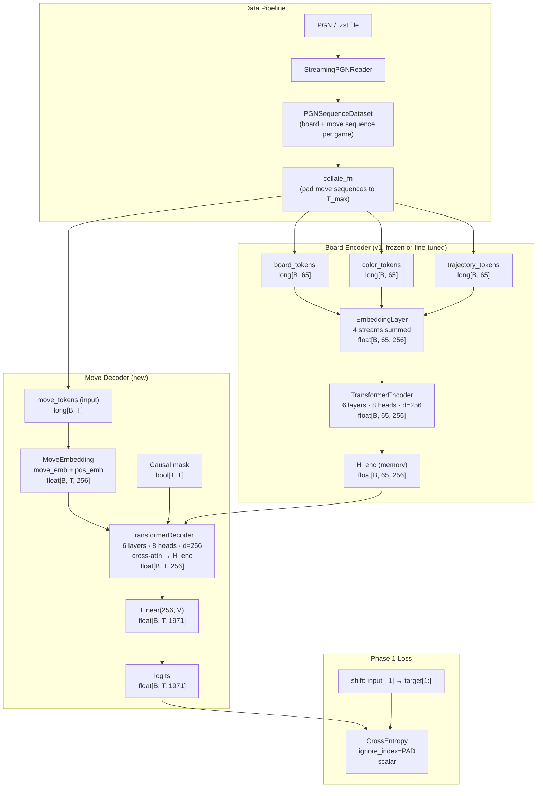
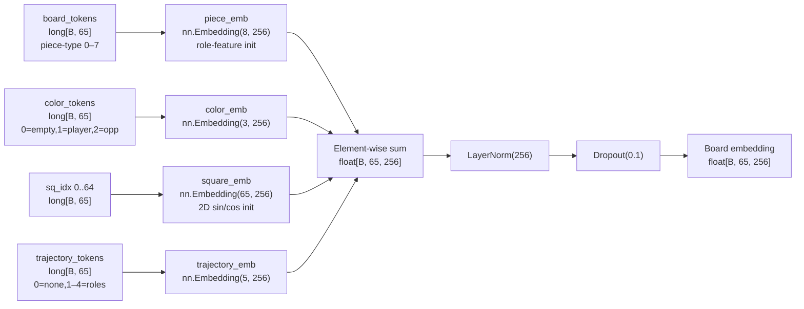
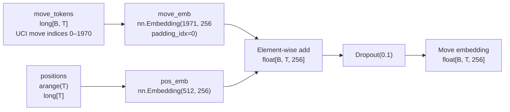
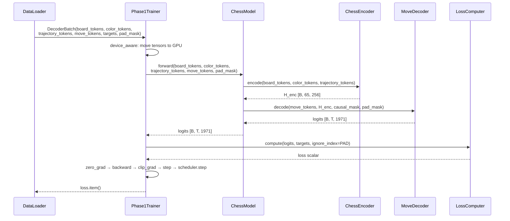
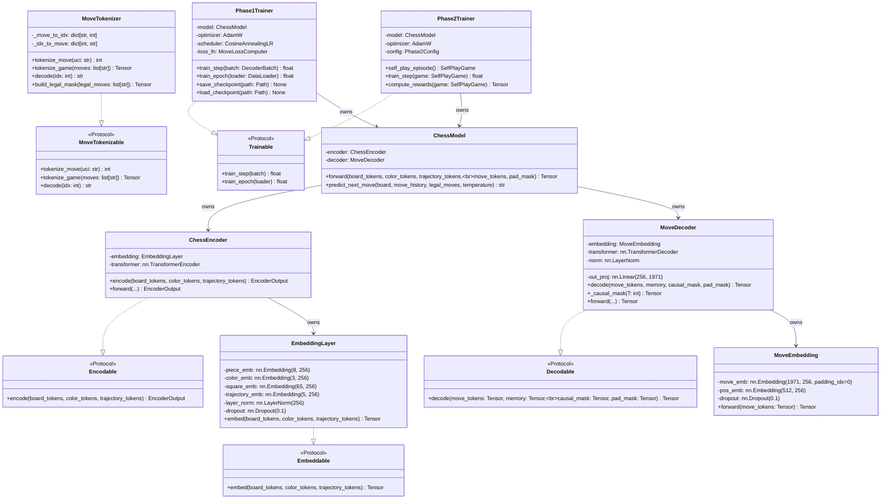
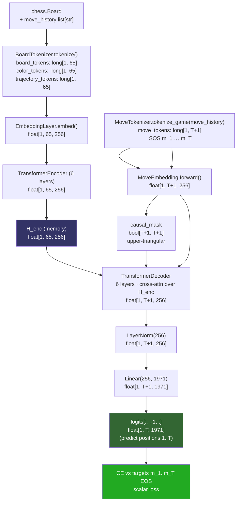
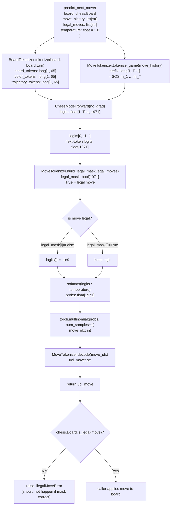
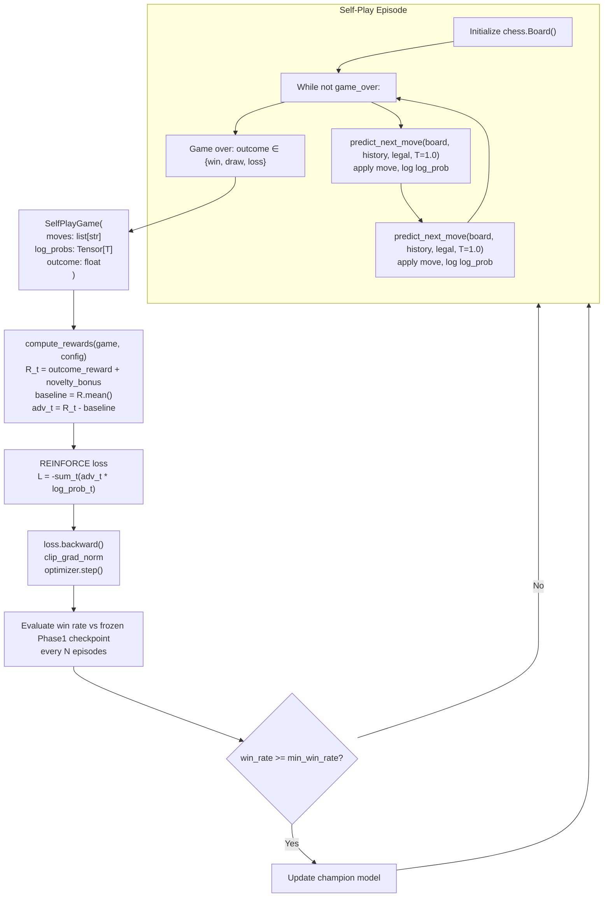
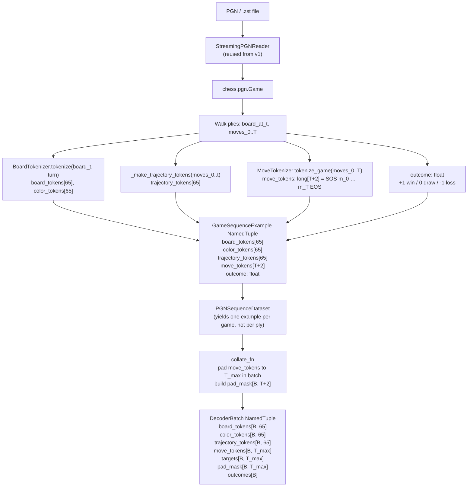

# ChessModel v2 — Encoder-Decoder Design

> **Document version:** 1.0
> **Date:** 2026-03-07
> **Status:** Design — pending engineering implementation

---

## Problem Statement

The v1 ChessEncoder treats move prediction as four independent 64-class classification problems conditioned on a single static board state. This framing is semantically incomplete: chess is a sequential decision process where each move is chosen given the full prior move history, not merely the current board position. The v1 model cannot generate a legal move string directly, cannot condition on move history length, and produces no probability distribution over complete moves — only disjoint distributions over source and target squares. ChessModel v2 reframes move prediction as a sequence-to-sequence translation problem: the board state is the source language, and the game's move sequence is the target language. An autoregressive decoder cross-attending to the board encoder's output generates one complete UCI move token at each step, enabling direct move sampling, legal-move masking at inference, and REINFORCE self-play in Phase 2 training.

---

## Feasibility Analysis

| Approach | Pros | Cons | Verdict |
|----------|------|------|---------|
| **Keep v1 encoder-only, improve heads** | No new architecture risk; straightforward to implement; existing checkpoints reusable | Cannot generate complete moves; no move-history conditioning; accuracy ceiling limited by classification framing | Reject — insufficient expressivity for downstream self-play |
| **Encoder-decoder (seq2seq) — reuse v1 encoder** | Proper autoregressive move generation; move-history conditioning; v1 encoder weights transfer directly; well-understood architecture | Larger model; more complex training loop; Phase 2 RL adds significant complexity | **Accept** |
| **Encoder-decoder — replace v1 encoder with reference design (piece+rank+file)** | Simpler embedding (fewer streams); clean from-scratch design | Discards v1 color stream (relative ownership) and trajectory stream (temporal momentum); loses checkpoint transferability; no demonstrated benefit | Reject — regresses known-good inductive biases |
| **Decoder-only (GPT-style, no explicit board encoder)** | Single architecture, no cross-attention; simpler | Board state must be serialized into the token sequence; no structured spatial attention over squares; loses the geometric inductive bias of the encoder | Reject — loses structured board representation |

---

## Chosen Approach

The engineering team implements a standard Transformer encoder-decoder with the v1 `ChessEncoder` (4-stream `EmbeddingLayer` + 6-layer `TransformerEncoder`) preserved without modification as the encoder half. The v1 encoder is retained for three concrete reasons: (1) the color stream encodes relative ownership (PLAYER/OPPONENT), which is the critical signal for side-to-move invariance — the simpler reference design's 14-piece vocabulary collapses White and Black pieces, losing this property; (2) the trajectory stream provides temporal momentum context that is absent from the static board; (3) existing checkpoints are directly loadable into the encoder half, enabling fast pretraining initialization. The decoder half is entirely new: a `MoveEmbedding` layer maps UCI move tokens to dense vectors with learned absolute positional encoding, and a `MoveDecoder` (6-layer `TransformerDecoder`) applies causal self-attention followed by cross-attention over the full encoder output `[B, 65, d_model]` including the CLS token. The top-level `ChessModel` composes these and exposes `forward()` for training and `predict_next_move()` for inference.

---

## Architecture

### Diagram 1 — Full System Overview (Data → Encoder → Decoder → Loss)



*Figure 1. End-to-end data flow from raw PGN to training loss. The encoder path is the unmodified v1 ChessEncoder. The decoder path is entirely new.*

---

### Diagram 2 — Board Embedding Composition (v1 EmbeddingLayer, retained)



*Figure 2. The v1 EmbeddingLayer composes four independent streams. Color (relative ownership) and trajectory (last-move roles) streams are the key inductive biases retained over the simpler reference design.*

---

### Diagram 3 — Move Embedding Composition (new)



*Figure 3. Move embedding uses learned absolute positional encoding (not sinusoidal) because move sequence lengths are bounded and position semantics (move 1, move 2, …) are semantically distinct from board geometry.*

---

### Diagram 4 — Phase 1 Training Sequence Diagram



*Figure 4. Teacher-forced Phase 1 training. The decoder receives the full target sequence shifted right (SOS prepended), and the loss is computed on the shifted left (EOS appended) targets. PAD positions are masked from the loss.*

---

### Diagram 5 — Class Structure with Protocols



*Figure 5. Two new protocols (`MoveTokenizable`, `Decodable`) slot into the existing protocol hierarchy. All new classes implement one protocol. `ChessModel` composes encoder and decoder; it does not implement a protocol itself — it is the composition root.*

---

### Diagram 6 — Tensor Shape Flow (single example, B=1)



*Figure 6. Shape trace for a single game with T moves. The decoder input is [SOS, m1, …, mT]; the target is [m1, …, mT, EOS]. The output logits at position i predict move i+1, producing T pairs for loss computation.*

---

### Diagram 7 — Inference Flow (predict_next_move with legal masking)



*Figure 7. Inference is greedy-or-sampled with hard legal masking. Illegal moves receive -1e9 logits before softmax, making their probability numerically zero. The final legality check is a defensive assertion.*

---

### Diagram 8 — Phase 2 REINFORCE Self-Play Loop



*Figure 8. Phase 2 REINFORCE loop. The model plays both sides. A frozen champion model is periodically challenged; the live model replaces the champion only if it achieves win_rate >= min_win_rate. This prevents reward hacking via catastrophic forgetting.*

---

### Diagram 9 — Data Pipeline (v2 PGNSequenceDataset)



*Figure 9. v2 data pipeline. Each game produces one `GameSequenceExample` containing the full move sequence. `collate_fn` pads sequences within the batch and produces the `targets` tensor (move_tokens shifted left by 1).*

---

## Component Breakdown

### New: `chess_sim/model/move_vocab.py` — `MoveVocab` + `MoveTokenizer`

**Responsibility:** Owns the UCI move vocabulary (PAD/SOS/EOS + ~1968 legal UCI moves) and provides deterministic bidirectional mapping between UCI strings and integer indices.

**Key interface:**
```
PAD_IDX: int = 0
SOS_IDX: int = 1
EOS_IDX: int = 2
MOVE_VOCAB_SIZE: int = 1971  # 3 specials + 1968 UCI moves

class MoveTokenizer:
    def tokenize_move(self, uci: str) -> int: ...
    def tokenize_game(self, moves: list[str]) -> Tensor: ...
        # Returns long[T+2]: [SOS_IDX, m_1, ..., m_T, EOS_IDX]
    def decode(self, idx: int) -> str: ...
    def build_legal_mask(self, legal_moves: list[str]) -> Tensor: ...
        # Returns bool[MOVE_VOCAB_SIZE], True = legal
```

**Protocol:** Implements `MoveTokenizable`. Unit-testable in isolation (no torch dependencies).

**Build note:** UCI move enumeration must be generated once deterministically (e.g., from `chess.Move.from_uci` over all algebraically valid move strings including promotions) and stored as a sorted list. The sort order must be stable across Python versions.

---

### New: `chess_sim/model/move_embedding.py` — `MoveEmbedding`

**Responsibility:** Maps move token indices to dense vectors by summing a learned move embedding and a learned absolute positional embedding.

**Key interface:**
```
class MoveEmbedding(nn.Module):
    def __init__(self, d_model: int = 256, max_seq_len: int = 512) -> None: ...
    def forward(self, move_tokens: Tensor) -> Tensor: ...
        # move_tokens: long[B, T]
        # returns: float[B, T, d_model]
```

**Internal structure:**
- `move_emb: nn.Embedding(1971, 256, padding_idx=PAD_IDX)` — PAD_IDX=0 produces zero embedding
- `pos_emb: nn.Embedding(512, 256)` — learned, not sinusoidal; chess games rarely exceed 300 moves
- `dropout: nn.Dropout(0.1)`
- Output: `Dropout(move_emb(tokens) + pos_emb(arange(T)))`

**Protocol:** No protocol (embedding is not user-facing). Unit-testable via shape assertions.

---

### New: `chess_sim/model/decoder.py` — `MoveDecoder`

**Responsibility:** Autoregressively decodes a move sequence by cross-attending to the board encoder's output at each layer.

**Key interface:**
```
class MoveDecoder(nn.Module):
    def __init__(self, model_cfg: DecoderConfig | None = None) -> None: ...
    def decode(
        self,
        move_tokens: Tensor,          # long[B, T]
        memory: Tensor,               # float[B, 65, d_model]
        tgt_key_padding_mask: Tensor | None = None,  # bool[B, T]
    ) -> Tensor: ...                  # float[B, T, MOVE_VOCAB_SIZE]
    def _causal_mask(self, T: int, device: torch.device) -> Tensor: ...
        # Returns bool[T, T], upper-triangular, same device as input
    def forward(self, move_tokens, memory, tgt_key_padding_mask) -> Tensor: ...
```

**Implements:** `Decodable` protocol.

**Internal structure:**
- `embedding: MoveEmbedding`
- `transformer: nn.TransformerDecoder` (6 layers, 8 heads, d_ff=1024, Pre-LN, batch_first=True)
- `norm: nn.LayerNorm(256)` — applied after decoder stack
- `out_proj: nn.Linear(256, 1971)` — projects to move vocabulary

**Attention pattern per decoder layer:**
1. Causal self-attention: Q=K=V=move_emb, mask=causal_mask — no future leakage
2. Cross-attention: Q=move_emb, K=V=memory (full 65 encoder tokens including CLS)
3. Feedforward: position-wise MLP

**Device contract:** `_causal_mask` creates the mask on the same device as `move_tokens`. This is mandatory — failing to match devices silently produces wrong attention masks on GPU.

---

### Modified: `chess_sim/model/chess_model.py` — `ChessModel` (new top-level, v2)

**Responsibility:** Composes `ChessEncoder` and `MoveDecoder` into a single `nn.Module`; owns `predict_next_move()` inference logic.

**Key interface:**
```
class ChessModel(nn.Module):
    def __init__(self, model_cfg: ModelConfig, decoder_cfg: DecoderConfig) -> None: ...
    def forward(
        self,
        board_tokens: Tensor,          # long[B, 65]
        color_tokens: Tensor,          # long[B, 65]
        trajectory_tokens: Tensor,     # long[B, 65]
        move_tokens: Tensor,           # long[B, T]
        move_pad_mask: Tensor | None,  # bool[B, T]
    ) -> Tensor: ...                   # float[B, T, MOVE_VOCAB_SIZE]

    @torch.no_grad()
    def predict_next_move(
        self,
        board: chess.Board,
        move_history: list[str],
        legal_moves: list[str],
        temperature: float = 1.0,
    ) -> str: ...
```

**No protocol** — `ChessModel` is the composition root. It is tested via end-to-end forward pass shape assertions.

**Checkpoint structure:** `{'encoder': state_dict, 'decoder': state_dict}` — note the key change from v1 (`'heads'` is absent; `'decoder'` is new). The implementor must update `save_checkpoint` and `load_checkpoint` accordingly.

---

### New: `chess_sim/data/pgn_sequence_dataset.py` — `PGNSequenceDataset` + `collate_fn`

**Responsibility:** Yields one `GameSequenceExample` per game (not per ply), then a `collate_fn` produces padded `DecoderBatch` instances for the DataLoader.

**Key interface:**
```
class PGNSequenceDataset(Dataset):
    def __init__(self, pgn_path: Path, move_tokenizer: MoveTokenizer,
                 board_tokenizer: BoardTokenizer, max_games: int | None = None) -> None: ...
    def __len__(self) -> int: ...
    def __getitem__(self, idx: int) -> GameSequenceExample: ...

def collate_fn(batch: list[GameSequenceExample]) -> DecoderBatch:
    # Pads move_tokens and targets to T_max; builds pad_mask
    ...
```

**Reuse:** `StreamingPGNReader` and `BoardTokenizer` from v1 are used unchanged. `MoveTokenizer` is new.

**Memory note:** This dataset holds all games in memory after first pass. For large corpora, a future sharded variant (analogous to `ShardedChessDataset`) is deferred to Open Questions.

---

### New: `chess_sim/training/phase1_trainer.py` — `Phase1Trainer`

**Responsibility:** Supervised teacher-forced training loop for Phase 1 (cross-entropy on game move sequences).

**Key interface:**
```
class Phase1Trainer:
    def __init__(self, model: ChessModel, config: TrainV2Config,
                 device: str = "cpu") -> None: ...
    @log_metrics
    @device_aware
    def train_step(self, batch: DecoderBatch) -> float: ...
    @log_metrics
    def train_epoch(self, loader: DataLoader) -> float: ...
    def save_checkpoint(self, path: Path) -> None: ...
    def load_checkpoint(self, path: Path) -> None: ...
```

**Implements:** `Trainable` protocol.

**Loss:** `F.cross_entropy(logits.view(-1, V), targets.view(-1), ignore_index=PAD_IDX)` where `logits[B, T, V]` and `targets[B, T]` are the decoder output and the move_tokens shifted left by 1 respectively.

**Decorators (cross-cutting concerns):**
- `@log_metrics` — logs loss + lr after each `train_step` and `train_epoch`
- `@device_aware` — moves all `DecoderBatch` tensors to model device before call
- `@timed` — optional profiling on `train_epoch`

---

### New: `chess_sim/training/phase2_trainer.py` — `Phase2Trainer`

**Responsibility:** REINFORCE self-play training loop for Phase 2 fine-tuning.

**Key interface:**
```
class Phase2Trainer:
    def __init__(self, model: ChessModel, config: Phase2Config,
                 device: str = "cpu") -> None: ...
    def self_play_episode(self) -> SelfPlayGame: ...
    def compute_rewards(self, game: SelfPlayGame) -> Tensor: ...
        # Returns float[T] per-move advantages after baseline subtraction
    @log_metrics
    def train_step(self, game: SelfPlayGame) -> float: ...
    def train_epoch(self, n_episodes: int) -> float: ...
```

**Implements:** `Trainable` protocol (train_step and train_epoch).

**REINFORCE update:**
```
L = -sum_t(advantage_t * log_prob_t)
advantage_t = R_t - mean(R)
R_t = outcome_reward + delta_novelty * novelty_bonus_t
```

**Champion model:** `Phase2Trainer` holds a frozen copy of the Phase 1 checkpoint (`champion_model`) and evaluates the live model against it every `eval_every_episodes`. The live model replaces the champion only when win_rate >= `config.min_win_rate`.

---

### Modified: `chess_sim/protocols.py` — add `Decodable`, `MoveTokenizable`

**Two new Protocol definitions to add at end of file:**

```
@runtime_checkable
class MoveTokenizable(Protocol):
    def tokenize_move(self, uci: str) -> int: ...
    def tokenize_game(self, moves: list[str]) -> Tensor: ...
    def decode(self, idx: int) -> str: ...

@runtime_checkable
class Decodable(Protocol):
    def decode(
        self,
        move_tokens: Tensor,
        memory: Tensor,
        tgt_key_padding_mask: Tensor | None,
    ) -> Tensor: ...
```

---

### Modified: `chess_sim/config.py` — add `DecoderConfig`, `Phase2Config`, `TrainV2Config`

**New dataclass fields:**

```python
@dataclass
class DecoderConfig:
    """Move decoder architecture hyperparameters."""
    decoder_layers: int = 6
    max_seq_len: int = 512   # max moves in a game sequence

@dataclass
class Phase2Config:
    """REINFORCE self-play training hyperparameters."""
    pretrained_ckpt: str = ""
    delta_novelty: float = 0.05        # novelty bonus weight
    delta_decay: float = 0.999         # decay per step
    top_k_human: int = 5               # moves below top-k get novelty bonus
    win_reward: float = 1.0
    loss_reward: float = -1.0
    draw_reward: float = 0.0
    min_win_rate: float = 0.55         # threshold to replace champion
    self_play_games: int = 100         # episodes per RL update batch
    eval_every_episodes: int = 500

@dataclass
class TrainV2Config:
    """Root config for v2 training (Phase 1 or Phase 2)."""
    data: DataConfig = field(default_factory=DataConfig)
    model: ModelConfig = field(default_factory=ModelConfig)
    decoder: DecoderConfig = field(default_factory=DecoderConfig)
    trainer: TrainerConfig = field(default_factory=TrainerConfig)
    phase2: Phase2Config = field(default_factory=Phase2Config)
    phase: int = 1   # 1=supervised, 2=REINFORCE

def load_train_v2_config(path: Path) -> TrainV2Config: ...
```

---

## Data Structures

### New NamedTuples to add to `chess_sim/types.py`

```python
class GameSequenceExample(NamedTuple):
    """One complete game as a sequence example.

    board_tokens:       long[65]  — board state at move 0 (start position)
    color_tokens:       long[65]  — color tokens at move 0
    trajectory_tokens:  long[65]  — trajectory tokens at move 0 (all zeros for move 0)
    move_tokens:        long[T+2] — [SOS, m_0, ..., m_{T-1}, EOS]
    outcome:            float     — +1 win / 0 draw / -1 loss (white perspective)
    """
    board_tokens: list[int]
    color_tokens: list[int]
    trajectory_tokens: list[int]
    move_tokens: list[int]
    outcome: float


class DecoderBatch(NamedTuple):
    """Batched game sequence for DataLoader consumption.

    board_tokens:       long[B, 65]
    color_tokens:       long[B, 65]
    trajectory_tokens:  long[B, 65]
    move_tokens:        long[B, T_max]   — decoder input: SOS m_0 … m_{T-1}
    targets:            long[B, T_max]   — CE target: m_0 … m_{T-1} EOS
    pad_mask:           bool[B, T_max]   — True = PAD position (ignored in loss)
    outcomes:           float[B]         — game outcomes for Phase 2
    """
    board_tokens: Tensor        # [B, 65] long
    color_tokens: Tensor        # [B, 65] long
    trajectory_tokens: Tensor   # [B, 65] long
    move_tokens: Tensor         # [B, T_max] long
    targets: Tensor             # [B, T_max] long
    pad_mask: Tensor            # [B, T_max] bool
    outcomes: Tensor            # [B] float


class DecoderOutput(NamedTuple):
    """Output of MoveDecoder.decode().

    logits:  float[B, T, MOVE_VOCAB_SIZE] — raw pre-softmax scores
    """
    logits: Tensor   # [B, T, MOVE_VOCAB_SIZE]


class SelfPlayGame(NamedTuple):
    """Completed self-play episode for Phase 2 training.

    moves:      list of UCI move strings (full game)
    log_probs:  float[T] — log P(m_t | m_{<t}, board) at time of sampling
    outcome:    float     — +1 win / 0 draw / -1 loss (from first-mover perspective)
    """
    moves: list[str]
    log_probs: Tensor   # [T] float
    outcome: float
```

---

## Hyperparameters

| Hyperparameter | v2 Value | v1 Value | Notes |
|----------------|----------|----------|-------|
| `d_model` | 256 | 256 | Shared encoder+decoder dimension |
| `n_heads` (encoder) | 8 | 8 | Unchanged |
| `encoder_layers` | 6 | 6 | Unchanged |
| `decoder_layers` | 6 | — | Symmetric with encoder |
| `d_ff` (both) | 1024 | 1024 | 4× expansion ratio |
| `dropout` | 0.1 | 0.1 | Unchanged |
| `max_seq_len` | 512 | — | Max move tokens per game |
| `MOVE_VOCAB_SIZE` | 1971 | — | PAD+SOS+EOS + ~1968 UCI |
| `PIECE_VOCAB_SIZE` | 8 | 8 | Unchanged |
| `COLOR_VOCAB_SIZE` | 3 | 3 | Unchanged |
| `TRAJECTORY_VOCAB_SIZE` | 5 | 5 | Unchanged |
| `SQUARE_VOCAB_SIZE` | 65 | 65 | CLS + 64 squares |
| Phase 1 lr | 3e-4 | 3e-4 | AdamW |
| Phase 1 weight_decay | 0.01 | 0.01 | |
| Phase 1 grad_clip | 1.0 | 1.0 | max-norm |
| Phase 1 warmup_steps | 4000 | 1000 | Larger due to decoder |
| Phase 2 lr | 1e-5 | — | Lower for fine-tuning |
| Phase 2 delta_novelty | 0.05 | — | Novelty bonus weight |
| Phase 2 min_win_rate | 0.55 | — | Champion replacement threshold |
| Phase 2 self_play_games | 100 | — | Episodes per RL update |

---

## v1 vs v2 Comparison

| Dimension | v1 (Encoder-Only) | v2 (Encoder-Decoder) |
|-----------|-------------------|----------------------|
| **Architecture** | BERT-style TransformerEncoder only | TransformerEncoder + TransformerDecoder |
| **Training objective** | 4× CrossEntropy over 64 squares (src/tgt for player and opponent) | CrossEntropy over 1971 UCI move tokens (seq2seq, teacher-forced) |
| **Move representation** | Factored: separate src and tgt square distributions | Unified: single distribution over complete UCI move strings |
| **Move history conditioning** | Via trajectory tokens (last 2 half-moves only) | Full move sequence via decoder autoregression |
| **Inference procedure** | Argmax on src head → argmax on tgt head → construct UCI move | Autoregressive sampling with legal-move masking at each step |
| **Legal move enforcement** | Post-hoc: must verify src+tgt combination is legal | At inference: illegal moves masked to -1e9 before softmax |
| **Encoder params** | ~4.76M | ~4.76M (same) |
| **Decoder params** | ~66K (4 linear heads) | ~5.4M (6-layer decoder + output proj) |
| **Total params** | ~4.82M | ~10.2M |
| **Expected strengths** | Fast inference; small memory footprint; easy to interpret per-head | Proper move generation; captures move-sequence context; enables self-play |
| **Expected weaknesses** | Cannot generate legal moves reliably without search; no history beyond 2 moves | Slower inference (autoregressive); more complex training pipeline |
| **Phase 2 (RL)** | Not applicable | REINFORCE self-play |
| **Checkpoint format** | `{'encoder': ..., 'heads': ...}` | `{'encoder': ..., 'decoder': ...}` |

---

## Project Structure

The engineering team adds the following files. Existing files marked with `(existing)` are unchanged unless noted.

```
chess-sim/
├── chess_sim/
│   ├── protocols.py               (existing — add Decodable, MoveTokenizable)
│   ├── types.py                   (existing — add GameSequenceExample, DecoderBatch,
│   │                                          DecoderOutput, SelfPlayGame)
│   ├── config.py                  (existing — add DecoderConfig, Phase2Config,
│   │                                          TrainV2Config, load_train_v2_config)
│   ├── model/
│   │   ├── embedding.py           (existing — no changes)
│   │   ├── encoder.py             (existing — no changes)
│   │   ├── heads.py               (existing — no changes, v1 only)
│   │   ├── move_vocab.py          (NEW — MoveVocab constants + MoveTokenizer)
│   │   ├── move_embedding.py      (NEW — MoveEmbedding)
│   │   ├── decoder.py             (NEW — MoveDecoder)
│   │   └── chess_model.py         (NEW — ChessModel top-level v2)
│   ├── data/
│   │   ├── tokenizer.py           (existing — no changes)
│   │   ├── reader.py              (existing — no changes)
│   │   ├── sampler.py             (existing — no changes)
│   │   ├── sharded_dataset.py     (existing — no changes)
│   │   ├── dataset.py             (existing — no changes)
│   │   └── pgn_sequence_dataset.py  (NEW — PGNSequenceDataset + collate_fn)
│   └── training/
│       ├── loss.py                (existing — no changes)
│       ├── trainer.py             (existing — no changes, v1 Trainer)
│       ├── phase1_trainer.py      (NEW — Phase1Trainer)
│       └── phase2_trainer.py      (NEW — Phase2Trainer)
├── configs/
│   ├── train_50k.yaml             (existing — no changes, v1)
│   ├── evaluate.yaml              (existing — no changes, v1)
│   ├── train_v2_phase1.yaml       (NEW — Phase 1 supervised config)
│   └── train_v2_phase2.yaml       (NEW — Phase 2 REINFORCE config)
├── scripts/
│   ├── train_real.py              (existing — no changes, v1)
│   ├── evaluate.py                (existing — no changes, v1)
│   └── train_v2.py                (NEW — v2 entry point; reads phase from config)
├── tests/
│   ├── test_config.py             (existing)
│   └── test_chess_model_v2.py     (NEW — all 17 test cases)
└── docs/
    ├── encoder_architecture.md    (existing)
    ├── streaming_data_pipeline_design.md (existing)
    ├── chess_pytorch_design.md    (existing — reference)
    └── chess_encoder_decoder_v2_design.md  (THIS DOCUMENT)
```

---

## Test Cases

All tests live in `tests/test_chess_model_v2.py`. Tests run on CPU. No GPU assertions.

| ID | Scenario | Input | Expected Outcome | Edge? |
|----|----------|-------|------------------|-------|
| T01 | MoveVocab special tokens | `PAD_IDX, SOS_IDX, EOS_IDX` | `0, 1, 2` respectively | No |
| T02 | MoveVocab size | `len(MOVE_VOCAB_SIZE)` | `>= 1971` | No |
| T03 | MoveTokenizer encodes known move | `tokenize_move("e2e4")` | Integer in `[3, MOVE_VOCAB_SIZE)` | No |
| T04 | MoveTokenizer roundtrip | `decode(tokenize_move("g1f3"))` | `"g1f3"` | No |
| T05 | MoveTokenizer tokenize_game shape | `tokenize_game(["e2e4", "e7e5"])` | `Tensor` shape `[4]`: `[SOS, idx, idx, EOS]` | No |
| T06 | MoveTokenizer tokenize_game empty | `tokenize_game([])` | `Tensor` shape `[2]`: `[SOS, EOS]` | Yes |
| T07 | MoveEmbedding output shape | `MoveEmbedding()(long[B=4, T=10])` | `float[4, 10, 256]` | No |
| T08 | MoveEmbedding PAD produces zero | Embedding row at `padding_idx=0` | `all_zeros: True` | No |
| T09 | MoveDecoder output shape | `MoveDecoder().decode(long[2,8], float[2,65,256])` | `float[2, 8, 1971]` | No |
| T10 | Causal mask is upper-triangular | `MoveDecoder()._causal_mask(T=5, device='cpu')` | `mask[i,j]=True` iff `j>i`; all diagonal+lower `False` | No |
| T11 | Causal mask device matches input | Create mask on `device='cpu'`; verify `.device` | Same device as input tensor | Yes |
| T12 | ChessModel forward end-to-end shape | `ChessModel().forward(bt,ct,tt,mt)` with `B=2, T=6` | `float[2, 6, 1971]` | No |
| T13 | ChessModel forward with pad_mask | Pass `pad_mask=bool[2,6]` with some `True` | No exception; shape unchanged | No |
| T14 | CE loss ignores PAD positions | `logits[B,T,V]`, `targets[B,T]` with `targets[:,3]=PAD` | Loss does not include position 3 in gradient | No |
| T15 | Legal mask blocks illegal moves | `build_legal_mask(["e2e4"])` from start position; pass to `predict_next_move` | Returned move is in legal_moves | No |
| T16 | predict_next_move returns legal UCI | `predict_next_move(chess.Board(), [], board.legal_moves)` | Returned string passes `chess.Move.from_uci` without error | No |
| T17 | DecoderBatch collate_fn pads to T_max | Two games with T=5 and T=10 | `move_tokens.shape == [2, 12]`; shorter game padded with PAD | Yes |

---

## Coding Standards

The engineering team follows the standards established in v1 and enforced below.

- **DRY** — Extract shared tokenization logic into `MoveTokenizer`. No duplicated UCI-to-index mapping across files.
- **Protocols** — `MoveTokenizable` for `MoveTokenizer`; `Decodable` for `MoveDecoder`. Use `@runtime_checkable` on both. No `isinstance` checks on concrete classes.
- **Decorators for cross-cutting concerns** — `@log_metrics`, `@device_aware`, `@timed` from `chess_sim/training/trainer.py` are reused in `Phase1Trainer` and `Phase2Trainer`. The `@device_aware` decorator must be updated to handle `DecoderBatch` fields in addition to `ChessBatch`.
- **Typing everywhere** — All function signatures carry full type annotations. No bare `Any` without an explanatory comment. `Tensor` over `torch.Tensor` (import from `torch`).
- **Comments ≤ 280 characters** — If a comment requires more, the code it describes is too complex and must be refactored.
- **`unittest` required** — All 17 test cases in `tests/test_chess_model_v2.py` must pass before any training script is run. No exceptions.
- **`virtualenv` + `python -m`** — All Python work happens inside a virtualenv. Run tests with `python -m unittest discover`.
- **CPU for unit tests, GPU for training** — `MoveDecoder`, `ChessModel`, and both trainers accept a `device` argument. Tests pass `device='cpu'`. Training configs set `device='cuda'`.
- **No new dependencies without justification** — `chess_sim/model/move_vocab.py` uses `python-chess` (already a dependency) for legal move enumeration. No additional packages are introduced.
- **NamedTuples for all data containers** — `GameSequenceExample`, `DecoderBatch`, `DecoderOutput`, `SelfPlayGame` are all `NamedTuple` subclasses in `chess_sim/types.py`.

---

## Implementation Order

The implementor follows this order exactly. Each step is independently testable before proceeding.

1. **`chess_sim/types.py`** — Add `GameSequenceExample`, `DecoderBatch`, `DecoderOutput`, `SelfPlayGame` NamedTuples.

2. **`chess_sim/protocols.py`** — Add `MoveTokenizable` and `Decodable` `@runtime_checkable` Protocol classes after the existing `Cacheable` definition.

3. **`chess_sim/model/move_vocab.py`** — Implement `MoveVocab` constants (`PAD_IDX`, `SOS_IDX`, `EOS_IDX`, `MOVE_VOCAB_SIZE`) and `MoveTokenizer` class. Write `tests/test_chess_model_v2.py::TestMoveVocab` (T01–T06) and confirm all pass.

4. **`chess_sim/model/move_embedding.py`** — Implement `MoveEmbedding`. Write `TestMoveEmbedding` (T07–T08) and confirm all pass.

5. **`chess_sim/model/decoder.py`** — Implement `MoveDecoder` including `_causal_mask`. Write `TestMoveDecoder` (T09–T11) and confirm all pass.

6. **`chess_sim/model/chess_model.py`** — Implement `ChessModel` with `forward()` and `predict_next_move()`. Write `TestChessModel` (T12–T13, T15–T16) and confirm all pass.

7. **`chess_sim/data/pgn_sequence_dataset.py`** — Implement `PGNSequenceDataset` and `collate_fn`. Write `TestCollate` (T17) and confirm it passes.

8. **`chess_sim/config.py`** — Extend with `DecoderConfig`, `Phase2Config`, `TrainV2Config`, `load_train_v2_config`. Add config tests to `tests/test_config.py` (round-trip YAML load).

9. **`configs/train_v2_phase1.yaml`** — Phase 1 YAML template with `phase: 1`, all model/decoder/trainer defaults.

10. **`configs/train_v2_phase2.yaml`** — Phase 2 YAML template with `phase: 2`, `pretrained_ckpt` pointing to Phase 1 output.

11. **`chess_sim/training/phase1_trainer.py`** — Implement `Phase1Trainer`. Write `TestPhase1Loss` (T14) and confirm it passes. Run a smoke-test epoch on 100 CPU examples.

12. **`chess_sim/training/phase2_trainer.py`** — Implement `Phase2Trainer`. Validate `compute_rewards` with a hand-crafted `SelfPlayGame` fixture. Do not run self-play until Phase 1 produces a checkpoint.

13. **`scripts/train_v2.py`** — CLI entry point. Reads config, dispatches to `Phase1Trainer` or `Phase2Trainer` based on `config.phase`.

14. **Phase 1 training run** — `python -m scripts.train_v2 --config configs/train_v2_phase1.yaml` on GPU. Checkpoint saved to `checkpoints/v2_phase1.pt`.

15. **Phase 2 training run** — Update `train_v2_phase2.yaml` to point `pretrained_ckpt` at `checkpoints/v2_phase1.pt`. Run `python -m scripts.train_v2 --config configs/train_v2_phase2.yaml`.

---

## Open Questions

1. **PGNSequenceDataset vs ShardedChessDataset for v2.** The v2 dataset yields full game sequences (variable-length). The existing `ShardedChessDataset` stores fixed-length per-ply examples. A sharded variant that stores variable-length move sequences requires a modified shard format (e.g., ragged tensors or index offsets). Defer to a future design document if corpus size exceeds available RAM.

2. **Board state at which ply?** The current design uses the board state at move 0 (starting position) for the entire game sequence. An alternative is to re-encode the board at every move and pass the sequence of encoder outputs as memory — this is more expressive but requires `B × T` encoder forward passes. The simple fixed-board encoding is implemented first; the multi-board variant is deferred.

3. **Encoder fine-tuning in Phase 1.** Should the Phase 1 training freeze the encoder (transfer the v1 checkpoint) or fine-tune it end-to-end? Freezing reduces training cost and prevents overwriting the encoder's learned representations; fine-tuning may produce better decoder-encoder alignment. Recommend: freeze for first 5 epochs, then unfreeze with a 10× lower LR on encoder parameters. Stakeholder decision needed.

4. **Phase 2 reward shaping.** The current design uses a single game outcome reward + novelty bonus. More granular rewards (material advantage per move, check threats, king safety) may produce stronger play but require a position evaluator (e.g., Stockfish). This is deferred — the stockfish integration is a separate design document.

5. **Legal move mask construction performance.** `build_legal_mask` is called at every inference step. For `MOVE_VOCAB_SIZE=1971`, this constructs a boolean tensor over all moves for each position. At inference on GPU, this should be precomputed and cached by board hash. The caching strategy is not designed here.

6. **Promotion move handling.** UCI promotion moves (`e7e8q`, `e7e8r`, etc.) are multiple UCI strings for the same piece movement. The vocabulary must enumerate all four promotion targets. Verify the enumeration produces exactly 4 entries per promotion square pair (8 pawn pairs × 4 promotions = 32 entries). Confirm the MoveVocab unit test covers at least one promotion move.

7. **EOS token at inference.** The `predict_next_move` function returns a single move per call. If the model samples `EOS_IDX`, the caller should treat the game as complete. This contract must be documented in the `ChessModel` docstring. Edge case: `EOS` may be in `legal_moves` if the legal-move list is not filtered before calling `predict_next_move`.

8. **Train/val split at game level.** Inherits the v1 concern: the split must be performed at the game level (not the example level) to prevent data leakage between training and validation sets. `PGNSequenceDataset` must accept a `split` argument with game-level splitting.

9. **Phase 2 GPU memory.** Running `self_play_games=100` episodes with a 10M-parameter model on GPU requires careful batch management. Full-game trajectories can be 100+ moves; storing log_probs for 100 games simultaneously may exceed VRAM on smaller GPUs. Consider a streaming update (update after each episode rather than batching 100 episodes).

10. **Evaluation metric for v2.** The v1 evaluation metric (top-1 src/tgt accuracy) does not apply to v2. The v2 evaluation must report: move-level perplexity, top-1 move accuracy (exact UCI match), and legal-move rate (fraction of sampled moves that are legal before masking). Design a `GameEvaluatorV2` analogous to the v1 `GameEvaluator` after Phase 1 training produces a checkpoint.
