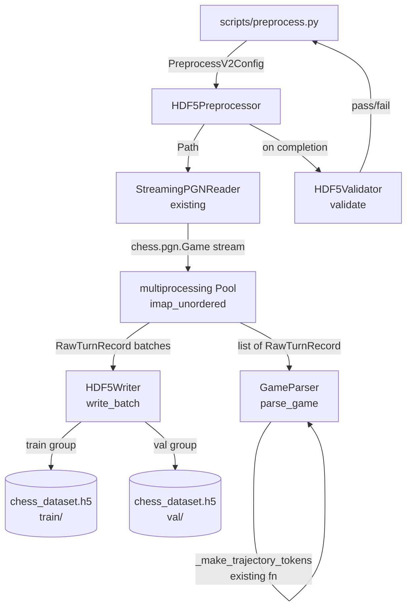
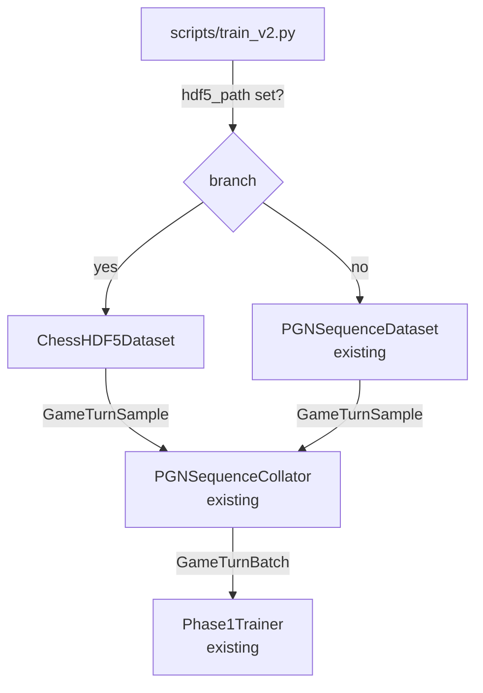
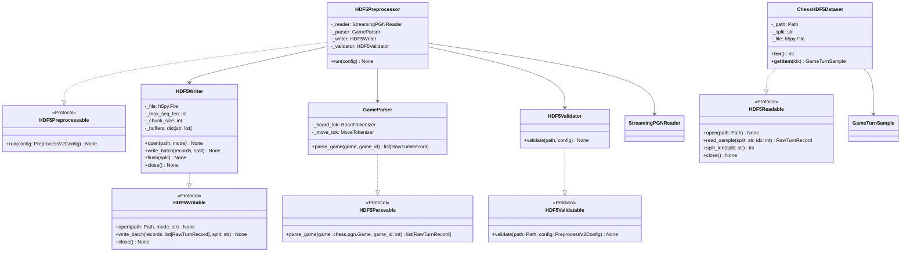

# Chess HDF5 Preprocessing Pipeline — Design

## Problem Statement

The current V2 training flow (`scripts/train_v2.py` → `PGNSequenceDataset`) parses PGN
on every training run, which blocks GPU utilization while the CPU tokenizes games. For
the full lichess shard (3.3M examples, 49 shards), startup latency and I/O pressure
during epoch boundaries are the primary bottlenecks. The goal is a one-time
preprocessing pass that writes all `GameTurnSample` fields into an HDF5 file; subsequent
training runs read pre-baked integer arrays directly, eliminating PGN parsing entirely.
This pipeline must not disturb the existing V1 `.pt` shard pipeline or V1 training.

---

## Feasibility Analysis

| Approach | Pros | Cons | Verdict |
|----------|------|------|---------|
| **HDF5 via h5py** (chosen) | Single-file, chunked random access, industry standard for ML datasets, excellent NumPy interop, resizable datasets, compression built-in | Requires `h5py` dependency; no built-in distributed write without locking | **Accept** |
| **Arrow/Parquet via PyArrow** | Column-oriented, good for filtering, zero-copy reads via memory-map | Variable-length sequences require awkward list-of-lists encoding; ragged arrays need extra indirection | Reject — move sequence ragged shape is a poor fit |
| **SQLite** | Portable, zero-setup, transactional | Row-by-row I/O is slow at 3M+ rows; tensor reconstruction overhead per batch | Reject — throughput insufficient at scale |
| **Extend existing .pt shards** | No new dependency | .pt shards load entire shard into RAM; random access requires full shard deserialize; V2 fields (move sequences) have variable length incompatible with the current fixed-shape shard tensors | Reject — structural mismatch |

---

## Chosen Approach

HDF5 via `h5py` is accepted. The pipeline writes one HDF5 file with `train/` and `val/`
groups, each containing eight fixed-dtype datasets. Variable-length move sequences are
stored padded to `max_seq_len` with a companion `move_lengths` array that allows
`ChessHDF5Dataset.__getitem__` to slice off padding before returning the sample. The
`PGNSequenceCollator` already in production handles batch-level padding, so the
`ChessHDF5Dataset` intentionally returns unpadded tensors to keep collation logic
unchanged. Multiprocessing fans out game parsing across workers; the main process owns
the single HDF5 writer to avoid concurrent-write races. The V1 `.pt` shard pipeline is
untouched; `scripts/train_v2.py` gains an optional `hdf5_path` config key and falls back
to PGN when absent.

---

## Architecture

### Data flow — preprocessing



*Figure 1. Preprocessing data flow. Error paths: `GameParser` logs and skips games with
unknown moves; `HDF5Writer` raises `IOError` on disk-full; `HDF5Validator` raises
`ValueError` on schema mismatch.*

---

### Data flow — training



*Figure 2. Training-time branch. The collator and trainer are unchanged regardless of
which dataset path is active.*

---

### Static structure



*Figure 3. Class diagram. Protocols carry all public contracts; concrete classes are
wired in `HDF5Preprocessor.__init__` via dependency injection.*

---

## HDF5 File Schema

### File layout

```
chess_dataset.h5
├── attrs
│   ├── version           str        "2.0"
│   ├── created_at        str        ISO-8601 timestamp
│   └── source_checksum   str        first-1MB+size hex digest (matches CacheManager)
├── train/
│   ├── board_tokens      [N_train, 65]         uint8
│   ├── color_tokens      [N_train, 65]         uint8
│   ├── trajectory_tokens [N_train, 65]         uint8
│   ├── move_tokens       [N_train, max_seq_len] uint16   padded; PAD=0
│   ├── target_tokens     [N_train, max_seq_len] uint16   padded; PAD=0
│   ├── move_lengths      [N_train]             uint16   actual seq len (excl. padding)
│   ├── outcome           [N_train]             int8     +1=win 0=draw -1=loss
│   ├── turn              [N_train]             uint16   0-indexed ply within game
│   └── game_id           [N_train]             uint32   parent game index
└── val/
    └── (identical structure)
```

### Field definitions

| Field | Shape | Dtype | Notes |
|-------|-------|-------|-------|
| `board_tokens` | `[N, 65]` | `uint8` | CLS=0 at index 0; squares 1-64; values 0-7 |
| `color_tokens` | `[N, 65]` | `uint8` | CLS=0; 0=empty, 1=player, 2=opponent |
| `trajectory_tokens` | `[N, 65]` | `uint8` | CLS=0; values 0-4 per `_make_trajectory_tokens` |
| `move_tokens` | `[N, max_seq_len]` | `uint16` | Decoder input: SOS + prior moves; PAD=0 after `move_lengths[i]` |
| `target_tokens` | `[N, max_seq_len]` | `uint16` | Targets: prior moves + current move; PAD=0 |
| `move_lengths` | `[N]` | `uint16` | Length of the unpadded move sequence for this turn |
| `outcome` | `[N]` | `int8` | +1 win / 0 draw / -1 loss from player-to-move perspective |
| `turn` | `[N]` | `uint16` | 0-indexed ply within the parent game |
| `game_id` | `[N]` | `uint32` | Sequential index of parent game for grouping |

**Rationale for dtypes:** `uint8` for board/color/trajectory (max value 7/2/4 — fits
cleanly). `uint16` for move tokens (vocab size 1971 < 65535). `int8` for outcome
(signed: -1, 0, +1). `uint32` for game_id (supports up to ~4B games).

---

## Component Breakdown

### `chess_sim/types.py` — new type: `RawTurnRecord`

- **Responsibility:** Immutable container for one preprocessed game turn, passed
  between `GameParser` and `HDF5Writer`.
- **Key interface:**
  ```python
  class RawTurnRecord(NamedTuple):
      board_tokens: list[int]        # len 65, uint8 range
      color_tokens: list[int]        # len 65, uint8 range
      trajectory_tokens: list[int]   # len 65, uint8 range
      move_tokens: list[int]         # variable len, uint16 range (SOS + prior)
      target_tokens: list[int]       # variable len, uint16 range (prior + current)
      outcome: int                   # -1 / 0 / +1
      turn: int                      # 0-indexed ply
      game_id: int                   # parent game index
  ```
- **Unit-testable:** Yes — pure NamedTuple, no dependencies.

---

### `chess_sim/protocols.py` — four new Protocols

- **Responsibility:** Define public contracts for the four new HDF5 pipeline components.
- **Key interfaces:**
  ```python
  @runtime_checkable
  class HDF5Parseable(Protocol):
      def parse_game(
          self, game: chess.pgn.Game, game_id: int
      ) -> list[RawTurnRecord]: ...

  @runtime_checkable
  class HDF5Writable(Protocol):
      def open(self, path: Path, mode: str) -> None: ...
      def write_batch(
          self, records: list[RawTurnRecord], split: str
      ) -> None: ...
      def close(self) -> None: ...

  @runtime_checkable
  class HDF5Readable(Protocol):
      def open(self, path: Path) -> None: ...
      def read_sample(self, split: str, idx: int) -> RawTurnRecord: ...
      def split_len(self, split: str) -> int: ...
      def close(self) -> None: ...

  @runtime_checkable
  class HDF5Validatable(Protocol):
      def validate(
          self, path: Path, config: "PreprocessV2Config"
      ) -> None: ...

  @runtime_checkable
  class HDF5Preprocessable(Protocol):
      def run(self, config: "PreprocessV2Config") -> None: ...
  ```
- **Unit-testable:** Yes — `runtime_checkable` allows `isinstance` checks in tests.

---

### `chess_sim/config.py` — new dataclass: `PreprocessV2Config`

- **Responsibility:** Typed root config for `scripts/preprocess.py`, loaded from YAML
  with the same `from_yaml` pattern used by `load_v2_config`.
- **Key interface:**
  ```python
  @dataclass
  class InputConfig:
      pgn_path: str = ""            # path to .pgn or .pgn.zst
      max_games: int = 0            # 0 = all

  @dataclass
  class OutputConfig:
      hdf5_path: str = "data/processed/chess_dataset.h5"
      chunk_size: int = 1000        # write buffer flush threshold
      compression: str = "gzip"
      compression_opts: int = 4
      max_seq_len: int = 512        # padded move sequence length

  @dataclass
  class FilterConfig:
      min_elo: int = 0
      min_moves: int = 5
      max_moves: int = 512
      winners_only: bool = False

  @dataclass
  class SplitConfig:
      train: float = 0.95
      val: float = 0.05
      seed: int = 42

  @dataclass
  class ProcessingConfig:
      workers: int = 4

  @dataclass
  class PreprocessV2Config:
      input: InputConfig = field(default_factory=InputConfig)
      output: OutputConfig = field(default_factory=OutputConfig)
      filter: FilterConfig = field(default_factory=FilterConfig)
      split: SplitConfig = field(default_factory=SplitConfig)
      processing: ProcessingConfig = field(default_factory=ProcessingConfig)

  def load_preprocess_v2_config(path: Path) -> PreprocessV2Config: ...
  ```
- **Unit-testable:** Yes — pure dataclass, no I/O in construction.

---

### `chess_sim/preprocess/__init__.py`

- **Responsibility:** Package marker; re-exports `GameParser`, `HDF5Writer`,
  `HDF5Validator`, `HDF5Preprocessor`.

---

### `chess_sim/preprocess/parse.py` — `GameParser`

- **Responsibility:** Convert a single `chess.pgn.Game` into a list of `RawTurnRecord`
  by replaying each ply.
- **Implements:** `HDF5Parseable`
- **Reuses:** `BoardTokenizer`, `MoveTokenizer`, `_make_trajectory_tokens` (extracted
  from `pgn_sequence_dataset.py` into a shared location — see Open Questions #1).
- **Key interface:**
  ```python
  class GameParser:
      def __init__(
          self,
          min_moves: int,
          max_moves: int,
          winners_only: bool,
      ) -> None: ...

      def parse_game(
          self, game: chess.pgn.Game, game_id: int
      ) -> list[RawTurnRecord]:
          """Return one RawTurnRecord per ply; empty list if game is filtered."""
          ...
  ```
- **Outcome encoding:** Read `game.headers["Result"]`; from player-to-move perspective:
  - White to move: `"1-0"` → +1, `"0-1"` → -1, `"1/2-1/2"` → 0.
  - Black to move: `"0-1"` → +1, `"1-0"` → -1, `"1/2-1/2"` → 0.
- **Error path:** Unknown moves (not in `MoveVocab`) — log warning and return `[]`.
- **Unit-testable:** Yes — instantiate with fixed game via `chess.pgn.read_game(io)`.

---

### `chess_sim/preprocess/writer.py` — `HDF5Writer`

- **Responsibility:** Buffer `RawTurnRecord` batches in memory and flush to an open
  `h5py.File` with resizable chunked datasets.
- **Implements:** `HDF5Writable`
- **Key interface:**
  ```python
  class HDF5Writer:
      def __init__(
          self,
          max_seq_len: int,
          chunk_size: int,
          compression: str,
          compression_opts: int,
      ) -> None: ...

      def open(self, path: Path, mode: str = "w") -> None:
          """Create or open HDF5 file; initialise resizable datasets."""
          ...

      def write_batch(
          self, records: list[RawTurnRecord], split: str
      ) -> None:
          """Append records to internal buffer; flush when buffer >= chunk_size."""
          ...

      def flush(self, split: str) -> None:
          """Write buffered records to HDF5 and reset buffer."""
          ...

      def close(self) -> None:
          """Flush all remaining buffers and close the HDF5 file."""
          ...
  ```
- **Dataset initialisation:** All datasets start with shape `(0, ...)` and `maxshape=(None, ...)`.
  `resize` is called on each flush to extend the dataset. Chunk shape on the trailing
  dimension is set to `(chunk_size, ...)` for read locality.
- **Unit-testable:** Yes — use `tmp_path` fixture; assert dataset shapes after flush.

---

### `chess_sim/preprocess/validate.py` — `HDF5Validator`

- **Responsibility:** Post-preprocessing sanity checks on the written HDF5 file.
- **Implements:** `HDF5Validatable`
- **Key interface:**
  ```python
  class HDF5Validator:
      def validate(
          self, path: Path, config: PreprocessV2Config
      ) -> None:
          """Raise ValueError if schema, shapes, or value ranges are invalid."""
          ...
  ```
- **Checks performed:**
  - Both `train/` and `val/` groups present.
  - All eight datasets present in each group.
  - Dataset shapes consistent (all `N` match across fields within a group).
  - `board_tokens` values in `[0, 7]`.
  - `color_tokens` values in `[0, 2]`.
  - `trajectory_tokens` values in `[0, 4]`.
  - `outcome` values in `{-1, 0, 1}`.
  - `move_lengths` values in `[1, max_seq_len]`.
  - `game_id` monotonically increases within a group (games are contiguous).
  - File attribute `version == "2.0"`.
- **Unit-testable:** Yes — write a minimal valid HDF5 and assert no exception; write a
  corrupt one and assert `ValueError`.

---

### `chess_sim/preprocess/preprocess.py` — `HDF5Preprocessor`

- **Responsibility:** Orchestrate the end-to-end preprocessing run: stream PGN → fan
  out to worker pool → write HDF5 → validate.
- **Implements:** `HDF5Preprocessable`
- **Key interface:**
  ```python
  class HDF5Preprocessor:
      def __init__(
          self,
          reader: StreamingPGNReader,
          parser: GameParser,
          writer: HDF5Writer,
          validator: HDF5Validator,
      ) -> None: ...

      def run(self, config: PreprocessV2Config) -> None: ...
  ```
- **Split assignment:** A deterministic per-game decision: `game_id % 100 < round(split.train * 100)` → `"train"`, else `"val"`. This avoids loading all records into memory before splitting and is reproducible.
- **Multiprocessing contract:** `multiprocessing.Pool(workers).imap_unordered(parse_fn, games)`. The main process owns the `HDF5Writer`; workers return plain `list[RawTurnRecord]` (Python objects, no tensors — avoids pickling overhead). Worker initializer sets `torch` CPU threads to 1.
- **Unit-testable:** Yes — inject stub reader/writer; assert `run` calls writer methods.

---

### `chess_sim/data/hdf5_dataset.py` — `ChessHDF5Dataset`

- **Responsibility:** `torch.utils.data.Dataset[GameTurnSample]` that reads one
  `GameTurnSample` per index from the HDF5 file, compatible with the existing
  `PGNSequenceCollator`.
- **Implements:** `HDF5Readable` (structurally)
- **Key interface:**
  ```python
  class ChessHDF5Dataset(Dataset[GameTurnSample]):
      def __init__(
          self,
          hdf5_path: Path,
          split: str = "train",
      ) -> None: ...

      def __len__(self) -> int: ...

      def __getitem__(self, idx: int) -> GameTurnSample:
          """Return GameTurnSample with move sequences sliced to move_lengths[idx]."""
          ...
  ```
- **HDF5 file handle:** Opened once in `__init__`, not re-opened per `__getitem__`. When
  `num_workers > 0`, h5py requires each worker to open its own handle. Implement
  `worker_init_fn` (module-level function) that re-opens the handle:
  ```python
  def hdf5_worker_init(worker_id: int) -> None:
      """Re-open HDF5 handle in each DataLoader worker process."""
      ...
  ```
- **Return contract:** `move_tokens` and `target_tokens` are sliced to `move_lengths[idx]`
  before return, producing variable-length 1-D tensors. The existing
  `PGNSequenceCollator` handles batch-level padding — no changes needed to the collator.
- **Unit-testable:** Yes — write a tiny HDF5 fixture; assert `__getitem__` returns
  correct shapes and that the collator produces valid `GameTurnBatch`.

---

### `chess_sim/config.py` — `DataConfig` update

- **Responsibility:** Add `hdf5_path: str = ""` field to `DataConfig`. When non-empty,
  `scripts/train_v2.py` uses `ChessHDF5Dataset` instead of `PGNSequenceDataset`.
- **Backward compatibility:** Default is `""`, so existing YAML configs remain valid
  without modification.

---

### `scripts/preprocess.py` — entry point

- **Responsibility:** CLI wrapper for `HDF5Preprocessor.run`. Loads `PreprocessV2Config`
  from YAML; supports `--pgn`, `--output`, `--max-games` CLI overrides.
- **Key interface (signatures only):**
  ```python
  def _build_parser() -> argparse.ArgumentParser: ...
  def _merge_config(
      args: argparse.Namespace, cfg: PreprocessV2Config
  ) -> PreprocessV2Config: ...
  def main() -> None: ...
  ```

---

### `scripts/train_v2.py` — update

- **Responsibility:** Accept `--hdf5` CLI arg and `data.hdf5_path` YAML key. When set,
  instantiate `ChessHDF5Dataset(hdf5_path, split="train")` and
  `ChessHDF5Dataset(hdf5_path, split="val")` instead of calling
  `PGNSequenceDataset` + `random_split`. PGN path fallback is unchanged.
- **`DataLoader` note:** Pass `worker_init_fn=hdf5_worker_init` when
  `num_workers > 0` and the HDF5 path is active.

---

## `PreprocessV2Config` YAML Template

```yaml
# configs/preprocess_v2.yaml
input:
  pgn_path: data/raw/lichess_db_standard_rated_2013-01.pgn.zst
  max_games: 0          # 0 = all games

output:
  hdf5_path:         data/processed/chess_dataset.h5
  chunk_size:        1000      # flush buffer size
  compression:       gzip
  compression_opts:  4
  max_seq_len:       512       # padded move sequence dimension

filter:
  min_elo:        0
  min_moves:      5
  max_moves:      512
  winners_only:   false

split:
  train: 0.95
  val:   0.05
  seed:  42

processing:
  workers: 4
```

---

## Test Cases

| ID | Scenario | Input | Expected Outcome | Edge? |
|----|----------|-------|------------------|-------|
| T1 | `GameParser` — normal game | 10-move game, both sides, no filter | 10 `RawTurnRecord`s, correct `turn` values 0-9 | No |
| T2 | `GameParser` — min_moves filter | 3-move game, `min_moves=5` | Returns `[]` | Yes |
| T3 | `GameParser` — max_moves filter | 600-move game, `max_moves=512` | Returns records only for plies 0-511 | Yes |
| T4 | `GameParser` — winners_only, draw | draw result, `winners_only=True` | Returns `[]` | Yes |
| T5 | `GameParser` — outcome encoding white win | `"1-0"`, white to move at turn 0 | `outcome == +1` | No |
| T6 | `GameParser` — outcome encoding black to move at turn 0 | `"1-0"`, first record (white) | `outcome == -1` for black's first turn | Yes |
| T7 | `GameParser` — board_tokens length | any game | every `RawTurnRecord.board_tokens` has length 65 | No |
| T8 | `GameParser` — move_tokens starts with SOS | any game | `record.move_tokens[0] == SOS_IDX` | No |
| T9 | `HDF5Writer` — write + flush cycle | 3 records, chunk_size=2 | HDF5 datasets have shape `(3, ...)` after close | No |
| T10 | `HDF5Writer` — padding | record with `move_length=3`, `max_seq_len=10` | positions 3-9 of `move_tokens` row are PAD=0 | No |
| T11 | `HDF5Writer` — split routing | 2 train records, 1 val record | `train/board_tokens.shape[0] == 2`, `val/board_tokens.shape[0] == 1` | No |
| T12 | `HDF5Validator` — valid file | correct schema | No exception raised | No |
| T13 | `HDF5Validator` — missing dataset | `outcome` dataset deleted | `ValueError` raised | Yes |
| T14 | `HDF5Validator` — out-of-range value | `board_tokens` contains value 8 | `ValueError` raised | Yes |
| T15 | `HDF5Validator` — shape mismatch | `board_tokens` row count != `outcome` row count | `ValueError` raised | Yes |
| T16 | `ChessHDF5Dataset` — `__len__` | HDF5 with 50 train examples | `len(ds) == 50` | No |
| T17 | `ChessHDF5Dataset` — `__getitem__` shapes | index 0, `move_length=4` | `move_tokens.shape == (4,)`, `board_tokens.shape == (65,)` | No |
| T18 | `ChessHDF5Dataset` — collator compatibility | batch of 4 samples with varying move lengths | `GameTurnBatch.move_tokens.shape == (4, max_T)` | No |
| T19 | `ChessHDF5Dataset` — boundary index | `idx == len(ds) - 1` | Valid `GameTurnSample` returned | Yes |
| T20 | `PreprocessV2Config` — YAML round-trip | write YAML, `load_preprocess_v2_config` | All fields match written values | No |
| T21 | `PreprocessV2Config` — unknown key | YAML with `filter.unknown_key: 99` | `TypeError` raised immediately | Yes |
| T22 | `HDF5Preprocessor` — end-to-end smoke | 5 synthetic games, 2 workers | HDF5 file created, validator passes, total rows > 0 | No |
| T23 | `HDF5Preprocessor` — no V1 interference | V1 shard cache present | V1 cache directory untouched after run | No |
| T24 | `train_v2.py` — HDF5 fallback absent | `data.hdf5_path=""` | Script uses `PGNSequenceDataset`, no import error | No |
| T25 | `train_v2.py` — HDF5 path active | `data.hdf5_path=<valid file>` | Script uses `ChessHDF5Dataset`, `Phase1Trainer` trains 1 epoch without error | No |

---

## Coding Standards

The implementing engineer must follow all standards below. Any PR that deviates is
returned without review.

- **DRY** — `_make_trajectory_tokens` must be extracted from `pgn_sequence_dataset.py`
  into `chess_sim/data/tokenizer_utils.py` (or equivalent shared module) and imported
  by both `GameParser` and `PGNSequenceDataset`. No copy-paste.
- **Protocols for functionality** — every new class implements a Protocol defined in
  `chess_sim/protocols.py`. No concrete class is referenced directly across module
  boundaries; always type-hint against the Protocol.
- **Typing everywhere** — no bare `Any`; all method signatures carry full type
  annotations including return types. h5py datasets should be typed as
  `h5py.Dataset` not `Any`.
- **Comments ≤ 280 characters** — if an inline comment requires more than one tweet,
  the code must be refactored to be self-explanatory.
- **`unittest` first** — `tests/test_preprocess_v2.py` must exist and all T1-T25 must
  have corresponding `TestCase` methods before any production module is submitted.
- **CPU for tests** — tests must not require a GPU. All `torch` ops in tests use
  `device="cpu"`.
- **No new dependencies without justification** — `h5py>=3.9` is required and must be
  added to `requirements.txt` with the comment `# HDF5 dataset storage for V2 preprocess pipeline`.
- **`virtualenv` + `python -m`** — all execution during development and CI goes through
  the project virtualenv.
- **Google engineering best practices** — single responsibility per class, dependency
  injection in constructors, no global state.

---

## Open Questions

1. **Shared `_make_trajectory_tokens`** — This function currently lives in
   `chess_sim/data/pgn_sequence_dataset.py` as a module-private helper. It must be
   promoted to a shared location before `GameParser` can reuse it. Proposed location:
   `chess_sim/data/tokenizer_utils.py`. Engineering must update the import in
   `pgn_sequence_dataset.py` and verify no test regressions.

2. **`h5py` multi-worker read safety** — h5py in SWMR (Single Writer Multiple Reader)
   mode supports concurrent reads. If `num_workers > 1` causes issues with the default
   open mode, engineering should evaluate enabling SWMR on the read side. This is a
   performance concern, not a correctness concern; the `worker_init_fn` approach is the
   primary mitigation.

3. **`max_seq_len` bound** — The current `PGNSequenceDataset` builds move sequences of
   unbounded length (up to the game length). The HDF5 schema fixes `max_seq_len=512`.
   Games with more plies than `max_seq_len` are truncated by the `max_moves` filter.
   Engineering must confirm this matches the `DecoderConfig.max_seq_len=512` setting, or
   expose a config-driven override.

4. **ELO filter** — The `FilterConfig.min_elo` field is specified but the existing
   `StreamingPGNReader` does not parse ELO headers. `GameParser` must read
   `game.headers.get("WhiteElo", "0")` and `game.headers.get("BlackElo", "0")`,
   parse as int (default 0 on parse failure), and skip games where both ELOs are below
   `min_elo`. Stakeholder confirmation needed on whether the filter applies to the
   average ELO or to both individually.

5. **Resumable writes** — If preprocessing is interrupted after writing 2M of 3.3M
   examples, the current design starts over. Engineering may wish to add a
   resume-from-checkpoint feature (open HDF5 in `"a"` mode, track last `game_id`).
   This is deferred to a follow-up ticket; the initial implementation uses `mode="w"`.

6. **HDF5 file size estimate** — At 3.3M examples with `max_seq_len=512`, the uncompressed
   size is approximately: `(65+65+65)*1 + 512*2 + 512*2 + 2 + 1 + 2 + 4 ≈ 2.3 KB` per
   row × 3.3M ≈ 7.6 GB before compression. With gzip level 4, expect 2-3 GB. Engineering
   should verify available disk space before the preprocessing run.

7. **`DataConfig.hdf5_path` vs separate config section** — The current design adds
   `hdf5_path: str` directly to the existing `DataConfig`. An alternative is a separate
   `HDF5DataConfig` sub-section. Stakeholder preference should be confirmed before
   implementation to avoid a config schema churn.
