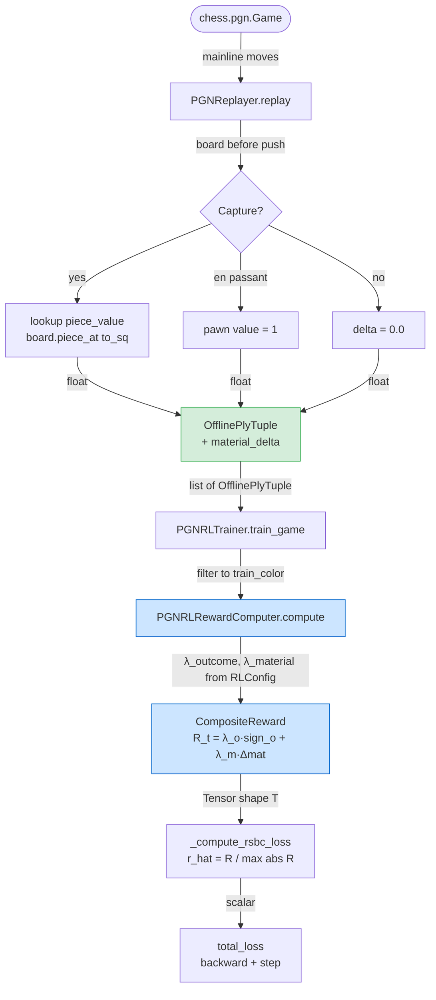
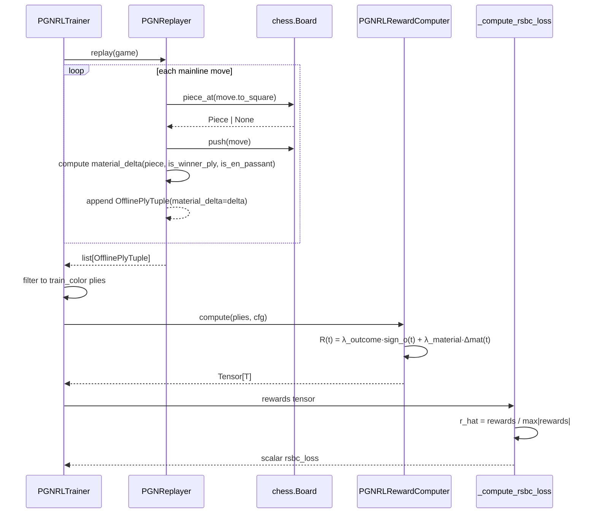

# Composite Reward Redesign — Design

## Problem Statement

The current offline RL pipeline assigns reward `R(t) = base_outcome * gamma^(T-1-t)`
to every ply in a game. After per-game RSBC normalization (`r̂ = r / max|r|`), all
plies in a winning game collapse to a narrow band `r̂ ≈ [0.75, 1.0]`, giving the
gradient no signal about which individual moves were tactically good. The model
therefore cannot distinguish a queen sacrifice that won material from a meaningless
king shuffle in the same winning game. Adding a per-ply material-delta component
breaks this degeneracy and gives the RSBC weighting meaningful intra-game variance.

---

## Current vs Proposed Formula

### Current formula

```
R(t) = base_outcome × γ^(T−1−t)

base_outcome ∈ {win_reward=10, draw_reward=2, loss_reward=−10}
```

After RSBC normalization `r̂_t = R(t) / max_t |R(t)|`:

- Winning game (T=40): R(0) = 10 × 0.99^39 ≈ 6.7, R(39) = 10.0 → r̂ ∈ [0.67, 1.00]
- All plies positive; no intra-game quality signal.

### Proposed composite formula

```
R(t) = λ_outcome × sign_outcome(t)  +  λ_material × Δmaterial(t)
```

where:

| Symbol | Definition |
|--------|-----------|
| `λ_outcome` | Outcome weight (default 1.0) |
| `λ_material` | Material delta weight (default 0.1) |
| `sign_outcome(t)` | +1 for winner ply, −1 for loser ply, `draw_reward_norm` for draw ply |
| `draw_reward_norm` | Normalized draw signal; default 0.0 (neutral) — see Open Questions |
| `Δmaterial(t)` | Material gained by the **trained side** on ply t (0 for non-captures, piece value for captures, negative if opponent captured) |

**Piece values** (standard centipawn-free integers):

| Piece | Value |
|-------|-------|
| Pawn (P) | 1 |
| Knight (N) | 3 |
| Bishop (B) | 3 |
| Rook (R) | 5 |
| Queen (Q) | 9 |
| King (K) | 0 |

**Outcome component range**: `sign_outcome(t) ∈ {−1, 0, +1}` → after scaling by
`λ_outcome=1.0`, outcome term ∈ [−1, +1] for decisive games.

**Material component range**: `Δmaterial(t)` ∈ [−9, +9] (capturing/losing a queen).
After scaling by `λ_material=0.1`, material term ∈ [−0.9, +0.9].

**Composite raw range**: `R(t) ∈ [−1.9, +1.9]` before RSBC per-game normalization.
RSBC then divides by `max_t |R(t)|`, driving `r̂_t ∈ [−1, +1]` with genuine
intra-game spread.

### Why these defaults?

- `λ_outcome=1.0`, `λ_material=0.1`: outcome dominates direction of signal (win/lose);
  material modulates magnitude within a game by up to ±47% of max outcome signal.
- If a game has only non-capture plies, `R(t) = ±1.0` for all plies → RSBC collapses
  back to the uniform baseline (acceptable; no false signal injected).

---

## Feasibility Analysis

| Approach | Pros | Cons | Verdict |
|----------|------|------|---------|
| **A. Compute material delta in `PGNReplayer`** | Board state is available before and after `board.push(move)`; zero re-traversal; single source of truth | `OfflinePlyTuple` gains a new field; replayer grows one responsibility | **Accept** |
| **B. Compute material delta in `PGNRLRewardComputer`** | No change to `OfflinePlyTuple` | Requires re-parsing move UCI to reconstruct captured piece; brittle (promotion, en-passant edge cases); no board access | **Reject** — fragile reconstruction vs. reading from live board |
| **C. Compute material delta in `PGNRLTrainer.train_game`** | Trainer already has `board_snaps` list | Trainer would need both pre- and post-move board; current `_build_board_snapshots` only collects pre-move boards; splitting replay into two loops increases complexity | **Reject** — duplicates replay logic already owned by `PGNReplayer` |
| **D. Add a separate `MaterialDeltaComputer` class** | Clean SRP separation | Extra class for what is ultimately a two-line computation inside the existing replay loop | **Reject** — YAGNI; over-engineering a trivial calculation |

---

## Chosen Approach

Approach A is accepted. `PGNReplayer.replay()` already iterates the board move-by-move
and calls `board.push(move)`. Before the push, `board.piece_at(move.to_square)`
reveals any captured piece. After the push, en-passant captures are detectable via
`move.is_en_passant()` (standard python-chess API). `material_delta` is appended to
`OfflinePlyTuple` with a default of `0.0` for full backward compatibility. The reward
computer receives the delta through the tuple and combines it with the flat outcome
signal using `λ_outcome` and `λ_material` drawn from `RLConfig`.

---

## Architecture

### Dataflow diagram



*Caption: Full dataflow from PGN game to RSBC loss update. Green node = modified data
structure. Blue nodes = modified compute components. Capture classification happens
entirely inside `PGNReplayer` before `board.push`.*

### Component interaction diagram



*Caption: Sequence showing how material_delta flows from Board through OfflinePlyTuple
into the reward computation without any extra board traversals.*

---

## Component Breakdown

### 1. `chess_sim/types.py` — `OfflinePlyTuple`

**Responsibility**: Data container for one half-move of PGN replay.

**Change**: Add `material_delta` field with a default so existing construction sites
do not break.

```python
class OfflinePlyTuple(NamedTuple):
    board_tokens:   Tensor
    color_tokens:   Tensor
    traj_tokens:    Tensor
    move_prefix:    Tensor
    move_uci:       str
    is_winner_ply:  bool
    is_white_ply:   bool
    is_draw_ply:    bool = False
    material_delta: float = 0.0   # NEW: piece value gained by moving side
```

**Protocol**: `NamedTuple` — no abstract base. Fully backward compatible because
`NamedTuple` fields with defaults are append-only and existing keyword/positional
construction sites that do not pass `material_delta` receive `0.0`.

**Testability**: Instantiated directly in tests; no mocking required.

---

### 2. `chess_sim/training/pgn_replayer.py` — `PGNReplayer`

**Responsibility**: Replay a `chess.pgn.Game` into an ordered list of
`OfflinePlyTuple`, now including per-ply material delta for the moving side.

**Change**: Before `board.push(move)`, inspect `board.piece_at(move.to_square)` to
detect ordinary captures. After push, inspect `board.is_en_passant(move)` — but
en-passant must be checked on the board state before push via `move` flags or
`board.is_en_passant(move)` which is valid pre-push in python-chess. Material delta
is always from the **moving side's perspective** (positive = gain, negative = loss is
impossible for the mover in a standard game since the opponent captures on their own
turn).

Key typed signatures (pseudocode, not production):

```python
_PIECE_VALUES: dict[chess.PieceType, float] = {
    chess.PAWN: 1.0, chess.KNIGHT: 3.0, chess.BISHOP: 3.0,
    chess.ROOK: 5.0, chess.QUEEN: 9.0, chess.KING: 0.0,
}

def _material_delta(
    board: chess.Board,
    move: chess.Move,
) -> float:
    """Material gained by side-to-move on this half-move."""
    ...
```

**Testability**: Unit-testable by constructing minimal `chess.pgn.Game` objects or
replaying FEN positions with known captures. No model dependency.

---

### 3. `chess_sim/training/pgn_rl_reward_computer.py` — `PGNRLRewardComputer`

**Responsibility**: Convert a list of `OfflinePlyTuple` into a per-ply reward tensor
using the composite formula.

**Change**: Replace temporal discount with flat outcome signal plus material delta.

```python
def compute(
    self,
    plies: list[OfflinePlyTuple],
    cfg: RLConfig,
) -> Tensor:
    """Return composite reward tensor of shape [T].

    R(t) = λ_outcome * sign_outcome(t) + λ_material * delta_material(t)
    """
    ...
```

The outcome sign lookup:

```python
def _outcome_sign(p: OfflinePlyTuple, cfg: RLConfig) -> float:
    if p.is_draw_ply:
        return cfg.draw_reward_norm   # new field, default 0.0
    return 1.0 if p.is_winner_ply else -1.0
```

**Testability**: Pure function; takes only `list[OfflinePlyTuple]` and `RLConfig`.
Easily parameterized with hand-crafted tuples.

---

### 4. `chess_sim/config.py` — `RLConfig`

**Responsibility**: Typed configuration dataclass for RL training hyperparameters.

**Changes**:
- Add `lambda_outcome: float = 1.0`
- Add `lambda_material: float = 0.1`
- Add `draw_reward_norm: float = 0.0` (normalized draw signal; replaces `draw_reward`
  in the outcome-sign path while keeping `draw_reward` for backward compat)
- Add validation in `__post_init__`:
  - `lambda_outcome >= 0`
  - `lambda_material >= 0`
  - `draw_reward_norm` in `[-1.0, 1.0]` (must remain bounded for RSBC stability)

**Backward compatibility**: `win_reward`, `loss_reward`, `draw_reward`, `gamma` are
retained (existing YAML keys parsed without error). When `lambda_material == 0.0` and
`lambda_outcome == 1.0`, the new formula with no captures reduces to `R(t) = ±1.0`
(flat outcome), which is a strict improvement over the temporal-discounted baseline.

**Testability**: `__post_init__` validation is directly unit-testable via
`dataclasses.replace` or constructor calls with out-of-range values.

---

### 5. `configs/train_rl.yaml` and `configs/train_rl_10k.yaml`

**Responsibility**: Operator-facing training configuration files.

**Change**: Add new fields under the `rl:` section:

```yaml
rl:
  # ... existing fields unchanged ...
  lambda_outcome:   1.0
  lambda_material:  0.1
  draw_reward_norm: 0.0
```

Existing `gamma`, `win_reward`, `loss_reward`, `draw_reward` keys remain to avoid
YAML parse errors on old configs — they are read but ignored by the composite path.

---

### 6. `chess_sim/training/pgn_rl_trainer.py` — `PGNRLTrainer.sample_visuals`

**Responsibility**: Visual diagnostic — renders per-ply board positions with reward
overlaid.

**Change**: The inline reward calculation inside `sample_visuals` (lines 676–686)
currently reimplements the temporal discount formula directly. This must be replaced
with a call to `self._reward_fn.compute(plies_subset, self._cfg.rl)` to stay in sync.
This is a DRY fix that this redesign also mandates.

**Key interface** (no new signature; internal refactor only):

```python
# replace inline formula with:
rewards_all = self._reward_fn.compute(all_plies, self._cfg.rl)
reward = float(rewards_all[idx].item())
```

**Testability**: `sample_visuals` is tested via integration tests with a mock PGN;
reward values are not asserted (visual output only), so the refactor does not require
new unit tests — but the DRY fix eliminates a hidden stale-formula bug.

---

## Test Cases

| ID | Scenario | Input | Expected Outcome | Edge? |
|----|----------|-------|------------------|-------|
| T-CR1 | Non-capture winner ply, λ_material=0 | `is_winner_ply=True`, `material_delta=0.0`, `lambda_outcome=1.0`, `lambda_material=0.0` | `R(t) = 1.0` | No |
| T-CR2 | Non-capture loser ply, λ_material=0 | `is_winner_ply=False`, `material_delta=0.0`, `lambda_outcome=1.0`, `lambda_material=0.0` | `R(t) = -1.0` | No |
| T-CR3 | Winner ply with queen capture | `is_winner_ply=True`, `material_delta=9.0`, `lambda_outcome=1.0`, `lambda_material=0.1` | `R(t) = 1.0 + 0.9 = 1.9` | No |
| T-CR4 | Draw ply, draw_reward_norm=0.0 | `is_draw_ply=True`, `material_delta=0.0` | `R(t) = 0.0` | No |
| T-CR5 | Draw ply with capture, draw_reward_norm=0.0 | `is_draw_ply=True`, `material_delta=3.0`, `lambda_material=0.1` | `R(t) = 0.0 + 0.3 = 0.3` | No |
| T-CR6 | All non-capture plies in winning game; RSBC normalization | 40 plies, all `material_delta=0.0`, all winner | `r̂_t = 1.0` for all plies (uniform after normalization) | No |
| T-CR7 | Mixed captures: queen take at ply 20, rest pawns | Ply 20 `material_delta=9.0`, others `material_delta=0.0` | Ply 20 has highest `r̂_t`; RSBC max = R(20); all others `r̂ = 1/1.9 ≈ 0.53` | Yes |
| T-CR8 | Empty ply list | `plies=[]` | Returns `torch.zeros(0)` tensor; no exception | Yes |
| T-CR9 | En-passant pawn capture detected in replayer | FEN with en-passant legal move replayed | `material_delta=1.0` on the en-passant ply | Yes |
| T-CR10 | Promotion with capture (queen promotion capturing rook) | Promotion move with captured rook on promotion square | `material_delta` = rook value (5.0); promoting piece value not added | Yes |
| T-CR11 | `RLConfig` with `lambda_outcome < 0` raises `ValueError` | `lambda_outcome=-0.1` | `ValueError` raised in `__post_init__` | Yes |
| T-CR12 | `RLConfig` with `lambda_material < 0` raises `ValueError` | `lambda_material=-0.5` | `ValueError` raised in `__post_init__` | Yes |
| T-CR13 | `draw_reward_norm` outside `[-1, 1]` raises `ValueError` | `draw_reward_norm=1.5` | `ValueError` raised in `__post_init__` | Yes |
| T-CR14 | `OfflinePlyTuple` constructed without `material_delta` | Old-style construction with 8 fields | `material_delta` defaults to `0.0`; no `TypeError` | Yes |
| T-CR15 | Replayer: non-capture move produces `material_delta=0.0` | Pawn push to empty square | `OfflinePlyTuple.material_delta == 0.0` | No |

---

## Coding Standards

The implementing engineer must observe:

- **DRY**: The reward formula must live in exactly one place — `PGNRLRewardComputer.compute`.
  The inline reward re-computation in `PGNRLTrainer.sample_visuals` (lines 676–686)
  must be deleted and replaced with a `self._reward_fn.compute` call.
- **Typing everywhere**: `_material_delta` must be typed `(chess.Board, chess.Move) -> float`.
  No bare `Any`. `_PIECE_VALUES` is `dict[chess.PieceType, float]` (module-level constant).
- **Decorators**: Not applicable here — no cross-cutting concern on these methods.
- **Comments ≤ 280 chars**: The `_material_delta` docstring may include the en-passant
  edge case in one sentence.
- **`unittest` before hypothesis**: Any throwaway script validating python-chess
  capture detection must be wrapped in `unittest.TestCase` first.
- **No new dependencies**: `python-chess` is already in `requirements.txt`. No new
  package is required.
- **Generators**: The reward tensor loop is a list comprehension over a bounded game
  (≤ 300 plies). No need for lazy iteration here; keep it readable.
- **Validation in `__post_init__`**: New `RLConfig` fields must have range checks
  consistent with the existing validation pattern (explicit `ValueError` with message
  including field name and got-value).

---

## Open Questions

1. **`draw_reward_norm` default**: Should draws produce `R(t) = 0.0` (neutral signal,
   model neither imitates nor avoids draw moves) or a small positive value like `+0.2`
   (slightly rewarding drawing as better than losing)? The design defaults to `0.0`
   for simplicity, but the training team should decide based on the desired draw
   treatment.

2. **Opponent-ply material delta sign**: When the opponent captures our piece, the
   `is_winner_ply` for our next ply already carries the outcome signal. The `material_delta`
   on our ply is always 0 or positive (we never suffer a capture on our own half-move
   in standard chess). This means the composite reward cannot penalize a ply that
   exposes a hanging piece. Engineering should confirm this one-sided view is acceptable
   or request a "material balance change after ply" field instead.

3. **Gamma removal**: The design removes temporal discounting entirely (`gamma` becomes
   unused). Engineering should confirm whether `gamma` should be silently ignored or
   raise a deprecation warning when `lambda_material > 0`. Removing the field
   entirely would break existing YAML files; a warning is preferable.

4. **RSBC stability on all-zero material games**: When `lambda_material > 0` but the
   entire game has no captures (e.g., drawish positional games), `R(t) = ±λ_outcome`
   for all plies. RSBC normalization divides by `max|R| = λ_outcome`, yielding `r̂ = ±1`.
   This is correct behavior. Engineering should add a logging statement when
   `material_delta` is zero for all plies in a game to help diagnose reward collapse
   in production runs.

5. **`sample_visuals` reward display**: The visualizer passes a scalar `reward` float
   to `render_rl_ply`. After this redesign, that float changes meaning (no longer
   discounted; now composite). Confirm with the team whether the chart legend needs
   updating to say "composite reward" rather than "discounted reward".

6. **Value head target scale**: `PGNRLTrainer` trains `ActionConditionedValueHead` via
   MSE against `valid_rewards`. After this redesign, `valid_rewards` live in `[−1.9,
   +1.9]` rather than `[−10, +10]`. Engineering should verify whether `value_lr_multiplier`
   or initialization of the value head need adjustment for the new reward scale.
