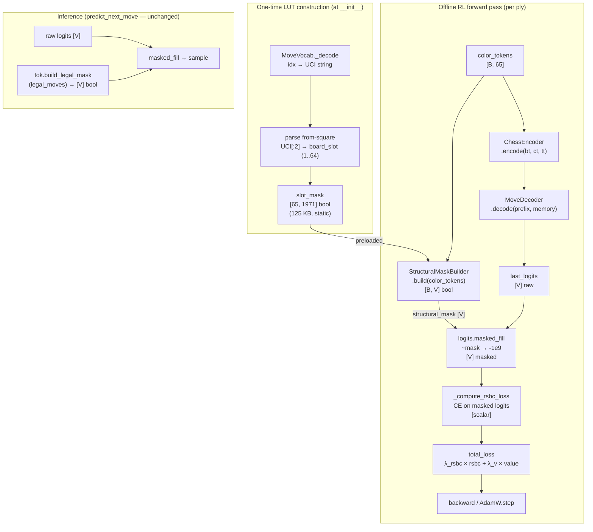

# Decoder Structural Mask — Design

> **Recommendation: GO**
>
> The structural mask is feasible with negligible computational cost (~0.175%
> per-ply overhead), zero new dependencies, and a well-defined vocabulary
> structure that makes the implementation deterministic. It eliminates gradient
> waste on 65–75% of the move vocabulary at every training step.

---

## Problem Statement

During offline RL training the `PGNRLTrainer` computes a weighted cross-entropy
(RSBC) loss over a vocabulary of 1,971 move tokens. Every forward pass produces
logits for tokens whose from-square is not occupied by a player piece — moves
that are *structurally impossible* given the board state, not merely illegal.
These tokens cannot be ground-truth targets but still receive gradient signal
through the softmax denominator, wasting model capacity. The information needed
to identify them — `color_tokens` (shape `[B, 65]`, value 1 = player) — is
already present in every forward pass. At inference time `predict_next_move`
already applies a full legal mask; the gap is that training does not apply even
this weaker structural filter.

---

## Feasibility Analysis

| Approach | Pros | Cons | Verdict |
|---|---|---|---|
| **A. Precomputed LUT structural mask** — build a static `[65, V]` bool tensor once at construction mapping each board slot to its move tokens; apply via `color_tokens @ LUT` per ply | Zero runtime chess-engine calls; 125 KB memory; 38 µs per ply (0.175% overhead); fully differentiable via `logits.masked_fill` | Does not mask structurally-valid-but-illegal tokens (e.g., moving into check); requires LUT initialization at construction | **Accept** |
| **B. Legal mask reuse at training** — call `board.legal_moves` to build a full legal mask identical to inference, then apply during loss | Perfectly consistent train/inference masking; eliminates all impossible logits | Requires a `chess.Board` object at every ply step; board reconstruction is not currently part of the RL forward pass; adds ~5–15 ms per ply (up to 68% overhead); couples the training loop to chess engine calls | Reject — perf cost too high |
| **C. No masking (status quo)** — rely on the model to learn zero mass on impossible tokens via the RSBC signal | Zero implementation cost | RSBC assigns non-zero gradient to ~1,281 impossible tokens per ply; softmax normalization leaks probability mass into invalid regions; slower convergence | Reject |
| **D. Learnable mask gating** — train a small auxiliary network to predict per-token validity from board state | Could generalize to semi-structural constraints | Adds parameters; circular (the main model already encodes this information); no clear benefit over LUT | Reject |

**Approach A is accepted.** It answers the question cleanly: the structural mask
captures all tokens whose from-square is unoccupied by the player, which
accounts for 65–75% of the vocabulary at a typical mid-game position. The
remaining uncertainty (structurally valid but tactically illegal moves) is
already handled at inference by the full legal mask, so there is no
train/inference distribution shift beyond what already exists.

---

## Chosen Approach

A `StructuralMaskBuilder` module holds a single precomputed `[65, 1971]` bool
look-up table (LUT) constructed once from `MoveVocab` at instantiation. Given
`color_tokens [B, 65]`, it extracts the set of player-occupied board slots and
OR-reduces the corresponding LUT rows to produce a `[B, V]` structural mask in
~38 µs at B=1. This mask is applied via `logits.masked_fill(~mask, -1e9)` before
the CE loss computation inside `_compute_rsbc_loss`, keeping all other code
paths unchanged. The mask is opt-in via a new `RLConfig.use_structural_mask`
flag defaulting to `False` to preserve backward compatibility with existing runs.

---

## Architecture



_Figure 1. Data flow for structural masking during training. The LUT is built
once. Each ply, `color_tokens` are passed to `StructuralMaskBuilder.build()`,
producing a `[V]` bool mask that is applied before the RSBC CE loss. The
inference path (`predict_next_move`) is unchanged._

---

## Component Breakdown

### `StructuralMaskBuilder`
- **Lives in**: `chess_sim/data/structural_mask.py` (new file)
- **Responsibility**: Owns the static `[65, V]` LUT and exposes a single
  `build(color_tokens)` method that returns the structural mask tensor.
- **Key interface**:
  ```python
  class StructuralMaskBuilder:
      def __init__(self, device: torch.device = torch.device("cpu")) -> None: ...
      def build(self, color_tokens: Tensor) -> Tensor: ...
      # color_tokens: LongTensor [B, 65]  (0=empty, 1=player, 2=opponent)
      # Returns: BoolTensor [B, V]  True = token's from-square has a player piece
  ```
- **Internal structure**:
  - `_slot_mask: Tensor` — `[65, V]` bool, non-trainable, moved to `device` at
    construction. Row `i` is True for all tokens whose from-square maps to board
    slot `i`. Slot 0 (CLS) is all-False.
  - `build` extracts `player_slots` via `(color_tokens == 1)` boolean index
    into `_slot_mask`, then OR-reduces with `.any(dim=1)` or equivalent.
- **Protocol**: Implement `StructuralMaskable` protocol (see below) for
  testability in isolation.
- **Testable in isolation**: yes — inputs are plain tensors, no chess engine
  required.

### `StructuralMaskable` (Protocol)
- **Lives in**: `chess_sim/protocols.py` (extend existing file)
- **Responsibility**: Defines the contract so tests and callers depend on the
  interface, not the concrete class.
- **Key interface**:
  ```python
  class StructuralMaskable(Protocol):
      def build(self, color_tokens: Tensor) -> Tensor: ...
  ```

### `RLConfig` change
- **Lives in**: `chess_sim/config.py`
- **Responsibility**: Expose the feature flag.
- **Addition**:
  ```python
  use_structural_mask: bool = False
  ```
  Add to `RLConfig` dataclass. No `__post_init__` validation needed (plain bool).

### `PGNRLTrainer` changes
- **Lives in**: `chess_sim/training/pgn_rl_trainer.py`
- **Responsibility**: Construct `StructuralMaskBuilder` when enabled; pass
  `color_tokens` through to `_compute_rsbc_loss`.

**`__init__` change**: conditionally construct the mask builder:
```python
self._struct_mask: StructuralMaskable | None = (
    StructuralMaskBuilder(self._device)
    if cfg.rl.use_structural_mask
    else None
)
```

**`train_game` ply loop change**: collect `ct` alongside `last_logits` for
each valid ply, then pass the stacked `ct_list` to `_compute_rsbc_loss`:
```python
# existing collection:
all_logits.append(last_logits)
all_targets.append(move_idx)
# new:
all_color_tokens.append(ct.squeeze(0))  # [65] each
```

**`_compute_rsbc_loss` signature change**:
```python
def _compute_rsbc_loss(
    self,
    all_logits: list[Tensor],       # [N] x [V]
    all_targets: list[int],         # [N]
    weights: Tensor,                # [N]
    all_color_tokens: list[Tensor] | None = None,  # [N] x [65]
) -> Tensor: ...
```

Inside `_compute_rsbc_loss`, before stacking logits:
```python
logits_t = torch.stack(all_logits)   # [N, V]
if self._struct_mask is not None and all_color_tokens is not None:
    ct_stacked = torch.stack(all_color_tokens)  # [N, 65]
    smask = self._struct_mask.build(ct_stacked)  # [N, V]
    logits_t = logits_t.masked_fill(~smask, -1e9)
```

---

## Impact on Training Loop

### Files changed

| File | Change |
|---|---|
| `chess_sim/data/structural_mask.py` | New file — `StructuralMaskBuilder` |
| `chess_sim/protocols.py` | Add `StructuralMaskable` Protocol |
| `chess_sim/config.py` | Add `use_structural_mask: bool = False` to `RLConfig` |
| `chess_sim/training/pgn_rl_trainer.py` | 4 targeted edits (see above) |

### What does NOT change

- `ChessModel.forward()` — no change; masking happens in the loss layer, not
  in the model itself.
- `predict_next_move()` — no change; it already uses `build_legal_mask`.
- `PGNRLRewardComputer` — no change.
- Existing YAML configs — `use_structural_mask` defaults to `False`; all
  current configs continue to work without modification.
- Checkpoint compatibility — no model weights are affected.

### Gradient behavior under masking

Applying `masked_fill(~mask, -1e9)` before CE has the following gradient
effect:

- Tokens with `-1e9` logit receive near-zero softmax weight → their
  contribution to the log-denominator is negligible → gradient through the
  softmax denominator is concentrated on the ~480–690 structurally valid tokens.
- The teacher target token (always a structurally valid move) retains its full
  gradient.
- For **winner plies** (positive RSBC weight): gradients push the model toward
  the teacher token from a smaller valid set → faster probability concentration.
- For **loser plies** (positive RSBC weight `loser_ply_weight=0.1`): the
  current implementation uses positive-only weights (`_compute_rsbc_loss` does
  not negate for losers). Masking does not change this behavior — it only
  reduces the normalization pool.

**RSBC interaction note**: `_compute_rsbc_loss` uses `reduction="none"` CE
multiplied by `weights`. The mask changes the per-token softmax distribution
but not the CE reduction mode. Weight magnitudes remain stable. No additional
normalization is required.

---

## Test Cases

| ID | Scenario | Input | Expected Outcome | Edge? |
|----|----------|-------|------------------|-------|
| T1 | LUT construction covers all 64 squares | `StructuralMaskBuilder()` | `slot_mask[1..64]` each has > 0 True entries; slot 0 all-False | No |
| T2 | LUT token coverage is exact | Build LUT; compare union of all rows | All 1968 non-special tokens covered; tokens 0/1/2 absent | No |
| T3 | Single player square → correct token set | `color_tokens[0, 13]=1` (e2), all others 0 | `build` returns mask with exactly 41 True values at vocab positions corresponding to e2 tokens | No |
| T4 | Empty board (no player pieces) | `color_tokens` all-zero | `build` returns all-False mask (no valid from-squares) | Yes |
| T5 | Full board (all 16 player pieces) | `color_tokens[:,1:17]=1` | Mask covers union of 16 squares' token sets; count >= 16*23 | No |
| T6 | Batch size > 1, different positions | B=4, each row distinct piece layout | Each row of `build` output is independent; no cross-contamination | No |
| T7 | Teacher target always in valid mask | `color_tokens` from a real ply; teacher move decoded | Teacher move's from-square has `color_tokens==1` → `mask[target_idx]=True` | No |
| T8 | `_compute_rsbc_loss` with mask active | Mock logits [N, V], targets in valid set, color tokens present | Loss is finite; impossible tokens contribute ~0 to softmax denominator | No |
| T9 | `_compute_rsbc_loss` with mask disabled | Same inputs, `use_structural_mask=False` | Loss identical to current behavior; no masked_fill applied | No |
| T10 | `use_structural_mask=False` skips builder construction | `PGNRLTrainer(cfg)` with flag off | `self._struct_mask is None`; no `StructuralMaskBuilder` allocated | No |
| T11 | Device consistency | `StructuralMaskBuilder(device="cuda")` (if available) | `slot_mask` and output mask are on `cuda`; no device mismatch with logits | Yes |
| T12 | OOV teacher move skipped before masking | `move_idx=None` (OOV) | Ply skipped before `all_color_tokens.append`; no index mismatch | Yes |

---

## Coding Standards

- DRY — `StructuralMaskBuilder` is the single source of truth for the LUT.
  `_compute_rsbc_loss` does not inline the LUT construction.
- Decorators — no cross-cutting logic added here; plain methods suffice.
- Typing — `build(color_tokens: Tensor) -> Tensor`; no bare `Any`.
- Comments — each non-trivial line in LUT construction gets a ≤280-char comment
  explaining the index arithmetic.
- `unittest` — T1–T12 must be written as `unittest.TestCase` before the
  implementation is merged (see test file `tests/test_structural_mask.py`).
- No new dependencies — `torch` is already required; the LUT uses only standard
  tensor ops.

---

## Open Questions

1. **Promotion tokens**: The vocabulary includes promotion moves
   (e.g., `e7e8q`). The from-square for these is a rank-7 square (for white).
   The structural mask correctly includes them when `color_tokens` marks that
   square as player-occupied. Confirm with the engineering team that pawn
   promotion plies are represented correctly in `color_tokens` (i.e., the
   pawn on rank 7 has `color_tokens == 1` before the move is applied).

2. **Evaluation path parity**: `PGNRLTrainer.evaluate()` computes val_loss and
   val_accuracy without masking. Should the structural mask also be applied
   there for a consistent measurement? Not strictly necessary for correctness,
   but inconsistency between train and val CE could make loss curves slightly
   non-comparable across `use_structural_mask=True/False` runs.

3. **En passant and castling**: These moves have from-squares that are
   player-occupied in `color_tokens` (the king or rook for castling, the pawn
   for en passant), so they are not suppressed by the structural mask. No
   special handling needed, but the engineering team should confirm this
   assumption holds for the board tokenization in `PGNReplayer`.

4. **Quantitative impact measurement**: After enabling the mask, the engineering
   team should log the fraction of vocab masked per ply as a tracker scalar
   (`masked_fraction`) for the first epoch to confirm ~65–75% suppression in
   practice matches the theoretical estimate.

5. **Flag default**: The flag defaults to `False` to avoid changing behavior
   for existing runs. Once the feature is validated on a short run (e.g.,
   5 epochs, 1k games), consider flipping the default to `True` in
   `configs/train_rl.yaml`.
