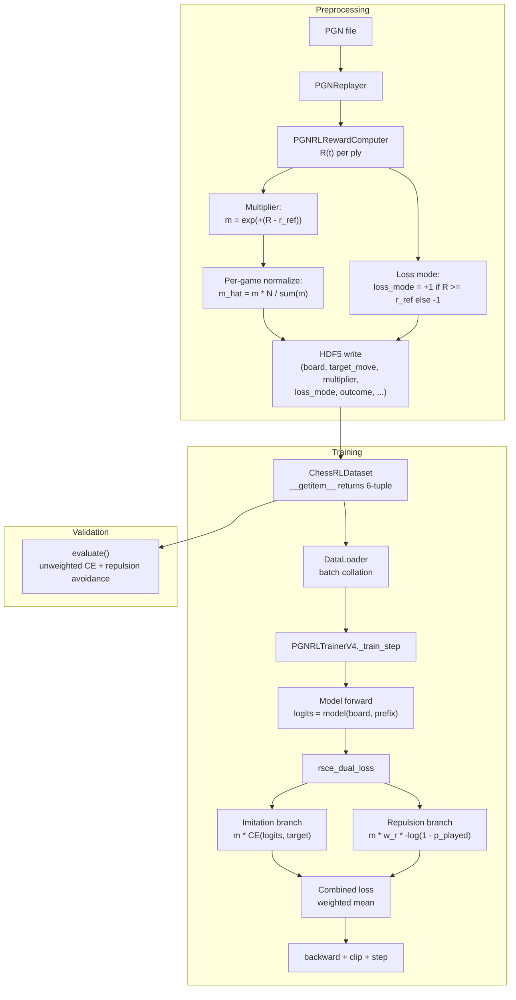
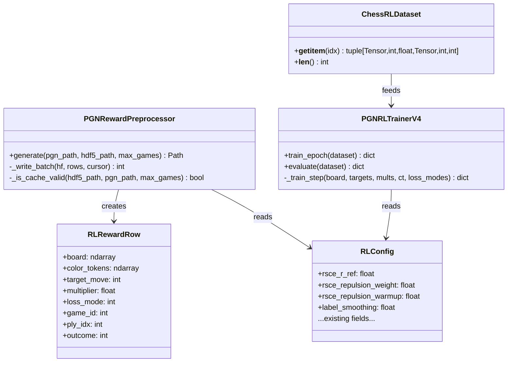

# Dual-Direction RSCE Loss -- Design

## Problem Statement

The current V4 RSCE trainer applies cross-entropy loss uniformly to all
plies, scaled by a multiplier `m(t)`. For plies where the trained side
played a losing move (`R(t) < r_ref`), a larger multiplier amplifies
learning *toward* that bad move rather than away from it. The pipeline
needs a bifurcated loss that imitates winning-regime plies and repels
losing-regime plies, each scaled by the same reward-derived multiplier
`m(t)`, to produce a model that both learns good moves and unlearns bad
ones.

## Feasibility Analysis

| Approach | Pros | Cons | Verdict |
|----------|------|------|---------|
| A. Bifurcated loss with `loss_mode` stored in HDF5 | Regime decision is frozen at preprocess time; no per-batch R(t) needed; clean separation of imitation vs repulsion in the loss function; minimal runtime overhead | Adds one int8 dataset to HDF5; requires regeneration; HDF5 schema coupled to r_ref | **Accept** |
| B. Compute `loss_mode` on-the-fly from `outcome` column | No HDF5 schema change; adapts to r_ref tuning without regeneration | `outcome` is +1/0/-1 per game, not per ply -- cannot reconstruct per-ply R(t) from outcome alone since material_delta is lost; would require storing R(t) instead | Reject: insufficient information in current schema |
| C. Store raw `R(t)` in HDF5, derive `loss_mode` + `m(t)` in trainer | Maximum flexibility (r_ref tunable without regeneration); trainer owns all reward logic | Shifts normalization and multiplier computation to GPU per-batch; complicates DataLoader; breaks the design principle that HDF5 is the single source of pre-computed weights | Reject: adds runtime complexity; deferred to Open Questions as a future option |
| D. Negative multiplier convention (m < 0 encodes repulsion) | No new HDF5 column; sign of `m` encodes direction | Mixes magnitude and direction in one field; normalization becomes sign-aware; harder to debug and log | Reject: conflates two concerns |

## Chosen Approach

Approach A stores `loss_mode` as an additional int8 dataset in HDF5,
determined at preprocessing time from the raw per-ply `R(t)` and the
configured `rsce_r_ref`. The multiplier magnitude `m(t) = exp(+(R(t) - r_ref))`
is stored separately, always positive. The trainer selects the imitation
(CE) or repulsion (`-log(1 - p_played)`) branch per sample based on
`loss_mode`, then scales by `m(t)`. This preserves the existing
"precompute everything offline" architecture of the V4 pipeline and adds
only one scalar int8 per ply to storage.

## Architecture

### Data Flow



*Caption: End-to-end data flow from PGN through HDF5 to dual-branch loss computation.*

### Loss Computation Detail

```mermaid
flowchart TD
    Logits["logits: (B, V)"] --> CE["F.cross_entropy\nreduction=none\n(B,)"]
    Logits --> Softmax["softmax -> probs (B, V)"]
    Softmax --> Gather["gather p_played (B,)"]
    Gather --> Clamp["clamp(max=1-1e-6)"]
    Clamp --> RepLoss["-log(1 - p_played)\n(B,)"]

    LossMode["loss_mode (B,)"] --> ImitMask["imitation_mask\n(loss_mode == +1)"]
    LossMode --> RepMask["repulsion_mask\n(loss_mode == -1)"]

    CE --> Select["per_sample =\nimit_mask * CE\n+ repul_mask * w_r * repul_loss"]
    RepLoss --> Select
    ImitMask --> Select
    RepMask --> Select

    Mult["multiplier (B,)"] --> Weight["weighted = mult * per_sample"]
    Select --> Weight
    Weight --> Mean["loss = weighted.mean()"]

    Mean --> AllImit{{"All imitation?"} }
    AllImit -->|Yes| OK1["Normal CE path\nrepulsion term = 0"]
    AllImit -->|No| AllRep{{"All repulsion?"}}
    AllRep -->|Yes| OK2["Normal repulsion path\nCE term = 0"]
    AllRep -->|No| OK3["Mixed batch\nboth terms contribute"]
```

*Caption: Per-batch loss computation with branch selection via loss_mode mask.*

### Class Relationships



*Caption: Static class relationships for the dual-direction RSCE pipeline.*

## Component Breakdown

### 1. `RLConfig` -- two new fields, one updated validation

- **Responsibility**: Holds `rsce_repulsion_weight` and `rsce_repulsion_warmup` config values.
- **Key interface**:
  ```
  rsce_repulsion_weight: float = 1.0    # scale factor on repulsion branch
  rsce_repulsion_warmup: float = 0.0    # fraction of total steps to linearly ramp repulsion weight from 0 to rsce_repulsion_weight; 0.0 = no warmup
  ```
- **Validation in `__post_init__`**:
  ```
  rsce_repulsion_weight >= 0
  0.0 <= rsce_repulsion_warmup < 1.0
  ```
- **Note**: `rsce_r_ref` already exists at line 476 of `config.py` with default `0.0`.

### 2. `RLRewardRow` -- add `loss_mode` field

- **Responsibility**: Immutable intermediate row for HDF5 writing, now carries loss direction.
- **Key interface change**: Add field `loss_mode: int` (values +1 or -1) after `multiplier`.
- **File**: `chess_sim/types.py`, line ~334.
- **Impact**: All call sites that construct `RLRewardRow` (only `PGNRewardPreprocessor.generate`) must pass the new field.

### 3. `PGNRewardPreprocessor` -- three changes

- **Responsibility**: Computes and stores `loss_mode` and the corrected multiplier sign.
- **Change A -- Multiplier sign flip** (line 203):
  ```
  CURRENT: m = torch.exp(-(rewards - rl.rsce_r_ref))
  NEW:     m = torch.exp(+(rewards - rl.rsce_r_ref))
  ```
  This is critical. With the current sign, high-reward plies get SMALL multipliers (exp of negative), which is the inverse of the desired behavior for dual-direction RSCE. After the flip, R(t) > r_ref yields m > 1 (strong imitation), R(t) < r_ref yields m < 1 (weak repulsion).

- **Change B -- Compute `loss_mode`** (after rewards, before normalization):
  ```
  loss_mode_np = np.where(rewards.numpy() >= rl.rsce_r_ref, 1, -1).astype(np.int8)
  ```
  `loss_mode` is derived from raw R(t), not from normalized m_hat. The normalized multiplier only controls magnitude, not direction.

- **Change C -- Write `loss_mode` to HDF5**:
  - Add `"loss_mode": ("int8", ())` to the `_DATASETS` dict.
  - Pass `loss_mode` per ply into `RLRewardRow`.
  - Write `loss_mode` array in `_write_batch`.
  - Add `rsce_repulsion_weight` to cache validation attributes.

### 4. `ChessRLDataset` -- return 6-tuple

- **Responsibility**: Surface `loss_mode` per sample to the DataLoader.
- **Current return type**: `tuple[Tensor, int, float, Tensor, int]` (board, target_move, multiplier, color_tokens, outcome).
- **New return type**: `tuple[Tensor, int, float, Tensor, int, int]` (board, target_move, multiplier, color_tokens, outcome, **loss_mode**).
- **`__getitem__` change**: Read `self._h5["loss_mode"][global_idx]` and return as the 6th element.
- **Backward compatibility**: The trainer's `train_epoch` unpacks by position. All call sites (trainer, tests) must be updated to handle the new 6th element.
- **No `collate_fn` change needed**: `loss_mode` is a scalar per sample; default collation handles it.

### 5. `rsce_dual_loss` -- new standalone function

- **Responsibility**: Computes the bifurcated loss for one minibatch.
- **File**: `chess_sim/training/pgn_rl_trainer_v4.py` (module-level function, not a method).
- **Key interface**:
  ```
  def rsce_dual_loss(
      logits: Tensor,              # (B, num_moves)
      targets: Tensor,             # (B,) int64
      multipliers: Tensor,         # (B,) float32, pre-normalized
      loss_modes: Tensor,          # (B,) int8, +1 or -1
      repulsion_weight: float,     # effective weight for this step (after warmup ramp)
      label_smoothing: float = 0.0,
  ) -> tuple[Tensor, dict[str, float]]
  ```
  Returns `(scalar_loss, branch_metrics_dict)` where `branch_metrics_dict` contains `loss_imitation`, `loss_repulsion`, and `frac_repulsion` for logging.
- **Edge cases**:
  - All-imitation batch (`repulsion_mask.sum() == 0`): repulsion term is zero; `loss_repulsion` metric is `0.0`.
  - All-repulsion batch (`imitation_mask.sum() == 0`): CE term is zero; `loss_imitation` metric is `0.0`.
  - Empty batch (B=0): return `(tensor(0.0), {all zeros})`.
- **Numerical stability**:
  - `p_played.clamp(max=1.0 - 1e-6)` prevents `log(0)` in the repulsion branch.
  - No `clamp(min=...)` needed -- `p_played >= 0` by construction from softmax.
  - Label smoothing applies to the CE (imitation) branch only. The repulsion branch operates on raw probabilities and has no smoothing analogue.

### 6. `PGNRLTrainerV4._train_step` -- updated signature and loss call

- **Responsibility**: Forward pass, dual loss, backward, optimizer step.
- **New signature**:
  ```
  def _train_step(
      self, board: Tensor, targets: Tensor,
      multipliers: Tensor, color_tokens: Tensor,
      loss_modes: Tensor,
  ) -> dict[str, float]
  ```
- **New return keys**: `loss`, `loss_imitation`, `loss_repulsion`, `frac_repulsion`, `n_correct`, `n_total`, `mean_entropy`, `mean_multiplier`, `grad_norm`.
- **Repulsion warmup ramp**: The effective repulsion weight at step `s` is:
  ```
  warmup_steps = int(rsce_repulsion_warmup * total_steps)
  if warmup_steps > 0 and s < warmup_steps:
      eff_w = rsce_repulsion_weight * (s / warmup_steps)
  else:
      eff_w = rsce_repulsion_weight
  ```
  The trainer already tracks `self._global_step` and `total_steps` is available at init. Store `total_steps` as `self._total_steps` and compute `eff_w` in `_train_step`.

### 7. `PGNRLTrainerV4.train_epoch` -- unpack 6-tuple

- **Change**: The DataLoader loop currently unpacks 5 elements. Update to:
  ```
  for board, targets, multipliers, ct, _outcomes, loss_modes in dl:
  ```
  Pass `loss_modes` to `_train_step`.
- **Metrics accumulation**: Aggregate `loss_imitation`, `loss_repulsion`, `frac_repulsion` across batches (weighted by batch size).
- **New return keys**: `total_loss`, `loss_imitation`, `loss_repulsion`, `frac_repulsion`, `n_samples`, `mean_multiplier`, `n_games`.

### 8. `PGNRLTrainerV4.evaluate` -- add repulsion avoidance metric

- **Change**: The eval loop also unpacks 6 elements now. For the val set:
  - Primary metric remains unweighted CE loss and top-1 accuracy.
  - New metric `repulsion_top1_avoidance`: fraction of `loss_mode == -1` samples where the model's top-1 prediction is NOT the played (bad) move.
  - If no repulsion-mode samples exist in the val set, `repulsion_top1_avoidance = 0.0` (not undefined).
- **No repulsion loss in validation**: Validation loss is always unweighted CE for comparability across experiments.

### 9. `_run_training_loop` -- extended log line

- **Responsibility**: Print per-epoch diagnostics including branch losses.
- **Updated log format**:
  ```
  Epoch %02d: loss=%.4f (imit=%.4f repul=%.4f frac_repul=%.2f)
  | val_loss=%.4f val_acc=%.4f repul_avoid=%.4f
  | n_samples=%d n_games=%d lr=%.2e
  ```

### 10. YAML config -- new fields

- **File**: `configs/train_rl_v4.yaml`, under `rl:`.
- **Add**:
  ```yaml
  rsce_repulsion_weight: 1.0
  rsce_repulsion_warmup: 0.2
  ```
- **`rsce_r_ref`** already exists (line 46 of current YAML, value 0.0).

## Multiplier Sign Convention -- Detailed Analysis

The draft proposes flipping the multiplier from `exp(-(R - r_ref))` to
`exp(+(R - r_ref))`. Here is the analysis of why this is correct.

### Current convention: `m = exp(-(R - r_ref))`

| R(t) | Sign of -(R - 0) | m(t) | Effect |
|------|-------------------|------|--------|
| R = +1.0 (winner, no material) | -1.0 | 0.37 | Low weight on winner ply |
| R = -1.0 (loser, no material) | +1.0 | 2.72 | High weight on loser ply |

This is backward for single-direction CE: it amplifies learning on bad
moves. The current pipeline applies CE uniformly, so high m on loser
plies means the model is trained MORE strongly to replicate losing moves.

### Corrected convention: `m = exp(+(R - r_ref))`

| R(t) | Sign of +(R - 0) | m(t) | loss_mode | Effect |
|------|-------------------|------|-----------|--------|
| R = +1.0 (winner) | +1.0 | 2.72 | +1 (imitation) | Strong imitation |
| R = +0.3 (winner, weak) | +0.3 | 1.35 | +1 (imitation) | Mild imitation |
| R = -0.3 (loser, weak) | -0.3 | 0.74 | -1 (repulsion) | Mild repulsion |
| R = -1.0 (loser) | -1.0 | 0.37 | -1 (repulsion) | Weak repulsion |

With the corrected sign AND dual loss, note that loser plies get m < 1,
meaning repulsion is applied but with LOW magnitude. This is actually
desirable: we are less confident about what to avoid than what to imitate,
because one bad outcome does not mean every individual move was terrible.

### The four-quadrant claim

The draft's four-quadrant table claims "Losing traj, bad move -> largest
m(t), repulsion (strongest penalty)." **This is incorrect** given
`m = exp(+(R - r_ref))`. With R < 0, m < 1, so the repulsion magnitude
is LESS than the imitation magnitude for winner plies. The corrected
ordering is:

| Regime | R(t) | m(t) | Direction | Gradient strength |
|--------|------|------|-----------|-------------------|
| Winner ply, decisive game | ~ +1.1 | ~ 3.0 | Imitation | Strongest |
| Winner ply, draw game | ~ +0.5 | ~ 1.6 | Imitation | Moderate |
| Loser ply, draw game | ~ -0.5 | ~ 0.6 | Repulsion | Moderate-weak |
| Loser ply, decisive game | ~ -1.1 | ~ 0.33 | Repulsion | Weakest |

This ordering is actually more conservative and arguably better: the
model learns winning moves aggressively and avoids losing moves gently.
If stronger repulsion is desired, increase `rsce_repulsion_weight`.

## HDF5 Schema Change Summary

### Before

| Dataset | dtype | Shape | Description |
|---------|-------|-------|-------------|
| board | float32 | (N, 65, 3) | Board/color/traj channels |
| color_tokens | int8 | (N, 65) | For structural mask |
| target_move | int32 | (N,) | Vocab index |
| multiplier | float32 | (N,) | m_hat (INVERTED sign) |
| game_id | int32 | (N,) | Source game index |
| ply_idx | int16 | (N,) | Ply within game |
| outcome | int8 | (N,) | +1/0/-1 |

### After

| Dataset | dtype | Shape | Description | Changed? |
|---------|-------|-------|-------------|----------|
| board | float32 | (N, 65, 3) | Board/color/traj channels | No |
| color_tokens | int8 | (N, 65) | For structural mask | No |
| target_move | int32 | (N,) | Vocab index | No |
| multiplier | float32 | (N,) | m_hat (CORRECTED sign) | **Yes: sign flipped** |
| game_id | int32 | (N,) | Source game index | No |
| ply_idx | int16 | (N,) | Ply within game | No |
| outcome | int8 | (N,) | +1/0/-1 | No |
| **loss_mode** | **int8** | **(N,)** | **+1 imitation / -1 repulsion** | **New** |

**All existing HDF5 files must be regenerated.** The old schema has (a)
the inverted multiplier sign and (b) no `loss_mode` dataset.

## Cache Invalidation

The `_is_cache_valid` method must check the new
`rsce_repulsion_weight` attribute (not `rsce_repulsion_warmup`, since
warmup is a training concern and does not affect preprocessed data).
Add to HDF5 attrs:

```
hf.attrs["rsce_repulsion_weight"] = rl.rsce_repulsion_weight
```

And to the checks list in `_is_cache_valid`.

**Note**: `loss_mode` depends on `rsce_r_ref`, which is already checked.
No additional cache key needed for `loss_mode` derivation.

## Stability Considerations

### Repulsion gradient spikes

When the model confidently assigns high probability to a losing move,
`-log(1 - p_played)` spikes toward infinity. Mitigations:

1. **Clamp**: `p_played.clamp(max=1.0 - 1e-6)` caps the loss at
   `~13.8` per sample. This is a hard ceiling.
2. **Gradient clipping**: The trainer already applies
   `nn.utils.clip_grad_norm_` with `gradient_clip=1.0`.
3. **Repulsion warmup ramp**: Linearly scale
   `rsce_repulsion_weight` from `0.0` to its configured value over the
   first `rsce_repulsion_warmup * total_steps` steps. This gives the
   model time to develop a reasonable prior before repulsion gradients
   kick in. Recommended default: `rsce_repulsion_warmup = 0.2` (first
   20% of training).
4. **Multiplier magnitude**: With `m = exp(+(R - r_ref))`, repulsion
   plies have m < 1.0 (since R < r_ref), naturally dampening their
   gradient contribution.

### r_ref sensitivity

- `r_ref = 0.0` with `lambda_outcome=1.0`: all winner plies get
  R >= 1.0 (imitation), all loser plies get R <= -1.0 (repulsion).
  Draw plies get R = draw_reward_norm (0.5 in current config), so
  draws are always imitation. This is a reasonable default.
- Monitor `frac_repulsion` per epoch. Healthy range: 0.3--0.6.
- If `frac_repulsion` is near 0 or near 1, `r_ref` is too extreme.

### Draw plies behavior

With `draw_reward_norm = 0.5` and `r_ref = 0.0`, all draw plies have
`R(t) >= 0.5 > 0.0 = r_ref`, placing them in the imitation regime. This
means draw moves are treated as worth learning (mildly), which is
reasonable -- draws against strong opponents often involve solid play.

## Rollout Order

The changes are sequentially dependent. Implement in this order:

```
Phase 1: Schema + preprocessing
  1. RLConfig          -- add rsce_repulsion_weight, rsce_repulsion_warmup
  2. RLRewardRow       -- add loss_mode field
  3. _DATASETS dict    -- add loss_mode entry
  4. Preprocessor      -- flip multiplier sign, compute loss_mode, write to HDF5
  5. Cache validation  -- add rsce_repulsion_weight to attrs
  *** Regenerate HDF5 ***

Phase 2: Dataset + trainer
  6. ChessRLDataset    -- return 6-tuple with loss_mode
  7. rsce_dual_loss    -- implement standalone function
  8. _train_step       -- accept loss_modes, call rsce_dual_loss
  9. train_epoch       -- unpack 6-tuple, aggregate branch metrics
 10. evaluate          -- unpack 6-tuple, compute repulsion_top1_avoidance

Phase 3: Logging + config
 11. _run_training_loop -- extend log line
 12. YAML config        -- add new fields
 13. Tests              -- update TC08, TC11, TC12, TC13; add TC16-TC23
```

## Test Cases

### Existing tests requiring updates

| ID | Test | Required change |
|----|------|-----------------|
| TC08 | `test_tc08_getitem_shapes_and_types` | Unpack 6-tuple; assert `loss_mode in (-1, +1)` |
| TC10 | `test_tc10_multipliers_positive_mean_one` | Still valid -- multipliers remain positive after sign flip |
| TC11 | `test_tc11_train_step_finite_loss` | Pass `loss_modes` tensor to `_train_step`; check new return keys |
| TC12 | `test_tc12_train_epoch_returns_all_keys` | Assert `loss_imitation`, `loss_repulsion`, `frac_repulsion` in keys |
| TC13 | `test_tc13_evaluate_returns_val_metrics` | Assert `repulsion_top1_avoidance` in keys |

### New tests

| ID | Scenario | Input | Expected Outcome | Edge? |
|----|----------|-------|-------------------|-------|
| TC16 | `rsce_dual_loss` all-imitation batch | `loss_modes = [+1, +1, +1, +1]`, random logits/targets/mults | Loss equals `(multipliers * CE).mean()`; `loss_repulsion == 0.0`; `frac_repulsion == 0.0` | Yes |
| TC17 | `rsce_dual_loss` all-repulsion batch | `loss_modes = [-1, -1, -1, -1]`, random logits/targets/mults | Loss equals `(multipliers * w_r * -log(1-p)).mean()`; `loss_imitation == 0.0`; `frac_repulsion == 1.0` | Yes |
| TC18 | `rsce_dual_loss` mixed batch | `loss_modes = [+1, -1, +1, -1]` | `loss_imitation > 0`, `loss_repulsion > 0`, `frac_repulsion == 0.5` | No |
| TC19 | `rsce_dual_loss` numerical stability: p_played near 1.0 | Logits rigged so `softmax[target] > 0.999` on a repulsion sample | Loss is finite (not inf); bounded by `-log(1e-6) ~ 13.8` | Yes |
| TC20 | `rsce_dual_loss` with `repulsion_weight=0.0` | Mixed batch, `repulsion_weight=0.0` | Repulsion samples contribute zero loss; equivalent to CE-only on imitation samples | Yes |
| TC21 | Preprocessor: `loss_mode` values match reward sign | Generate HDF5 from 3-game PGN | Every row with `outcome == +1` has `loss_mode == +1`; every row with `outcome == -1` has `loss_mode == -1`; draw rows have `loss_mode == +1` (since `draw_reward_norm=0.5 > r_ref=0.0`) | No |
| TC22 | Preprocessor: multiplier sign is corrected | Generate HDF5, winner plies | Winner-ply multipliers > 1.0 (exp(positive)); loser-ply multipliers < 1.0 (exp(negative)) | No |
| TC23 | Repulsion warmup: `eff_w` at step 0 equals 0.0 | `rsce_repulsion_warmup=0.2`, `total_steps=100`, step 0 | Effective repulsion weight is 0.0 | Yes |
| TC24 | Repulsion warmup: `eff_w` at step = warmup_steps equals full weight | `rsce_repulsion_warmup=0.2`, `total_steps=100`, step 20 | Effective repulsion weight equals `rsce_repulsion_weight` | Yes |
| TC25 | Repulsion warmup: `rsce_repulsion_warmup=0.0` disables ramp | `rsce_repulsion_warmup=0.0`, any step | Effective repulsion weight equals `rsce_repulsion_weight` immediately | Yes |
| TC26 | Config validation: negative `rsce_repulsion_weight` raises ValueError | `rsce_repulsion_weight=-0.5` | ValueError | Yes |
| TC27 | Config validation: `rsce_repulsion_warmup >= 1.0` raises ValueError | `rsce_repulsion_warmup=1.0` | ValueError | Yes |
| TC28 | `evaluate` returns `repulsion_top1_avoidance` between 0 and 1 | Synthetic HDF5 with mixed `loss_mode` | `0.0 <= repulsion_top1_avoidance <= 1.0` | No |
| TC29 | `_write_synthetic_hdf5` helper updated for new schema | Call updated helper | HDF5 has `loss_mode` dataset with values in {-1, +1} | No |
| TC30 | Dataset 6-tuple backward compat: trainer unpacks correctly | Full train_epoch on synthetic HDF5 | No unpacking errors; metrics dict contains all expected keys | No |

## Coding Standards

- **DRY**: `rsce_dual_loss` is a standalone function, not duplicated between train and eval.
- **Decorators**: None needed; loss function is pure computation.
- **Typing**: All new functions fully annotated. `loss_modes: Tensor` typed as int8 in docstrings. Return types are `tuple[Tensor, dict[str, float]]` for the loss function.
- **Comments**: Each branch in `rsce_dual_loss` gets a one-line comment explaining the formula.
- **`unittest`**: TC16--TC30 required before merge.
- **No new dependencies**: All functionality uses existing `torch`, `h5py`, `numpy`.
- **Line limit**: 88 chars per `ruff` config.

## Summary of File Changes

| File | Change type | Description |
|------|-------------|-------------|
| `chess_sim/config.py` | Addition | `rsce_repulsion_weight`, `rsce_repulsion_warmup` fields + validation in `RLConfig.__post_init__` |
| `chess_sim/types.py` | Modification | Add `loss_mode: int` field to `RLRewardRow` |
| `chess_sim/data/pgn_reward_preprocessor.py` | Modification | Flip multiplier sign; compute + store `loss_mode`; add `loss_mode` to `_DATASETS`; update cache validation |
| `chess_sim/data/chess_rl_dataset.py` | Modification | Return 6-tuple from `__getitem__`; read `loss_mode` from HDF5 |
| `chess_sim/training/pgn_rl_trainer_v4.py` | Modification | Add `rsce_dual_loss` function; update `_train_step` signature; update `train_epoch` unpacking and metrics; update `evaluate` for repulsion avoidance; store `_total_steps` for warmup |
| `scripts/train_rl_v4.py` | Minor | Extended log line in `_run_training_loop` |
| `configs/train_rl_v4.yaml` | Addition | `rsce_repulsion_weight: 1.0`, `rsce_repulsion_warmup: 0.2` |
| `tests/test_rsce_v4.py` | Modification | Update TC08/TC11/TC12/TC13; add TC16--TC30; update `_write_synthetic_hdf5` to include `loss_mode` |
| HDF5 files | Regenerate | Must be regenerated -- schema changed and multiplier sign flipped |

## Open Questions

1. **Should `R(t)` be stored in HDF5 for future flexibility?** Storing
   raw R(t) alongside `loss_mode` and `multiplier` would allow
   recomputing the regime split with a different `r_ref` without
   regenerating HDF5. Cost: one float32 per ply (~4 bytes). This is
   Approach C from the feasibility analysis, applied as an additive
   enhancement to Approach A.

2. **Adaptive `r_ref`**: Should `r_ref` be set to the empirical mean of
   R(t) computed during preprocessing? This would balance the imitation
   and repulsion regimes automatically. Implementation: first pass over
   all games to compute mean R(t), then second pass to compute
   multipliers and `loss_mode`. Doubles preprocessing time.

3. **Label smoothing interaction with repulsion**: The imitation branch
   uses `label_smoothing` from config. The repulsion branch operates on
   raw probabilities. Should repulsion have its own smoothing mechanism,
   e.g., clamping `p_played` to `[eps, 1-eps]` with a wider floor? The
   current `clamp(max=1-1e-6)` handles the upper bound only.

4. **Repulsion accuracy as an early stopping signal**: Should
   `repulsion_top1_avoidance` be used alongside `val_loss` for early
   stopping / patience? Currently only `val_loss` drives patience.

5. **Per-game normalization interaction**: Per-game normalization
   (`m_hat = m * N / sum(m)`) preserves relative magnitudes within a
   game but rescales so the mean multiplier per game is 1.0. After the
   sign flip, winner-heavy games will have most multipliers > 1 before
   normalization and will be pulled down. Verify empirically that
   normalization does not wash out the imitation/repulsion magnitude
   asymmetry.
