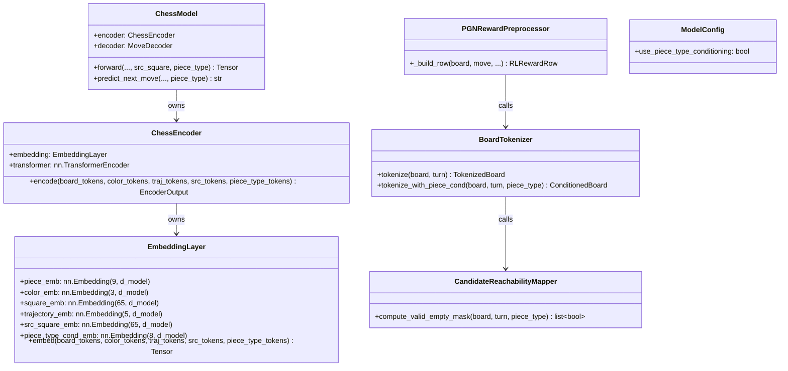
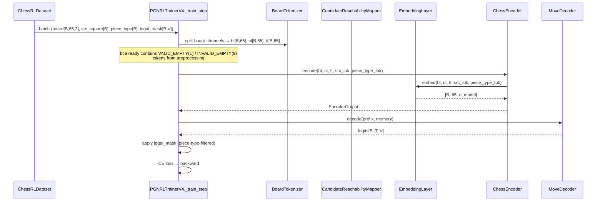
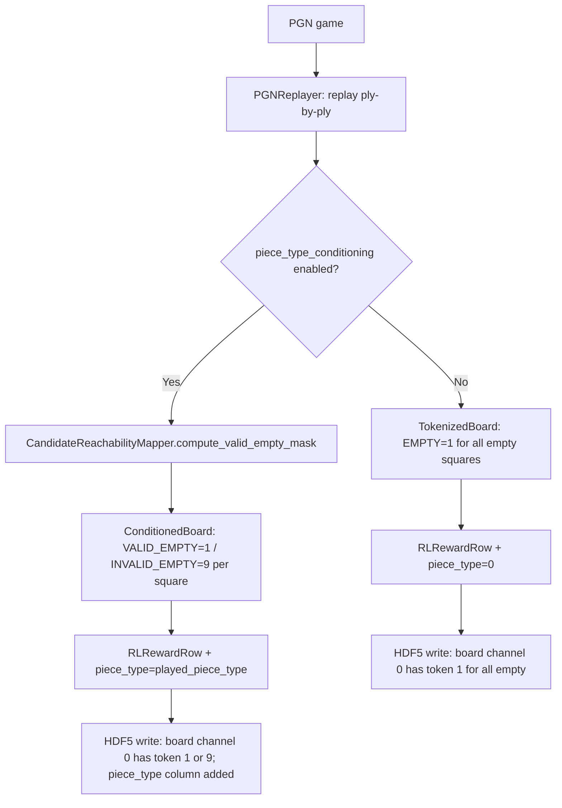

# Candidate Piece Conditioning — Design

## Problem Statement

The chess model currently predicts `P(action | board)` over all 1971 move tokens and
applies a legal mask post-hoc. This forces the encoder to maintain full decision entropy
across all piece types simultaneously, even when the caller has already selected a piece
type to consider moving. Introducing **candidate piece conditioning** narrows the
prediction to `P(action | board, piece_type)`, baking the piece-type constraint into the
board representation via two complementary changes: a new `piece_type_cond_emb` broadcast
signal in `EmbeddingLayer`, and a VALID/INVALID split of the EMPTY token that encodes
reachability at the token level before any forward pass.

---

## Feasibility Analysis

| Approach | Pros | Cons | Verdict |
|---|---|---|---|
| **A. New broadcast embedding + VALID/INVALID EMPTY split (proposed)** | Aligns with existing `src_square_emb` broadcast pattern; zero-init makes it a no-op until trained; VALID_EMPTY token gives explicit board-level signal with no runtime cost in the forward pass | Expands `PIECE_VOCAB_SIZE` from 8 to 9 (breaks checkpoints); requires new pre-computation in tokenizer and preprocessor; HDF5 schema version must be bumped | **Accept** |
| **B. Add piece_type_cond_emb only, keep single EMPTY token** | Minimal change; no tokenizer or HDF5 impact; zero-init safe to deploy | EMPTY token provides no discriminative signal about reachability; the conditioning is purely implicit in the cond embedding, not reflected in the board representation | Reject — misses the key reachability signal that motivates the feature |
| **C. Encode reachability as a fourth board channel (float mask)** | No vocabulary change; no checkpoint breakage | Adds a new tensor dimension to the already-packed `[B, 65, 3]` board array; requires HDF5 schema change and re-preprocessing anyway; less interpretable than a discrete token | Reject — broader schema impact, no interpretability advantage over Option A |
| **D. Apply piece-type filtering entirely post-hoc via a piece-type LUT (like `SrcMoveLUT`)** | Zero model change; works today | Does not reduce model entropy during the forward pass; does not condition the encoder on the selected piece type; misses the core training-time benefit | Reject — addresses inference only, not the training objective |

---

## Chosen Approach

Approach A is accepted. It extends the existing broadcast conditioning pattern (already
established by `src_square_emb`) with a second broadcast signal of identical shape and
initialization semantics. The VALID_EMPTY / INVALID_EMPTY split is the cheapest way to
bake reachability into the board representation: it is computed entirely from `chess.Board`
+ `piece_type` before the forward pass, adds no runtime cost inside the model, and makes
the reachability constraint visible to every attention head without requiring extra
architectural layers. The `piece_type_cond_emb` is zero-initialized so that `piece_type=0`
(no conditioning) is a strict no-op, preserving backward compatibility with all existing
checkpoints at the embedding level (see Open Questions on the PIECE_VOCAB_SIZE breakage).

---

## Architecture

### Static structure — changed modules



*Figure 1: Static structure showing changed and new components. Only the shaded boundary of
`EmbeddingLayer`, `ChessEncoder`, `ChessModel`, and `BoardTokenizer` changes; `MoveDecoder`
and all auxiliary heads are untouched.*

---

### Runtime data flow — training step



*Figure 2: Training step data flow. `piece_type` tokens travel as a single [B] tensor
parallel to `src_square`, broadcast inside `EmbeddingLayer` identically to `src_square_emb`.*

---

### Pre-computation flow — HDF5 preprocessing



*Figure 3: Preprocessing fork. When conditioning is disabled the pipeline is unchanged.
When enabled, `CandidateReachabilityMapper` rewrites EMPTY tokens to VALID/INVALID before
the row reaches HDF5.*

---

## Component Breakdown

### `chess_sim/model/embedding.py`

**Responsibility:** Compose all embedding streams, including the new piece-type broadcast.

**Changes:**
- Rename constant `PIECE_VOCAB_SIZE: int = 8` → `9` (adds `INVALID_EMPTY` at index 9).
  The existing index layout is preserved; 9 is appended.
- Add module constant `PIECE_TYPE_COND_VOCAB_SIZE: int = 8` (same domain as the old
  `PIECE_VOCAB_SIZE`: 0=no conditioning, 1=EMPTY, ..., 7=KING — these are piece *types*
  being considered, not board tokens).
- Add `piece_type_cond_emb: nn.Embedding(8, d_model)` to `__init__`, zero-initialized.
- Update `_init_piece_emb` to tile role features for 9 vocab entries; `INVALID_EMPTY`
  (index 9) receives the same role vector as `EMPTY` (index 1) as a starting prior.
- Add parameter `piece_type_tokens: Tensor | None = None` to `embed()` and `forward()`.
  When `None`, defaults to a zero tensor (no-op). Broadcast semantics identical to
  `src_square_emb`: `[B] → [B, 65]` via `unsqueeze(1).expand(B, S)`.

**Key interface:**
```python
def embed(
    self,
    board_tokens: Tensor,          # [B, 65] long — includes VALID_EMPTY(1)/INVALID_EMPTY(9)
    color_tokens: Tensor,          # [B, 65] long
    trajectory_tokens: Tensor,     # [B, 65] long
    src_tokens: Tensor | None = None,        # [B] long
    piece_type_tokens: Tensor | None = None, # [B] long, 0=no cond, 1-7=piece type
) -> Tensor:                       # [B, 65, d_model]
```

**Unit-testable in isolation:** yes — no chess dependency, pure tensor arithmetic.

---

### `chess_sim/model/encoder.py`

**Responsibility:** Pass the new `piece_type_tokens` parameter through to `EmbeddingLayer`.

**Changes:**
- Add `piece_type_tokens: Tensor | None = None` to `encode()` and `forward()`.
- Pass it through to `self.embedding(...)`.
- No structural change to the `TransformerEncoder`.

**Key interface:**
```python
def encode(
    self,
    board_tokens: Tensor,
    color_tokens: Tensor,
    trajectory_tokens: Tensor,
    src_tokens: Tensor | None = None,
    piece_type_tokens: Tensor | None = None,
) -> EncoderOutput:
```

**Unit-testable in isolation:** yes — mock `EmbeddingLayer` to verify pass-through.

---

### `chess_sim/model/chess_model.py`

**Responsibility:** Thread `piece_type` through the public API (`forward`, `predict_next_move`).

**Changes:**
- Add `piece_type: Tensor | None = None` to `forward()`. Convert to vocab index and pass
  to `self.encoder.encode(...)`.
- Add `piece_type: int | None = None` to `predict_next_move()`. When provided, convert
  to a `[1]` tensor and pass to `forward()`. Also pass `piece_type` to a new
  `PieceTypeMoveLUT.filter_legal_mask()` call to narrow the legal mask to only moves
  by pieces of that type.

**Key interface:**
```python
def forward(
    self,
    board_tokens: Tensor,
    color_tokens: Tensor,
    trajectory_tokens: Tensor,
    move_tokens: Tensor,
    move_pad_mask: Tensor | None = None,
    move_colors: Tensor | None = None,
    src_square: Tensor | None = None,
    piece_type: Tensor | None = None,   # [B] long, 0=no cond, 1-7
) -> Tensor:

def predict_next_move(
    self,
    board_tokens: Tensor,
    color_tokens: Tensor,
    trajectory_tokens: Tensor,
    move_history: list[str],
    legal_moves: list[str],
    is_white_turn: bool = True,
    temperature: float = 1.0,
    tokenizer: MoveTokenizer | None = None,
    src_square: int | None = None,
    piece_type: int | None = None,   # 1-7 (chess.PieceType values)
) -> str:
```

**Unit-testable in isolation:** yes — mock encoder and decoder; test that the piece_type
tensor flows correctly and that legal mask narrowing applies.

---

### `chess_sim/data/tokenizer.py`

**Responsibility:** Produce `ConditionedBoard` with VALID/INVALID EMPTY tokens.

**Changes:**
- Keep `BoardTokenizer.tokenize()` unchanged (no-conditioning path must remain stable).
- Add new dataclass/NamedTuple `ConditionedBoard` (see `types.py` below).
- Add new pure function `tokenize_with_piece_cond(board, turn, piece_type)` — delegates
  EMPTY-square classification to `CandidateReachabilityMapper`.

**Key interface:**
```python
def tokenize_with_piece_cond(
    board: chess.Board,
    turn: chess.Color,
    piece_type: chess.PieceType,   # chess.PAWN .. chess.KING
) -> ConditionedBoard:
```

`ConditionedBoard` contains `board_tokens`, `color_tokens`, and `piece_type_idx` (int, 1-7).

**Unit-testable in isolation:** yes — provide synthetic `chess.Board` positions.

---

### `chess_sim/data/candidate_reachability_mapper.py` (new file)

**Responsibility:** Compute which empty squares are reachable by any friendly piece of
the selected type. This is the only place that calls `python-chess` pseudo-legal move
generation with a piece-type filter.

**Key interface:**
```python
def compute_valid_empty_mask(
    board: chess.Board,
    turn: chess.Color,
    piece_type: chess.PieceType,
) -> list[bool]:
    """Return a length-64 bool list. True = square is a valid EMPTY destination
    for at least one friendly piece of piece_type. Index i = square a1+i."""
```

**Algorithm (pseudocode):**
```
reachable = set()
for move in board.generate_pseudo_legal_moves():
    if board.piece_at(move.from_square).piece_type == piece_type
       and board.piece_at(move.from_square).color == turn
       and board.piece_at(move.to_square) is None:
        reachable.add(move.to_square)
return [sq in reachable for sq in range(64)]
```

**Unit-testable in isolation:** yes — test against known positions (e.g., rook on a1,
verify a1..a8 and a1..h1 are all True when clear).

---

### `chess_sim/data/piece_type_move_lut.py` (new file)

**Responsibility:** Precomputed `[7, V]` bool LUT mapping each piece type (1–7) to the
set of move vocab indices whose from-square contains a piece of that type on the starting
board. Unlike `SrcMoveLUT` (which keys on a specific square), this keys on piece type,
so it is board-independent — it is a static structural constraint derived from the move
vocabulary itself.

Note: this is a move-vocabulary constraint only, not a board-state constraint. It answers
"which vocab entries correspond to moves by a piece type?" This is combined at inference
time with the existing legal mask to yield the piece-type-filtered mask.

**Key interface:**
```python
class PieceTypeMoveLUT:
    def __init__(self, device: torch.device | str = "cpu") -> None: ...
    def filter_legal_mask(
        self,
        legal_mask: Tensor,      # [B, V] bool
        piece_types: Tensor,     # [B] long, 1-7
    ) -> Tensor:                 # [B, V] bool
```

**Unit-testable in isolation:** yes — construct from `MoveVocab`, verify known moves
appear under their correct piece type.

---

### `chess_sim/types.py`

**New type:**
```python
class ConditionedBoard(NamedTuple):
    """Output of tokenize_with_piece_cond().

    board_tokens: Length-65 list. Index 0=CLS(0). Indices 1-64:
                  piece types 0-7 for occupied squares;
                  VALID_EMPTY(1) or INVALID_EMPTY(9) for empty squares.
    color_tokens: Length-65 list (unchanged semantics).
    piece_type_idx: int 1-7 (chess.PieceType), the conditioning signal.
    """
    board_tokens: list[int]
    color_tokens: list[int]
    piece_type_idx: int
```

**No changes** to `RLRewardRow`, `OfflinePlyTuple`, or other existing types. The HDF5
schema stores `piece_type` as a new `int8` column (see training pipeline section below).

---

### `chess_sim/config.py`

**Change:** Add `use_piece_type_conditioning: bool = False` to `ModelConfig`. The flag
gates all new behavior; `False` is a strict no-op so existing configs continue unchanged.

**No new config section required** — this is a model architectural flag, not a
hyperparameter sweep dimension.

---

### Data pipeline / HDF5 preprocessor

**Responsibility:** Store the `piece_type` conditioning signal per ply so the trainer can
retrieve it at batch time without recomputing it.

**Changes to `PGNRewardPreprocessor`:**
- When `cfg.model.use_piece_type_conditioning` is True:
  - Call `tokenize_with_piece_cond(board, turn, played_piece_type)` instead of
    `BoardTokenizer.tokenize()`. The `played_piece_type` is derived from
    `board.piece_at(move.from_square).piece_type`.
  - Write `board_tokens` (with VALID/INVALID EMPTY) to the `board` channel 0 as before.
  - Add a new HDF5 dataset `piece_type` (dtype `int8`, shape `(N,)`, values 0–7).
- Bump `_SCHEMA_VERSION` to 6 when the column is added.

**Changes to `ChessRLDataset`:**
- Load `piece_type` column when present, default to zeros when absent (backward compat).
- Return it as the 8th element of the `__getitem__` tuple (appended to existing 7-tuple).

**Training pipeline (`PGNRLTrainerV4._train_step`):**
- Unpack `piece_type` from the batch.
- When `cfg.model.use_piece_type_conditioning` is True:
  - Pass `piece_type_tok = piece_type` (already 1-based vocab index from preprocessing)
    to `self._model.encoder.encode(...)`.
  - Use `PieceTypeMoveLUT.filter_legal_mask(legal_mask, piece_type - 1)` (converting
    from 1-based to 0-based piece type index) to narrow the legal mask before CE loss.

---

## Updated Token Vocabulary Table

### Board token vocabulary (piece_emb, after this change)

| Index | Token Name | Meaning |
|---|---|---|
| 0 | CLS | Class token (position 0 only) |
| 1 | VALID_EMPTY | Empty square reachable by at least one candidate piece |
| 2 | PAWN | Pawn (player or opponent) |
| 3 | KNIGHT | Knight |
| 4 | BISHOP | Bishop |
| 5 | ROOK | Rook |
| 6 | QUEEN | Queen |
| 7 | KING | King |
| 8 | INVALID_EMPTY | Empty square not reachable by any candidate piece |

When `piece_type_conditioning=False`, all empty squares receive `VALID_EMPTY` (index 1)
— identical to the current `EMPTY` token. The model sees no difference unless conditioning
is active. `INVALID_EMPTY` (index 8) only appears when conditioning is enabled.

### Piece-type conditioning vocabulary (piece_type_cond_emb)

| Index | Meaning |
|---|---|
| 0 | No conditioning (no-op, zero-initialized) |
| 1 | PAWN candidates |
| 2 | KNIGHT candidates |
| 3 | BISHOP candidates |
| 4 | ROOK candidates |
| 5 | QUEEN candidates |
| 6 | KING candidates |

Note: this vocabulary uses 1-based `chess.PieceType` values directly. The EMPTY piece
type (python-chess has no piece at PAWN-1=0) maps to no-conditioning (index 0).

---

## Test Cases

| ID | Scenario | Input | Expected Outcome | Edge? |
|---|---|---|---|---|
| T01 | `EmbeddingLayer` piece_type_tokens=None is no-op | `piece_type_tokens=None`, all zeros board | Output identical to current `embed()` call with same inputs | No |
| T02 | `EmbeddingLayer` piece_type broadcast shape | `piece_type_tokens=[B]` long, any values 0-7 | Output shape `[B, 65, d_model]` with no error | No |
| T03 | `EmbeddingLayer` piece_type=0 zero init | Fresh layer, `piece_type_tokens=zeros(B)` | `piece_type_cond_emb` contribution is exactly zero | No |
| T04 | `PIECE_VOCAB_SIZE=9` does not break existing piece indices | Board with all piece types 0-7 | `piece_emb` lookup succeeds; indices 0-7 unchanged | No |
| T05 | `INVALID_EMPTY` token (8) embeds without error | `board_tokens` containing 8 | `piece_emb(8)` returns `[d_model]` float tensor | No |
| T06 | `ChessEncoder.encode` passes piece_type_tokens through | Mock `EmbeddingLayer`, check call args | `embedding` called with correct `piece_type_tokens` | No |
| T07 | `CandidateReachabilityMapper` rook on a1 open board | Rook on a1, empty a-file and rank 1 | All squares on file a (a2-a8) and rank 1 (b1-h1) are True; all others False | No |
| T08 | `CandidateReachabilityMapper` no pieces of requested type | Board with no knights, `piece_type=KNIGHT` | All 64 entries False | Yes |
| T09 | `CandidateReachabilityMapper` blocked piece | Pawn on e2 blocked by own piece on e3 | e3 not in valid set (occupied); e4 may be (push), e3 is not empty anyway | Yes |
| T10 | `tokenize_with_piece_cond` VALID_EMPTY assignment | Position with rook, `piece_type=ROOK` | Reachable empty squares get token 1; unreachable empty squares get token 8 | No |
| T11 | `tokenize_with_piece_cond` returns correct `piece_type_idx` | `piece_type=chess.QUEEN` | `ConditionedBoard.piece_type_idx == 5` | No |
| T12 | `PieceTypeMoveLUT` construction | Default init on CPU | `_lut.shape == (7, 1971)` | No |
| T13 | `PieceTypeMoveLUT.filter_legal_mask` narrows correctly | `legal_mask` all True, `piece_types=[ROOK(4)]` | Output mask True only at vocab indices whose from-square had a rook | No |
| T14 | `PieceTypeMoveLUT.filter_legal_mask` piece_type=0 no-op behavior | `piece_types=zeros(B)` | Caller guards with `piece_type > 0`; LUT row 0 all-False means empty result — caller must gate | Yes |
| T15 | `ChessModel.forward` with piece_type=None | Standard call without piece_type arg | Identical output to current; no regression | No |
| T16 | `ChessModel.forward` with piece_type tensor | `piece_type=torch.tensor([5])` (ROOK) | Forward completes, encoder receives piece_type_tokens | No |
| T17 | `ChessModel.predict_next_move` with piece_type | `piece_type=chess.ROOK`, board with rooks | Returned move is a rook move (from-square has a rook) | No |
| T18 | `ChessRLDataset` backward compat (no piece_type column) | HDF5 without `piece_type` dataset | Returns 8-tuple with `piece_type=0` for all rows | Yes |
| T19 | `PGNRLTrainerV4._train_step` piece_type conditioning path | `cfg.model.use_piece_type_conditioning=True` | `encoder.encode` called with non-None `piece_type_tokens` | No |
| T20 | `PGNRLTrainerV4._train_step` no-conditioning path unchanged | `cfg.model.use_piece_type_conditioning=False` | `encoder.encode` called with `piece_type_tokens=None` | No |

---

## Coding Standards

The implementing engineer must observe the following standards enforced on this project:

- **DRY** — `CandidateReachabilityMapper.compute_valid_empty_mask` and
  `PieceTypeMoveLUT` must not duplicate the UCI-from-square parsing logic already in
  `chess_sim/data/structural_mask.py`. Reuse `_uci_from_square_slot` via import.
- **Decorators** — no new decorators required by this feature. Do not add logging
  decorators to hot-path tensor operations; use `logger.debug` inside the function.
- **Typing everywhere** — all new signatures must be fully annotated. No bare `Any`.
  `chess.PieceType` is `int` at runtime; annotate as `chess.PieceType` for clarity.
- **Comments ≤ 280 characters** — each function docstring summary must fit one tweet.
  Detailed argument semantics go in the `Args:` block.
- **`unittest` before hypothesis scripts** — if any pre-validation script is written for
  the VALID/INVALID split logic, a `unittest.TestCase` must precede it.
- **No new dependencies** — `python-chess` is already in requirements. `PieceTypeMoveLUT`
  must be built from `MoveVocab` (existing), not by shelling out or importing new packages.
- **`virtualenv` + `python -m`** — all hypothesis scripts run inside `.venv`; clean up
  `.venv` after validation.
- **`match/case` preferred** — the piece-type role-feature lookup in `_init_piece_emb`
  (extended for index 8) should use a match/case or direct list index, not a chain of
  if/elif.
- **Functional-first** — `compute_valid_empty_mask` is a standalone pure function, not a
  method. Wrap it in a utility class only if a second related function is added later.
- **Checkpoint breakage** — `PIECE_VOCAB_SIZE` changing from 8 to 9 means
  `piece_emb.weight` shape changes. Document in `load_checkpoint` with a `logger.warning`
  that flags shape mismatches and loads with `strict=False` when
  `use_piece_type_conditioning=True`.

---

## Open Questions

1. **Checkpoint migration strategy.** Existing checkpoints (`chess_v2_1k.pt`,
   `lichess_25k_v2.pt`) have `piece_emb.weight` of shape `[8, d_model]`. Loading them
   with `PIECE_VOCAB_SIZE=9` will fail under `strict=True`. Engineering must decide:
   (a) always load with `strict=False` when `use_piece_type_conditioning=True`, padding
   the new row with the role-feature init for EMPTY; or (b) provide a one-time migration
   script that appends the row.

2. **HDF5 schema version bump strategy.** The addition of the `piece_type` column bumps
   `_SCHEMA_VERSION` to 6. Existing HDF5 files at version 5 must still be loadable
   (backward compat via the zero-default path in `ChessRLDataset`). Confirm whether a
   re-preprocessing run is planned or whether the lazy-default approach is sufficient.

3. **Piece-type selection policy during training.** The design derives `piece_type` from
   the played move (i.e., the teacher's chosen piece). This creates a supervision signal
   that is always consistent with the target. An alternative is to randomly sample a
   *legal* piece type at each ply and only use it when it matches the teacher — this
   provides more diverse conditioning signal but halves (or less) the effective training
   signal per sample. Defer to ML team.

4. **INVALID_EMPTY role-feature initialization.** Currently proposed to use the same
   role vector as VALID_EMPTY (index 1). An alternative is to use all-zeros so the
   embedding starts maximally neutral. Empirically, the zero init is safer but may slow
   learning; role-feature init may introduce a useful inductive bias. Defer to experiment.

5. **Interaction with `SrcMoveLUT`.** The trainer currently applies `SrcMoveLUT` (src
   square filter) when `use_src_conditioning=True`. When `use_piece_type_conditioning=True`
   is also set, both filters may be active simultaneously — the legal mask is ANDed with
   both the src-square constraint and the piece-type constraint. Confirm whether this
   intersection is the intended behavior or whether piece-type conditioning subsumes
   src-square conditioning (making them mutually exclusive).

6. **`PieceTypeMoveLUT` index convention.** `chess.PieceType` values are 1–6
   (PAWN=1, KNIGHT=2, ..., KING=6 in python-chess). The `piece_type_cond_emb` vocab
   above uses indices 1–7 to match the board token vocabulary (PAWN=2 in board tokens,
   PAWN=1 in `chess.PieceType`). Engineering must pick one convention and apply it
   consistently. Recommendation: use `chess.PieceType` (1–6) throughout the data and
   conditioning pipeline, and document the off-by-one from board token indices explicitly.

7. **Pseudo-legal vs legal moves in `compute_valid_empty_mask`.** The design uses
   `generate_pseudo_legal_moves()` for speed (O(piece count) vs O(legal moves)). This
   may mark squares as VALID_EMPTY even when the move would leave the king in check (i.e.,
   the piece is pinned). Using `generate_legal_moves()` is correct but slower. Engineering
   should measure the latency difference during preprocessing and decide.
