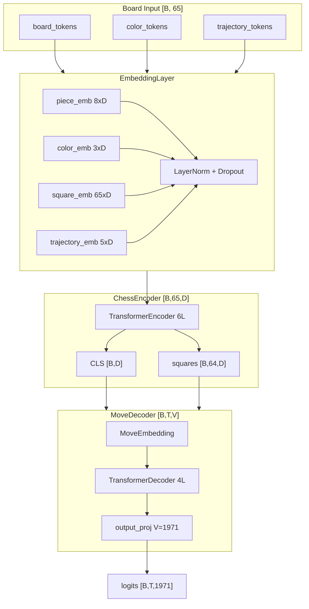
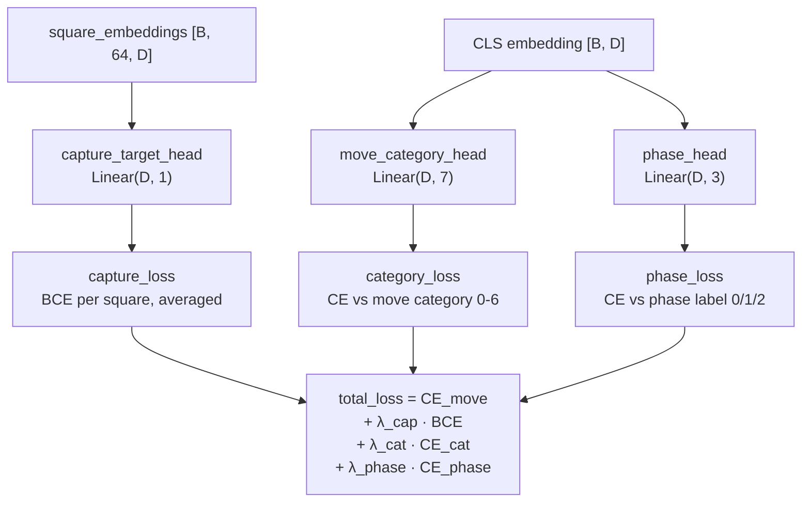
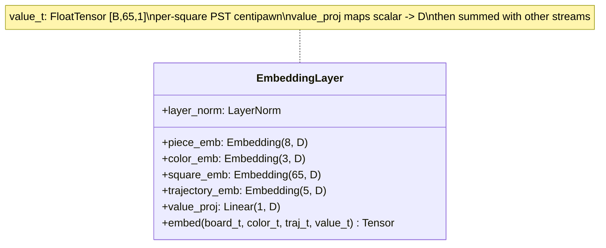
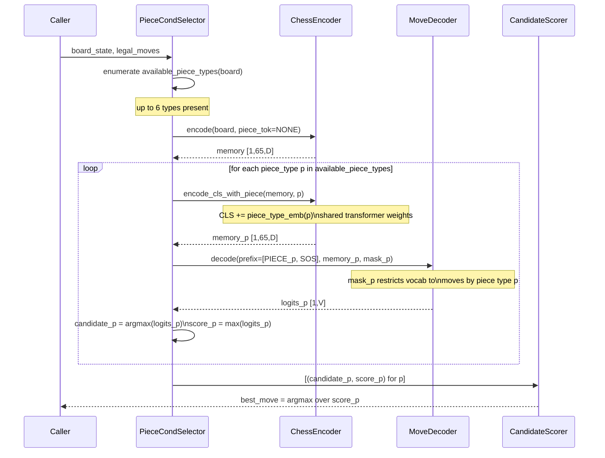
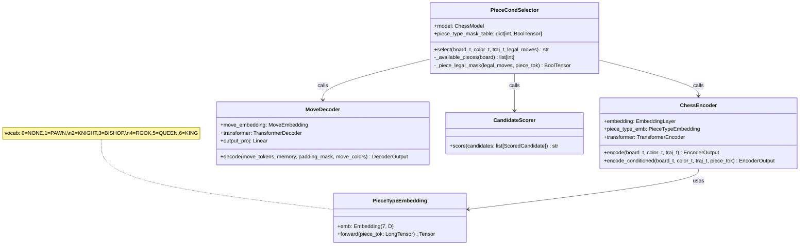
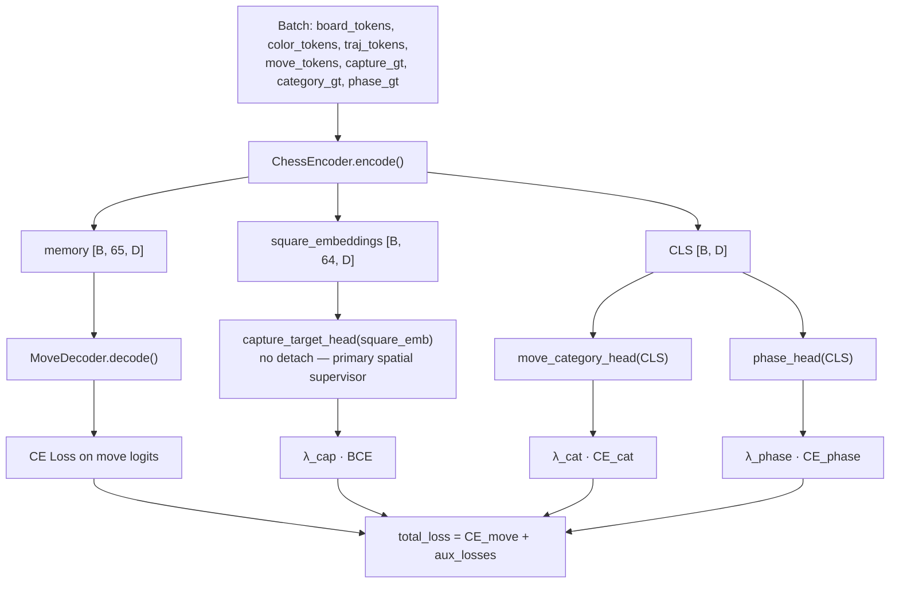
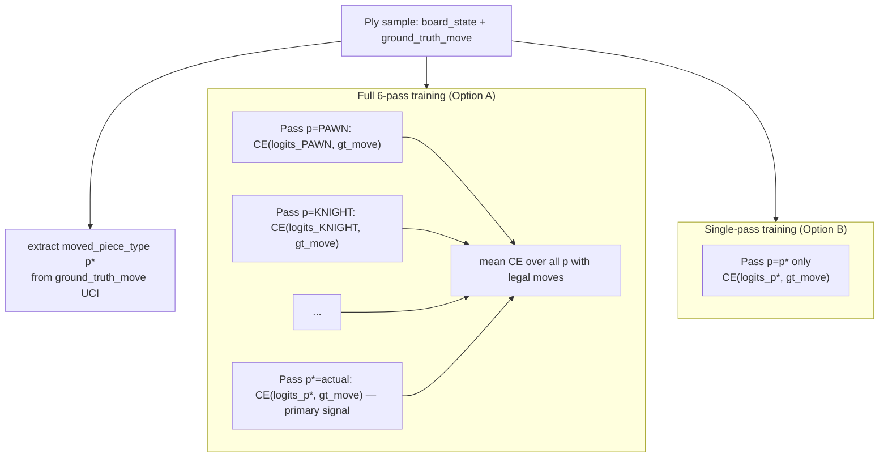

# Encoder Architecture Improvements — Design

> **Doc version**: v1.2 — Updated 2026-03-13. Changes: Added joint training strategy section. Documented aux label HDF5 storage requirement (capture_map, move_category). Clarified inference-path isolation of AuxiliaryHeads.

> **Changed from previous version**: Phase 1 no longer uses `material_head` (MSE regression) or `check_head` (BCE binary). These are replaced by `capture_target_head` (per-square BCE on square_embeddings) and `move_category_head` (7-class CE on CLS). `phase_head` is retained at low priority. Feasibility verdicts A1 and A2 changed from "Accept" to "Reject". New rows A7 and A8 added. Test cases T1-T7 replaced; total test count increased from 17 to 20.

## Problem Statement

The current `ChessEncoder` receives only piece type, color, and trajectory tokens and
is trained end-to-end with a pure CE objective on the decoder's next-move prediction.
This gives the encoder no direct supervision signal about board geometry, positional
tension, or piece role — it must infer all of it from move prediction loss alone, which
is an extremely sparse and noisy supervisor for structural board concepts. The decoder
also generates a single candidate move per forward pass, discarding the possibility that
different piece types call for structurally different reasoning paths. The result is a
model that sees pieces as abstract tokens rather than as agents with specific roles,
movement patterns, and board influence.

---

## Feasibility Analysis

### Auxiliary Encoder Objectives

| Approach | Pros | Cons | Verdict |
|---|---|---|---|
| A1: Material count regression (shared CLS head) | Zero new data; ground truth from `chess.Board`; fast | Scalar signal only; doesn't improve per-square reps | Reject — scalar regression collapses spatial information |
| A2: Check/check-threat classification (CLS head) | Binary; very cheap; high signal near critical positions | Rare event (~5-10%); severe class imbalance; too narrow | Reject — too narrow, rare event, class imbalance loses sight of game |
| A3: Game-phase classification (CLS head) | Easy to label from ply count and material; 3-class | Coarse; overlaps with trajectory already in input | Accept (low priority) |
| A4: Legal move count regression (CLS head) | Mobility is a known proxy for positional advantage | Difficult to batch efficiently at HDF5 time | Reject — compute cost at preprocess |
| A5: Masked piece prediction (BERT-style) | Strong structural signal; proven in NLP | Requires masking + extra forward pass; doubles training time | Reject — too expensive for now |
| A6: Square attack map prediction (per-square head) | Fine-grained; gives each square a supervision signal | 64 binary predictions; increases preprocess complexity | Accept — Phase 2 item |
| A7: Per-square capture availability (`capture_target_head`) | 64 binary labels; forces per-square representation quality; 64x denser gradient than CLS heads | Requires per-ply ground truth from `chess.Board` | Accept |
| A8: Move category classification (`move_category_head`) | 7-class CE on CLS; covers full tactical landscape (captures by piece value, castle, promotion) | Requires UCI move + board state for labeling | Accept |

### Square-Level Value Injection

| Approach | Pros | Cons | Verdict |
|---|---|---|---|
| B1: New PST embedding stream (like trajectory stream) | Consistent with existing 4-stream pattern; no arch change | Static lookup table; does not adapt to board context | Accept |
| B2: Continuous scalar injection via learned projection | Encodes arbitrary floating-point board signals | Breaks integer-embedding pattern; requires new linear layer | Accept — cleaner for mixed signals |
| B3: Separate value encoder branch (parallel transformer) | Maximum separation of concerns | Double encoder parameters; training complexity | Reject — over-engineered for now |
| B4: Cross-attention from value tokens to board tokens | Flexible; context-dependent weighting | Third encoder sub-block; large training surface | Reject — defer to later phase |

### Piece-Conditional Move Generation

| Approach | Pros | Cons | Verdict |
|---|---|---|---|
| C1: Piece token injected at CLS only (encoder) | Minimal change; CLS already accumulates global context | Piece signal diluted by 64-square attention; may not reach decoder | Reject — signal loss |
| C2: Piece token as decoder prefix (before SOS) | Decoder receives conditioning at generation time | Encoder has no piece context; memory is piece-agnostic | Reject — encoder blind |
| C3: Piece token injected at CLS (encoder) + decoder prefix | Both components receive the signal; CLS and decoder prefix are symmetric | 2x conditioning complexity; slight coupling | Accept |
| C4: Piece token as new 5th embedding stream (every square) | Maximum encoder exposure; conditioning is spatially distributed | Overloads per-square representation with a board-level signal | Reject — semantically wrong |
| C5: Cross-attention key bias (additive attention bias) | No extra tokens; can be applied per-head | Difficult to implement cleanly in PyTorch's built-in decoder | Reject — implementation friction |

**Chosen approach for piece conditioning: C3** — piece type token enters at the CLS
position of the encoder and as a prefix token (position 0, before SOS) in the decoder.

---

## Chosen Approach

The design proceeds in three independent layers that can be shipped in sequence:

**Phase 1 (highest ROI):** Add three auxiliary heads — two new spatially-aware tasks
plus a low-priority phase classifier. (1) `capture_target_head`: per-square BCE on
`square_embeddings [B, 64, D]` predicting which opponent squares are legally capturable.
(2) `move_category_head`: 7-class CE on `CLS [B, D]` classifying the tactical category
of the played move (quiet, capture by piece value, castle, promotion).
(3) `phase_head`: 3-class CE on `CLS [B, D]` for game phase (low priority, kept from
prior design). No architecture change; no new data fields beyond what `chess.Board`
already provides.

**Phase 2:** Add a fifth embedding stream to `EmbeddingLayer` — a scalar board-signal
stream that carries per-square continuous values (PST centipawn value, attack indicator)
projected through a learned linear layer into `d_model`. This parallels the existing
trajectory stream and requires minimal HDF5 schema change.

**Phase 3 (main proposal):** Introduce piece-conditional move generation. A `PIECE_TYPE`
token (vocab size 7: NONE + 6 piece types) is appended to the encoder CLS position and
prepended to the decoder sequence. At inference, up to 6 forward passes are run — one
per piece type present on the board — and a lightweight scorer selects the best
candidate. The encoder is shared across all 6 passes (board state is fixed); only the
CLS conditioning and decoder prefix change.

---

## Training Strategy: Joint Encoder-Decoder Training

Encoder and decoder are trained **jointly** in a single pipeline. There is no separate
encoder pre-training stage. The auxiliary heads (`capture_target_head`,
`move_category_head`, `phase_head`) are added as siblings to the decoder inside
`ChessModel` and are active only during training — they are never called during
inference.

### Why not separate pre-training

The encoder's memory `[B, 65, D]` is consumed by the decoder through cross-attention.
A separately pre-trained encoder would learn representations optimized for auxiliary
tasks but not necessarily in the format the decoder's cross-attention queries expect.
Joint training ensures both gradient sources (decoder CE loss and auxiliary head
losses) shape the encoder simultaneously, so the final representations satisfy both
objectives.

### Gradient flow

Two gradient streams enter the encoder simultaneously per training step:

1. **Decoder CE loss** → cross-attention → encoder memory → encoder parameters
2. **Auxiliary BCE/CE losses** → directly into the encoder's `square_embeddings`
   (capture head, no detach) and `cls_embedding` (CLS heads, detach TBD — see Open
   Questions, item 1)

These streams are **additive** and do not fight each other because they supervise
complementary aspects: the decoder teaches "what move was played" while the capture
head teaches "which squares are tactically prime."

### Auxiliary label sourcing

The current `ChessRLDataset` loads from HDF5 and does not expose `chess.Board` objects
at training time. Auxiliary labels must therefore be computed at **preprocess time** by
`PGNRewardPreprocessor` and stored as new HDF5 fields:

| HDF5 Field | Shape | Dtype | Description |
|---|---|---|---|
| `capture_map` | `[N, 64]` | `uint8` | Binary per-square capture availability for each ply |
| `move_category` | `[N]` | `uint8` | Move category index 0-6 for each ply |

The HDF5 file must be **regenerated** when first enabling Phase 1. Subsequent training
runs reuse the cached file. The two new fields are ignored by any training run that does
not enable Phase 1, so the schema change is additive and does not break existing
training pipelines.

### Inference isolation

`AuxiliaryHeads` is never called during inference. `ChessModel.forward()` returns only
move logits. The auxiliary heads add parameters to the checkpoint but are ignored at
inference time. If checkpoint size becomes a concern, the auxiliary heads can be
stripped from the `state_dict` using a one-time migration script without changing
`ChessModel`'s inference interface.

---

## Architecture

### Current Architecture (baseline)


*Figure 1. Baseline encoder-decoder data flow. Single candidate output per forward pass.*

---

### Phase 1: Auxiliary Heads


*Figure 2. Phase 1 auxiliary heads. `capture_target_head` operates on per-square
embeddings (64 binary predictions); `move_category_head` and `phase_head` operate on
CLS. Per-square gradients from `capture_target_head` flow back through the encoder
without detach — the per-square head IS the primary spatial supervisor.*

**Move category labels (7-class, derived from UCI move + `chess.Board`):**

| Index | Category | Condition |
|-------|----------|-----------|
| 0 | `QUIET` | No capture, no castle, no promotion |
| 1 | `CAPTURE_PAWN` | Move captures a pawn |
| 2 | `CAPTURE_MINOR` | Move captures a knight or bishop |
| 3 | `CAPTURE_ROOK` | Move captures a rook |
| 4 | `CAPTURE_QUEEN` | Move captures a queen |
| 5 | `CASTLE` | Kingside or queenside castling |
| 6 | `PROMOTION` | Pawn promotion (with or without capture) |

**Phase label derivation (no new HDF5 field needed):**
- Opening: ply < 20
- Endgame: total material (pawns excluded) <= 15 centipawns equivalent
- Midgame: otherwise

---

### Phase 2: Square Value Stream


*Figure 3. EmbeddingLayer with new value projection stream.*

The `value_t` input is a `FloatTensor [B, 65, 1]` (not an integer index). It passes
through `value_proj: Linear(1, D)` before being summed with the other four integer
embedding outputs. The CLS position receives `0.0`.

New HDF5 fields: `board_values [N, 65, 1]` — float32, PST centipawn value per square,
player-relative (positive = good for player to move), filled at preprocess time from a
static piece-square table.

---

### Phase 3: Piece-Conditional Move Generation


*Figure 4. Piece-conditional inference procedure. Encoder is run once to get base
memory, then CLS is updated per-piece. Decoder runs up to 6 times (one per piece type).
Scores are compared across piece types by raw logit magnitude.*

---

### Phase 3: Full Static Structure


*Figure 5. Static class structure for Phase 3. `ChessModel` gains a new
`encode_conditioned` method; `PieceCondSelector` wraps inference logic.*

---

## Component Breakdown

### Phase 1 Components

- **`AuxiliaryHeads`** (`chess_sim/model/auxiliary_heads.py`)
  - Responsibility: owns `capture_target_head`, `move_category_head`, `phase_head`
    linear projections; computes their losses given embeddings and ground-truth labels.
  - Key interface:
    ```
    def forward(
        square_emb: Tensor,         # [B, 64, D], NOT detached
        cls_emb: Tensor,            # [B, D]
        capture_gt: Tensor,         # [B, 64] float binary
        category_gt: Tensor,        # [B] long 0-6
        phase_gt: Tensor,           # [B] long 0/1/2
    ) -> AuxLossOutput              # namedtuple: capture_loss, category_loss, phase_loss
    ```
  - `capture_target_head: Linear(D, 1)` applied to `square_emb` produces `[B, 64, 1]`.
  - `move_category_head: Linear(D, 7)` applied to `cls_emb` produces `[B, 7]`.
  - `phase_head: Linear(D, 3)` applied to `cls_emb` produces `[B, 3]`.
  - Testable in isolation by passing random embeddings with synthetic GT labels.

- **`AuxLossOutput`** (`chess_sim/types.py` addition)
  - Responsibility: typed namedtuple for the three auxiliary losses.
  - Key interface:
    `AuxLossOutput(capture_loss: Tensor, category_loss: Tensor, phase_loss: Tensor)`

- **`ModelConfig` extension** (`chess_sim/config.py`)
  - New fields: `lambda_capture: float = 0.5` (weighted higher — per-square signal is
    64x denser than CLS heads), `lambda_category: float = 0.2`,
    `lambda_phase: float = 0.05`.
  - Controls how much each auxiliary loss contributes to total loss.

- **`CaptureMapBuilder`** (`chess_sim/data/capture_map_builder.py`)
  - Responsibility: given a `chess.Board` and `turn`, returns a `[64]` binary tensor
    where 1 indicates an opponent piece on that square that can be legally captured by
    at least one of the current player's pieces.
  - Key interface:
    ```
    def build(board: chess.Board, turn: chess.Color) -> list[int]
    # length 64; index i=1 if opponent piece on square i is attacked by any player piece
    ```
  - Ground truth: computed from `board.attacks_mask(sq) & board.occupied_co[opponent]`
    for each player square — any opponent square attacked by at least one player piece
    is a capture target.
  - No ML dependency; pure python-chess. Fully unit-testable with static board positions.

- **`MoveCategoryBuilder`** (`chess_sim/data/move_category_builder.py`)
  - Responsibility: given a UCI move string and a `chess.Board`, returns a category
    index 0-6 classifying the tactical type of the move.
  - Key interface:
    ```
    def build(uci_move: str, board: chess.Board) -> int
    # Returns category index: 0=QUIET, 1=CAPTURE_PAWN, 2=CAPTURE_MINOR,
    # 3=CAPTURE_ROOK, 4=CAPTURE_QUEEN, 5=CASTLE, 6=PROMOTION
    ```
  - Priority order: PROMOTION > CASTLE > CAPTURE_* > QUIET (promotion with capture
    is classified as PROMOTION).
  - No ML dependency; pure python-chess. Fully unit-testable.

- **Phase 1 HDF5 schema additions** (written by `PGNRewardPreprocessor` at preprocess time)

  | HDF5 Field | Shape | Dtype | Description |
  |---|---|---|---|
  | `capture_map` | `[N, 64]` | `uint8` | Binary per-square capture availability for each ply |
  | `move_category` | `[N]` | `uint8` | Move category index 0-6 for each ply |

  Both fields are populated by `CaptureMapBuilder` and `MoveCategoryBuilder`
  respectively. The HDF5 file must be regenerated when first enabling Phase 1.
  Fields are additive — existing fields are unchanged and existing training
  pipelines that ignore Phase 1 labels continue to load the file without
  modification.

---

### Phase 2 Components

- **`EmbeddingLayer` (extended)** (`chess_sim/model/embedding.py`)
  - New field: `value_proj: nn.Linear(1, d_model)`.
  - `embed()` signature gains `value_tokens: Tensor` (`[B, 65, 1]` float).
  - Backward-compatible: default `value_tokens = torch.zeros(B, 65, 1)`.

- **`PSTTableBuilder`** (`chess_sim/data/pst_table_builder.py`)
  - Responsibility: maps `(piece_type, color, square)` to a centipawn float using a
    static PST table; produces the `board_values [65]` array for a given board state.
  - Key interface:
    ```
    def build_value_array(board: chess.Board, turn: chess.Color) -> list[float]
    # length 65; index 0 = CLS = 0.0; indices 1-64 = per-square value
    ```

- **New HDF5 field** (`board_values [N, 65]` float32)
  - Added by the preprocess pipeline. Populated by `PSTTableBuilder`.
  - No change to existing integer fields.

- **`OutputConfig` / `PreprocessV2Config` extension** (`chess_sim/config.py`)
  - New field: `include_pst_values: bool = False`.

---

### Phase 3 Components

- **`PieceTypeEmbedding`** (`chess_sim/model/piece_type_embedding.py`)
  - Responsibility: single `nn.Embedding(7, d_model)` for piece-type conditioning tokens.
  - Key interface: `forward(piece_tok: LongTensor) -> Tensor  # [B, D]`

- **`ChessEncoder.encode_conditioned`** (new method on existing class)
  - Responsibility: accepts a `piece_tok: LongTensor [B]` and adds
    `PieceTypeEmbedding(piece_tok)` to the CLS position of the input before passing
    through the transformer.
  - Key interface:
    ```
    def encode_conditioned(
        board_tokens: Tensor,
        color_tokens: Tensor,
        trajectory_tokens: Tensor,
        piece_tok: Tensor,       # [B] long, 0=NONE..6=KING
    ) -> EncoderOutput
    ```
  - The base `encode()` method calls `encode_conditioned(piece_tok=zeros)` to preserve
    backward compatibility with existing training code.

- **`MoveDecoder` (prefix token support)**
  - The decoder already accepts arbitrary prefix sequences; the piece prefix token is
    prepended to the SOS token. No structural change needed.
  - `MoveEmbedding` adds a `piece_prefix_emb: nn.Embedding(7, d_model)` to embed the
    piece prefix before the main move token embedding sequence.

- **`PieceCondMaskTable`** (`chess_sim/data/piece_cond_mask.py`)
  - Responsibility: pre-computes, for each piece type (0-6), which of the 1971 vocab
    indices correspond to moves where the from-square could be occupied by that piece
    type. Built once at import time from `MoveVocab`.
  - Key interface:
    ```
    def get_mask(piece_type: int, legal_moves: list[str]) -> BoolTensor  # [1971]
    ```
  - Returns the intersection of the piece-type structural mask and the runtime legal
    moves list.

- **`PieceCondSelector`** (`chess_sim/inference/piece_cond_selector.py`)
  - Responsibility: orchestrates the up-to-6 forward passes, collects scored candidates,
    delegates to `CandidateScorer`.
  - Key interface:
    ```
    def select(
        board_tokens: Tensor,
        color_tokens: Tensor,
        trajectory_tokens: Tensor,
        board: chess.Board,
        legal_moves: list[str],
        temperature: float,
    ) -> str  # best UCI move
    ```
  - Encoder is called once for base memory; `encode_conditioned` is called per piece.
    This is O(1) extra encoder forward pass overhead per unique piece type present.

- **`CandidateScorer`** (`chess_sim/inference/candidate_scorer.py`)
  - Responsibility: given `list[ScoredCandidate]` (uci, logit), returns the highest-
    logit candidate. Abstracted as a protocol to allow future swap to a learned scorer.
  - Key interface:
    ```
    class ScorerProtocol(Protocol):
        def score(self, candidates: list[ScoredCandidate]) -> str: ...
    ```

- **`ModelConfig` extension** (`chess_sim/config.py`)
  - New field: `piece_conditional: bool = False`.
  - When `False`, `encode_conditioned` is a no-op wrapper around `encode`. No behavior
    change to existing training runs.

---

## Training Procedure

### Phase 1 Training


*Figure 6. Phase 1 training graph. `capture_target_head` receives `square_embeddings`
without detach — per-square gradients flow back through the encoder, directly shaping
spatial representations. For CLS-based heads (`move_category_head`, `phase_head`), the
detach question remains open (see Open Questions, item 1).*

---

### Phase 3 Training


*Figure 7. Two training options for Phase 3. Option A provides 6x the gradient signal
per ply but increases computation 6x. Option B is efficient but the model never learns
to produce low-confidence outputs for incorrect piece types (the selection signal).
Recommended starting point: Option B.*

**Piece-type label extraction:** from a UCI string such as `e2e4`, look up `board.piece_at(e2)` before the move is applied. The piece type is unambiguous from the from-square and the board state.

---

## Test Cases

| ID | Scenario | Input | Expected Outcome | Edge? |
|----|----------|-------|------------------|-------|
| T1 | CaptureMapBuilder: starting position | `chess.Board()`, `chess.WHITE` | All zeros — no captures available at start | No |
| T2 | CaptureMapBuilder: pawn fork position | Board with pawn on d4, opponent pieces on c5 and e5 | Exactly two squares flagged (c5, e5) | No |
| T3 | MoveCategoryBuilder: quiet move | `"e2e4"` on starting board | `QUIET` (0) | No |
| T4 | MoveCategoryBuilder: pawn capture | `"d4e5"` where e5 has opponent pawn | `CAPTURE_PAWN` (1) | No |
| T5 | MoveCategoryBuilder: rook capture | `"d1h5"` where h5 has opponent rook | `CAPTURE_ROOK` (3) | No |
| T6 | MoveCategoryBuilder: castling | `"e1g1"` kingside castle | `CASTLE` (5) | No |
| T7 | MoveCategoryBuilder: promotion | `"e7e8q"` pawn promotion | `PROMOTION` (6) | No |
| T8 | capture_target_head shape | `square_emb [4, 64, D]` | Output `[4, 64, 1]` | No |
| T9 | move_category_head shape | `CLS [4, D]` | Output `[4, 7]` | No |
| T10 | EmbeddingLayer with value_proj: shape | board_t [4,65], value_t [4,65,1] all zeros | Output [4,65,128] same shape as without value_t | No |
| T11 | EmbeddingLayer backward compat: no value_t | Existing call signature unchanged | Output matches old output (value_t defaults to zeros) | No |
| T12 | PieceCondMaskTable: KNIGHT mask | All 1971 vocab moves | Mask True only for moves geometrically reachable by a knight | No |
| T13 | PieceCondMaskTable: PAWN mask includes promotions | White pawn on e7 | `e7e8q`, `e7e8r` etc. included in mask | Yes |
| T14 | PieceTypeEmbedding shape | piece_tok [4] | Output [4, D] | No |
| T15 | encode_conditioned vs encode: NONE token equivalent | piece_tok = all zeros | EncoderOutput matches encode() (NONE embedding init near zero) | No |
| T16 | PieceCondSelector: no legal moves for piece type | ROOK conditioned, no rook on board | Piece type skipped; at least 1 candidate returned | Yes |
| T17 | PieceCondSelector: all 6 passes produce a candidate | Full set of pieces on board | Returns 6 scored candidates, selects highest logit | No |
| T18 | CandidateScorer: single candidate | 1 candidate | Returns that candidate regardless of score | Yes |
| T19 | piece_conditional=False: behavior unchanged | Existing ChessModel forward | logits identical to pre-Phase-3 model | No |
| T20 | Phase label boundary: ply=19 vs ply=20 | Synthetic board at ply 19 and ply 20 | ply 19 → phase=0 (opening), ply 20 → phase=1 (mid) | Yes |

---

## Coding Standards

The engineering team must enforce the following on all new modules:

- **DRY** — `PieceCondMaskTable` is built once at import; never rebuilt per-call.
- **Decorators** — use `@torch.no_grad()` as a decorator on `PieceCondSelector.select`
  (inference only). Do not decorate training methods.
- **Typing** — all functions carry full annotations including return types; no bare `Any`.
  `ScoredCandidate` is a typed `NamedTuple(uci: str, logit: float)`.
- **Comments** — max 280 characters per comment. Docstring examples follow existing
  `chess_model.py` style (show tensor shapes in the Returns block).
- **`unittest` required** — every new module ships with a corresponding
  `tests/model/test_<module>.py` or `tests/data/test_<module>.py`. PR is rejected if
  tests are absent.
- **No new deps** — all Phase 1 and Phase 2 work uses only `torch`, `chess`, and
  `numpy` (already in requirements). Phase 3 likewise. If `chess` is not available in
  `PieceCondMaskTable`, generate the mask table offline at preprocess time and load it.
- **`virtualenv`** — all `python -m` invocations use `.venv`; no system interpreter.
- **`ruff>=0.4`** — run `python -m ruff check . --fix` before every commit; line limit 88.
- **Backward compatibility** — `encode()` continues to work without `piece_tok`;
  `embed()` continues to work without `value_t`. Never remove existing method
  signatures.

---

## Open Questions

1. **CLS head detach strategy (Phase 1):** `capture_target_head` gradients flow through
   `square_embeddings` into the encoder without detach — the per-square head IS the
   primary spatial supervisor, so not detaching is recommended. The encoder's per-square
   representations are directly shaped by whether those squares are identified as capture
   targets. For the CLS-based heads (`move_category_head`, `phase_head`), the detach
   question remains: should CLS be detached before these heads to prevent auxiliary
   gradients from corrupting the encoder's move-prediction gradients? Recommended: start
   detached for CLS heads; ablate with a second run.

2. **Phase 3 training option (A vs B):** Full 6-pass training (Option A) gives richer
   signal but costs 6x compute per ply. Single-pass (Option B) is cheaper but the model
   never learns piece-rejection. A practical middle ground is to run Option A with 1/6th
   probability for each non-selected piece type (reservoir sampling). Decision deferred
   to engineering.

3. **Candidate scorer architecture (Phase 3):** The current design uses argmax over raw
   logits across piece types. This is scale-sensitive — if the QUEEN decoder produces
   higher logits simply because it has more legal moves (and thus the legal mask is less
   restrictive), it will dominate. A softmax-normalized confidence per piece type or a
   learned scorer MLP may be needed. Validate empirically on the 1k checkpoint before
   committing to a learned scorer.

4. **PST table choice (Phase 2):** Several PST tables exist (PeSTO, Fruit, Stockfish).
   They disagree significantly on king safety values. The design does not mandate a
   specific table. The engineering team should pick one, cite it in a comment, and
   validate that the resulting float distribution has reasonable variance (~10-50 cp
   range) when normalized.

5. **Piece mask precompute vs runtime (Phase 3):** `PieceCondMaskTable` proposes a
   static mask keyed on piece type. However, the intersection with `legal_moves` is
   always runtime. Confirm that the runtime `list[str]` intersection is fast enough
   at inference latency requirements (should be sub-millisecond for max 218 legal moves).

6. **Checkpoint compatibility:** `encode_conditioned` adds `PieceTypeEmbedding`
   parameters. A checkpoint trained without Phase 3 will fail to load against a Phase 3
   model. The engineering team must decide whether to handle this via a migration script
   or by shipping Phase 3 as a new checkpoint lineage.

7. **`value_proj` initialization (Phase 2):** A scalar input through `Linear(1, D)` is
   sensitive to initial weight scale. The existing `piece_emb` and `trajectory_emb` have
   vocab-based priors. For `value_proj`, a small initialization (std ~ 0.001) is
   recommended to prevent the new stream from dominating the sum at epoch 0.

---

## Recommended First Step

**Implement `capture_target_head` first.** The per-square BCE head is the highest
priority because it produces 64 binary labels per position — a 64x denser gradient
signal than any single CLS head. This forces the encoder to learn spatially-aware
representations: not just "what piece is here" but "can this piece be taken."

Priority order:
1. **`capture_target_head`** (per-square BCE) — highest ROI, 64x denser gradient signal
2. **`move_category_head`** (7-class CE on CLS) — second priority, tactical landscape
3. **`phase_head`** (3-class CE on CLS) — lowest priority, coarse signal

All three can be added in a single PR with no HDF5 schema changes, no inference-path
changes, and no new dependencies. `CaptureMapBuilder` and `MoveCategoryBuilder` run at
training time on the batch's `chess.Board` objects (already available through the
existing data pipeline), so no preprocessing changes are needed.

This is the highest-ROI change because:
- Per-square BCE gives the encoder direct spatial supervision starting at epoch 1.
- The embedding probe (from the deep inspection workflow) can immediately measure whether
  capture availability and move category are more linearly separable after the change.
- It is entirely isolated: if results are negative, remove the linear heads with no
  architectural debt.

Phase 2 (value injection) and Phase 3 (piece-conditional generation) both depend on
having a well-calibrated encoder; Phase 1 is their prerequisite.

---

## Version History

| Version | Date | Changes |
|---------|------|---------|
| v1.0 | 2026-03-12 | Initial design: material_head, check_head, phase_head for Phase 1 |
| v1.1 | 2026-03-13 | Replaced material_head and check_head with capture_target_head (per-square BCE) and move_category_head (7-class CE). Updated feasibility verdicts A1/A2 to Reject, added A7/A8. Rewrote Phase 1 components, training diagram, test cases (T1-T20). Updated recommended first step priority order. |
| v1.2 | 2026-03-13 | Added joint training strategy section. Documented aux label HDF5 storage requirement (capture_map, move_category). Clarified inference-path isolation of AuxiliaryHeads. |
