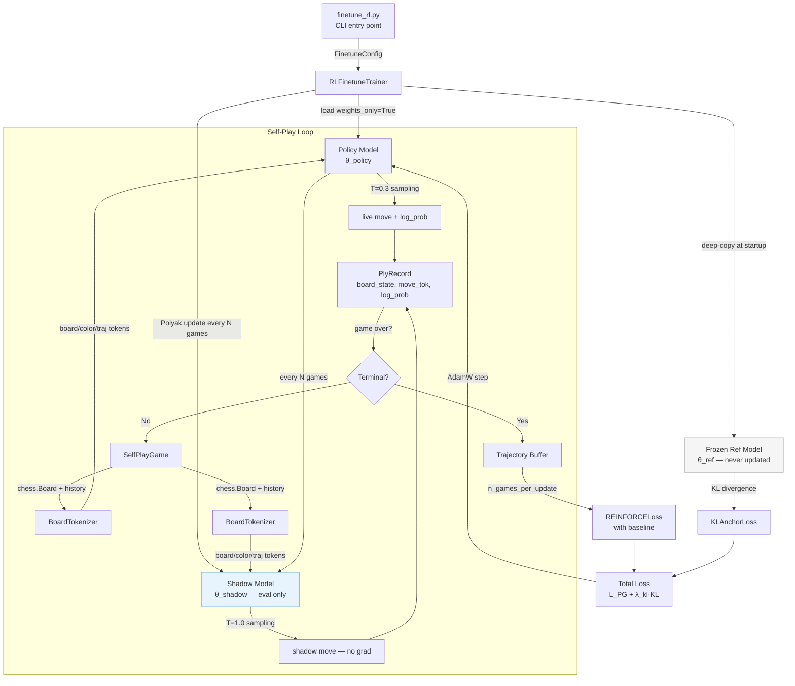
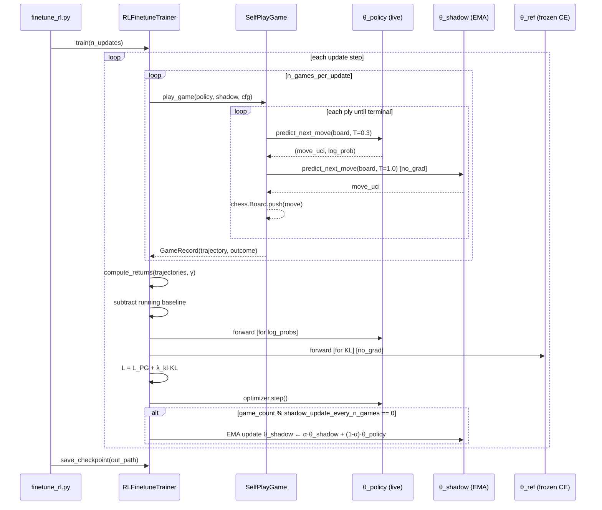
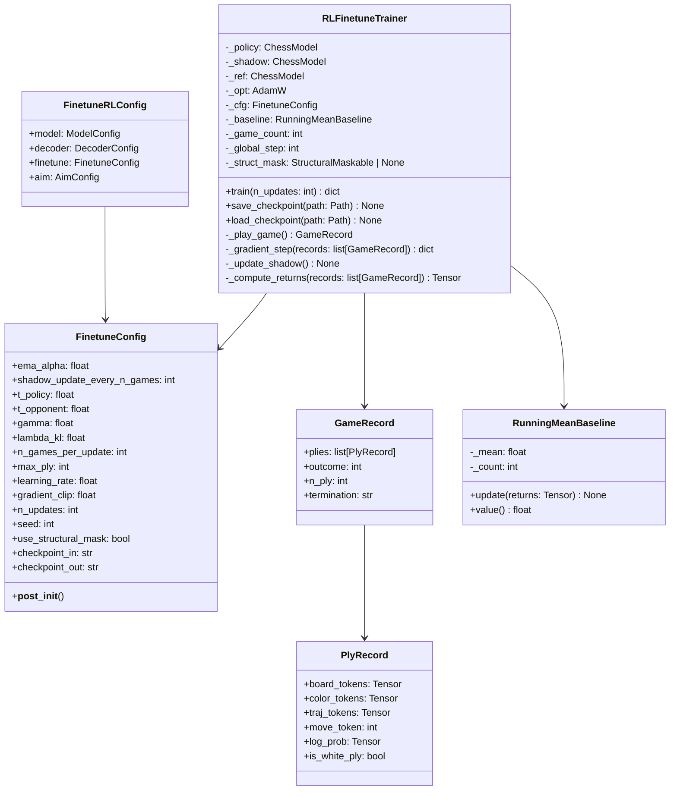

# RL Self-Play Fine-Tuner — Design

## Problem Statement

The CE-trained `ChessModel` (`chess_rl_v4_100k.pt`) learns to imitate master games but
has no mechanism to discover moves that win under self-generated pressure. The engineering
team must add an online self-play fine-tuning stage that rewards the live policy for
winning games against a lagging shadow copy of itself, while anchoring the policy to the
CE checkpoint via KL regularization to prevent catastrophic forgetting. This design is
entirely additive — no existing trainer files are modified.

---

## Feasibility Analysis

| Approach | Pros | Cons | Verdict |
|----------|------|------|---------|
| **EMA shadow opponent + REINFORCE + KL anchor** | Stable opponent (no oscillation), KL prevents collapse, proven in AlphaZero variants; complexity is moderate | Ply-by-ply forward passes are slow without batching; requires python-chess game loop | **Accept** |
| Fully frozen snapshot opponent | Simplest opponent management; no EMA bookkeeping | Opponent becomes trivially exploitable as policy improves; requires periodic manual snapshot rotation | Reject — operational overhead outweighs simplicity |
| PPO with clipped surrogate | Better sample efficiency, lower variance than REINFORCE | Requires value function estimates per ply (two forward passes); implementation complexity doubles; overkill for chess-length episodes | Reject — premature complexity given current ~200 ply cap |
| League training (multiple frozen snapshots) | Maximally diverse opponents; prevents cycling strategies | 3–5x memory overhead; sampling strategy is an additional hyperparameter; out of scope for a fine-tune stage | Reject — scope exceeds the stated brief |
| Self-play with no opponent (maximize entropy) | Zero opponent overhead | Provides no win signal; model learns random diversity, not chess | Reject — invalid objective |

---

## Chosen Approach

The engineering team implements **EMA shadow + REINFORCE + KL regularization** as a
standalone `RLFinetuneTrainer` class. A shadow model (`θ_shadow`) is updated via
Polyak averaging every N games, ensuring the opponent lags the live policy by a
controllable margin. Trajectories for the live policy are collected ply-by-ply using
`ChessModel.predict_next_move` with temperature sampling, then a single REINFORCE
gradient step is taken over `n_games_per_update` games. A frozen reference copy of the
CE checkpoint provides the KL anchor term. The approach re-uses all existing tokenizer
and board-encoding infrastructure without modification.

---

## Architecture

### System overview



### Training loop sequence



### Data types



---

## Component Breakdown

### `chess_sim/config.py` — additions (no existing lines modified)

**`FinetuneConfig` dataclass**
- Responsibility: holds all self-play fine-tune hyperparameters; validates ranges in
  `__post_init__`.
- Interface:
  ```python
  @dataclass
  class FinetuneConfig:
      ema_alpha: float = 0.995
      shadow_update_every_n_games: int = 50
      t_policy: float = 0.3
      t_opponent: float = 1.0
      gamma: float = 0.99
      lambda_kl: float = 0.1
      n_games_per_update: int = 10
      max_ply: int = 200
      learning_rate: float = 1e-5
      gradient_clip: float = 1.0
      n_updates: int = 500
      seed: int = 42
      use_structural_mask: bool = False
      checkpoint_in: str = ""
      checkpoint_out: str = "checkpoints/chess_rl_finetune.pt"
      def __post_init__(self) -> None: ...
  ```
- Validates: `0 < ema_alpha < 1`, `0 < gamma <= 1`, `lambda_kl >= 0`,
  `t_policy > 0`, `t_opponent > 0`, `max_ply >= 1`, `n_games_per_update >= 1`.

**`FinetuneRLConfig` dataclass**
- Responsibility: root config; composes `ModelConfig`, `DecoderConfig`,
  `FinetuneConfig`, `AimConfig`.
- Interface:
  ```python
  @dataclass
  class FinetuneRLConfig:
      model: ModelConfig = field(default_factory=ModelConfig)
      decoder: DecoderConfig = field(default_factory=DecoderConfig)
      finetune: FinetuneConfig = field(default_factory=FinetuneConfig)
      aim: AimConfig = field(default_factory=AimConfig)
  ```

**`load_finetune_rl_config(path: Path) -> FinetuneRLConfig`**
- Responsibility: load and parse YAML, raise `TypeError` on unknown keys.
- Interface:
  ```python
  def load_finetune_rl_config(path: Path) -> FinetuneRLConfig: ...
  ```
- Unit-testable in isolation with a tmp YAML file.

---

### `chess_sim/types.py` — additions

**`PlyRecord` NamedTuple**
- Responsibility: immutable record of one live-policy half-move for gradient computation.
- Interface:
  ```python
  class PlyRecord(NamedTuple):
      board_tokens: Tensor    # [1, 65] long
      color_tokens: Tensor    # [1, 65] long
      traj_tokens:  Tensor    # [1, 65] long
      move_token:   int       # vocab index of sampled move
      log_prob:     Tensor    # scalar; requires_grad=True
      is_white_ply: bool
  ```

**`GameRecord` NamedTuple**
- Responsibility: completed game result passed to the gradient step.
- Interface:
  ```python
  class GameRecord(NamedTuple):
      plies:       list[PlyRecord]
      outcome:     int          # +1 win, 0 draw, -1 loss (policy perspective)
      n_ply:       int
      termination: str          # "checkmate" | "stalemate" | "50move" |
                                # "threefold" | "maxply"
  ```

---

### `chess_sim/training/rl_finetune_trainer.py` — new file

**`RunningMeanBaseline`**
- Responsibility: maintains an online running mean of discounted returns to subtract as
  a variance-reduction baseline.
- Interface:
  ```python
  class RunningMeanBaseline:
      def __init__(self) -> None: ...
      def update(self, returns: Tensor) -> None: ...
      def value(self) -> float: ...
  ```
- Uses Welford-style accumulation; no tensors stored — only Python floats.
- Unit-testable independently with synthetic return sequences.

**`play_game(...) -> GameRecord`** (module-level function)
- Responsibility: run one complete chess game between live policy and shadow; return the
  trajectory of live-policy plies.
- Interface:
  ```python
  def play_game(
      policy: ChessModel,
      shadow: ChessModel,
      board_tok: BoardTokenizer,
      move_tok: MoveTokenizer,
      cfg: FinetuneConfig,
      device: torch.device,
  ) -> GameRecord: ...
  ```
- Policy perspective is always White. Shadow plays Black.
- Calls `ChessModel.predict_next_move` for both agents; only the policy call retains
  `log_prob` (via a separate `_log_prob_of_move` helper that re-runs the forward pass
  with `requires_grad=True`).
- Terminates on: `board.is_checkmate()`, `board.is_stalemate()`,
  `board.is_fifty_moves()`, `board.is_repetition(3)`, or `ply >= max_ply`.
- Returns `outcome` from White's perspective.
- No side effects on model state.

**`_log_prob_of_move(...) -> Tensor`** (module-level private function)
- Responsibility: given a board state and a sampled move token, compute `log π(a|s)`
  with gradients attached to the live policy parameters.
- Interface:
  ```python
  def _log_prob_of_move(
      policy: ChessModel,
      board_tokens: Tensor,
      color_tokens: Tensor,
      traj_tokens:  Tensor,
      move_token:   int,
      legal_moves:  list[str],
      move_tok:     MoveTokenizer,
      device:       torch.device,
  ) -> Tensor: ...
  ```
- Runs `policy.forward(...)` (training mode, no `torch.no_grad()`).
- Takes last-position logits, applies legal-move mask, temperature=`t_policy`, computes
  `log_softmax`, indexes at `move_token`.
- Returns scalar `Tensor` with `requires_grad=True`.

**`compute_returns(records: list[GameRecord], gamma: float) -> list[Tensor]`**
(module-level function)
- Responsibility: compute per-ply discounted returns `G_t` for each game's live-policy
  plies. Reward is terminal-only (+1/-1/0 at last ply, 0 elsewhere).
- Interface:
  ```python
  def compute_returns(
      records: list[GameRecord],
      gamma: float,
  ) -> list[Tensor]: ...
  ```
- Returns a flat list of scalar tensors aligned 1:1 with `PlyRecord` entries across all
  games.

**`RLFinetuneTrainer`**
- Responsibility: owns all three model copies, optimizer, baseline, and the outer
  training loop.
- Interface:
  ```python
  class RLFinetuneTrainer:
      def __init__(
          self,
          cfg: FinetuneRLConfig,
          device: str = "cpu",
          tracker: MetricTracker | None = None,
      ) -> None: ...

      @property
      def policy(self) -> ChessModel: ...

      def train(self, n_updates: int) -> dict[str, float]: ...

      def save_checkpoint(self, path: Path) -> None: ...
      def load_checkpoint(self, path: Path) -> None: ...

      def _play_games(self) -> list[GameRecord]: ...
      def _gradient_step(
          self, records: list[GameRecord]
      ) -> dict[str, float]: ...
      def _update_shadow(self) -> None: ...
  ```
- `__init__` loads the CE checkpoint into `_policy` via `torch.load(weights_only=True)`,
  deep-copies to `_ref` (immediately frozen via `requires_grad_(False)`), and
  deep-copies to `_shadow` (set to `eval()`, `requires_grad_(False)`).
- `train(n_updates)` loops `n_updates` times; each iteration calls `_play_games()`,
  then `_gradient_step()`, then conditionally `_update_shadow()`.
- `_update_shadow()` applies `θ_s ← α·θ_s + (1-α)·θ_p` parameter-by-parameter using
  `torch.no_grad()`.
- `save_checkpoint` stores `model`, `optimizer`, `baseline_state`, `global_step`,
  `game_count`; uses `weights_only=True` on load.

---

### `configs/finetune_rl.yaml` — new file

```
model:
  d_model: 128
  n_heads: 8
  n_layers: 6
  dim_feedforward: 512
  dropout: 0.1

decoder:
  d_model: 128
  n_heads: 8
  n_layers: 4
  dim_feedforward: 512
  dropout: 0.1
  max_seq_len: 512
  move_vocab_size: 1971

finetune:
  ema_alpha: 0.995
  shadow_update_every_n_games: 50
  t_policy: 0.3
  t_opponent: 1.0
  gamma: 0.99
  lambda_kl: 0.1
  n_games_per_update: 10
  max_ply: 200
  learning_rate: 1.0e-5
  gradient_clip: 1.0
  n_updates: 500
  seed: 42
  use_structural_mask: false
  checkpoint_in: checkpoints/chess_rl_v4_100k.pt
  checkpoint_out: checkpoints/chess_rl_finetune.pt

aim:
  enabled: false
  experiment_name: finetune_rl
  repo: .aim
  log_every_n_steps: 10
```

---

### `scripts/finetune_rl.py` — new file

**`main(config_path: Path | None = None) -> None`**
- Responsibility: CLI entry point; mirrors the structure of `scripts/train_rl_v4.py`.
- Interface:
  ```python
  def main(config_path: Path | None = None) -> None: ...
  def _build_parser() -> argparse.ArgumentParser: ...
  def _setup_reproducibility(seed: int) -> None: ...
  ```
- Accepts `--config` CLI argument.
- Calls `load_finetune_rl_config`, constructs `RLFinetuneTrainer`, calls
  `trainer.train(cfg.finetune.n_updates)`.
- Catches `KeyboardInterrupt` and saves an emergency checkpoint with `_interrupted`
  suffix (same pattern as `train_rl_v4.py`).

---

### `tests/test_rl_finetune_trainer.py` — new file

Uses `unittest.TestCase`. All model constructions use `ModelConfig(d_model=64, n_layers=2)` and
`DecoderConfig(d_model=64, n_layers=1)` to keep tests fast. Mocks `chess.Board` and
`ChessModel.predict_next_move` where the underlying behavior is already covered.

---

## Training Loop Pseudocode

```
# Initialization
policy  ← load_checkpoint(cfg.checkpoint_in)
ref     ← deepcopy(policy); ref.requires_grad_(False)
shadow  ← deepcopy(policy); shadow.eval(); shadow.requires_grad_(False)
opt     ← AdamW(policy.parameters(), lr=cfg.learning_rate)
baseline ← RunningMeanBaseline()
game_count ← 0
global_step ← 0

for update in range(n_updates):
    records: list[GameRecord] = []

    for _ in range(cfg.n_games_per_update):
        record ← play_game(policy, shadow, board_tok, move_tok, cfg, device)
        records.append(record)
        game_count += 1

        if game_count % cfg.shadow_update_every_n_games == 0:
            _update_shadow()   # EMA

    # Compute discounted returns across all games
    flat_returns: list[Tensor] ← compute_returns(records, cfg.gamma)
    baseline.update(stack(flat_returns))

    # Collect log-probs (re-run forward with grad)
    flat_log_probs: list[Tensor] ← [ply.log_prob for game in records for ply in game.plies]

    advantages: Tensor ← stack(flat_returns) - baseline.value()

    # REINFORCE loss
    L_PG ← -mean(advantages.detach() * stack(flat_log_probs))

    # KL loss — forward pass against ref model (no_grad on ref)
    L_KL ← mean over (board, color, traj) in flat plies of:
        KL( softmax(policy_logits / t_policy) || softmax(ref_logits).detach() )

    loss ← L_PG + cfg.lambda_kl * L_KL

    opt.zero_grad()
    loss.backward()
    clip_grad_norm_(policy.parameters(), cfg.gradient_clip)
    opt.step()
    global_step += 1

    log: win_rate, mean_ply, L_PG, L_KL, baseline_value, grad_norm
```

---

## Test Cases

| ID | Scenario | Input | Expected Outcome | Edge? |
|----|----------|-------|------------------|-------|
| TC01 | `FinetuneConfig` with valid defaults constructs without error | default `FinetuneConfig()` | No exception; all fields match defaults | No |
| TC02 | `FinetuneConfig` with `ema_alpha=1.0` raises | `ema_alpha=1.0` | `ValueError` | Yes |
| TC03 | `FinetuneConfig` with `ema_alpha=0.0` raises | `ema_alpha=0.0` | `ValueError` | Yes |
| TC04 | `FinetuneConfig` with `lambda_kl=-0.1` raises | `lambda_kl=-0.1` | `ValueError` | Yes |
| TC05 | `FinetuneConfig` with `max_ply=0` raises | `max_ply=0` | `ValueError` | Yes |
| TC06 | `load_finetune_rl_config` parses valid YAML | tmp YAML with all sections | `FinetuneRLConfig` with correct field values | No |
| TC07 | `load_finetune_rl_config` raises on unknown key | YAML with `finetune: {unknown_key: 1}` | `TypeError` | Yes |
| TC08 | `RunningMeanBaseline.value()` returns 0.0 before any update | fresh instance | `0.0` | Yes |
| TC09 | `RunningMeanBaseline` converges toward true mean | 100 updates of `tensor([1.0])` and `tensor([-1.0])` alternately | `abs(baseline.value()) < 0.1` | No |
| TC10 | `compute_returns` with win outcome discounts correctly | 3-ply game, outcome=+1, gamma=0.99 | returns[0] ≈ 0.99², returns[1] ≈ 0.99, returns[2] ≈ 1.0 | No |
| TC11 | `compute_returns` with draw outcome produces all-zero returns | 4-ply game, outcome=0 | all returns == 0.0 | No |
| TC12 | `compute_returns` with loss outcome produces all-negative returns | 2-ply game, outcome=-1 | returns[0] ≈ -0.99, returns[1] ≈ -1.0 | No |
| TC13 | `_log_prob_of_move` returns scalar with `requires_grad=True` | tiny model, valid board state, one legal move | tensor shape `[]`, `requires_grad=True` | No |
| TC14 | `_update_shadow` moves shadow weights toward policy | after 1 EMA step with `ema_alpha=0.0` (full copy) | shadow weights == policy weights | Yes |
| TC15 | `_update_shadow` with `ema_alpha=1.0` leaves shadow unchanged | policy weights modified, alpha=1.0 not used (validated to reject) | covered by TC02 (config rejects this) | Yes |
| TC16 | `play_game` with mocked `predict_next_move` always returning same move terminates via `max_ply` | mock returns "e2e4" for white, "e7e5" for black repeatedly | `termination == "maxply"`, `n_ply == cfg.max_ply` | Yes |
| TC17 | `play_game` terminates on checkmate board | board at 1-move-from-mate position; mock returns the mating move | `termination == "checkmate"`, `outcome == +1` | No |
| TC18 | `RLFinetuneTrainer.__init__` loads CE checkpoint and creates three separate model instances | tmp checkpoint saved then loaded | `policy is not shadow`, `policy is not ref`; ref and shadow have `requires_grad == False` for all params | No |
| TC19 | `RLFinetuneTrainer._gradient_step` reduces `L_PG` when outcome is win | 1-game batch, outcome=+1, mocked log_probs | `L_PG < 0` (gradients increase log-prob of winning moves) | No |
| TC20 | `RLFinetuneTrainer.save_checkpoint` and `load_checkpoint` round-trip | train 1 step, save, new trainer, load | `global_step` matches; policy weights are identical post-load | No |

---

## Coding Standards

- **DRY** — `BoardTokenizer`, `MoveTokenizer`, and `_compute_trajectory_tokens` are
  imported from existing modules; they are not re-implemented.
- **Typing** — every function carries full type annotations; no bare `Any`.
- **Decorators** — `@torch.no_grad()` on shadow and ref forward passes; logging of
  per-update metrics via a decorator or direct `tracker.track_scalars` call at the
  update boundary.
- **Comments** — all inline comments must fit in 280 characters.
- **unittest** — `tests/test_rl_finetune_trainer.py` must pass before any PR is merged.
- **No new dependencies** — `python-chess` is already present; `torch`, `copy`, and
  standard library are sufficient.
- **`virtualenv` + `python -m`** — all validation scripts run under the project's
  `.venv`.
- **Security** — `torch.load(..., weights_only=True)` at every call site; never revert.
- **`match/case`** — termination reason dispatch in `play_game` should use
  `match termination_str: case "checkmate": ...` for readability.
- **Generators** — if `flat_log_probs` and `flat_returns` lists grow large, yield from
  a generator to avoid materializing both simultaneously.

---

## Open Questions

1. **Policy perspective fixed to White**: the design trains exclusively as White
   (shadow plays Black). Should the engineering team add a `train_color` field to
   `FinetuneConfig` and alternate sides per game to produce a color-agnostic policy?

2. **KL target distribution**: the KL term is computed at every live ply. Should it be
   restricted only to positions where the policy deviates significantly from the
   reference (e.g. KL > threshold), or applied uniformly?

3. **Batching `_log_prob_of_move`**: the current design calls one forward pass per live
   ply (potentially 100+ per game). Can the engineering team batch plies from one game
   into a single forward pass? This requires padding the move prefix per ply, which adds
   implementation complexity but could yield a 5–10x throughput improvement.

4. **Shadow model device**: both `_policy` and `_shadow` must reside on the same device
   for the EMA parameter copy. Is CUDA memory sufficient to hold all three models
   (`policy` + `shadow` + `ref`) simultaneously at d_model=128?

5. **Baseline scope**: the design uses a single global running mean across all games and
   all updates. Should the baseline be reset per update step, or maintained across the
   entire fine-tuning run? A per-update baseline reduces variance more aggressively but
   discards inter-update trend information.

6. **KL computation against reference**: computing KL requires a forward pass through
   `_ref` for every live ply. If batching (Q3) is adopted, the ref forward should be
   batched identically to amortize cost.

7. **Evaluation metric**: no evaluation loop is specified. Should the engineering team
   add a periodic Elo-estimation step (e.g. run N games vs. the frozen CE checkpoint
   and report win rate), or defer that to a separate evaluation script?

8. **Checkpoint compatibility**: `save_checkpoint` stores `baseline_state` as a plain
   dict. If `RunningMeanBaseline` internal fields change in a future version, the saved
   dict becomes unreadable. Should the engineering team version-stamp the checkpoint
   format?
