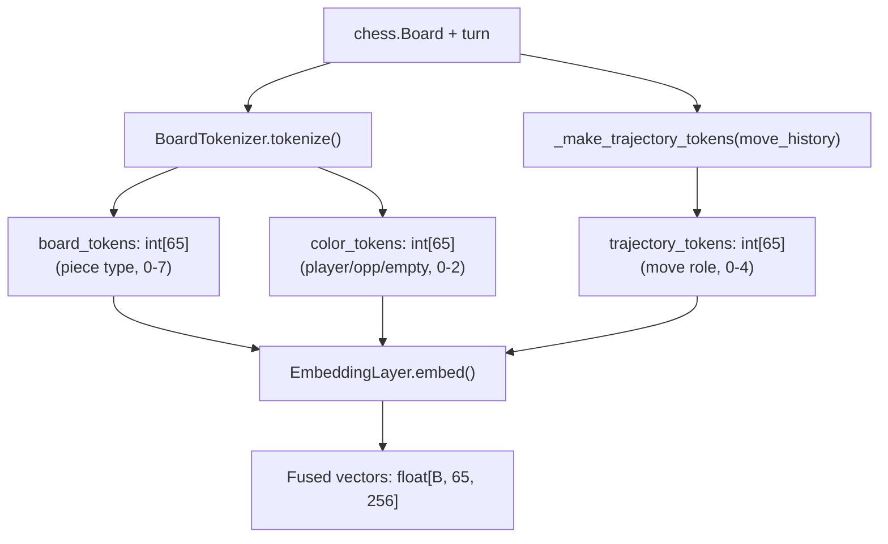
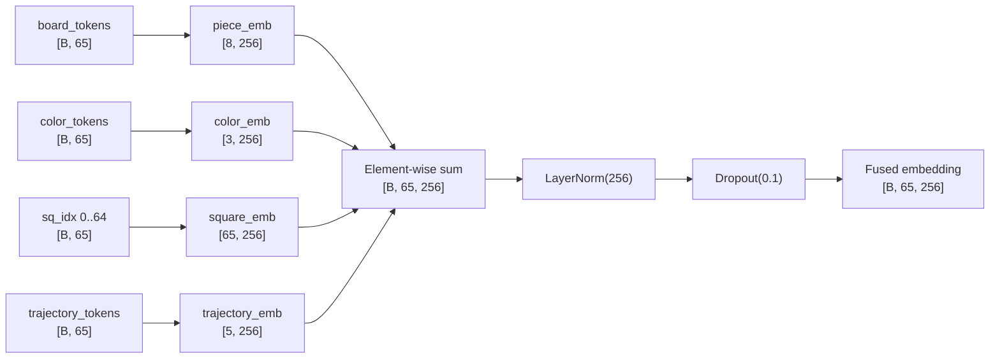
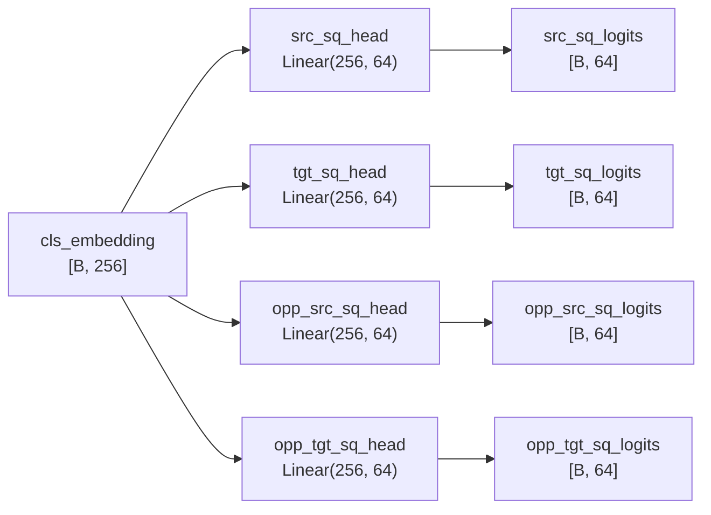
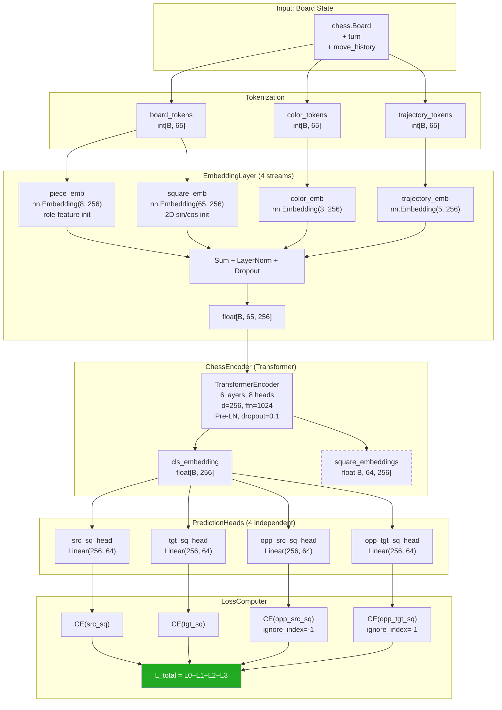

# Chess Move Prediction Encoder — Architecture and Findings

> **Document version:** 1.0 — Model checkpoint `winner_run_01.pt`
> **Last updated:** 2026-03-06

---

## 1. Abstract

Chess move prediction is a structured classification problem with a combinatorial search space
of roughly 10^120 legal game sequences. This document describes a Transformer-based encoder,
`ChessEncoder`, designed to learn dense representations of chess board positions and predict
both the current player's next move and the opponent's anticipated response. The model avoids
explicit search or hand-crafted evaluation functions, instead learning positional understanding
entirely from game trajectories recorded in Portable Game Notation (PGN) format.

The architecture tokenizes each board position as a sequence of 65 integer tokens (one CLS
aggregate token prepended to 64 square tokens) and passes them through four parallel embedding
streams before encoding with a 6-layer, 8-head Transformer. Four independent linear prediction
heads then classify the source and target squares for both the current player and the opponent,
framing the full prediction problem as four simultaneous 64-class classification tasks. This
design separates the encoding concern (understanding the board) from the prediction concern
(choosing a move), enabling each component to be tested and iterated in isolation.

The first trained checkpoint, `winner_run_01.pt`, was trained exclusively on positions from
games won by one of the two sides (draws excluded). Evaluation on a held-out game of 96 plies
shows source-square accuracy of 37.5% and target-square accuracy of 28.1%, against a random
baseline of approximately 1.56% (1/64). Mean Shannon entropy across all four heads is
approximately 2.50 nats out of a theoretical maximum of 4.158 nats (log 64), indicating the
model concentrates probability mass over roughly 12 squares on average rather than spreading
uniformly across all 64.

---

## 2. Problem Statement

A chess game is a sequence of alternating half-moves (plies). At each ply, the player to move
selects one of up to roughly 30 legal moves from a position that encodes the history of the
entire game. The branching factor of ~30 compounds across plies to produce a game tree of
astronomical size: Shannon estimated the number of possible chess games at 10^120. Even
restricting to positions reachable from opening theory leaves tens of millions of distinct
positions in a moderately sized game database.

From a model's perspective, "understanding" a chess position means correctly internalizing at
least three types of information simultaneously:

1. **Piece identity and location.** Which piece type occupies each square, and to which player
   does it belong.
2. **Tactical and strategic relationships.** How pieces interact through attack, defense,
   pinning, forking, and long-range threats — relationships that are inherently global (a rook
   on a1 threatens a piece on a8 regardless of what occupies the intervening squares).
3. **Temporal context.** What moved most recently — both for the current player and the
   opponent — constraining which responses are tactically urgent.

A model that treats each square independently (e.g., a simple feedforward network) cannot
capture relationship type 2. Convolutional architectures capture local interactions but require
many layers to propagate long-range threats. The Transformer's self-attention mechanism is the
natural fit: every square attends to every other square in a single layer, making global
relationships computationally first-class rather than emergent after many layers of
local convolution.

The task is framed as four parallel classification problems over the 64-square vocabulary:
predict the source square (which piece moves), the target square (where it moves), and both
squares of the opponent's anticipated next move. This framing avoids the need to enumerate
legal moves explicitly — the model learns the geometry of legal moves implicitly from data.

---

## 3. Input Representation

### 3.1 Tokenization

A chess board consists of 64 squares, each occupied by one of 12 possible pieces (6 types,
2 colors) or empty. The `BoardTokenizer` maps this into two parallel integer sequences of
length 65. The prepended index-0 position is a **CLS token**, borrowed from BERT, whose
embedding aggregates global board context through self-attention and is later consumed by the
prediction heads.

**Board token vocabulary (8 classes):**

| Token | Meaning |
|-------|---------|
| 0     | CLS (special aggregate token) |
| 1     | Empty square |
| 2     | Pawn |
| 3     | Knight |
| 4     | Bishop |
| 5     | Rook |
| 6     | Queen |
| 7     | King |

**Color token vocabulary (3 classes):**

| Token | Meaning |
|-------|---------|
| 0     | Empty square or CLS |
| 1     | Player (the side to move) |
| 2     | Opponent |

The square ordering follows python-chess conventions: a1 maps to token-sequence index 1, b1 to
index 2, ..., h8 to index 64. No board flipping is applied — square semantics are stable
regardless of which side is to move. Piece ownership is encoded relationally through the color
stream (`PLAYER=1` for whichever side is to move) rather than absolutely (White=1, Black=2),
so the model learns move logic that generalizes across both colors.

### 3.2 Trajectory Tokens

A third integer stream encodes the most recent half-moves by both players. Given the move
history up to but not including the current ply, the four squares involved in the last two
half-moves are marked with roles 1–4:

| Token | Meaning |
|-------|---------|
| 0     | No special role |
| 1     | Player's previous location (piece that just moved, origin) |
| 2     | Player's current location (piece that just moved, destination) |
| 3     | Opponent's previous location |
| 4     | Opponent's current location |

This gives the model access to **temporal momentum**: a piece that the opponent just moved to
square X is likely to be under tactical pressure or to be an attacking threat, information that
is not present in the static board position alone. When the opponent captures the square the
player just vacated, the opponent's mark overwrites the player's mark (tokens 3/4 take
precedence over 1/2), which is semantically correct.

### 3.3 Input Diagram



*Figure 1. Three integer token streams are produced from a board state and merged by the
embedding layer into dense 256-dimensional vectors.*

---

## 4. Embedding Layer — Deep Dive

The `EmbeddingLayer` composes four independent learned embedding tables. Their outputs are
summed element-wise, then normalized and regularized before entering the Transformer stack.

```
output = Dropout(LayerNorm(piece_emb + color_emb + square_emb + trajectory_emb))
```

All four tables map to the same dimensionality `D_MODEL = 256`, making element-wise addition
well-defined without any learned projection. The sum-then-normalize pattern is equivalent to
the approach used in BERT's segment + position + token embedding fusion.

### 4.1 Piece Embedding (`piece_emb`) — `nn.Embedding(8, 256)`

**What it encodes.** The functional role of the piece type occupying a square: empty, pawn,
knight, bishop, rook, queen, or king.

**Why it is needed.** Without piece identity, the model cannot distinguish a rook from a bishop
on the same square, and therefore cannot learn their fundamentally different movement patterns.

**Design choice — role-feature initialization.** Rather than random initialization, each of the
8 embedding vectors is seeded with a 7-dimensional hand-crafted feature vector tiled to fill
all 256 dimensions:

| Feature | Description |
|---------|-------------|
| value | Relative material value (normalized 0–1) |
| mobility | Typical number of reachable squares (normalized) |
| linearity | Moves in straight lines (0 or 1) |
| diagonality | Moves diagonally (0 or 1) |
| can_jump | Ignores blocking pieces (0 or 1) |
| royalty | Is the king (0 or 1) |
| freq_prior | Expected frequency on a random board |

The tiled vector is scaled by 0.02 to match the standard deviation of PyTorch's default
embedding initialization. This gives the optimizer a structured starting point aligned with
known chess semantics, reducing the number of gradient steps needed to establish basic
piece-type separability in the embedding space.

### 4.2 Color Embedding (`color_emb`) — `nn.Embedding(3, 256)`

**What it encodes.** Whether the piece on a given square belongs to the player to move, the
opponent, or is absent.

**Why it is needed.** Two boards with identical piece layouts but reversed colors represent
entirely different tactical situations — a player's knight on d4 is an asset; an opponent's
knight on d4 is a threat. Without the color stream, the model sees the same piece-type token
on both squares and cannot distinguish ownership. The color embedding is the primary signal
from which the model learns which pieces it controls.

**Design choice — relative encoding.** Color is encoded as PLAYER (1) / OPPONENT (2) rather
than WHITE / BLACK. This makes the representation color-invariant: the model learns "move my
pieces" rather than "move white pieces", which is critical for generalizing to both sides.

### 4.3 Square Embedding (`square_emb`) — `nn.Embedding(65, 256)`

**What it encodes.** The geometric location of a square on the board — its rank (row 1–8) and
file (column a–h).

**Why it is needed.** A pawn on e2 and a pawn on e7 have the same piece and color tokens but
represent completely different tactical situations (one is at home, one is a passed pawn one
step from promotion). Without positional encoding, the model treats both identically.

**Design choice — 2D sinusoidal initialization.** Rather than the 1D sinusoidal encoding from
the original Transformer paper, the square embedding uses a 2D scheme reflecting the board's
two-dimensional geometry. For square index `s` with `rank = (s-1) // 8` and
`file = (s-1) % 8`, dimension `d` is initialized according to the pattern `d % 4`:

```
d % 4 == 0: sin(rank / 10000^(d/256))
d % 4 == 1: cos(rank / 10000^(d/256))
d % 4 == 2: sin(file / 10000^(d/256))
d % 4 == 3: cos(file / 10000^(d/256))
```

The CLS position (index 0) is initialized to the zero vector. These weights are used as an
initialization rather than a frozen encoding — the optimizer can refine them during training —
allowing the model to learn chess-specific spatial relationships that differ from the raw
geometric sinusoid (e.g., the center squares are strategically more important than the
sinusoidal encoding implies).

### 4.4 Trajectory Embedding (`trajectory_emb`) — `nn.Embedding(5, 256)`

**What it encodes.** The recent move history: which squares were involved in the last two
half-moves (player's last move and opponent's last move), encoded as roles 0–4.

**Why it is needed.** The static board position is memoryless — it records where pieces are
now but not how they got there. Recency matters tactically: a piece that just moved is less
likely to have moved again; a piece that the opponent just moved is likely the source of
immediate threats. Without trajectory tokens, the model must infer this from attention patterns
across consecutive board states, which is impossible when positions are served as i.i.d. batch
examples.

**Design choice — role vocabulary over coordinates.** The trajectory is encoded as a role
(prev-loc / curr-loc for each side) rather than as the raw move coordinates. This lets the
model learn role-semantic embeddings: "the square from which the opponent just moved" vs "the
square to which the opponent just moved" have different tactical implications regardless of
which specific squares they are.

### 4.5 Fusion and Normalization

The four embeddings are summed before normalization, not concatenated. Concatenation would
require a projection layer (increasing parameters and introducing another learned transformation
before the Transformer sees any content). The sum preserves all 256 dimensions for each stream
while keeping the interface into the Transformer clean. `LayerNorm` then rescales the summed
vector to unit-ish magnitude, preventing any single stream from dominating by accident of
initialization scale. `Dropout(p=0.1)` is applied after normalization as a regularizer.



*Figure 2. Four embedding streams are summed, normalized, and regularized to produce the
sequence fed into the Transformer encoder.*

**Embedding summary table:**

| Stream | Table size | Init strategy | Primary signal |
|--------|-----------|---------------|----------------|
| `piece_emb` | 8 × 256 | Role-feature tiling, scale 0.02 | Piece type and movement class |
| `color_emb` | 3 × 256 | Random (default) | Piece ownership, relative to mover |
| `square_emb` | 65 × 256 | 2D sinusoidal (learnable) | Board geometry, rank/file |
| `trajectory_emb` | 5 × 256 | Random (default) | Recent move history, role-coded |

---

## 5. Encoder Architecture

### 5.1 Transformer Stack

The `ChessEncoder` wraps an `EmbeddingLayer` and a `nn.TransformerEncoder` with the following
hyperparameters:

| Hyperparameter | Value |
|---------------|-------|
| `d_model` | 256 |
| `nhead` | 8 |
| `num_layers` | 6 |
| `dim_feedforward` | 1024 |
| `dropout` | 0.1 |
| `norm_first` | True (Pre-LN) |
| `batch_first` | True |

Each attention head operates on a 32-dimensional subspace (256 / 8). The feedforward expansion
ratio is 4× (`dim_feedforward` = 4 × `d_model`), consistent with the original Transformer
paper. `norm_first=True` applies LayerNorm before the self-attention and feedforward
sublayers (Pre-LN), which improves gradient flow in deep stacks and reduces sensitivity to
learning rate.

**Total model parameter count (from `winner_run_01.pt`):**

| Component | Parameters |
|-----------|-----------|
| Embedding tables + LayerNorm | 345,600 |
| Transformer (6 layers × ~735K) | 4,412,928 |
| **Encoder total** | **4,758,528** |
| Prediction heads (4 × Linear(256, 64)) | 65,792 |
| **Grand total** | **4,824,320** |

### 5.2 Why Self-Attention for Chess

Self-attention is uniquely suited to chess for two reasons that are not true of language or
images:

1. **Global relationships are first-class.** A rook on a1 attacks every square on the a-file
   and the first rank simultaneously. In a single self-attention layer, the rook's token can
   attend to all 64 squares in parallel and accumulate information about which of its attack
   squares are occupied. Convolutional architectures require O(board-diameter / filter-width)
   layers to propagate this signal to the rook's token.

2. **Position semantics are discrete and fixed.** Unlike image pixels (which are spatially
   continuous) or words (which occupy arbitrary positions in a sequence), chess squares have a
   small, finite, and semantically meaningful position vocabulary. The 65-position sequence
   is short enough that full quadratic attention (65 × 65 = 4,225 pairs per layer) is
   computationally trivial, requiring no sparse or linear-attention approximation.

### 5.3 CLS Token Role

The CLS token at sequence position 0 serves as the global board representation. It has no
associated piece, color, or square semantics — it is initialized to the all-zeros piece
embedding (CLS type 0) with no trajectory role. Through 6 layers of bidirectional self-attention,
the CLS token accumulates attended information from all 64 square tokens. The final CLS
embedding `[B, 256]` is the sole input to the four prediction heads, making it responsible for
encoding everything the model knows about the current position relevant to move selection.

The per-square embeddings `[B, 64, 256]` are preserved in the `EncoderOutput` but not
currently consumed by the prediction heads. They are retained for future use, such as
per-square attention visualization or GUI logit highlighting.

---

## 6. Prediction Heads

The `PredictionHeads` module contains four independent `nn.Linear(256, 64)` layers organized
in an `nn.ModuleList`. Each head receives the same CLS embedding `[B, 256]` and produces
raw (pre-softmax) logits over all 64 squares `[B, 64]`.

**Head descriptions:**

| Head | Field | Predicts | Why it matters |
|------|-------|---------|----------------|
| `src_sq_head` | `src_sq_logits` | Which square the current player's piece moves FROM | Forces the encoder to locate the player's own pieces accurately |
| `tgt_sq_head` | `tgt_sq_logits` | Which square the piece moves TO | Forces learning of legal move geometry and positional preference |
| `opp_src_sq_head` | `opp_src_sq_logits` | Which square the opponent will move FROM | Forces awareness of opponent piece locations and threat sources |
| `opp_tgt_sq_head` | `opp_tgt_sq_logits` | Which square the opponent will move TO | Forces anticipation of opponent intentions — the beginning of strategic play |

**On piece identity.** No separate piece-type prediction head is needed. Given a predicted
source square and the known board state (which the model has already encoded), the piece on
that square is deterministic: `P(piece | src_sq, board) = 1`. The heads therefore implicitly
predict piece identity through the source square.

**On head independence.** The four heads share no weights. This is a deliberate design choice:
the gradient signal from predicting the opponent's target square should not directly influence
the weights that predict the player's source square. Each head maintains a separate linear
projection from the shared CLS representation, allowing the optimizer to specialize each head
for its task without cross-contamination through shared parameters.



*Figure 3. Four independent linear heads share the CLS embedding as input. No weights are
shared between heads.*

---

## 7. Loss Design and Intent

### 7.1 Cross-Entropy over 64 Squares

Each head is trained with standard cross-entropy loss against a single ground-truth square
index (0–63). Cross-entropy is used because:

- The task is a single-label 64-way classification — exactly the problem CE is designed for.
- CE computes the negative log-probability assigned to the correct class, providing a smooth
  gradient signal that pushes the model to concentrate probability mass on the correct square.
- At random initialization with uniform logits, CE loss equals log(64) ≈ 4.158 nats per head,
  giving a sanity-check baseline: a freshly initialized model's total loss should be near
  4 × 4.158 = 16.63.

### 7.2 Why Four Separate Heads

An alternative design would predict a single (src, tgt) pair — 64 × 64 = 4,096 possible moves
— in one head. This is rejected for three reasons:

1. **Sparsity.** Only ~30 of 4,096 move combinations are legal from any position. The
   loss landscape is dominated by the zero gradient from the 4,066 illegal classes, making
   optimization pathological.
2. **Factored learning.** Separating src and tgt lets the model learn piece location
   (src head) and move geometry (tgt head) as distinct skills, each with 64 clean classes and
   dense gradient signal.
3. **Opponent anticipation.** Adding opponent heads (opp_src, opp_tgt) for free — without
   any additional encoder computation — forces the model to maintain opponent-aware
   representations in the CLS embedding. This is a form of self-supervised auxiliary task that
   improves representation quality even for the primary player heads.

### 7.3 What Each Loss Term Teaches

| Loss term | Gradient teaches the encoder to... |
|-----------|-------------------------------------|
| `CE(src_sq)` | Accurately locate the player's own pieces; learn which pieces are active/mobile given the position |
| `CE(tgt_sq)` | Learn the geometry of legal moves; prefer tactically motivated destinations (captures, checks, central control) |
| `CE(opp_src_sq)` | Maintain a representation of where the opponent's active pieces are — their threats and candidate moves |
| `CE(opp_tgt_sq)` | Anticipate opponent intentions; encode positional tension and forced responses |

### 7.4 Total Loss Formula

```
L_total = CE(src_sq) + CE(tgt_sq) + CE(opp_src_sq, ignore=-1) + CE(opp_tgt_sq, ignore=-1)
```

All four terms have equal weight (1.0). The opponent heads use `ignore_index=-1` so that
terminal positions — the last move in a game has no subsequent opponent move — do not
contribute a gradient. When all examples in a batch have `opp_src_sq = -1` (e.g., a batch
of only terminal positions), the opponent CE loss returns NaN; the `LossComputer` replaces NaN
with 0.0 to prevent gradient poisoning.

No per-head loss weighting is applied in v1. The implicit assumption is that all four
prediction tasks are equally informative as training signals. This assumption is open for
future experimentation (see Section 12).

---

## 8. Training Setup

### 8.1 Data Pipeline

Training data comes from the Lichess open database in `.pgn.zst` format (Zstandard-compressed
PGN). The `stream_pgn` function decompresses and streams games one at a time, keeping memory
usage O(1) with respect to file size. The `game_to_examples` function walks every ply of each
game and emits one `TrainingExample` per position.

For each ply `i`:
- `board_tokens` and `color_tokens` are produced by `BoardTokenizer.tokenize(board, board.turn)`.
- `trajectory_tokens` are produced by `_make_trajectory_tokens(move_history)` using all moves
  played prior to ply `i`.
- `src_sq` and `tgt_sq` are the from/to squares of move `i`.
- `opp_src_sq` and `opp_tgt_sq` are the from/to squares of move `i+1` (the opponent's
  immediate response), or `-1` if `i` is the last ply.

The 90% / 10% train/validation split is performed at the example level in v1 (noted in Section
12 as a leakage risk for future correction).

### 8.2 Winner-Only Filtering

The `--winners-only` flag in `train_real.py` filters training examples to include only
positions where the winning side is to move. Draws are excluded entirely. The rationale is
**quality bias**: positions played by the losing side may include blunders, missed tactics, and
desperate moves that provide conflicting signal — the model is asked to predict a move that was
objectively poor. By training only on winner positions, the dataset is biased toward
high-quality play, providing cleaner signal per example at the cost of reduced dataset size
(approximately half the plies are discarded).

`winner_run_01.pt` was trained under this regime using the Lichess January 2013 standard rated
database.

### 8.3 Optimizer and Scheduler

| Setting | Value |
|---------|-------|
| Optimizer | `AdamW` |
| Learning rate | 3e-4 |
| Weight decay | 0.01 |
| Gradient clip | max-norm 1.0 |
| LR schedule | `CosineAnnealingLR(T_max=total_steps)` |
| Early stopping patience | 3 epochs |
| Batch size | 128 |
| Device | CUDA when available, CPU for unit tests |

The cosine schedule anneals the learning rate from 3e-4 to ~0 over the full training run,
parameterized by `total_steps = num_epochs × batches_per_epoch`. `total_steps` is computed at
runtime and passed to `Trainer.__init__` so the schedule correctly spans the entire training
duration regardless of dataset size.

Gradient clipping at max-norm 1.0 prevents gradient explosions during early training, when the
loss landscape is steep. The `@device_aware` decorator on `train_step` moves all batch tensors
to the correct device before the forward pass, decoupling device management from the training
logic itself.

### 8.4 Cross-Cutting Decorators

The `Trainer` class uses three decorator patterns for cross-cutting concerns:

| Decorator | Purpose |
|-----------|---------|
| `@log_metrics` | Prints loss and current learning rate to stdout after each `train_step` or `train_epoch` call |
| `@device_aware` | Moves all `ChessBatch` tensors to the model's device before calling the wrapped function |
| `@timed` | Records wall-clock time of the wrapped call; used on `evaluate_game` for profiling |

---

## 9. Evaluation Pipeline

### 9.1 GameEvaluator and StepResult

The `GameEvaluator` loads a checkpoint via `Trainer.load_checkpoint`, sets both `encoder` and
`heads` to `eval()` mode, then walks a game ply by ply using the same tokenization and
trajectory logic used during training. For each ply, `evaluate_step` runs a single forward
pass under `torch.no_grad()` and returns a `StepResult` namedtuple with 16 fields.

**`StepResult` fields:**

| Field | Type | Description |
|-------|------|-------------|
| `ply` | `int` | Zero-based ply index |
| `move_uci` | `str` | UCI move string (e.g. `"e2e4"`) |
| `loss_src` | `float` | CE loss for src head at this ply |
| `loss_tgt` | `float` | CE loss for tgt head |
| `loss_opp_src` | `float` | CE loss for opp_src head (0.0 if terminal) |
| `loss_opp_tgt` | `float` | CE loss for opp_tgt head (0.0 if terminal) |
| `total_loss` | `float` | Sum of the four losses |
| `acc_src` | `int` | 1 if top-1 prediction matches src, 0 otherwise |
| `acc_tgt` | `int` | 1 if top-1 prediction matches tgt, 0 otherwise |
| `acc_opp_src` | `int` | 1/0 or -1 if terminal (no label) |
| `acc_opp_tgt` | `int` | 1/0 or -1 if terminal (no label) |
| `entropy_src` | `float` | Shannon entropy of src logits (nats) |
| `entropy_tgt` | `float` | Shannon entropy of tgt logits (nats) |
| `entropy_opp_src` | `float` | Shannon entropy of opp_src logits (nats) |
| `entropy_opp_tgt` | `float` | Shannon entropy of opp_tgt logits (nats) |
| `mean_entropy` | `float` | Mean of the four entropy values |

### 9.2 Shannon Entropy as a Confidence Metric

Shannon entropy of the softmax distribution over 64 squares is computed as:

```
H = -sum_i( p_i * log(p_i + 1e-9) )   where p = softmax(logits)
```

The maximum possible entropy occurs when the model is perfectly uncertain — when all 64 squares
receive equal probability 1/64:

```
H_max = log(64) ≈ 4.158 nats
```

The minimum entropy (H = 0) occurs when the model assigns all probability to a single square.

Entropy complements accuracy by revealing *how confident* the model is, independent of whether
that confidence is correct. A model with low entropy and low accuracy is confidently wrong — a
different failure mode from a model with high entropy and low accuracy (uncertain, guessing).
Tracking entropy across plies also reveals which positions the model finds most ambiguous,
which can guide data collection (gather more games of the position types with high entropy) or
curriculum design.

The **effective number of squares** under consideration is approximately `exp(H)`. At mean
entropy of 2.50 nats, the model is distributing probability across roughly `exp(2.50) ≈ 12`
squares, compared to `exp(4.158) = 64` squares for a uniform distribution.

---

## 10. Current Findings — Model v1 (`winner_run_01`)

### 10.1 Checkpoint Provenance

`winner_run_01.pt` contains two state dicts: `encoder` and `heads`. Inspection of the
checkpoint reveals that the encoder's embedding table contains keys for `piece_emb`,
`color_emb`, and `square_emb` but **not** `trajectory_emb`. This indicates the checkpoint was
produced before the trajectory embedding stream was added to the architecture. When loading
with `strict=False`, PyTorch skips the missing `trajectory_emb` key and zero-initializes that
embedding table, meaning the trajectory stream contributes no learned information in this
checkpoint and effectively degrades to a zero vector at all positions — functionally equivalent
to the three-stream design.

This is a known state (the `--resume` flag in `train_real.py` uses `strict=False` precisely to
allow forward-compatibility with this checkpoint) and should be corrected in the next training
run by retraining from scratch with all four streams active.

### 10.2 Evaluation Conditions

Evaluation was performed on game index 0 from the Lichess January 2013 PGN, a standard rated
game with 96 total plies. All 96 positions were evaluated (no `--winners-only` filter at
inference time). The device was CPU.

### 10.3 Accuracy Results

| Head | Top-1 Accuracy | Random Baseline |
|------|---------------|-----------------|
| `acc_src` | **37.5%** | 1.56% (1/64) |
| `acc_tgt` | **28.1%** | 1.56% |
| `acc_opp_src` | (not reported) | 1.56% |
| `acc_opp_tgt` | (not reported) | 1.56% |

Both player heads substantially outperform the random baseline, confirming the model has
learned non-trivial structure about chess positions. The gap between `acc_src` (37.5%) and
`acc_tgt` (28.1%) is expected: locating a piece that moved (src) is easier than predicting
the exact destination (tgt), because the destination depends on both move legality and
positional strategy.

The absolute accuracy numbers should be interpreted with caution. The evaluation game is from
the same distribution as training data (Lichess 2013 standard rated), so these numbers reflect
in-distribution fitting rather than generalization. An evaluation on games held out from the
training corpus is required before drawing conclusions about generalization.

### 10.4 Entropy Analysis

**Mean Shannon entropy: ≈ 2.50 nats** (out of 4.158 maximum).

The model is not uniform: 2.50 nats corresponds to `exp(2.50) ≈ 12` effective squares, versus
64 for a random model. The model consistently concentrates probability on a subset of the board.

**Top-5 highest-entropy plies** (most ambiguous positions, by mean entropy across four heads):

| Ply | Move | Interpretation |
|-----|------|----------------|
| f6g5 | Knight or pawn slide | Pawn or piece advance; multiple active pieces in the area |
| c6d5 | Central piece move | Mid-game central tension; many candidate continuations |
| d3c4 | Diagonal move | Bishop or pawn diagonal; multiple viable plans |
| e1e5 | Rook activation | Rook lift to open file; tactical complexity |
| g2h3 | Kingside pawn/bishop | Defensive or prophylactic move; less forced position |

High-entropy plies tend to correspond to positions with genuine strategic ambiguity — multiple
reasonable moves exist and the game outcome does not yet constrain which is correct. This is
qualitatively consistent with what a chess-aware observer would expect from these move
descriptions. Low-entropy plies (not listed) likely correspond to forced or near-forced
sequences such as captures, checks, and recaptures.

### 10.5 What the Numbers Mean

The model is operating well above chance. On a 64-class problem, a model that learned nothing
would achieve approximately 1.56% top-1 accuracy. The observed 37.5% on src and 28.1% on tgt
represent a 24× and 18× lift over random, respectively. This is achieved without any explicit
move legality filter, search, or game-tree evaluation — the model is learning positional
structure purely from gradient descent on PGN move sequences.

The entropy of 2.50 nats tells us the model is not yet committing to a single square in most
positions. This is appropriate behavior for a model at this stage of training: chess positions
frequently have multiple reasonable moves, and a model trained on a diverse game corpus should
maintain some uncertainty. However, the gap between 2.50 and 0.0 (perfect certainty) also
quantifies how much room remains for the model to sharpen its predictions through additional
training data and compute.

---

## 11. Full System Architecture Diagram



*Figure 4. End-to-end data flow from a raw board state to the total training loss. The
dashed `square_embeddings` node is produced but not yet consumed by current heads.*

---

## 12. Open Questions and Future Work

1. **Train/validation split at game level.** The current split is performed at the example
   level, meaning consecutive positions from the same game may appear in both splits. This is
   a data leakage risk that overstates validation accuracy. The split should be performed at
   the game level before flattening to examples.

2. **Trajectory embedding retraining.** `winner_run_01.pt` was trained before the trajectory
   stream was added. The next checkpoint should be trained from scratch with all four embedding
   streams active and their contributions evaluated by comparing src/tgt accuracy with and
   without trajectory tokens at inference time.

3. **Opponent head impact on player head accuracy.** Do the opp_src and opp_tgt heads improve
   src and tgt accuracy as auxiliary tasks, or do they compete for CLS embedding capacity? An
   ablation that removes opponent heads from the loss (setting their weights to 0) would
   quantify this.

4. **Per-head loss weighting.** All four loss terms are currently weighted equally at 1.0.
   Weighting the player heads more heavily (e.g., 2.0 each) might improve move prediction
   accuracy at the cost of opponent anticipation quality. This should be explored once
   per-head accuracy is tracked separately.

5. **Scale of training corpus.** The Lichess January 2013 database is a small subset of the
   full Lichess history (which contains hundreds of millions of games). Accuracy gains from
   training on more data should be measured empirically before investing in architectural
   changes.

6. **Logit caching for GUI visualization.** The per-square logits (`src_sq_logits`,
   `tgt_sq_logits`) are currently discarded after accuracy computation. Caching them per ply
   would enable a GUI overlay that highlights the model's predicted source and target squares,
   providing a qualitative debugging interface and user-facing feature.

7. **ELO-conditioned training.** The Lichess PGN includes player ELO ratings. Conditioning
   training on ELO (e.g., by appending an ELO embedding to the CLS token) could produce a
   model that adapts its play style to a requested skill level — useful for training tools.

8. **Evaluation generalization gap.** All current evaluation is in-distribution (same source
   database as training). Evaluation on independently sourced games (e.g., FICS games, GM
   tournament PGNs) is needed to establish whether the model generalizes beyond Lichess 2013
   style play.

9. **Winner-only filtering trade-off.** The `--winners-only` regime discards roughly half the
   data in exchange for higher-quality signal per example. Whether this trade-off is net
   positive should be tested by training two identical runs — one with and one without the
   filter — and comparing validation accuracy and loss curves at equal wall-clock time.
