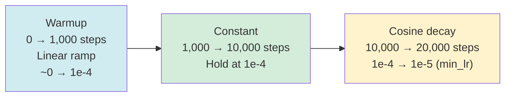

# Offline RL Training Loop — Architecture & Data Flow

---

## 1. Overview

The offline RL trainer teaches a chess model to play well without expensive
self-play rollouts. Instead of generating new games, it replays archived
master-level PGN games and applies behavioral cloning (RSBC) and value head
(MSE) updates against the moves actually played, weighted by the known game
outcome. The key architectural decision is to train on only one color per run
(`train_color = white` or `black`). Because each game contains interleaved
plies from two opponents, filtering to one side gives the model a coherent,
consistent perspective — every example the model sees came from the same
"player" — while also halving the number of forward passes per game.

Each epoch, the game list is optionally **outcome-balanced** (`balance_outcomes
= true`): win games and loss games are subsampled to equal counts before
training, ensuring the gradient receives symmetric positive and negative signal.

---

## 2. System Architecture

```mermaid
flowchart TD
    subgraph Phase0["Phase 0 — One-time preprocessing (preprocess_rl.py)"]
        A["PGN file (.pgn / .pgn.zst)"]
        B["RLPGNReader.stream()\nchess.pgn.Game objects"]
        C["RLPlyParser.parse_game()\nlist[RLPlyRecord] — plain Python lists"]
        D["RLHdf5Writer.write_batch()\ntrain/ or val/ group"]
        E["RLHdf5Validator.validate()\nschema + value-range checks"]
        F[("data/processed/chess_rl.h5\n11 datasets per split")]
        A --> B --> C --> D --> E --> F
    end

    subgraph Phase1["Phase 1 — Training (train_rl.py)"]
        G["_stream_pgn(pgn_path)\nlist[chess.pgn.Game]"]
        H["balance_outcomes\nsplit by result → subsample majority → interleave"]
        I["PGNReplayer.replay(game)\nlist[OfflinePlyTuple]"]
        J["PGNRLRewardComputer.compute()\nFloatTensor[T] — composite reward"]
        K["PGNRLTrainer.train_game()\nper-ply forward pass loop"]
        L["_encode_and_decode(bt, ct, tt, prefix)\nencoder.encode() → memory → decoder.decode()\nreturns last_logits [1, vocab], cls [1, d_model]"]
        M["ActionConditionedValueHead(cls.detach(), action_emb.detach())\nq_t [1,1] — Q-value, grad isolated from encoder"]
        N["Loss computation\nλ_rsbc × rsbc_loss + λ_v × value_loss"]
        O["Backward + clip_grad_norm_\nAdamW.step() / SequentialLR.step()"]
        P["train_epoch() aggregates\ntotal_loss, rsbc_loss, value_loss,\nmean_reward, mean_advantage"]
        Q["evaluate()\nval_loss, val_accuracy — no_grad"]
        R["tracker.track_epoch()\nAim experiment logging"]
        S["save_checkpoint()\ncheckpoints/chess_rl.pt"]
        G --> H --> I --> J --> K
        K --> L --> M --> N --> O --> K
        O --> P --> Q --> R --> S
    end

    style E fill:#d4edda
    style N fill:#fff3cd
    style Q fill:#d1ecf1
    style F fill:#cfe2ff
```



_Figure 1. Full pipeline. Phase 0 (one-time HDF5 preprocessing) exists but
`train_rl.py` currently reads directly from PGN via `_stream_pgn()`. The
inner `train_game` loop (K → L → M → N → O → K) runs once per ply. Phase 0
can be used to pre-bake tensors for faster repeated training; see Section 3._

---

## Phase 0: Preprocessing Pipeline

Phase 0 is an optional one-time operation that converts the raw PGN source
into a split, compressed HDF5 file. Once the HDF5 file exists and its schema
is validated, Phase 0 need not be re-run unless the input data or
`train_color` changes. The current `train_rl.py` script bypasses Phase 0 and
reads PGN directly — Phase 0 is intended for high-throughput multi-epoch runs
where re-parsing PGN every epoch is a bottleneck.

### Invocation

```
python -m scripts.preprocess_rl --config configs/preprocess_rl.yaml
```

CLI overrides are available for `--pgn`, `--output`, and `--max-games`.

### Phase 0 components

| Component | Responsibility |
|---|---|
| `RLPGNReader` | Streams `chess.pgn.Game` from `.pgn` or `.pgn.zst`; transparent decompression via `zstandard` |
| `RLPlyParser` | Tokenizes one game into `list[RLPlyRecord]`; applies `train_color`, `min_moves`, `max_moves` filters |
| `RLHdf5Writer` | Buffers records in memory; flushes to chunked, gzip-compressed HDF5 datasets when buffer hits `chunk_size` |
| `RLHdf5Validator` | Post-write integrity check: schema presence, shape consistency, value ranges, root attribute match |
| `RLHdf5Preprocessor` | Orchestrator: composes the four components; supports serial and multiprocessing execution paths |

### HDF5 file schema

Output path: `data/processed/chess_rl.h5` (configurable via `output.hdf5_path`).

**Root attributes**

| Attribute | Value |
|---|---|
| `version` | `"rl_1.0"` |
| `train_color` | `"white"` or `"black"` |
| `max_prefix_len` | Integer — padded width of `move_prefix` (default 512) |
| `created_at` | ISO-8601 UTC timestamp |

**Datasets — identical schema in both `train/` and `val/` groups**

| Dataset | dtype | Shape | Notes |
|---|---|---|---|
| `board_tokens` | `uint8` | `(N, 65)` | CLS at index 0, piece-type values 0–7 for indices 1–64 |
| `color_tokens` | `uint8` | `(N, 65)` | 0=empty, 1=player, 2=opponent relative to side-to-move |
| `traj_tokens` | `uint8` | `(N, 65)` | Trajectory roles 0–4 for the previous two half-moves |
| `move_prefix` | `uint16` | `(N, max_prefix_len)` | Zero-padded; valid slice is `[:prefix_lengths[i]]` |
| `prefix_lengths` | `uint16` | `(N,)` | Actual prefix length per ply |
| `move_uci` | `S5` | `(N,)` | 5-byte null-padded ASCII UCI string |
| `is_winner_ply` | `uint8` | `(N,)` | 0 or 1 |
| `is_white_ply` | `uint8` | `(N,)` | 0 or 1 |
| `is_draw_ply` | `uint8` | `(N,)` | 0 or 1 |
| `game_id` | `uint32` | `(N,)` | Source game index (0-based) |
| `ply_index` | `uint32` | `(N,)` | 0-based ply index within the original game |

---

## 3. Data Pipeline (Phase 1)

### 3.1 PGN streaming — current training path

`_stream_pgn(pgn_path, max_games)` reads all games from a `.pgn` or `.pgn.zst`
file into a `list[chess.pgn.Game]` at the start of each epoch. Transparent
zstandard decompression is handled inline. After loading, the game list is
optionally outcome-balanced (Section 3.2) before iteration.

For each game, `PGNReplayer.replay(game)` tokenizes the board positions inline
and returns a `list[OfflinePlyTuple]` — one per ply. This re-tokenizes every
epoch, which is the primary motivation for the Phase 0 HDF5 path.

### 3.2 Outcome balancing (`balance_outcomes`)

When `balance_outcomes = true` (default), `train_epoch` splits the loaded
games into three buckets by result — win, loss, and draw for the trained side
— before training begins:

```
win_games, loss_games, draw_games = _split_games_by_outcome(games, train_white)
n = min(len(win_games), len(loss_games))
balanced = interleave(sample(win_games, n), sample(loss_games, n)) + draws
```

The majority class is subsampled to match the minority. Win and loss games are
interleaved so the optimizer receives alternating positive/negative reward
signal throughout the epoch. If only one outcome class is present (e.g.,
single-game test runs), balancing is skipped with a warning.

The balance stats are logged at the start of each epoch:

```
Outcome balance: 446 win + 446 loss + 25 draw = 917 games (dropped 0 from majority)
```

### 3.3 `OfflinePlyTuple` fields

```
OfflinePlyTuple (NamedTuple)
├── board_tokens   : Tensor[65]  long  — piece-type encoding, CLS + 64 squares
├── color_tokens   : Tensor[65]  long  — color relative to side-to-move
├── traj_tokens    : Tensor[65]  long  — trajectory roles 0-4 for last 2 half-moves
├── move_prefix    : Tensor[S]   long  — SOS + prior move vocab indices (no EOS)
│                                        S varies per ply
├── move_uci       : str                — ground-truth move to predict
├── is_winner_ply  : bool               — True => positive outcome reward
├── is_white_ply   : bool               — True when white is side-to-move
├── is_draw_ply    : bool               — True for all plies in a drawn game
└── material_delta : float              — signed material balance change at this ply
                                          (own − opp) change since last same-color ply
```

`material_delta` is computed by `PGNReplayer` from piece values
(P=1, N=3, B=3, R=5, Q=9) and is positive when the player gained material,
negative when they lost material since their previous move.

---

## 4. Reward Signal

### 4.1 Formula

```
R(t) = lambda_outcome × sign_outcome(t) + lambda_material × material_delta(t)
```

- `sign_outcome(t)` — determined by the ply's outcome flags (see below)
- `material_delta(t)` — signed material balance change at this ply (from `OfflinePlyTuple`)
- `lambda_outcome` — weight on the outcome signal (default `1.0`)
- `lambda_material` — weight on the material signal (default `0.1`)

There is no temporal discounting. Every ply in a game receives the same
outcome signal, regardless of its position in the game.

### 4.2 Three-way outcome assignment

| Condition | `sign_outcome` | Default value |
|---|---|---|
| `is_draw_ply` | `draw_reward_norm` | +0.5 |
| `is_winner_ply` (decisive game) | +1.0 | +1.0 |
| neither (loser's ply) | −1.0 | −1.0 |

Draw detection takes priority: `is_draw_ply` is checked before `is_winner_ply`
in `PGNRLRewardComputer.compute()`. Draw games can be excluded entirely via
`skip_draws = true`.

### 4.3 Composite reward rationale

The outcome signal (`lambda_outcome × sign_outcome`) provides a game-level
binary signal: the model is rewarded uniformly for every ply in a winning
game and penalized uniformly for every ply in a losing game. This is simple
and unambiguous but assigns equal credit to all moves in a game regardless
of their individual quality.

The material delta term (`lambda_material × material_delta`) adds a ply-level
shaping signal: moves that gain material receive a bonus; moves that lose
material receive a penalty. This helps the optimizer distinguish tactically
strong moves (captures, winning exchanges) within a game, partially
compensating for the flat outcome signal.

`lambda_material` is kept small (0.1) relative to `lambda_outcome` (1.0) so
the outcome signal dominates and material gain does not override the game
result signal.

---

## 5. Training Loop (`train_game`)

### 5.1 Color filtering

Before any forward pass, `train_game` filters the ply list to the configured
`train_color`:

```
train_white = (cfg.rl.train_color == "white")
plies = [p for p in plies if p.is_white_ply == train_white]
```

This halves forward passes per game and gives the model a consistent
single-perspective policy.

### 5.2 Per-ply forward pass

For each ply, the trainer calls `_encode_and_decode(bt, ct, tt, prefix)`:

```
enc_out     = model.encoder.encode(bt, ct, tt)
cls         = enc_out.cls_embedding          # [1, d_model]
memory      = cat([cls.unsqueeze(1),
                   enc_out.square_embeddings], dim=1)  # [1, 65, d_model]
dec_out     = model.decoder.decode(prefix, memory, None)
last_logits = dec_out.logits[0, -1]          # [vocab] — next-move distribution
returns     (last_logits, cls, move_idx)
```

`last_logits` is the model's predicted distribution over the 1971-token move
vocabulary. `cls` is the encoder's global board representation. `move_idx`
is the vocabulary index of the teacher move, or `None` if OOV (ply skipped).

### 5.3 Per-step logging

Every 100 ply steps, `_log_board_snapshot` emits a rich log line:

```
Board @ ply_step=7100 game=235 side=winner reward=1.05
  move=e2e4(e4) pred=e2e4(e4)[HIT] top1=34.2%
```

This surfaces: which outcome side is being trained (`winner`/`loser`), the
composite reward at this ply, the teacher move, the model's top-1 prediction,
whether it matched (`[HIT]`/`[MISS]`), and the top-1 softmax probability.
The same text is logged to the Aim tracker as a board unicode block.

### 5.4 Q-value prediction

Immediately after `_encode_and_decode`, the action-conditioned value head
predicts the Q-value for the taken action:

```
action_emb = model.move_token_emb([move_idx]).detach()  # [1, d_model]
q_t = model.value_head(cls.detach(), action_emb)        # [1, 1]
```

Both `cls` and `action_emb` are detached before reaching the value head. This
ensures the MSE value loss does not reshape encoder or token embedding
representations — those are trained only by the RSBC loss.

### 5.5 RSBC loss (reward-signed behavioral cloning)

After the ply loop, the RSBC loss is computed over all valid plies:

```
r_hat = rewards / (max(|rewards|) + ε)      # normalize to [-1, 1]
rsbc_loss = -sum( r_hat[t] × log_p(move_t) for all valid plies )
```

`r_hat > 0` (winner plies): the CE term is weighted positively → maximizes
log-prob of those moves (imitation). `r_hat < 0` (loser plies): the CE term
is weighted negatively → minimizes log-prob of those moves (suppression).
`_compute_rsbc_loss` handles the normalization and sign-weighted CE internally.

Setting `lambda_rsbc = 0.0` disables this loss entirely, leaving only the
value head MSE as the training signal.

### 5.6 Value loss

```
value_loss = MSE(q_preds_t, valid_rewards)
           = mean( (Q(t) − R(t))^2  for all valid plies )
```

`q_preds_t` carries its gradient graph intact. The MSE loss trains
`ActionConditionedValueHead` to predict the composite reward at each
board-action pair. The Q-head gradient does not reach the encoder because
it received a detached CLS (Section 5.4).

The advantage `A(t) = R(t) − Q(t)` is computed for diagnostic logging only
(whitened, logged as `mean_advantage` / `std_advantage`). It is **not** used
in the loss — there is no policy gradient advantage weighting in the current
implementation.

### 5.7 Total loss and backward

```
total_loss = lambda_rsbc × rsbc_loss + lambda_value × value_loss
```

| Config default | Value | Effect |
|---|---|---|
| `lambda_rsbc = 0.0` | RSBC off | Only value head trains |
| `lambda_rsbc = 1.0` | RSBC on | Policy cloning + value head |
| `lambda_value = 1.0` | Value on | Q-head always trains |
| `lambda_value = 0.0` | Value off | Pure RSBC only |

```
optimizer.zero_grad()
total_loss.backward()
clip_grad_norm_(model.parameters(), cfg.rl.gradient_clip)   # default 1.0
optimizer.step()
scheduler.step()
global_step += 1
```

---

## 6. LR Schedule

### 6.1 Three phases

The scheduler is a `SequentialLR` composed of three sub-schedulers:

| Phase | Scheduler | Duration | Behavior |
|---|---|---|---|
| Warmup | `LinearLR` | `warmup_fraction × total_steps` | LR ramps from near-zero to `learning_rate` |
| Constant | `ConstantLR` | `(decay_start_fraction − warmup_fraction) × total_steps` | LR holds at `learning_rate` |
| Cosine decay | `CosineAnnealingLR` | remaining steps | LR decays cosine from `learning_rate` to `min_lr` |

With the defaults from `configs/train_rl.yaml` (1k games, 20 epochs):

- `total_steps = 20 × 1000 = 20,000`
- `warmup_steps = 0.05 × 20,000 = 1,000`
- `decay_start = 0.5 × 20,000 = 10,000`
- `constant_steps = 10,000 − 1,000 = 9,000`
- `cosine_steps = 20,000 − 10,000 = 10,000`

The value head optimizer uses `learning_rate × value_lr_multiplier` as its
peak LR to allow the Q-head to adapt faster than the policy backbone.

### 6.2 Schedule shape



_Figure 2. LR schedule for a 20-epoch, 1,000-game run._

---

## 7. Evaluation Pass

After every epoch's `train_epoch()` call, `scripts/train_rl.py` calls
`trainer.evaluate(pgn_path, max_games)`. This pass:

1. Sets `model.eval()` and wraps in `torch.no_grad()`.
2. Replays the same games with the same `train_color` filter (no balancing).
3. For each ply, runs a full forward pass and takes `logits[0, -1]`.
4. Computes unsmoothed cross-entropy loss and top-1 accuracy against the
   ground-truth move index.

```
val_loss     = mean( CE(logits_t, move_idx_t) for all valid plies )
val_accuracy = correct_top1 / total_valid_plies
```

The evaluation runs on the **same games used for training** (no held-out set).
Its purpose is to measure whether updates are improving next-move prediction
quality. `val_n_games` is returned as a separate key to avoid collision with
training's `n_plies`.

---

## 8. Configuration Reference

All fields live in `chess_sim/config.py::RLConfig`.

| Field | Type | Default | Description |
|---|---|---|---|
| `learning_rate` | `float` | `1e-4` | Peak LR for AdamW |
| `weight_decay` | `float` | `0.01` | AdamW weight decay |
| `warmup_fraction` | `float` | `0.05` | Fraction of `total_steps` for linear warmup |
| `decay_start_fraction` | `float` | `0.50` | Fraction of `total_steps` before cosine begins |
| `min_lr` | `float` | `1e-5` | Cosine decay floor |
| `gradient_clip` | `float` | `1.0` | Max gradient norm |
| `epochs` | `int` | `20` | Full passes over the game set |
| `checkpoint` | `str` | `""` | Path to write `.pt` checkpoint each epoch |
| `resume` | `str` | `""` | Path to `.pt` checkpoint to warm-start from |
| `skip_draws` | `bool` | `False` | If `true`, drawn games are excluded entirely |
| `lambda_outcome` | `float` | `1.0` | Weight on outcome sign in reward formula |
| `lambda_material` | `float` | `0.1` | Weight on material delta in reward formula |
| `draw_reward_norm` | `float` | `0.5` | `sign_outcome` value for drawn game plies |
| `lambda_rsbc` | `float` | `1.0` | Weight on RSBC behavioral cloning loss; `0.0` disables |
| `lambda_value` | `float` | `1.0` | Weight on value head MSE loss; `0.0` disables critic |
| `rsbc_normalize_per_game` | `bool` | `True` | Normalize rewards per-game before RSBC weighting |
| `label_smoothing` | `float` | `0.0` | Label smoothing for CE inside RSBC loss |
| `train_color` | `str` | `"white"` | Which side to train (`"white"` or `"black"`) |
| `value_lr_multiplier` | `float` | `5.0` | Value head LR = `learning_rate × value_lr_multiplier` |
| `balance_outcomes` | `bool` | `True` | Subsample majority outcome class to match minority each epoch |
| `lambda_ce` | `float` | `0.0` | Deprecated — superseded by `lambda_rsbc` |
| `lambda_awbc` | `float` | `0.0` | Deprecated |
| `awbc_eps` | `float` | `1e-8` | Deprecated |

---

## 9. Key Design Decisions

### 9.1 Offline REINFORCE vs self-play

Self-play requires the model to generate legal moves at inference time, run
complete game episodes to terminal states, and assign credit under high
variance. With a 1,971-token move vocabulary and no legal-move masking during
training, self-play episodes are costly and brittle early in training when the
model is nearly random.

Offline REINFORCE sidesteps this entirely: the moves are already recorded in
PGN files, the outcomes are known, and no game simulation is needed. The
trade-off is that the model cannot discover novel strategies beyond those in
the dataset; it can only learn to reproduce or avoid master-level patterns.

### 9.2 Single-side training (`train_color`)

Training on interleaved plies from both sides would require the model to learn
two policies simultaneously from the same parameter set. Filtering to one color
eliminates that entanglement, halves compute, and produces cleaner gradients. A
model trained on white plies only can be used for black by flipping the board
— the `color_tokens` already encode relative perspective, so no additional
logic is required at inference time.

### 9.3 RSBC vs vanilla REINFORCE

Reward-signed behavioral cloning (RSBC) scales the CE loss on each ply by the
normalized reward `r_hat ∈ [-1, 1]`. Compared to vanilla REINFORCE
(log_p × advantage), RSBC is simpler to implement, avoids the need for a
baseline at training time, and produces well-conditioned gradient magnitudes
because `r_hat` is explicitly bounded. The trade-off is that RSBC is not a
proper policy gradient estimator — it is biased because it normalizes rewards
within a game rather than computing true advantages. For offline imitation
purposes this bias is acceptable.

### 9.4 Composite reward design

The reward `R(t) = lambda_outcome × sign_outcome(t) + lambda_material ×
material_delta(t)` uses two components with different roles:

**Outcome sign** (`lambda_outcome = 1.0`): uniform credit assignment — every
ply in a won game gets +1, every ply in a lost game gets -1. This is the
primary signal. It is simple, interpretable, and directly tied to the game
result.

**Material delta** (`lambda_material = 0.1`): per-ply shaping that rewards
material gain and penalizes material loss. This partially distinguishes good
moves from neutral moves within the same game, without requiring a strong
prior on what "good" means beyond material count. The small weight ensures
it does not override the game-result signal.

There is no temporal discounting. Discounting would assign less credit to
opening moves than endgame moves, which is reasonable in theory but adds a
hyperparameter (`gamma`) and makes reward magnitudes non-stationary across
game lengths. Uniform outcome assignment is simpler and more predictable.

### 9.5 Outcome balancing

In Lichess rated games, white wins slightly more often than black (~53% of
decisive games). Without balancing, every epoch would see more winner plies
than loser plies, biasing the RSBC gradient toward imitation over suppression.
`balance_outcomes = true` subsamples the majority class to exactly match the
minority, then interleaves win/loss games so the optimizer receives
alternating-sign gradient signal throughout the epoch rather than a block of
all-positive updates followed by all-negative.

### 9.6 Action-conditioned value head

The value head `ActionConditionedValueHead(cls, action_emb)` predicts the
expected composite reward for a (board, action) pair rather than for the board
state alone. This is closer to Q-learning (Q(s, a)) than pure value estimation
(V(s)). The advantage is that the critic can distinguish between different
moves from the same position — a capturing move may have a different expected
reward than a quiet move on the same board.

The CLS embedding and action embedding are both detached before reaching the
value head. This creates two isolated gradient paths: RSBC trains the encoder
and decoder; MSE trains only the value head.

### 9.7 Pre-baked HDF5 vs live PGN streaming

The current `train_rl.py` reads PGN directly (`_stream_pgn`) and tokenizes
each board position inline via `PGNReplayer` on every epoch. For a 1,000-game
run this repeats the same decompression + PGN parsing + tokenization work 20
times.

The Phase 0 HDF5 pipeline (`preprocess_rl.py`) eliminates this repetition:
tokenization happens once and the results are written to a compressed HDF5
file. Phase 1 would then read integer arrays directly from disk, bypassing
all PGN and board logic. The `game_id` + `ply_index` fields in the HDF5 schema
preserve per-game grouping so `PGNRLRewardComputer` can still compute
game-level rewards from random-access batches.

The HDF5 path is not yet wired into `train_rl.py`. The PGN path is used for
all current training runs. The Phase 0 infrastructure exists and is tested;
integration with the training loop is a future optimization.
