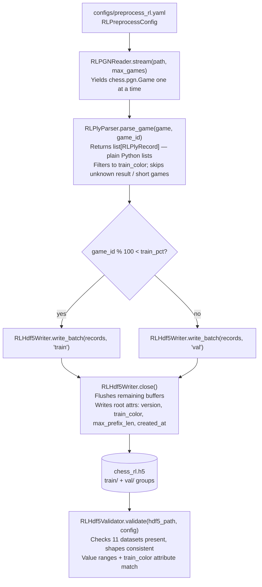
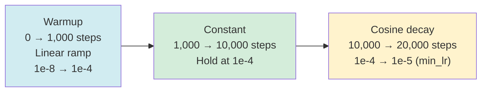

# Offline RL Training Loop — Architecture & Data Flow

---

## 1. Overview

The offline RL trainer solves the problem of teaching a chess model to play
well without requiring expensive self-play rollouts. Instead of generating new
games, it replays archived master-level PGN games and applies REINFORCE policy
gradient updates against the moves that were actually played, weighted by the
known game outcome. The key architectural decision is to train on only one
color per run (`train_color = white` or `black`). Because each game contains
interleaved plies from two opponents, filtering to one side gives the model a
coherent, consistent perspective — every example the model sees came from the
same "player" — while also halving the number of forward passes per game.

The pipeline is split into two discrete phases. **Phase 0** is a one-time
preprocessing step that converts the PGN source into a pre-baked HDF5 file.
**Phase 1** is the training loop proper, which reads from that file and never
touches PGN again.

---

## 2. System Architecture

```mermaid
flowchart TD
    subgraph Phase0["Phase 0 — One-time preprocessing (preprocess_rl.py)"]
        A["PGN file (.pgn / .pgn.zst)"]
        B["RLPGNReader.stream()\nchess.pgn.Game objects"]
        C["RLPlyParser.parse_game()\nlist[RLPlyRecord] — plain Python lists"]
        D["RLHdf5Writer.write_batch()\ntrain/ or val/ group"]
        E["RLHdf5Validator.validate()\nschema + value-range checks"]
        F[("data/processed/chess_rl.h5\n11 datasets per split")]
        A --> B --> C --> D --> E --> F
    end

    subgraph Phase1["Phase 1 — Training (train_rl.py)"]
        G["RLPlyHDF5Dataset.__getitem__()\nOfflinePlyTuple — sliced tensors"]
        H["Filter to train_color\ngame_id + ply_index grouping"]
        I["PGNRLRewardComputer.compute()\nFloatTensor[T]"]
        J["PGNRLTrainer.train_game()\nper-ply forward pass loop"]
        K["_encode_and_decode(bt, ct, tt, prefix)\nencoder.encode() → memory → decoder.decode()\nreturns last_logits [1, vocab], cls [1, d_model]"]
        K2["ReturnValueHead(cls.detach())\nv_t [1,1] — value MSE grad isolated from encoder"]
        L["Loss computation\npg_loss + λ_ce * ce_loss + λ_v * value_loss"]
        M["Backward + clip_grad_norm_\nAdamW.step() / SequentialLR.step()"]
        N["train_epoch() aggregates\ndict with total_loss, pg_loss, ce_loss,\nmean_reward, value_loss, mean_advantage"]
        O["evaluate()\nval_loss, val_accuracy — no_grad"]
        P["tracker.track_epoch()\nAim experiment logging"]
        Q["save_checkpoint()\ncheckpoints/chess_rl.pt"]
        F --> G --> H --> I --> J
        J --> K --> K2 --> L --> M --> J
        M --> N --> O --> P --> Q
    end

    style E fill:#d4edda
    style L fill:#fff3cd
    style O fill:#d1ecf1
    style F fill:#cfe2ff
```



_Figure 1. Full pipeline from PGN file through Phase 0 preprocessing, then
Phase 1 training loop. The inner `train_game` loop (J → K → K2 → L → M → J)
runs once per ply in the filtered game: `_encode_and_decode` produces logits
and a CLS embedding; `ReturnValueHead` receives the detached CLS and predicts
expected return. Phase 0 runs once; Phase 1 runs every epoch._

---

## Phase 0: Preprocessing Pipeline

Phase 0 is a one-time operation run before any training begins. It converts
the raw PGN source into a split, compressed HDF5 file that the training loop
reads via standard PyTorch `Dataset` / `DataLoader` machinery. Once the HDF5
file exists and its schema is validated, Phase 0 need not be re-run unless the
input data or `train_color` changes.

### Invocation

```
python -m scripts.preprocess_rl --config configs/preprocess_rl.yaml
```

CLI overrides are available for `--pgn`, `--output`, and `--max-games`. The
script constructs each pipeline component from config, then delegates entirely
to `RLHdf5Preprocessor.run(config)`.

### Phase 0 Mermaid detail



_Figure 2. Phase 0 data flow. Parallel execution (workers > 1) uses
`multiprocessing.Pool.imap_unordered` with `_rl_parse_worker` as the
per-game function; split assignment is determined by `game_id % 100`._

### Phase 0 components

| Component | Responsibility |
|---|---|
| `RLPGNReader` | Streams `chess.pgn.Game` from `.pgn` or `.pgn.zst`; transparent decompression via `zstandard` |
| `RLPlyParser` | Tokenizes one game into `list[RLPlyRecord]`; applies `train_color`, `min_moves`, `max_moves` filters |
| `RLHdf5Writer` | Buffers records in memory; flushes to chunked, gzip-compressed HDF5 datasets when buffer hits `chunk_size` |
| `RLHdf5Validator` | Post-write integrity check: schema presence, shape consistency, value ranges, root attribute match |
| `RLHdf5Preprocessor` | Orchestrator: composes the four components; supports serial and multiprocessing execution paths |

### HDF5 file schema

Output path: `data/processed/chess_rl.h5` (configurable via `output.hdf5_path`).

**Root attributes**

| Attribute | Value |
|---|---|
| `version` | `"rl_1.0"` |
| `train_color` | `"white"` or `"black"` |
| `max_prefix_len` | Integer — padded width of `move_prefix` (default 512) |
| `created_at` | ISO-8601 UTC timestamp |

**Datasets — identical schema in both `train/` and `val/` groups**

| Dataset | dtype | Shape | Notes |
|---|---|---|---|
| `board_tokens` | `uint8` | `(N, 65)` | CLS at index 0, piece-type values 0–7 for indices 1–64 |
| `color_tokens` | `uint8` | `(N, 65)` | 0=empty, 1=player, 2=opponent relative to side-to-move |
| `traj_tokens` | `uint8` | `(N, 65)` | Trajectory roles 0–4 for the previous two half-moves |
| `move_prefix` | `uint16` | `(N, max_prefix_len)` | Zero-padded; valid slice is `[:prefix_lengths[i]]` |
| `prefix_lengths` | `uint16` | `(N,)` | Actual prefix length per ply; use this to slice `move_prefix` |
| `move_uci` | `S5` | `(N,)` | 5-byte null-padded ASCII UCI string |
| `is_winner_ply` | `uint8` | `(N,)` | 0 or 1 |
| `is_white_ply` | `uint8` | `(N,)` | 0 or 1 |
| `is_draw_ply` | `uint8` | `(N,)` | 0 or 1 |
| `game_id` | `uint32` | `(N,)` | Source game index (0-based, assigned by reader order) |
| `ply_index` | `uint32` | `(N,)` | 0-based ply index within the original game |

`game_id` and `ply_index` together allow the training loop to reconstruct
per-game ply sequences for reward computation — see Section 3.1.

---

## 3. Data Pipeline (Phase 1)

### 3.1 `RLPlyHDF5Dataset` — indexed random access

`RLPlyHDF5Dataset(hdf5_path, split="train")` is a `torch.utils.data.Dataset`
that reads pre-baked `OfflinePlyTuple` records directly from the HDF5 file
produced in Phase 0. It replaces the former `_stream_pgn()` + `PGNReplayer`
combination entirely. No PGN parsing or board tokenization occurs during
training.

**Construction**: the dataset opens the HDF5 file handle in `__init__`, reads
`board_tokens.shape[0]` to cache the dataset length, and holds the open file
object. The file is opened read-only (`"r"` mode).

**`__getitem__(idx)`**: reads one record by index from the split group. The
key operation is prefix slicing — `move_prefix` is stored zero-padded to
`max_prefix_len`, but each ply's true prefix length is stored separately in
`prefix_lengths`. The dataset slices `move_prefix[idx, :pl]` where
`pl = prefix_lengths[idx]`, returning a variable-length tensor with no
trailing padding. `move_uci` is decoded from 5-byte ASCII and null bytes are
stripped. All integer arrays are cast to `torch.long` tensors.

**Multi-worker DataLoader**: `h5py` file handles are not safe to share across
forked processes. The module-level function `rl_hdf5_worker_init(worker_id)`
re-opens the HDF5 handle inside each DataLoader worker by calling `ds._open()`
on the worker's copy of the dataset object. Pass it as
`DataLoader(ds, num_workers=N, worker_init_fn=rl_hdf5_worker_init)`.

**Reward grouping via `game_id` and `ply_index`**: the training loop groups
sampled plies by `game_id` and sorts them by `ply_index` to reconstruct the
per-game ply sequence required by `PGNRLRewardComputer.compute()`. Because
both fields are stored in HDF5 and surfaced through `OfflinePlyTuple`, the
training loop can reconstitute game order from any random-access batch without
re-reading PGN.

### 3.2 `RLPlyParser.parse_game` — the preprocessing tokenizer

`RLPlyParser.parse_game(game, game_id)` is the component that performs board
tokenization during Phase 0, not during training. It is called once per game
by `RLHdf5Preprocessor` and produces a `list[RLPlyRecord]` — plain Python
dataclass instances holding Python lists and primitive values, with no PyTorch
tensors.

For each ply in the game's mainline:

1. The ply is skipped if `board.turn != train_color_side` — only the
   configured side's plies are recorded.
2. `BoardTokenizer.tokenize(board, board.turn)` is called **before** pushing
   the move, capturing the position the model must reason about.
3. `_make_trajectory_tokens(move_history)` encodes the previous two half-moves
   as trajectory roles 0–4.
4. `MoveTokenizer.tokenize_game(prior_ucis)[:-1]` builds the move prefix:
   SOS token + all prior move vocab indices, with EOS dropped (the decoder
   receives history-so-far as input, not a closed sequence).
5. Outcome flags (`is_winner_ply`, `is_white_ply`, `is_draw_ply`) are derived
   from the `Result` header.

Games with result `"*"` (unknown) or fewer than `min_moves` full moves return
an empty list and are excluded from the HDF5 file.

`RLPlyRecord` stores all values as Python primitives and lists, making
instances cheap to pickle and transmit across `multiprocessing.Pool` workers.
`RLHdf5Writer.flush()` converts these lists to NumPy arrays when writing to
disk.

### 3.3 `OfflinePlyTuple` fields

```
OfflinePlyTuple (NamedTuple)
├── board_tokens  : Tensor[65]  long  — piece-type encoding, CLS + 64 squares
├── color_tokens  : Tensor[65]  long  — color relative to side-to-move
├── traj_tokens   : Tensor[65]  long  — trajectory roles 0-4 for last 2 half-moves
├── move_prefix   : Tensor[S]   long  — SOS + prior move vocab indices (no EOS)
│                                       S varies per ply; padding already stripped
├── move_uci      : str                — ground-truth move to predict
├── is_winner_ply : bool               — True => positive reward
├── is_white_ply  : bool               — True when white is side-to-move
└── is_draw_ply   : bool = False       — True for all plies in a drawn game
```

The schema is identical to the pre-HDF5 era. The difference is provenance:
values were previously computed live by `PGNReplayer` on each training epoch;
they now come from HDF5 datasets written once during Phase 0. All token
tensors are CPU tensors at this stage; they are moved to the target device
inside `train_game` via `.to(self._device)`.

---

## 4. Reward Signal

### 4.1 Formula

```
R(t) = base_outcome(t) × γ^(T − 1 − t)
```

- `T` — total number of plies in the **filtered** list (one color only)
- `t` — zero-indexed position of this ply within that list
- `γ` — discount factor (`RLConfig.gamma`, default 0.99)
- `base_outcome(t)` — determined by the ply's flags (see below)

The last ply in the game (`t = T − 1`) receives `γ^0 = 1.0`, giving it the
full undiscounted outcome signal. The first ply (`t = 0`) receives
`γ^(T−1)`, the steepest discount.

### 4.2 Three-way outcome branching

| Condition | `base_outcome` | Default value |
|---|---|---|
| `is_draw_ply` | `draw_reward` | +2.0 |
| `is_winner_ply` (decisive game) | `win_reward` | +10.0 |
| neither (loser's ply) | `loss_reward` | −10.0 |

Draw detection takes priority: the `is_draw_ply` branch is checked first in
`PGNRLRewardComputer.compute()`.

### 4.3 Why temporal discounting

Temporal discounting imposes causality: moves made early in a game receive
less credit than moves near the terminal state. This is important because
opening moves are highly stochastic across players, while late-game moves are
tightly coupled to the outcome. With `γ = 0.99` and a 40-ply game (20 moves
per side), the first ply receives `0.99^39 ≈ 0.67` of the base reward — a
mild but consistent discount. The REINFORCE estimator subtracts the
`ReturnValueHead` critic baseline from these rewards (producing the advantage
`A(t) = R(t) − V(t)`); the CE auxiliary loss provides additional supervised
stabilization.

---

## 5. Training Loop (`train_game`)

### 5.1 Color filtering

Before any forward pass, `train_game` filters the ply list to the configured
`train_color`:

```
train_white = (cfg.rl.train_color == "white")
plies = [p for p in plies if p.is_white_ply == train_white]
```

This is the single most important throughput optimization. It halves the number
of forward passes per game and ensures the model learns a consistent
single-perspective policy.

### 5.2 Per-ply forward pass

For each ply, the trainer unsqueezes each token tensor to add a batch
dimension of 1, moves it to the device, then calls the private helper
`_encode_and_decode(bt, ct, tt, prefix)`:

```
enc_out     = model.encoder.encode(bt, ct, tt)
cls         = enc_out.cls_embedding          # [1, d_model]
memory      = cat([cls.unsqueeze(1),
                   enc_out.square_embeddings], dim=1)  # [1, 65, d_model]
dec_out     = model.decoder.decode(prefix, memory, None)
last_logits = dec_out.logits[0, -1]          # [vocab] — next-move distribution
returns     (last_logits, cls)
```

`last_logits` is the model's predicted distribution over the 1971-token move
vocabulary for the **next** move. The CLS embedding is returned alongside it
so the value head can operate on the same encoder state without a second
forward pass.

Immediately after `_encode_and_decode` returns, the per-ply value estimate is
computed and accumulated:

```
v_t = model.value_head(cls.detach())   # [1, 1] — detach prevents value MSE
                                       #   gradients from reshaping encoder
v_preds.append(v_t.squeeze())         # scalar tensor appended each ply
```

`v_preds` is collected across all plies and used post-loop to compute the
advantage and value loss.

### 5.3 Policy gradient loss

For each valid ply (where `MoveTokenizer.tokenize_move(move_uci)` succeeds):

```
probs      = softmax(last_logits)   # [1971]
log_p      = log(probs + 1e-10)     # [1971] — eps prevents -inf
log_prob_t = log_p[move_idx]        # scalar — log-prob of taken action
```

After the ply loop, the **advantage-based** REINFORCE loss is computed:

```
v_preds_t = stack(v_preds)                          # [N]
advantage = valid_rewards - v_preds_t.detach()      # [N] — detach prevents
                                                    #   value grad through
                                                    #   the advantage signal
pg_loss   = −sum( log_prob[t] × advantage[t]  for t in valid_plies )
```

`A(t) = R(t) − V(t)` is the **advantage**: how much better (or worse) the
taken move was relative to the critic's baseline prediction for that board
state. A positive advantage amplifies the probability of that move; a negative
advantage suppresses it. Using the advantage rather than the raw return
`R(t)` reduces gradient variance without introducing bias, provided the critic
is not too inaccurate.

The two detach boundaries are intentional and load-bearing: `cls.detach()`
(Section 5.2) prevents value MSE gradients from modifying encoder
representations; `v_preds_t.detach()` here prevents value-head gradients from
flowing backward through the advantage term into the policy loss.

### 5.4 Value loss

After the ply loop, the critic is trained to predict the actual discounted
return for each board state it evaluated:

```
value_loss = MSE(v_preds_t, valid_rewards)
           = mean( (V(t) − R(t))^2  for t in valid_plies )
```

`v_preds_t` carries its gradient graph intact (only the advantage detaches it
— see Section 5.3). The MSE loss therefore trains `ReturnValueHead` exclusively;
its gradient does not reach the encoder because the value head received a
detached CLS.

`lambda_value` (`RLConfig.lambda_value`, default `1.0`) weights this term in
the total loss. Setting `lambda_value = 0.0` disables the critic entirely and
reverts to vanilla REINFORCE with raw returns. The default `1.0` keeps the
MSE term on the same order of magnitude as the policy loss given that returns
are bounded by the win/loss reward range.

### 5.5 Cross-entropy supervised loss

CE loss is computed over **all valid plies** using every master move as a
supervised target — not restricted to winner plies.

```
ce_loss = CrossEntropy(stack(all_logits), all_move_targets,
                       label_smoothing=cfg.rl.label_smoothing)
```

Because the dataset consists entirely of master-level play, every recorded
move is worth imitating regardless of outcome. The PG loss provides the
trajectory signal (good outcomes get amplified, bad ones suppressed); the CE
loss provides a direct supervised signal that keeps the model anchored to
what strong players actually played at every position.

### 5.6 Total loss composition

```
total_loss = pg_loss + λ_ce × ce_loss + λ_v × value_loss
             (defaults: λ_ce = 0.5,  λ_v = 1.0)
```

### 5.7 Backward pass

```
optimizer.zero_grad()
total_loss.backward()
clip_grad_norm_(model.parameters(), cfg.rl.gradient_clip)   # default 1.0
optimizer.step()
scheduler.step()
global_step += 1
```

Gradient clipping to norm 1.0 guards against large policy gradient spikes
caused by games with extreme rewards (decisive wins/losses in short games).

---

## 6. LR Schedule

### 6.1 Three phases

The scheduler is a `SequentialLR` composed of three sub-schedulers:

| Phase | Scheduler | Duration | Behavior |
|---|---|---|---|
| Warmup | `LinearLR` | `warmup_fraction × total_steps` | LR ramps from `1e-4 × lr` to `lr` |
| Constant | `ConstantLR` | `(decay_start_fraction − warmup_fraction) × total_steps` | LR stays at `lr` |
| Cosine decay | `CosineAnnealingLR` | remaining steps | LR decays cosine from `lr` to `min_lr` |

With the defaults from `configs/train_rl.yaml`:

- `total_steps = epochs × max_games = 20 × 1000 = 20,000`
- `warmup_steps = 0.05 × 20,000 = 1,000`
- `decay_start = 0.5 × 20,000 = 10,000`
- `constant_steps = 10,000 − 1,000 = 9,000`
- `cosine_steps = 20,000 − 10,000 = 10,000`

### 6.2 Schedule shape



_Figure 3. LR schedule phases for a 20-epoch, 1,000-game run._

### 6.3 Config parameters

| Parameter | Default | Effect |
|---|---|---|
| `warmup_fraction` | 0.05 | Fraction of total steps spent warming up |
| `decay_start_fraction` | 0.50 | Fraction of total steps before cosine begins |
| `min_lr` | 1e-5 | Floor for cosine decay |
| `learning_rate` | 1e-4 | Peak LR (reached at end of warmup) |

The constraint `warmup_fraction < decay_start_fraction` is enforced by
`RLConfig.__post_init__`.

---

## 7. Evaluation Pass

After every epoch's `train_epoch()` call, `scripts/train_rl.py` calls
`trainer.evaluate(pgn_path, max_games)`. This pass:

1. Sets `model.eval()` and wraps in `torch.no_grad()`.
2. Replays the same games and applies the same `train_color` filter as training.
3. For each ply, runs a full forward pass and takes `logits[0, -1]`.
4. Computes unsmoothed cross-entropy loss and top-1 accuracy against the
   ground-truth move index.

```
val_loss     = mean( CE(logits_t, move_idx_t) for all valid plies )
val_accuracy = correct_top1 / total_valid_plies
```

The evaluation is run on the **same games used for training** (no held-out
set). Its purpose is to measure whether the model's policy gradient updates
are improving next-move prediction quality — a direct generalization signal.
Because the eval uses unsmoothed CE (unlike training's `label_smoothing=0.1`),
`val_loss` and `ce_loss` from training are not numerically comparable. The
`val_accuracy` metric is the primary indicator.

---

## 8. Configuration Reference

All fields live in `chess_sim/config.py::RLConfig`.

| Field | Type | Default | Description |
|---|---|---|---|
| `learning_rate` | `float` | `1e-4` | Peak LR for AdamW |
| `weight_decay` | `float` | `0.01` | AdamW weight decay (L2 regularization) |
| `warmup_fraction` | `float` | `0.05` | Fraction of `total_steps` for linear warmup |
| `decay_start_fraction` | `float` | `0.50` | Fraction of `total_steps` before cosine begins |
| `min_lr` | `float` | `1e-5` | Cosine decay floor |
| `gradient_clip` | `float` | `1.0` | Max gradient norm for `clip_grad_norm_` |
| `epochs` | `int` | `20` | Number of full passes over the game set |
| `checkpoint` | `str` | `""` | Path to write `.pt` checkpoint after each epoch |
| `resume` | `str` | `""` | Path to `.pt` checkpoint to warm-start from |
| `gamma` | `float` | `0.99` | Temporal discount factor for reward computation |
| `win_reward` | `float` | `10.0` | Base outcome for winner plies |
| `loss_reward` | `float` | `−10.0` | Base outcome for loser plies |
| `draw_reward` | `float` | `2.0` | Base outcome for drawn game plies |
| `lambda_ce` | `float` | `0.5` | Weight on cross-entropy supervised loss |
| `lambda_value` | `float` | `1.0` | Weight on value head MSE loss; `0.0` disables critic |
| `label_smoothing` | `float` | `0.1` | Label smoothing applied to CE loss |
| `train_color` | `str` | `"white"` | Which side to train (`"white"` or `"black"`) |

Preprocessing is configured separately via `RLPreprocessConfig` in
`chess_sim/config.py` and `configs/preprocess_rl.yaml`.

| Field | Section | Default | Description |
|---|---|---|---|
| `pgn_path` | `input` | — | Path to `.pgn` or `.pgn.zst` source file |
| `max_games` | `input` | `1000` | Cap on games to process (0 = all) |
| `hdf5_path` | `output` | `data/processed/chess_rl.h5` | Output file path |
| `chunk_size` | `output` | `1000` | HDF5 chunk size and auto-flush threshold |
| `compression` | `output` | `"gzip"` | HDF5 compression filter |
| `compression_opts` | `output` | `4` | Compression level (0–9) |
| `max_prefix_len` | `output` | `512` | Padded width of `move_prefix` datasets |
| `train_color` | `filter` | `"white"` | Side to keep; must match training config |
| `min_moves` | `filter` | `5` | Minimum full moves to include a game |
| `max_moves` | `filter` | `512` | Truncation limit in full moves |
| `train` | `split` | `0.95` | Fraction of games routed to `train/` group |
| `workers` | `processing` | `4` | Number of multiprocessing parse workers |

---

## 9. Key Design Decisions

### 9.1 Offline REINFORCE vs self-play

Self-play requires the model to generate legal moves at inference time, run
complete game episodes to terminal states, and assign credit under high
variance. With a 1,971-token move vocabulary and no legal-move masking during
training, self-play episodes are costly and brittle early in training when the
model is nearly random.

Offline REINFORCE sidesteps this entirely: the moves are already recorded in
PGN files, the outcomes are known, and no game simulation is needed. The
training signal is lower variance because the reward for every ply in a game
is computed in a single deterministic pass from a fixed outcome. The trade-off
is that the model cannot discover novel strategies beyond those in the dataset;
it can only learn to reproduce master-level play.

### 9.2 Single-side training (`train_color`)

Training on interleaved plies from both sides would require the model to learn
two policies simultaneously — one for white, one for black — from the same
parameter set. Because the board is always encoded from the side-to-move's
perspective (relative color tokens), the model does see every position
"as the player," but the reward signals from white and black are entangled
within each game. Filtering to one color eliminates that entanglement, halves
compute, and produces cleaner gradients. A model trained on white plies only
can still be used for black by flipping the board (the `color_tokens` already
encode relative perspective, so no additional logic is required).

### 9.3 CE on all plies, not just winners

An earlier iteration computed CE loss only on winner plies of decisive games,
treating it as a "supervised anchor" on strong moves. The current design
applies CE to every valid ply regardless of outcome. Because the entire
dataset is master-level play, even the losing side's moves are high-quality
and worth imitating. Restricting CE to winner plies discards roughly half the
supervisory signal and biases the model toward aggressive/decisive styles. The
PG loss already handles outcome weighting — winner plies receive positive
rewards and get amplified, loser plies receive negative rewards and get
suppressed. CE's job is purely supervised: keep the model's distribution
close to what strong players actually played at each position.

### 9.4 Pure temporal discount

An earlier iteration of the codebase included composite reward terms —
`lambda_material * L1_norm(material_delta)` and
`lambda_check * L1_norm(gave_check)` — to reward material gain and check
delivery at each ply. The current design uses a pure temporal discount with
no per-ply shaping terms. This simplifies the reward landscape: the only
signal is the game outcome, weighted by how close the ply is to the end of
the game. Composite rewards introduce hyperparameter sensitivity and can
produce unintended behavior (e.g., rewarding check even when it leads to
material loss). The pure discount is easier to reason about and interpret
during training.

### 9.5 Pre-baked HDF5 vs live PGN streaming

The original trainer called `_stream_pgn()` at the start of every epoch, which
decompressed the `.zst` archive, parsed all game headers and moves with
`chess.pgn.read_game()`, and then tokenized each board position inline inside
`PGNReplayer.replay()`. For a 1,000-game run this work was repeated 20 times —
once per epoch — even though the input data and tokenization logic never
change between epochs.

The HDF5 pipeline eliminates this repetition entirely. Decompression, PGN
parsing, board tokenization, and prefix construction happen once in Phase 0.
The resulting integer arrays are written to a compressed HDF5 file and never
recomputed. Phase 1 reads from this file via `RLPlyHDF5Dataset.__getitem__`,
which issues a small number of indexed HDF5 reads per sample and constructs
tensors directly from NumPy slices — a read path measured in microseconds, not
the milliseconds required for `chess.pgn.read_game()` + tokenization.

The HDF5 approach also enables standard `DataLoader` integration: random
shuffling, multi-worker prefetching, and batching all work without any custom
streaming logic. The `game_id` + `ply_index` fields stored in the file
preserve the per-game grouping needed by `PGNRLRewardComputer`, so no
information is lost relative to the streaming approach.

The trade-off is a preprocessing step that must be re-run whenever `train_color`,
`min_moves`, `max_moves`, or the source PGN changes. The config attribute
`train_color` is stored as a root-level HDF5 attribute and verified by
`RLHdf5Validator`, so mismatches between preprocessing config and training
config are caught before any training begins.

### 9.6 Advantage baseline (ReturnValueHead)

Without a baseline, plain REINFORCE assigns a positive reward to every ply in
a won game — even moves that were objectively poor but happened to be played
in a game the model's side won. This inflates gradient variance because the
signal does not distinguish between a brilliant sacrifice and a trivial pawn
push that happened to precede a win. Adding a learned critic that predicts
`V(t)` — the expected discounted return from board state `t` — reduces this
variance by centering each reward signal around what the model already
predicts: `A(t) = R(t) − V(t)`. A ply that beats the critic's prediction
receives a positive advantage; one that falls short receives a negative
advantage. The gradient update is therefore proportional to **surprise**, not
raw return magnitude.

**Why a two-layer MLP, not a linear head**: a linear projection from CLS to a
scalar can only learn affine relationships between board embedding dimensions
and expected return. Material advantage, king safety, and endgame proximity
interact non-linearly in chess positions. A single hidden layer with ReLU
introduces enough non-linearity to capture these interactions at minimal
parameter cost (`d_model × (d_model//2 + 1)` additional parameters).

**Two-detach design**: the CLS embedding is detached before it reaches the
value head (`cls.detach()`). This prevents value MSE gradients from modifying
the encoder's internal representations — the encoder is trained only by the
policy gradient and CE loss. Separately, the advantage `A(t)` is computed
from `v_preds_t.detach()`, preventing the value head's gradient from flowing
backward through the advantage term into `pg_loss`. Each loss term trains
exactly the components it is responsible for: `pg_loss + ce_loss` train
encoder and decoder; `value_loss` trains only `ReturnValueHead`.
