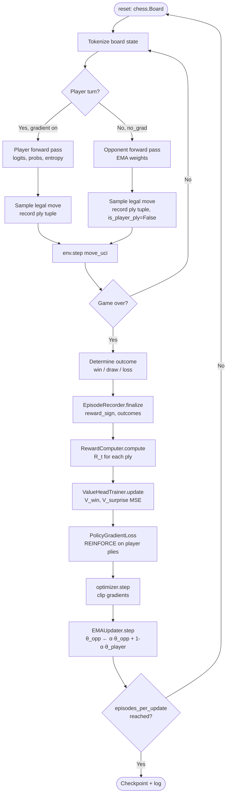
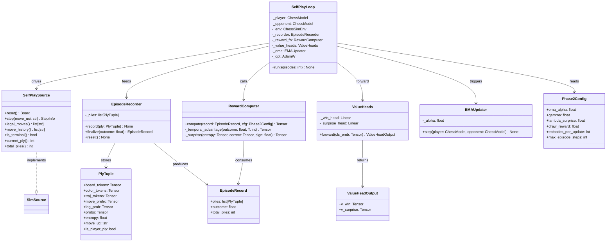

# Phase 2: Self-Play Reinforcement Learning — Design

> **Document version:** 1.1
> **Date:** 2026-03-08
> **Status:** Design — pending engineering implementation

---

## Problem Statement

Phase 1 trained `ChessModel` (d_model=128, 6-layer encoder, 4-layer decoder) on PGN supervision to predict the next move from labeled human games. The model reaches 94.9% validation accuracy on 1k games but is bounded by the quality and distribution of its training corpus — it can only imitate, not discover. Phase 2 extends training with self-play reinforcement learning (RL): the model plays both sides of the board, observes the game outcome, and updates its policy via REINFORCE. A frozen Exponential Moving Average (EMA) opponent prevents the learning agent from exploiting a rapidly shifting target, stabilizing training. A novel surprise reward supplements the sparse terminal signal, encouraging the model to take uncertain-but-correct actions and penalizing overconfident mistakes.

---

## Feasibility Analysis

| Approach | Pros | Cons | Verdict |
|----------|------|------|---------|
| **Vanilla REINFORCE with sparse outcome reward** | Minimal new code; direct outcome signal; fits existing `Phase2Trainer` stub | High variance gradients; no intra-game shaping; slow convergence on rare wins | Reject as standalone — needs reward shaping |
| **EMA opponent + surprise reward (proposed)** | Stable training target (frozen opponent); intra-game reward signal reduces variance; entropy term encourages exploration; reuses `ChessSimEnv`, `Policy`, `SimSource` | More hyperparameters (γ, λ, α); two value heads add model complexity; entropy normalization is an open question | **Accept** |
| **Population-based self-play (league training)** | Maximum opponent diversity; state-of-the-art in game AI | Requires N model copies in memory; complex worker orchestration; premature for current scale | Reject — over-engineered for Phase 2 scope |
| **Advantage Actor-Critic (A2C)** | Lower variance than REINFORCE via learned baseline; better sample efficiency | Requires separate critic network; much more complex training loop; V-function over sparse chess states is hard to bootstrap | Reject — adds complexity without proven benefit at this model scale |

### Reuse audit

The following Phase 1 components are reused without modification:

| Component | Location | Reuse |
|-----------|----------|-------|
| `ChessModel` | `chess_sim/model/chess_model.py` | Player policy; frozen copy for EMA opponent |
| `ChessSimEnv` | `chess_sim/env/chess_sim_env.py` | Episode loop driver |
| `SimSource` protocol | `chess_sim/env/__init__.py` | `SelfPlaySource` implements this |
| `BoardTokenizer` | `chess_sim/data/tokenizer.py` | Board → token conversion per ply |
| `MoveTokenizer` | `chess_sim/data/move_tokenizer.py` | Decoder input construction |
| `Phase2Config` | `chess_sim/config.py` | Existing dataclass; extended in-place |
| `SelfPlayGame` | `chess_sim/types.py` | Extended with per-ply entropy and correctness fields |
| `log_metrics` decorator | `chess_sim/training/trainer.py` | Episode logging |
| `device_aware` decorator | `chess_sim/training/trainer.py` | Tensor device routing |

---

## Chosen Approach

The design adopts an EMA-frozen opponent with a composite reward signal. The player's gradient flows only through the player's own plies — the opponent generates moves under `torch.no_grad()` using the EMA weights. After each complete episode, the EMA weights are updated (`θ_opp ← α·θ_opp + (1-α)·θ_player`), which ensures the opponent always lags the player by a controlled margin, preventing catastrophic policy collapse. The per-ply reward combines a temporally discounted outcome signal with a surprise score that multiplies Shannon entropy by a correctness indicator. This formulation requires no second forward pass — entropy and correctness are computed from the same logit tensor already produced during action sampling. Two lightweight value heads trained on the shared CLS embedding provide a learned baseline, reducing REINFORCE variance without requiring a separate critic network. All new hyperparameters are exposed through an extended `Phase2Config` so existing YAML infrastructure handles configuration with no new loading code.

---

## Architecture

### Episode Loop



*Figure 1. One training iteration: episode rollout → reward computation → policy update → EMA sync.*

---

### Training Update Flow

```mermaid
sequenceDiagram
    participant Loop as SelfPlayLoop
    participant Player as ChessModel (player)
    participant Opp as ChessModel (EMA opponent)
    participant Rec as EpisodeRecorder
    participant Rew as RewardComputer
    participant VH as ValueHeads
    participant Opt as AdamW optimizer
    participant EMA as EMAUpdater

    Loop->>Player: forward(board_tokens, move_prefix) → logits
    Player-->>Rec: record(ply_tuple: state, probs, entropy, move)
    Loop->>Opp: forward(board_tokens, move_prefix) [no_grad]
    Opp-->>Loop: sampled UCI move

    Note over Loop: game ends
    Loop->>Rec: finalize(outcome)
    Rec-->>Rew: episode: list[PlyTuple], outcome
    Rew-->>Loop: rewards: Tensor [T_player]

    Loop->>VH: forward(cls_embeddings) → V_win, V_surprise
    VH-->>Opt: MSE(V_win, temporal_advantage) + MSE(V_surprise, surprise_t)

    Loop->>Player: REINFORCE loss = -sum(advantages * log_probs)
    Player-->>Opt: backward()
    Opt-->>Player: step()
    Opt-->>EMA: notify step complete
    EMA-->>Opp: θ_opp ← α·θ_opp + (1-α)·θ_player
```

*Figure 2. Per-episode message flow between all Phase 2 components.*

---

### Component Relationships



*Figure 3. Static component structure. `SelfPlaySource` satisfies the existing `SimSource` protocol.*

---

## Component Breakdown

### `chess_sim/env/self_play_source.py` — `SelfPlaySource`

- **Responsibility:** Implements the existing `SimSource` protocol for a live self-play game. Holds a mutable `chess.Board` and applies moves from either the player or the opponent depending on whose turn it is.
- **Key interface:**
  ```
  class SelfPlaySource:
      def reset() -> chess.Board
      def step(move_uci: str) -> StepInfo
      def legal_moves() -> list[str]
      def move_history() -> list[str]
      def is_terminal() -> bool
      def current_ply() -> int
      def total_plies() -> int
  ```
- **Protocol:** Implements `SimSource` (from `chess_sim/env/__init__.py`) — structurally compatible with no inheritance required.
- **Testability:** Instantiate with a seeded `chess.Board`; assert that `step` advances the board, `legal_moves` shrinks on terminal positions, and `is_terminal` fires on checkmate.

---

### `chess_sim/training/episode_recorder.py` — `EpisodeRecorder`

- **Responsibility:** Accumulates per-ply data during an episode rollout — for **both** the player and the opponent. Each `PlyTuple` carries the tensors, log-probability, full probability distribution, Shannon entropy, and an `is_player_ply` flag. Recording opponent plies gives the player the full game context when computing rewards and training value heads. `finalize` applies the episode-wide softmax entropy normalization over player plies before sealing the record.
- **Key interface:**
  ```
  class EpisodeRecorder:
      def record(ply: PlyTuple) -> None          # call for every ply, both sides
      def finalize(outcome: float) -> EpisodeRecord
      def reset() -> None
  ```
- **Protocol:** Implements `Recordable` (new protocol, see below).
- **Testability:** Feed N synthetic `PlyTuple` instances (mix of player and opponent); assert `finalize` returns an `EpisodeRecord` with `len(plies) == N`, correct outcome, and that the normalized entropies for player plies sum to 1.0 within `1e-5`.

---

### `chess_sim/training/reward_computer.py` — `RewardComputer`

- **Responsibility:** Converts an `EpisodeRecord` into a per-player-ply reward tensor. Computes temporal advantage (discounted outcome) and surprise scores; combines them as `R(t) = temporal_advantage(t) + λ * surprise(t)`.
- **Key interface:**
  ```
  class RewardComputer:
      def compute(
          record: EpisodeRecord,
          cfg: Phase2Config,
      ) -> Tensor          # shape [T_player]

      def _temporal_advantage(
          outcome: float,
          T: int,
          gamma: float,
      ) -> Tensor          # shape [T]

      def _surprise(
          entropy: Tensor,   # [T]
          correct: Tensor,   # [T] values in {-1, +1}
          reward_sign: float,
      ) -> Tensor            # shape [T]
  ```
- **Surprise formula (exact):**
  ```
  correct(t) = +1 if argmax(probs_t) == vocab_idx(move_uci_t) else -1
  surprise(t) = H(probs_t) * correct(t) * reward_sign
  R(t) = temporal_advantage(t) + lambda_surprise * surprise(t)
  ```
  Where `H(probs_t) = -sum(p * log(p))` over the legal-masked distribution.
- **Entropy normalization:** Raw nats are not comparable across positions with different branching factors. After all player plies are recorded, entropies are normalized episode-wide via softmax: `H_norm(t) = softmax([H(0), …, H(T-1)])[t]`. This constrains the normalized values to `(0, 1)` summing to 1, making the surprise magnitudes consistent across episodes of different lengths.
- **Draw handling:** When `outcome == draw_reward` and `reward_sign` is effectively small, the temporal advantage is small. `draw_reward` defaults to `0.1` (a slight positive signal that distinguishes draws from losses).
- **Protocol:** Implements `Computable` (new protocol).
- **Testability:** Provide a synthetic `EpisodeRecord` with known entropy and correctness values; assert the output tensor matches hand-computed expected rewards to within `1e-5`.

---

### `chess_sim/model/value_heads.py` — `ValueHeads`

- **Responsibility:** Two linear projection heads that sit on top of the shared encoder's CLS embedding. `V_win` predicts the probability of winning from the current state; `V_surprise` predicts the expected surprise score.
- **Key interface:**
  ```
  class ValueHeads(nn.Module):
      def __init__(d_model: int) -> None
      def forward(cls_emb: Tensor) -> ValueHeadOutput
          # cls_emb: [B, d_model]
          # returns: ValueHeadOutput(v_win=[B,1], v_surprise=[B,1])
  ```
- **Training loss:** `MSE(v_win, temporal_advantage(t)) + MSE(v_surprise, surprise(t))` — computed separately from the policy gradient loss so gradient magnitudes can be tuned independently.
- **Gradient detachment:** `cls_emb` is **detached** before being passed to `ValueHeads` (`cls_emb.detach()`). Value regression must not distort the shared encoder's move-prediction representations.
- **Protocol:** `nn.Module` subclass; no new protocol required.
- **Testability:** Forward pass with random `[B, d_model]` input; assert output shapes are `[B, 1]` and values are finite.

---

### `chess_sim/training/ema_updater.py` — `EMAUpdater`

- **Responsibility:** Performs the EMA parameter sync from player to opponent after each episode: `θ_opp ← α·θ_opp + (1-α)·θ_player`. The opponent's `requires_grad` is always `False`.
- **Key interface:**
  ```
  class EMAUpdater:
      def __init__(alpha: float) -> None
      def step(
          player: nn.Module,
          opponent: nn.Module,
      ) -> None
  ```
- **Protocol:** Implements `Updatable` (new protocol).
- **Testability:** Copy a model; run `step` once with α=0.5; assert each opponent parameter equals `0.5 * initial_opp + 0.5 * player`.

---

### `chess_sim/training/self_play_loop.py` — `SelfPlayLoop`

- **Responsibility:** Orchestrates the full Phase 2 training loop. Drives `ChessSimEnv`, coordinates `EpisodeRecorder`, calls `RewardComputer`, trains `ValueHeads`, computes REINFORCE policy loss, and triggers `EMAUpdater`.
- **Key interface:**
  ```
  class SelfPlayLoop:
      def __init__(
          player: ChessModel,
          cfg: Phase2Config,
          device: str,
      ) -> None
      def run(episodes: int) -> None
      def save_checkpoint(path: Path) -> None
      def load_checkpoint(path: Path) -> None
  ```
- **Decorators used:** `@log_metrics` on episode summary logging; `@device_aware` on internal step calls.
- **Protocol:** Implements `Trainable` (from `chess_sim/protocols.py`) — `train_step` corresponds to one complete episode.
- **Testability:** Inject a mock `ChessModel` that returns deterministic logits; assert that `run(1)` produces a policy loss and updates the player's parameters while leaving the EMA opponent's parameters changed only via `EMAUpdater`.

---

### `chess_sim/config.py` — `Phase2Config` (extended)

- **Responsibility:** YAML-serializable dataclass carrying all Phase 2 hyperparameters. Extends the existing `Phase2Config` dataclass already present at line 184.
- **New fields to add** (replacing the existing stub fields):

  | Field | Type | Default | Description |
  |-------|------|---------|-------------|
  | `ema_alpha` | `float` | `0.995` | EMA decay rate for opponent weights |
  | `gamma` | `float` | `0.99` | Temporal discount factor |
  | `lambda_surprise` | `float` | `0.5` | Weight of surprise term in total reward |
  | `draw_reward` | `float` | `0.1` | Scalar reward assigned to draw outcomes (positive to distinguish draws from losses) |
  | `episodes_per_update` | `int` | `1` | Episodes before a gradient step |
  | `max_episode_steps` | `int` | `200` | Hard truncation limit per episode |
  | `win_reward` | `float` | `1.0` | Scalar reward for wins (existing) |
  | `loss_reward` | `float` | `-1.0` | Scalar reward for losses (existing) |
  | `pretrained_ckpt` | `str` | `""` | Path to Phase 1 checkpoint (existing) |

- **Validation** (`__post_init__`): assert `0 < ema_alpha < 1`; assert `0 < gamma <= 1`; assert `lambda_surprise >= 0`; assert `episodes_per_update >= 1`.

---

### `chess_sim/types.py` — `PlyTuple`, `EpisodeRecord`, `ValueHeadOutput` (new NamedTuples)

- **Responsibility:** Immutable typed containers for per-ply and per-episode data. Extend the existing types module without modifying existing types.
- **Key interfaces:**
  ```
  class PlyTuple(NamedTuple):
      board_tokens:  Tensor      # [65] long
      color_tokens:  Tensor      # [65] long
      traj_tokens:   Tensor      # [65] long
      move_prefix:   Tensor      # [T] long — SOS + prior moves
      log_prob:      Tensor      # scalar — log P(move | state)
      probs:         Tensor      # [V] float — full masked distribution
      entropy:       float       # H(probs) in nats
      move_uci:      str         # UCI string of sampled move
      is_player_ply: bool        # False for opponent plies

  class EpisodeRecord(NamedTuple):
      plies:       list[PlyTuple]
      outcome:     float          # +1 win / -1 loss / 0 draw
      total_plies: int

  class ValueHeadOutput(NamedTuple):
      v_win:      Tensor          # [B, 1]
      v_surprise: Tensor          # [B, 1]
  ```

---

### `chess_sim/protocols.py` — New Phase 2 protocols

Three new `@runtime_checkable` protocols added to the existing `protocols.py`:

```
class Recordable(Protocol):
    def record(ply: PlyTuple) -> None: ...
    def finalize(outcome: float) -> EpisodeRecord: ...
    def reset() -> None: ...

class Computable(Protocol):
    def compute(
        record: EpisodeRecord,
        cfg: Phase2Config,
    ) -> Tensor: ...

class Updatable(Protocol):
    def step(
        player: nn.Module,
        opponent: nn.Module,
    ) -> None: ...
```

---

## Test Cases

| ID | Scenario | Input | Expected Outcome | Edge? |
|----|----------|-------|------------------|-------|
| TC01 | EMA update at α=0.995 | Player and opponent with known weights; call `EMAUpdater.step` once | Each opponent param = `0.995 * initial + 0.005 * player_param` within `1e-6` | No |
| TC02 | EMA leaves player unchanged | Same setup as TC01 | Player parameters are byte-identical before and after `step` | No |
| TC03 | Surprise score — certain correct | `entropy=0.1`, `correct=+1`, `reward_sign=+1` | `surprise = 0.1 * 1 * 1 = 0.1` | No |
| TC04 | Surprise score — uncertain wrong on winning trajectory | `entropy=2.0`, `correct=-1`, `reward_sign=+1` | `surprise = 2.0 * -1 * 1 = -2.0` | No |
| TC05 | Surprise score — draw (reward_sign=0) | Any entropy and correct values | `surprise == 0.0` for all plies | No |
| TC06 | Reward tensor shape and values | `EpisodeRecord` with 10 player plies, outcome=+1, γ=0.99, λ=0.5 | Output tensor shape is `[10]`; last element equals `1.0 + 0.5 * surprise(9)` | No |
| TC07 | Reward tensor — loss trajectory sign flip | outcome=-1, high-entropy correct move at ply t | `R(t)` is less negative than temporal_advantage alone (partial positive credit) | Yes |
| TC08 | `ValueHeads` forward shape | Random `cls_emb: [4, 128]` | `v_win.shape == [4, 1]`, `v_surprise.shape == [4, 1]`, all values finite | No |
| TC09 | `Phase2Config` validation — invalid α | `ema_alpha=1.0` | Raises `ValueError` on construction | Yes |
| TC10 | `Phase2Config` validation — invalid γ | `gamma=0.0` | Raises `ValueError` on construction | Yes |
| TC11 | `EpisodeRecorder.finalize` | 5 `PlyTuple` instances recorded; `finalize(outcome=1.0)` | Returns `EpisodeRecord` with `len(plies)==5`, `outcome==1.0` | No |
| TC12 | `SelfPlaySource` terminal detection | Board in checkmate | `is_terminal()` returns `True`; `legal_moves()` returns `[]` | Yes |
| TC13 | Player-only ply filtering | `EpisodeRecord` with 20 plies, alternating `is_player_ply=True/False` | `RewardComputer.compute` returns tensor of length 10 (player plies only) | No |
| TC14 | Temporal discount monotonicity | `gamma=0.99`, outcome=+1, 10 plies | Later plies have smaller discounted return than earlier plies (`R[0] > R[9]`) | No |
| TC15 | `SelfPlayLoop.run` — no param collision | Mock model, 1 episode, CPU | Player params changed; opponent params differ from player but satisfy EMA invariant | No |

---

## Coding Standards

The following standards apply to all Phase 2 modules. These are not optional:

- **DRY** — `RewardComputer._temporal_advantage` and `._surprise` must not duplicate discount logic already in any existing utility. Extract shared math to `chess_sim/functional.py` if reused across more than one caller.
- **Protocols for every new capability** — `Recordable`, `Computable`, and `Updatable` are defined before any concrete class that implements them. No concrete class is instantiated by type in another module — only by protocol.
- **Decorators for cross-cutting concerns** — use `@log_metrics` from `chess_sim/training/trainer.py` for episode-level logging; use `@device_aware` for any method that receives a `ChessBatch` or `PlyTuple` with tensors. No ad-hoc `tensor.to(device)` calls in business logic.
- **Typing everywhere** — every function parameter and return value carries a type annotation. `Tensor` from `torch` is the accepted tensor type; never use bare `Any` for tensor arguments. `list[PlyTuple]` not `list`.
- **Comments ≤ 280 characters** — if a comment needs more, the code is unclear.
- **`unittest` required** — every hypothesis or validation script must be a `unittest.TestCase` run via `python -m unittest`. PR is rejected if test file is absent.
- **CPU for unit tests, GPU for training** — all test cases in the table above must pass with `device="cpu"`. GPU is used only in `scripts/train_phase2.py`.
- **No new dependencies** — `torch`, `chess`, `gymnasium`, and `numpy` are already present. No new packages added to `requirements.txt` without a justification comment explaining why the existing stack is insufficient.
- **Ruff linting** — run `python -m ruff check .` before any commit. Rules `E`, `W`, `F`, `ANN`, `I` are enforced; line limit is 88 characters.
- **YAML config extension** — the `Phase2Config` dataclass is modified in-place in `chess_sim/config.py`. The existing `load_v2_config` loader picks up new fields automatically because it uses `Phase2Config(**raw.get("phase2", {}))`. Unknown YAML keys still raise `TypeError` immediately.

---

## YAML Config Snippet

The implementor adds the following section to `configs/phase2.yaml` (no new loader needed):

```yaml
phase2:
  ema_alpha:           0.995
  gamma:               0.99
  lambda_surprise:     0.5
  draw_reward:         0.1
  episodes_per_update: 1
  max_episode_steps:   200
  win_reward:          1.0
  loss_reward:         -1.0
  pretrained_ckpt:     checkpoints/chess_v2_1k.pt
```

---

## Open Questions

> **Legend:** ✅ Resolved | ❓ Open

1. ✅ **Entropy normalization** — **Resolved:** Apply softmax over all player-ply entropies collected during the episode. This constrains normalized values to `(0, 1)` summing to 1 and makes surprise magnitudes consistent across episodes of varying length. `EpisodeRecorder.finalize` is responsible for this normalization before sealing the record.

2. ✅ **Draw reward value** — **Resolved:** `draw_reward = 0.1`. A small positive value distinguishes draws from losses and provides a weak positive training signal for positions where a draw is objectively the best achievable result.

3. ✅ **Opponent ply recording** — **Resolved:** Record all plies (both player and opponent) in `EpisodeRecord` using the `is_player_ply` flag on `PlyTuple`. Opponent moves are tagged into the player's trajectory so the player learns the full game context. `RewardComputer` still computes rewards only over `is_player_ply=True` plies; value heads may optionally be trained on all plies.

4. ❓ **Self-play parallelism** — each episode is currently sequential (one game at a time). Parallelizing across N worker processes requires shared-memory EMA broadcast or per-worker EMA sync. Deferred to Phase 2.5.

5. ❓ **Gradient accumulation** — `episodes_per_update=1` applies a gradient step after every game. For longer games (100+ plies) the REINFORCE gradient may be noisy. Whether accumulation over K episodes before a single step is warranted at the 1k-game scale is an open empirical question.

6. ✅ **Value head detachment** — **Resolved:** `cls_emb` is detached before being passed to `ValueHeads`. Value MSE gradients must not flow back into the encoder to avoid distorting move-prediction representations.

7. ✅ **Checkpointing strategy** — **Resolved:** Store both the player and EMA opponent state dicts for now. This simplifies exact resume semantics (no need to re-run EMA warm-up) at the cost of doubled checkpoint size, which is acceptable at the current 2.8M-parameter scale.

8. ❓ **Entropy collapse detection** — If per-episode softmax-normalized entropy values cluster near `1/T` (uniform after normalization), the surprise signal degrades to near-equal weights across plies. An entropy floor or entropy regularization term in the policy loss may be needed. Threshold values should be informed by the inspect script's mean raw entropy observations (opening=0.76, mid=0.98, late=1.62 nats from the 1k checkpoint).
