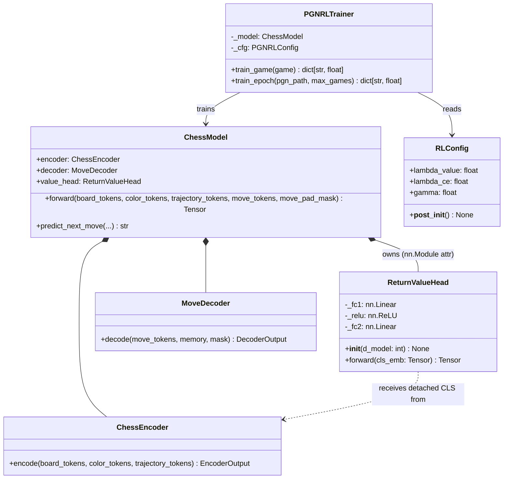
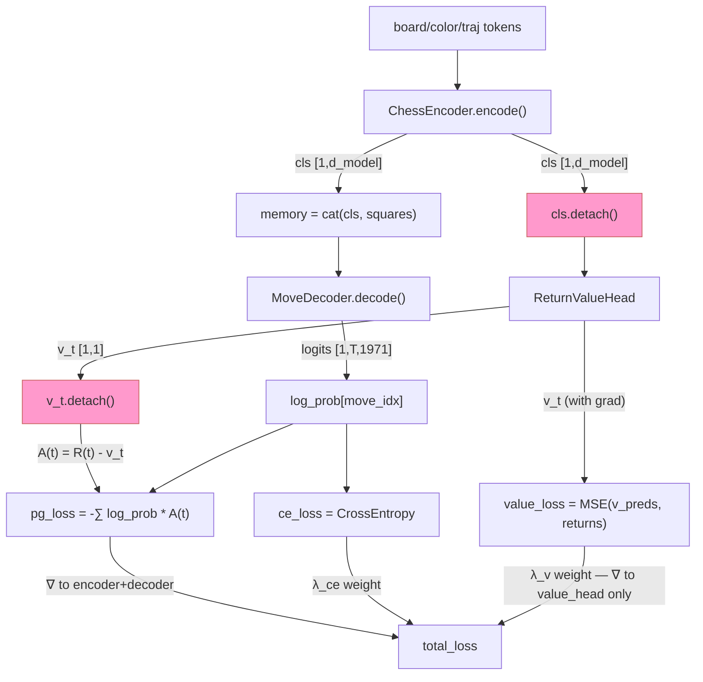

# Return Value Head (Critic) — Design

## Problem Statement

The offline RL training loop in `PGNRLTrainer` uses raw discounted returns as the
REINFORCE signal. Without a learned baseline, the policy gradient has high variance:
every ply in a won game receives a positive reward regardless of whether that specific
position was actually well-played. A critic (value head) that predicts the expected
return for each board state reduces this variance by replacing `R(t)` with the
advantage `A(t) = R(t) - V(t)`, improving training stability and sample efficiency.
The existing `ValueHeads` class in `value_heads.py` is a Phase 2 self-play artifact
with the wrong output semantics (win probability, not discounted return) and is never
instantiated anywhere — it is a safe drop-in replacement target.

---

## Feasibility Analysis

| Approach | Pros | Cons | Verdict |
|----------|------|------|---------|
| **A. Two-layer MLP on detached CLS** (chosen) | No encoder gradient contamination; CLS already aggregates global board context via bidirectional self-attention; two layers capture non-linear return relationships; zero new deps | Adds one forward pass per ply through a small head; MSE target is noisy Monte Carlo return | Accept |
| **B. Single linear layer on CLS** | Smallest footprint; strictly affine projection | Cannot learn non-linear relationships (e.g., material advantage matters more in endgames than openings); strictly weaker approximator for the same parameter budget | Reject |
| **C. Full separate value network (shared nothing)** | Maximum independence between policy and value | Doubles parameter count; doubles memory for a critic that only needs board-state features the encoder already computes; adds a second optimizer/checkpoint path | Reject |
| **D. Value head attending to square embeddings** | Richer per-square spatial features | Significant added complexity (cross-attention or pooling layer); CLS already attends to all squares during encoding — the information is already aggregated | Reject |

**Rejected immediately:** Options C and D violate the no-new-dependencies constraint
and significantly increase implementation surface without a justified quality gain over
option A given the existing CLS token design.

---

## Chosen Approach

A two-layer MLP (`Linear(d_model, d_model//2) → ReLU → Linear(d_model//2, 1)`)
replaces the entire contents of `value_heads.py`. The head receives the CLS embedding
**detached** from the computation graph so that value MSE gradients cannot corrupt the
encoder's move-prediction representations. The trainer calls `model.encoder.encode()`
directly per ply, reuses the resulting `EncoderOutput` for both the decoder path and
the value head, and computes the advantage as `R(t) - v_t.detach()` so that the
advantage computation is also isolated from the value graph. The total loss gains a
`lambda_value`-weighted MSE term; `RLConfig` gains a single validated field.

---

## Architecture

### Static Structure



*Figure 1. Static ownership. `ReturnValueHead` is an `nn.Module` attribute of
`ChessModel`, ensuring automatic checkpoint inclusion via `state_dict()`.*

---

### Training Data Flow (per-ply)

```mermaid
sequenceDiagram
    participant Trainer as PGNRLTrainer.train_game
    participant Enc as model.encoder
    participant Dec as model.decoder
    participant VH as model.value_head
    participant Loss as Loss Accumulator

    Trainer->>Enc: encode(bt, ct, tt) → EncoderOutput
    Enc-->>Trainer: cls [1,d_model], squares [1,64,d_model]
    Trainer->>Trainer: memory = cat([cls.unsqueeze(1), squares], dim=1)
    Trainer->>Dec: decode(prefix, memory, None) → DecoderOutput
    Dec-->>Trainer: logits [1, T, 1971]
    Trainer->>Trainer: last_logits = logits[0,-1]; log_prob = log_softmax(last_logits)[move_idx]
    Trainer->>VH: forward(cls.detach()) → v_t [1,1]
    VH-->>Trainer: v_t (no grad to encoder)
    Trainer->>Loss: accumulate log_prob, v_t, last_logits, move_idx

    Note over Trainer,Loss: Post-loop
    Trainer->>Loss: advantage[t] = R(t) - v_t.detach()
    Trainer->>Loss: pg_loss = -sum(log_prob[t] * advantage[t])
    Trainer->>Loss: value_loss = MSE(stack(v_preds), valid_rewards)
    Trainer->>Loss: ce_loss = CrossEntropy(all_logits, all_targets)
    Trainer->>Loss: total = pg_loss + λ_ce*ce_loss + λ_v*value_loss
```

*Figure 2. Per-ply sequence. The two detach boundaries are explicit: CLS is detached
before `value_head.forward()`, and `v_t` is detached again before advantage
computation.*

---

### Gradient Flow



*Figure 3. Gradient flow. Pink nodes are detach boundaries. The encoder and decoder
receive gradients only from `pg_loss` and `ce_loss`. The value head receives gradients
only from `value_loss`.*

---

## Component Breakdown

### `ReturnValueHead` (`chess_sim/model/value_heads.py` — full replacement)

- **Responsibility**: Estimate expected discounted return for a board state from the
  CLS embedding.
- **Key interface**:
  ```
  class ReturnValueHead(nn.Module):
      def __init__(self, d_model: int) -> None: ...
      def forward(self, cls_emb: Tensor) -> Tensor:
          # cls_emb: [B, d_model], caller must detach
          # returns: [B, 1] scalar return estimate
  ```
- **Internal layers**: `_fc1: nn.Linear(d_model, d_model // 2)`,
  `_relu: nn.ReLU()`, `_fc2: nn.Linear(d_model // 2, 1)`.
- **Contract**: The head performs no detach internally — detaching is the caller's
  responsibility and must be documented at each call site. This keeps the head
  testable in isolation with attached tensors.
- **Testability**: Instantiate with a fixed `d_model`; pass a `[B, d_model]` random
  float tensor; assert output shape is `[B, 1]` and output is finite.
- **Note on `ValueHeadOutput`**: The `ValueHeadOutput` NamedTuple in `chess_sim/types.py`
  was the return type of the old `ValueHeads`. It is no longer referenced once the
  replacement is in place. The implementor should remove `ValueHeadOutput` from
  `types.py` only after confirming no other module imports it — check with
  `ruff check .` after removal.

---

### `ChessModel` (`chess_sim/model/chess_model.py` — additive change)

- **Responsibility**: Top-level encoder-decoder assembly; now also owns the critic
  head as an `nn.Module` attribute.
- **Change**: Add `self.value_head = ReturnValueHead(model_cfg.d_model)` in
  `__init__`. Import `ReturnValueHead` from `chess_sim.model.value_heads`.
- **Constraint**: `forward()` signature and return type are unchanged:
  ```
  def forward(
      self,
      board_tokens: Tensor,
      color_tokens: Tensor,
      trajectory_tokens: Tensor,
      move_tokens: Tensor,
      move_pad_mask: Optional[Tensor] = None,
  ) -> Tensor:   # [B, T, 1971] — unchanged
  ```
- **Checkpoint safety**: Because `value_head` is an `nn.Module` attribute, it is
  included in `state_dict()` automatically. Checkpoints saved before this change
  will fail `load_state_dict()` with a missing-keys error — see Open Questions §1.
- **Testability**: Construct `ChessModel()`; assert `hasattr(model, "value_head")`;
  assert `isinstance(model.value_head, ReturnValueHead)`.

---

### `RLConfig` (`chess_sim/config.py` — additive change)

- **Responsibility**: Validated hyperparameter container for offline RL training.
- **Change**: Add `lambda_value: float = 1.0` field and a validation guard in
  `__post_init__`:
  ```
  if self.lambda_value < 0:
      raise ValueError(
          f"lambda_value must be >= 0, got {self.lambda_value}"
      )
  ```
- **Default rationale**: `1.0` keeps MSE loss on the same order of magnitude as the
  policy loss given that returns are bounded by `[-win_reward, win_reward] = [-10, 10]`
  and MSE is bounded by `(2 * win_reward)^2 / 4 = 100`.
- **Testability**: `RLConfig(lambda_value=-1.0)` must raise `ValueError`.

---

### `PGNRLTrainer.train_game` (`chess_sim/training/pgn_rl_trainer.py` — modified)

- **Responsibility**: Execute one complete offline REINFORCE + critic update step for
  a single PGN game.
- **Changes**:
  1. Replace `self._model(bt, ct, tt, prefix, None)` with the two-step
     `encoder.encode → decoder.decode` call sequence.
  2. Accumulate `v_preds: list[Tensor]` alongside `log_probs`.
  3. Compute `advantage` tensor and `value_loss` post-loop.
  4. Include `value_loss` and `mean_advantage` in the returned metrics dict.
- **Per-ply additions** (pseudocode only):
  ```
  enc_out  = model.encoder.encode(bt, ct, tt)
  cls      = enc_out.cls_embedding                   # [1, d_model]
  memory   = cat([cls.unsqueeze(1), enc_out.square_embeddings], dim=1)
  logits   = model.decoder.decode(prefix, memory, None).logits
  v_t      = model.value_head(cls.detach())          # [1, 1]
  v_preds.append(v_t.squeeze())                      # scalar tensor
  ```
- **Post-loop additions** (pseudocode only):
  ```
  v_preds_t  = stack(v_preds)                        # [N]
  advantage  = valid_rewards - v_preds_t.detach()    # [N], no value grad
  pg_loss    = -(log_probs_t * advantage).sum()
  value_loss = mse_loss(v_preds_t, valid_rewards)
  total_loss = pg_loss + λ_ce * ce_loss + λ_v * value_loss
  mean_adv   = advantage.mean().item()
  ```
- **Return dict additions**: `"value_loss": value_loss.item()`,
  `"mean_advantage": mean_adv`.
- **Testability**: All tensor operations are on CPU in unit tests; mock
  `model.encoder.encode` to return a fixed `EncoderOutput` if needed.

---

### `PGNRLTrainer.train_epoch` (`chess_sim/training/pgn_rl_trainer.py` — modified)

- **Responsibility**: Aggregate per-game metrics over a full epoch.
- **Changes**:
  1. Accumulate `value_loss_sum` and `mean_adv_sum` alongside existing accumulators.
  2. Pass `"value_loss"` and `"mean_advantage"` to `tracker.track_scalars(...)`.
  3. Return both in the epoch-level dict.
- **Interface** (return dict, additions only):
  ```
  "value_loss":     value_loss_sum / denom,
  "mean_advantage": mean_adv_sum / denom,
  ```

---

### `configs/train_rl.yaml` — additive change

Add one field under the `rl:` block:

```yaml
rl:
  # ... existing fields unchanged ...
  lambda_value: 1.0
```

No other YAML sections change.

---

## Test Cases

| ID | Scenario | Input | Expected Outcome | Edge? |
|----|----------|-------|------------------|-------|
| T15 | `train_game` returns `value_loss` key | Scholar's Mate game, default `PGNRLConfig` | `"value_loss"` present in returned dict and `math.isfinite(value_loss)` is `True` | No |
| T16 | `value_loss` is non-negative | Scholar's Mate game | `metrics["value_loss"] >= 0.0` (MSE is always ≥ 0) | No |
| T17 | `track_scalars` receives new metric keys | Fool's Mate game, mock tracker, `train_epoch` | `call_args[0][0]` dict contains keys `"value_loss"` and `"mean_advantage"` | No |
| T18 | `RLConfig(lambda_value=-1.0)` raises | `lambda_value=-1.0` | `ValueError` raised | Yes (boundary) |
| T19 | `value_head` is attribute of `ChessModel` | `ChessModel()` constructed | `hasattr(model, "value_head")` and `isinstance(model.value_head, ReturnValueHead)` | No |
| T20 | `ReturnValueHead` output shape | `ReturnValueHead(128).forward(rand(4, 128))` | Shape is `torch.Size([4, 1])` | No |
| T21 | Checkpoint round-trip includes value head weights | Save then load `PGNRLTrainer` checkpoint | Loaded `model.value_head` weights are bit-for-bit equal to original | No |
| T22 | `lambda_value=0.0` is valid | `RLConfig(lambda_value=0.0)` | No exception raised; effectively disables value loss | Yes (boundary) |
| T23 | `mean_advantage` is finite | Scholar's Mate game | `math.isfinite(metrics["mean_advantage"])` | No |

*T15–T18 are the four cases specified in the task. T19–T23 cover the model wiring,
shape contract, checkpoint safety, and boundary validation.*

---

## Coding Standards

The implementor must observe the following before opening a PR:

- **DRY**: The two-step `encode → decode` sequence appears in both `train_game` and
  `sample_visuals`. Extract a private helper
  `_encode_and_decode(bt, ct, tt, prefix) -> tuple[Tensor, Tensor]` that returns
  `(last_logits, cls_embedding)` to avoid duplication.
- **Decorators**: No new decorators needed; the existing `@property model` pattern is
  sufficient.
- **Typing**: `v_preds: list[Tensor]` must be declared at the top of the ply loop
  alongside `log_probs`. `advantage: Tensor` must be typed at assignment.
- **Comments**: The two detach sites must each carry a ≤ 280-character inline comment
  explaining why the detach is necessary (encoder protection and advantage isolation
  respectively).
- **`unittest` before implementation**: T15–T23 must exist as failing tests before
  any production changes are made.
- **No new dependencies**: `torch.nn.MSELoss` (aliased as `F.mse_loss`) is already
  available — no `requirements.txt` change needed.
- **Ruff**: Run `python -m ruff check . --fix` after all changes. The `ANN` rules
  apply to all non-test files.

---

## Open Questions

1. **Checkpoint backward compatibility**: Checkpoints saved before this change
   (`chess_rl.pt`, Phase 1 checkpoints) will fail `load_state_dict()` with
   `unexpected key: value_head.*` or `missing key` errors depending on load direction.
   The implementor must decide: (a) add `strict=False` to `load_state_dict()` calls
   in `load_checkpoint()` with a logged warning, or (b) version the checkpoint format.
   Option (a) is simpler; option (b) is safer. Stakeholder decision required before
   implementation.

2. **MSE target scale vs. reward scale**: The default `win_reward=10.0` means MSE
   values can reach up to `(20)^2 / 4 = 100` in the worst case. If `pg_loss` is
   typically in the range `[1, 20]` (as seen in training logs), the default
   `lambda_value=1.0` may allow `value_loss` to dominate early training. The
   implementor should verify empirically after the first training run and adjust
   `lambda_value` accordingly. This is flagged as a tuning concern, not a design
   defect.

3. **`ValueHeadOutput` removal from `types.py`**: The `ValueHeadOutput` NamedTuple
   is referenced by the old `ValueHeads.forward()` return annotation. Once the
   replacement is in, it becomes dead code. The implementor should confirm no external
   module (e.g., a test or a script) imports `ValueHeadOutput` before deleting it.
   Use `python -m ruff check . --select F401` to detect orphaned imports.

4. **Advantage normalization**: Standard REINFORCE implementations normalize advantages
   by their standard deviation (`A_norm = (A - mean(A)) / (std(A) + eps)`) to further
   reduce gradient variance. This design does not mandate normalization to keep the
   initial implementation simple, but engineering team should revisit after observing
   the `mean_advantage` metric in Aim over the first few epochs.

5. **`evaluate()` and `sample_visuals()` value inference**: These methods call
   `self._model(bt, ct, tt, prefix, None)` directly and do not use the value head.
   This is correct for evaluation (value head is a training artifact), but
   `sample_visuals()` could optionally display `v_t` alongside reward for debugging.
   Deferred to a follow-up; no change required now.
