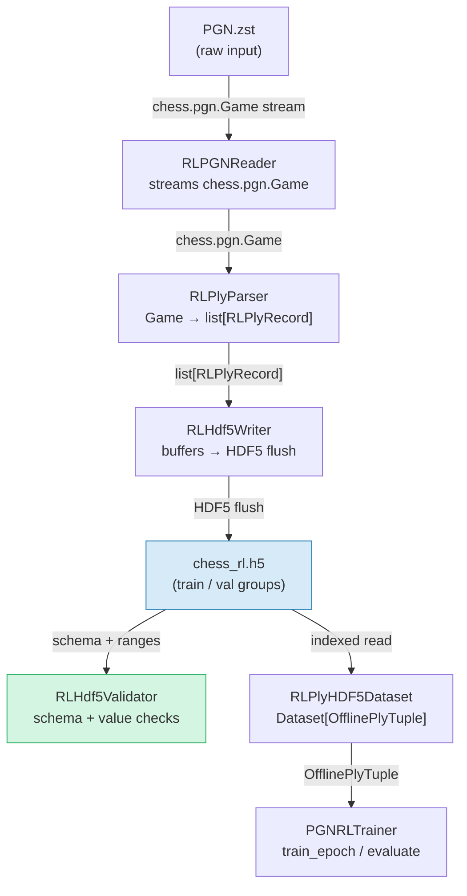
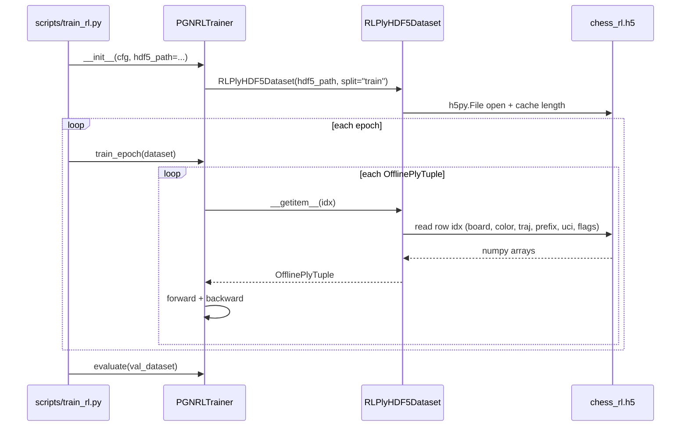

# RL HDF5 Preprocessing Pipeline — Design

## Problem Statement

`PGNRLTrainer.train_epoch` calls `_stream_pgn` and `PGNReplayer.replay` at the
start of every epoch. For a 1,000-game corpus this means decompressing a `.zst`
archive, parsing PGN text, tokenizing all board states, and building `move_prefix`
tensors from scratch every epoch. At ~14.5 min/epoch on GPU, an estimated 3–5 min
is pure preprocessing overhead (no gradient computation). The fix is a one-time
write of all `OfflinePlyTuple` fields to a structured HDF5 file, then replacing
the per-epoch parse with a random-access `Dataset` that issues only HDF5 reads.

---

## Feasibility Analysis

| Approach | Pros | Cons | Verdict |
|---|---|---|---|
| **A — Flat HDF5 per ply (this design)** | O(1) random access; mirrors existing `ChessHDF5Dataset` pattern; no decompression at training time; supports shuffling natively via DataLoader | One-time preprocessing cost; `move_prefix` padding wastes space for short games; `move_uci` requires fixed-length byte encoding | **Accept** |
| **B — Rechunked Parquet / Arrow** | Column-oriented; good for analytics queries; variable-length lists handled natively | Adds `pyarrow` dependency; no native PyTorch integration; read overhead higher than HDF5 for random integer slices | Reject — dependency cost, no existing pattern in the codebase |
| **C — Keep per-epoch PGN, add shard cache** | Zero schema change; shard cache already exists for Phase 1 | Shard cache stores `GameTurnSample`, not `OfflinePlyTuple`; still re-runs `PGNReplayer` and tokenizers every epoch; saves decompression but not parsing | Reject — does not eliminate the dominant cost |
| **D — Memory-map entire tensor file (.pt)** | `torch.load` is familiar | No compression; cannot append; not split-aware; entire file must fit in mapped virtual address space | Reject — operational inflexibility |

**Eliminated:** Options B, C, D rejected for reasons stated.

---

## Chosen Approach

Approach A mirrors the architecture of the existing `chess_sim/preprocess/` pipeline
exactly — `Reader → Parser → Writer → Validator → Dataset` — but targets
`OfflinePlyTuple` semantics rather than `GameTurnSample`. A new script
`scripts/preprocess_rl.py` runs once; the resulting `.h5` file is pointed to in
`train_rl.yaml`. `PGNRLTrainer` gains an optional `hdf5_path` parameter; when
provided it builds an `RLPlyHDF5Dataset` and replaces `_stream_pgn` + `PGNReplayer`
entirely. The parallel multiprocessing strategy from `HDF5Preprocessor` is carried
forward for the write phase. `train_color` filtering is applied at write time to
keep the hot path fast, with the filter choice recorded as a file-level HDF5
attribute so accidental mismatches are detectable.

---

## Architecture

### Figure 1 — End-to-end data flow



### Figure 2 — Component interactions during training



---

## Component Breakdown

### `RLPlyRecord` (new NamedTuple in `chess_sim/types.py`)

- **Responsibility:** Immutable intermediate container between `RLPlyParser` and
  `RLHdf5Writer`. Holds all scalar/array fields of one `OfflinePlyTuple` in plain
  Python / NumPy-compatible types, free of `torch.Tensor`.
- **Key interface:**
  ```python
  class RLPlyRecord(NamedTuple):
      board_tokens: list[int]        # len 65, values 0-7
      color_tokens: list[int]        # len 65, values 0-2
      traj_tokens: list[int]         # len 65, values 0-4
      move_prefix: list[int]         # SOS + prior move indices; variable length
      move_uci: str                  # UCI string e.g. "e2e4"
      is_winner_ply: bool
      is_white_ply: bool
      is_draw_ply: bool
      game_id: int
      ply_index: int                 # 0-indexed ply within the game
  ```
- Testable in isolation; no torch import required.

---

### `RLPGNReader` (new class in `chess_sim/preprocess/rl_reader.py`)

- **Responsibility:** Stream `chess.pgn.Game` objects from a `.pgn` or `.pgn.zst`
  file. Thin wrapper over the existing `StreamingPGNReader` that also supports plain
  `.pgn`. Implements the `Replayable` source half of the pipeline.
- **Key interface:**
  ```python
  class RLPGNReader:
      def stream(
          self, path: Path, max_games: int = 0
      ) -> Iterator[chess.pgn.Game]: ...
  ```
- Delegates `.zst` decompression to `StreamingPGNReader`; handles plain `.pgn`
  directly with `chess.pgn.read_game`.
- The implementor notes that `StreamingPGNReader` already exists in
  `chess_sim/data/reader.py` — `RLPGNReader` should compose it rather than
  duplicating `.zst` logic.

---

### `RLPlyParser` (new class in `chess_sim/preprocess/rl_parse.py`)

- **Responsibility:** Convert one `chess.pgn.Game` into a list of `RLPlyRecord`.
  Applies `train_color` filter; encodes board, color, trajectory, and move-prefix
  tokens using the existing `BoardTokenizer` and `MoveTokenizer`. This is the RL
  analogue of `GameParser`.
- **Key interface:**
  ```python
  class RLPlyParser:
      def __init__(
          self,
          train_color: str,        # "white" | "black"
          min_moves: int = 5,
          max_moves: int = 512,
      ) -> None: ...

      def parse_game(
          self,
          game: chess.pgn.Game,
          game_id: int,
      ) -> list[RLPlyRecord]: ...
  ```
- Internally mirrors `PGNReplayer.replay`: iterates `game.mainline_moves()`,
  calls `BoardTokenizer.tokenize(board, board.turn)` before each `board.push`,
  builds `move_prefix` as `MoveTokenizer.tokenize_game(prior_ucis)[:-1]`.
- Filters to only the `train_color` side before returning — records for the
  opponent side are never written, keeping the HDF5 file half the size.
- Games with unknown result (`*`) or games where all plies fail vocabulary lookup
  return an empty list (same contract as `PGNReplayer`).

---

### `RLHdf5Writer` (new class in `chess_sim/preprocess/rl_writer.py`)

- **Responsibility:** Buffer `RLPlyRecord` lists and flush to HDF5. Manages
  resizable chunked datasets, compression, and split routing. RL analogue of
  `HDF5Writer`.
- **Key interface:**
  ```python
  class RLHdf5Writer:
      def __init__(
          self,
          max_prefix_len: int,     # padded prefix dimension
          chunk_size: int,
          compression: str,
          compression_opts: int,
          train_color: str,        # stored as file attribute
      ) -> None: ...

      def open(self, path: Path, mode: str = "w") -> None: ...
      def write_batch(
          self, records: list[RLPlyRecord], split: str
      ) -> None: ...
      def flush(self, split: str) -> None: ...
      def close(self) -> None: ...
  ```
- The `train_color` value is written as an HDF5 root-level attribute at `close()`
  so `RLHdf5Validator` and `RLPlyHDF5Dataset` can assert consistency at load time.
- `move_uci` is stored as a fixed-length ASCII byte string with dtype
  `h5py.string_dtype(encoding="ascii", length=5)`. The maximum UCI string length
  is 5 characters (`e7e8q`); shorter moves are zero-padded by h5py.

---

### `RLHdf5Validator` (new class in `chess_sim/preprocess/rl_validate.py`)

- **Responsibility:** Post-write sanity checks: schema presence, row-count
  consistency, value ranges, and `train_color` attribute check.
- **Key interface:**
  ```python
  class RLHdf5Validator:
      def validate(
          self, path: Path, config: RLPreprocessConfig
      ) -> None: ...  # raises ValueError on failure
  ```
- Checks that `move_uci` values are non-empty ASCII, that flag fields are 0 or 1,
  and that `prefix_lengths` satisfy `1 <= L <= max_prefix_len`.

---

### `RLHdf5Preprocessor` (new class in `chess_sim/preprocess/rl_preprocess.py`)

- **Responsibility:** Orchestrate the full pipeline: stream → parse → write →
  validate. Supports both serial and multiprocessing execution. RL analogue of
  `HDF5Preprocessor`.
- **Key interface:**
  ```python
  class RLHdf5Preprocessor:
      def __init__(
          self,
          reader: RLPGNReader,
          parser: RLPlyParser,
          writer: RLHdf5Writer,
          validator: RLHdf5Validator,
      ) -> None: ...

      def run(self, config: RLPreprocessConfig) -> None: ...
  ```
- The multiprocessing worker function `_rl_parse_worker` follows the same pattern
  as `_parse_worker` in `preprocess.py`: receives PGN text + `game_id` as a tuple,
  constructs a fresh `RLPlyParser`, returns `list[RLPlyRecord]`.

---

### `RLPlyHDF5Dataset` (new class in `chess_sim/data/rl_hdf5_dataset.py`)

- **Responsibility:** PyTorch `Dataset[OfflinePlyTuple]` backed by the RL HDF5
  file. Reconstructs `OfflinePlyTuple` tensors from HDF5 arrays on each
  `__getitem__` call. Analogous to `ChessHDF5Dataset`.
- **Key interface:**
  ```python
  class RLPlyHDF5Dataset(Dataset[OfflinePlyTuple]):
      def __init__(
          self,
          hdf5_path: Path,
          split: str = "train",
      ) -> None: ...

      def __len__(self) -> int: ...
      def __getitem__(self, idx: int) -> OfflinePlyTuple: ...
  ```
- Re-opens the HDF5 file handle in each DataLoader worker via a companion
  `rl_hdf5_worker_init(worker_id: int) -> None` function (mirrors
  `hdf5_worker_init` in `hdf5_dataset.py`).
- `move_prefix` is sliced to `prefix_lengths[idx]` to strip padding before
  returning the tensor, matching how `ChessHDF5Dataset` slices `move_tokens`.
- `move_uci` is decoded from bytes to `str` via `.decode("ascii").rstrip("\x00")`.

---

## HDF5 Schema

Two groups: `train/` and `val/`. All datasets share the same first dimension N
(total plies in that split for the configured `train_color`).

| Dataset name | Shape | dtype | Notes |
|---|---|---|---|
| `board_tokens` | `(N, 65)` | `uint8` | CLS at index 0; values 0–7 |
| `color_tokens` | `(N, 65)` | `uint8` | Values 0–2 |
| `traj_tokens` | `(N, 65)` | `uint8` | Values 0–4 |
| `move_prefix` | `(N, max_prefix_len)` | `uint16` | Zero-padded; SOS at position 0 |
| `prefix_lengths` | `(N,)` | `uint16` | Actual prefix length before padding |
| `move_uci` | `(N,)` | `S5` (fixed ASCII) | 5-byte null-padded; e.g. `b"e2e4\x00"` |
| `is_winner_ply` | `(N,)` | `uint8` | 0 or 1 |
| `is_white_ply` | `(N,)` | `uint8` | 0 or 1 |
| `is_draw_ply` | `(N,)` | `uint8` | 0 or 1 |
| `game_id` | `(N,)` | `uint32` | Source game index |
| `ply_index` | `(N,)` | `uint16` | 0-indexed ply within the source game |

**Root-level HDF5 attributes:**

| Attribute | Value |
|---|---|
| `version` | `"rl_1.0"` |
| `train_color` | `"white"` or `"black"` |
| `created_at` | ISO-8601 UTC timestamp |
| `source_checksum` | First-1MB+size fingerprint of the source PGN (same scheme as shard cache) |
| `max_prefix_len` | Integer; the padding width used at write time |

### move_prefix padding strategy

`move_prefix` grows by one token per ply. At ply 0 of a game it has length 1
(SOS only); at ply T-1 it has length T (SOS + T-1 prior moves). The worst-case
is `max_moves` tokens. The implementor must choose `max_prefix_len` in config.

**Chosen strategy: pad to `max_prefix_len` with zero (PAD_IDX)**. The actual
length for each row is stored in `prefix_lengths`. `RLPlyHDF5Dataset.__getitem__`
slices `move_prefix[idx, :prefix_lengths[idx]]` before constructing the tensor.
This is identical to how `HDF5Writer` handles `move_tokens` and `ChessHDF5Dataset`
handles the slice-at-read pattern — consistent with the existing codebase, and
avoids the complexity of HDF5 variable-length datasets (which require special h5py
APIs and cannot be read with simple index slicing).

If a prefix exceeds `max_prefix_len` (very long game), it is truncated at write
time and a `WARNING` log is emitted — same behavior as `HDF5Writer` for
`max_seq_len`.

---

## Config Design

### New `RLPreprocessConfig` dataclass (add to `chess_sim/config.py`)

```python
@dataclass
class RLOutputConfig:
    hdf5_path: str = "data/processed/chess_rl.h5"
    chunk_size: int = 1000
    compression: str = "gzip"
    compression_opts: int = 4
    max_prefix_len: int = 512     # padded width of move_prefix

@dataclass
class RLFilterConfig:
    min_moves: int = 5
    max_moves: int = 512
    train_color: str = "white"    # "white" | "black"

@dataclass
class RLPreprocessConfig:
    input: InputConfig = field(default_factory=InputConfig)
    output: RLOutputConfig = field(default_factory=RLOutputConfig)
    filter: RLFilterConfig = field(default_factory=RLFilterConfig)
    split: SplitConfig = field(default_factory=SplitConfig)
    processing: ProcessingConfig = field(default_factory=ProcessingConfig)
```

`InputConfig`, `SplitConfig`, and `ProcessingConfig` are reused from the existing
preprocess config — no duplication. A companion `load_rl_preprocess_config(path:
Path) -> RLPreprocessConfig` loader follows the same pattern as
`load_preprocess_v2_config`.

### New `configs/preprocess_rl.yaml`

```yaml
input:
  pgn_path: data/lichess_db_standard_rated_2013-01.pgn.zst
  max_games: 1000   # 0 = all

output:
  hdf5_path:        data/processed/chess_rl.h5
  chunk_size:       1000
  compression:      gzip
  compression_opts: 4
  max_prefix_len:   512

filter:
  min_moves:   5
  max_moves:   512
  train_color: white

split:
  train: 0.95
  val:   0.05
  seed:  42

processing:
  workers: 4
```

---

## Integration with PGNRLTrainer

### What changes

`PGNRLTrainer` currently accepts a `pgn_path: Path` in `train_epoch` and
`evaluate`. The design adds an alternative code path when the caller supplies
an `RLPlyHDF5Dataset` directly.

**New method signatures (typed, not implementation):**

```python
def train_epoch(
    self,
    dataset: RLPlyHDF5Dataset,
) -> dict[str, float]: ...

def evaluate(
    self,
    dataset: RLPlyHDF5Dataset,
) -> dict[str, float]: ...
```

The existing `pgn_path`-accepting signatures are preserved as deprecated
overloads or removed — the design team should decide (see Open Questions #1).

### What is removed

- The private `_stream_pgn` module-level function is no longer called in the hot
  path. It can remain for the `sample_visuals` method, which continues to accept
  a PGN path.
- `self._replayer: PGNReplayer` is no longer instantiated in `__init__` when the
  HDF5 path is provided. The `PGNReplayer` dependency is injected only in the PGN
  mode and becomes optional.

### Reward recomputation

`PGNRLRewardComputer.compute(plies, cfg.rl)` accepts `list[OfflinePlyTuple]` and
uses `is_winner_ply`, `is_draw_ply`, and position index to compute discounted
rewards. All three fields are stored in HDF5, so the reward computation is
**unchanged**. No rewards are stored in HDF5.

### DataLoader integration

The implementor wraps `RLPlyHDF5Dataset` in a standard `DataLoader` with
`shuffle=True`, `num_workers=N`, and `worker_init_fn=rl_hdf5_worker_init`. Game
boundaries are lost in this flat view — the trainer iterates plies rather than
games. `train_game` is replaced by a ply-level `train_ply` method that accepts
a single `OfflinePlyTuple`, and `train_epoch` accumulates gradients over a
configurable `plies_per_update` window before calling `optimizer.step()`.

The key behavioral change: previously rewards were computed per-game using
discounted returns over the full game's ply sequence. With a flat DataLoader the
game context is broken. **The implementor must choose between two sub-approaches
(see Open Questions #2).**

---

## Test Cases

| ID | Scenario | Input | Expected Outcome | Edge? |
|----|---|---|---|---|
| T1 | Schema correctness | Run `RLHdf5Validator.validate` on a freshly written file | All required datasets present; `version="rl_1.0"`; row counts equal across all datasets in each split | No |
| T2 | Round-trip board/color/traj tokens | Write one `RLPlyRecord`, read back via `RLPlyHDF5Dataset.__getitem__(0)` | `board_tokens`, `color_tokens`, `traj_tokens` tensors equal the originals element-by-element | No |
| T3 | `move_prefix` padding round-trip | Write record with prefix length 3; `max_prefix_len=10` | `dataset[0].move_prefix` has shape `(3,)`; padding zeros not included | No |
| T4 | `move_prefix` truncation | Record with prefix length 600; `max_prefix_len=512` | Stored length capped at 512; WARNING logged; `prefix_lengths[0] == 512` | Yes |
| T5 | `train_color` filtering | Parse game with 60 plies (30 white, 30 black); `train_color="white"` | HDF5 contains exactly 30 records; all have `is_white_ply=1` | No |
| T6 | `move_uci` round-trip | Write record with `move_uci="e7e8q"` | `dataset[0].move_uci == "e7e8q"` after ASCII decode + rstrip | No |
| T7 | Reward recomputation from stored flags | Load `OfflinePlyTuple` from HDF5; pass to existing `PGNRLRewardComputer.compute` | Reward tensor shape matches number of plies; values consistent with `is_winner_ply` / `is_draw_ply` flags | No |
| T8 | Empty game handling | Parse a game with result `"*"` (unknown) | `RLPlyParser.parse_game` returns `[]`; HDF5 dataset length unchanged | Yes |
| T9 | Dataset length | Write 50 train records and 5 val records | `len(RLPlyHDF5Dataset(path, "train")) == 50`; `len(RLPlyHDF5Dataset(path, "val")) == 5` | No |
| T10 | Out-of-range `__getitem__` | `dataset[-1]` and `dataset[len(dataset)]` | Both raise `IndexError` | Yes |
| T11 | Multi-worker DataLoader | Wrap dataset in `DataLoader(num_workers=2, worker_init_fn=rl_hdf5_worker_init)` | All batches load without HDF5 handle collision; no `OSError` | No |
| T12 | `train_color` attribute mismatch | Write with `train_color="white"`; validate with config `train_color="black"` | `RLHdf5Validator.validate` raises `ValueError` | Yes |

---

## Coding Standards

- DRY — `RLPlyParser` reuses `BoardTokenizer` and `MoveTokenizer` directly; no
  re-implementation of tokenization. `RLPGNReader` composes `StreamingPGNReader`
  rather than copying `.zst` logic.
- Decorators for cross-cutting concerns (logging, retry) — plain functions and
  methods otherwise.
- Typing everywhere — no bare `Any`; all function signatures fully annotated.
- Comments `<=` 280 characters; if a method needs more explanation the method
  should be split.
- `unittest` required before any hypothesis script; skip it and the PR is rejected.
- No new dependencies without a justification comment in `requirements.txt`. `h5py`
  is already present; no new packages are needed for this pipeline.
- All new modules live under `chess_sim/preprocess/rl_*.py` and
  `chess_sim/data/rl_hdf5_dataset.py` — consistent with existing file layout.
- `chess_sim/preprocess/__init__.py` must re-export the four new RL components
  as `RLPlyParser`, `RLHdf5Writer`, `RLHdf5Validator`, `RLHdf5Preprocessor`.

---

## Migration Path

1. Run the new preprocessor once:
   ```
   python -m scripts.preprocess_rl \
     --config configs/preprocess_rl.yaml \
     --pgn data/lichess_db_standard_rated_2013-01.pgn.zst \
     --max-games 1000
   ```
   Output: `data/processed/chess_rl.h5` (~tens of MB for 1,000 games).

2. Add `hdf5_path` to `configs/train_rl.yaml` under the `data` section:
   ```yaml
   data:
     hdf5_path: data/processed/chess_rl.h5
     max_games:  0   # ignored when hdf5_path is set
   ```

3. `scripts/train_rl.py` checks `cfg.data.hdf5_path`; if non-empty it constructs
   `RLPlyHDF5Dataset` objects for train and val splits and passes them to
   `PGNRLTrainer.train_epoch` / `.evaluate` directly. If empty it falls back to the
   legacy PGN path (preserving backward compatibility for smoke tests).

4. `train_rl.yaml` `rl.train_color` must match the `train_color` written into the
   HDF5 file. `RLPlyHDF5Dataset.__init__` reads the attribute and asserts equality,
   raising `ValueError` at startup if they disagree — fast-fail before any training.

---

## Open Questions

1. **Deprecate or overload `train_epoch(pgn_path)` signature?** Keeping both
   signatures adds maintenance burden; removing breaks existing smoke-test configs
   that still point at raw PGN. Recommendation: keep the PGN path as a fallback
   for at most one release cycle, then delete `_stream_pgn` and `PGNReplayer`
   usage from the trainer.

2. **Game-context reward vs. flat-DataLoader reward.** `PGNRLRewardComputer`
   computes per-game discounted returns using the game's total ply count `T`. With
   a flat DataLoader, `T` is unknown per-record. Two options: (a) store `game_length`
   and `ply_index` in HDF5 and recompute rewards per-record in `train_ply`; (b)
   group records by `game_id` and restore game-level batching (essentially re-builds
   the current `train_game` loop using the dataset). Option (b) is safer and
   requires no reward logic change; option (a) enables true random shuffling.

3. **`max_prefix_len` vs. `max_moves` alignment.** At ply T of a game the prefix
   length is T (SOS + T-1 prior moves). A game with 512 moves produces a prefix
   of length 512 at the final ply. `max_prefix_len` in `RLOutputConfig` and
   `max_moves` in `RLFilterConfig` should be kept equal unless the team explicitly
   allows truncation. This should be enforced in `RLPreprocessConfig.__post_init__`
   or documented clearly.

4. **Variable-length storage alternative.** HDF5 supports ragged VL datasets via
   `h5py.special_dtype(vlen=np.dtype("uint16"))`. This eliminates padding waste
   (prefix lengths range from 1 to 512 tokens, mean ~30 for 1k-game corpus). The
   downside is that VL datasets cannot be sliced with simple numpy-style indexing;
   each row returns a Python object requiring `.astype` cast. Benchmark against
   padded storage before committing; the current shard-cache design chose padded
   storage for the same reason.

5. **`sample_visuals` migration.** `PGNRLTrainer.sample_visuals` still reads a
   raw PGN file. Once the HDF5 pipeline is established, this method should be
   updated to sample from the HDF5 dataset and rehydrate a `chess.Board` from
   stored tokens (or store a FEN string in HDF5). This is deferred to a follow-up.
