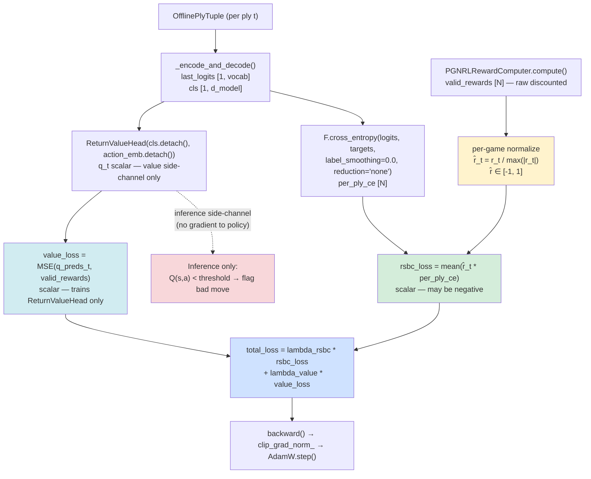
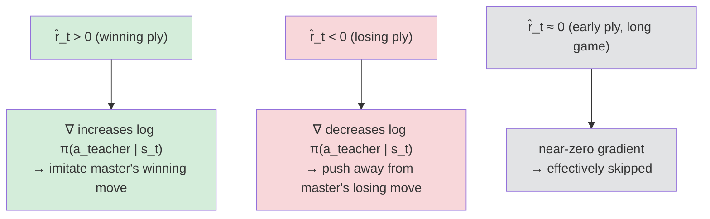
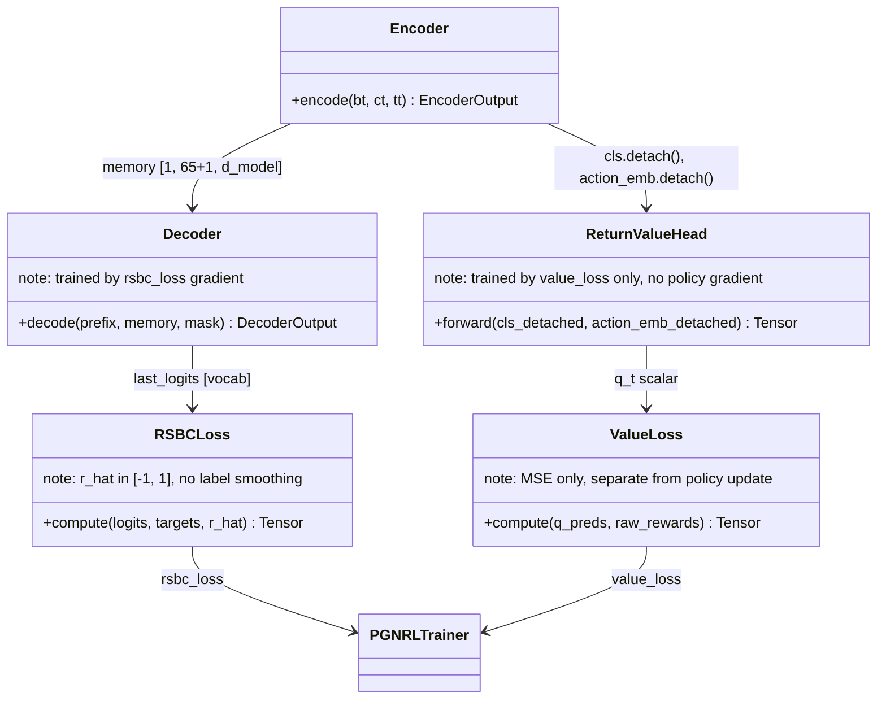

# Reward-Signed Behavioral Cloning (RSBC) Loss — Design

## Problem Statement

`PGNRLTrainer._compute_awbc_loss` applies `clamp(advantage, min=0)` before
weighting per-ply cross-entropy, which hard-zeros the gradient on every ply
with a negative advantage. In a dataset of decisive master games trained on one
color only, roughly half of all plies belong to the losing side — those plies
carry a negative discounted reward and, once whitened, a negative advantage.
AWBC silently discards all gradient signal from those plies, wasting ~50 % of
the available training data. RSBC replaces the clamp with the raw per-game
normalized reward `r̂_t ∈ [-1, 1]`, converting losing plies from ignored
samples into active anti-imitation signal.

---

## Feasibility Analysis

| Approach | Pros | Cons | Verdict |
|---|---|---|---|
| **A. RSBC: `r̂_t * CE(t)`, per-game normalization** | Uses 100 % of plies; mathematically equivalent to REINFORCE on teacher actions; keeps loss scale in [-1, 1] × CE; no critic needed for policy update | Loss can be negative (novel monitoring concern); normalization is per-game so global loss curves are noisier than per-epoch averages | **Accept** |
| **B. Keep AWBC, reduce clamp threshold** | Backward-compatible; only a constant change | Threshold is a new hyperparameter with no principled value; still discards some fraction of plies | **Reject** — partial fix, arbitrary threshold |
| **C. REINFORCE with whitened advantage (raw, no clamp)** | Industry-standard; uses all plies; no normalization needed | Requires a warm critic to produce low-variance advantages; early epochs have near-random advantage signal; high gradient variance | **Reject** — critic dependency re-introduced, high variance |
| **D. Filtered CE on winner plies only** | Simplest change; zero sign ambiguity | Still discards loser plies entirely; treats all winner plies equally regardless of temporal position | **Reject** — same 50 % waste problem as AWBC |
| **E. RSBC + per-batch normalization across games** | Reduces batch-level variance | Requires batching across games in the current ply-by-ply loop; significant refactor | **Reject (Phase 2 candidate)** — scope exceeds this change |

Approach A is accepted. Its connection to REINFORCE theory is direct: weighting
`log π(a|s)` by the signed return is the standard policy gradient update.
Per-game normalization (`r_t / max(|r_t|)`) is the minimal transformation
needed to bound gradient scale independently of reward magnitude and trajectory
depth. No new dependencies are required; `F.cross_entropy(reduction='none')`
is already used in `_compute_awbc_loss`.

---

## Chosen Approach

RSBC replaces `_compute_awbc_loss` with `_compute_rsbc_loss`. The formula is:

```
r̂_t = r_t / max(|r_t| for all t in game)    # per-game normalization
L_rsbc = (1/N) * Σ_t [ r̂_t * CE(logits_t, target_t) ]
```

where `CE` has `label_smoothing=0.0` unconditionally. Per-game normalization
keeps `r̂_t ∈ [-1, 1]` regardless of reward scale (win_reward=10 or 100),
which stabilizes gradient magnitude across trajectory depths and reward
configs. The value head remains trained via `L_value = MSE(Q(s,a), r_t)` but
is fully decoupled from the policy update: its gradient does not influence the
policy, and its predictions are not used to compute advantage. The entropy
bonus (`_compute_entropy_bonus`) is removed because RSBC already implicitly
maximizes entropy on losing plies — the anti-imitation gradient on negative
`r̂_t` plies distributes probability away from the teacher move, which
flattens the distribution over those states. A separate entropy term is
redundant and adds noise.

---

## Architecture

### Loss Computation Graph — RSBC `train_game` inner loop



_Figure 1. RSBC data flow inside `train_game`. Raw discounted rewards are
normalized per-game before multiplication with per-ply CE. The value head
trains on raw rewards via MSE but its gradient does not reach the policy.
The entropy path is removed entirely. Dashed line = inference-only path._

---

### Gradient Sign Semantics



_Figure 2. Gradient direction by reward sign. This is mathematically identical
to REINFORCE: the policy gradient update is `∇_θ J = E[r̂_t ∇_θ log π(a|s)]`.
RSBC instantiates this with teacher actions as the behavioral policy._

---

### Component Interaction — Decoupled Value Head



_Figure 3. Static component relationships. Two `detach()` boundaries isolate
`ReturnValueHead` from the encoder and token embedding gradients. `RSBCLoss`
trains encoder and decoder jointly. `ValueLoss` trains only `ReturnValueHead`._

---

## Component Breakdown

### `chess_sim/config.py` — `RLConfig` dataclass

- **Responsibility**: declare all RL training hyperparameters; enforce
  invariants in `__post_init__`.
- **New fields**:
  - `lambda_rsbc: float = 1.0` — scale on the RSBC loss term.
  - `rsbc_normalize_per_game: bool = True` — when `False`, raw rewards are
    used as weights without per-game normalization (research/ablation mode).
- **Changed defaults**:
  - `lambda_entropy: float = 0.0` (was `0.0` in code, `0.01` in YAML — align both).
  - `label_smoothing: float = 0.0` (was `0.1`).
- **Deprecated (retained for backward compat)**:
  - `lambda_awbc: float = 0.0` — set default to `0.0`; keep validation.
- **New validation in `__post_init__`**:
  ```python
  # pseudo-code — not production
  if self.lambda_rsbc < 0:
      raise ValueError("lambda_rsbc must be >= 0")
  ```
- **Key interface**:
  ```python
  @dataclass
  class RLConfig:
      lambda_rsbc: float = 1.0
      rsbc_normalize_per_game: bool = True
      lambda_awbc: float = 0.0        # deprecated
      lambda_entropy: float = 0.0     # changed default
      label_smoothing: float = 0.0    # changed default
      # ... all other existing fields unchanged ...
  ```
- **Testable in isolation**: instantiate `RLConfig(lambda_rsbc=-1.0)` and
  assert `ValueError`; no model or device required.

---

### `chess_sim/training/pgn_rl_trainer.py` — `PGNRLTrainer`

- **Responsibility**: execute the per-game training loop; compute RSBC loss and
  value loss; emit metrics.
- **New method `_compute_rsbc_loss`**:
  - Signature:
    ```python
    def _compute_rsbc_loss(
        self,
        all_logits: list[Tensor],
        all_targets: list[int],
        r_hat: Tensor,
    ) -> Tensor:
    ```
  - `r_hat` is `valid_rewards / max(abs(valid_rewards))` when
    `rsbc_normalize_per_game=True`; else `valid_rewards` unchanged.
  - CE computed with `label_smoothing=0.0` unconditionally — RSBC's
    anti-imitation semantics on negative `r_hat` plies are undermined by
    label smoothing distributing probability toward the target class even
    when the gradient should push away from it.
  - Returns `(r_hat * per_ply_ce).mean()` — a scalar that may be negative.
- **Method `_compute_awbc_loss`**: retained unchanged for the deprecation
  window; callers switch to `_compute_rsbc_loss` via config.
- **Method `_compute_entropy_bonus`**: retired — no longer called from
  `train_game`. The method body may remain for the deprecation window but
  `train_game` must not invoke it.
- **Changes to `train_game`**:
  1. After `valid_rewards` is computed, add the normalization step:
     ```python
     # pseudo-code — not production
     if cfg.rl.rsbc_normalize_per_game:
         scale = valid_rewards.abs().max().clamp(min=1e-8)
         r_hat = valid_rewards / scale
     else:
         r_hat = valid_rewards
     ```
  2. Remove the advantage computation block (lines 404–421 in current file) —
     `advantage`, `mean_adv`, `std_adv` are no longer needed for the policy
     loss. Retain `q_preds_t` for `value_loss` only.
  3. Replace the `_compute_awbc_loss` call with `_compute_rsbc_loss(all_logits,
     all_targets, r_hat)`.
  4. Remove the `_compute_entropy_bonus` call and its `entropy_bonus` term from
     `total_loss`.
  5. Updated metrics dict keys: replace `awbc_loss` with `rsbc_loss`; remove
     `entropy_bonus`, `mean_advantage`, `std_advantage`. Add `rsbc_loss` and
     `abs_rsbc_loss` (for monotone dashboard tracking). Retain `awbc_loss: 0.0`
     and `entropy_bonus: 0.0` as backward-compat zeros for one release.
- **Changes to `train_epoch`**: replace `awbc_loss_sum` with `rsbc_loss_sum`;
  remove `entropy_bonus_sum`, `mean_adv_sum`, `std_adv_sum`; update
  `track_scalars` and the returned dict.
- **Testable in isolation**: `_compute_rsbc_loss` takes only plain tensors; no
  model required. `train_game` integration tests use the `_make_scholars_mate`
  PGN helper already in `tests/test_trainer.py`.

---

### `configs/train_rl.yaml`

- **Responsibility**: operator-facing config for the default 1k-game training
  run.
- **Changes** (under the `rl:` section):
  ```yaml
  rl:
    lambda_rsbc:              1.0    # new
    rsbc_normalize_per_game:  true   # new
    lambda_awbc:              0.0    # was 1.0 — deprecated
    lambda_entropy:           0.0    # was 0.01
    label_smoothing:          0.0    # was 0.1
    skip_draws:               true   # recommended for RSBC
    # all other fields unchanged
  ```

---

### `tests/test_trainer.py` — new test class `TestPGNRLTrainerRSBC`

- **Responsibility**: unit-test `_compute_rsbc_loss` in isolation and
  `train_game` integration with RSBC active.
- **Helper**: reuse `_make_scholars_mate()` and `_write_pgn()` already present.
- **New helper `_make_rsbc_trainer()`**: mirrors `_make_awbc_trainer()`;
  constructs `PGNRLConfig(rl=RLConfig(lambda_rsbc=1.0, lambda_awbc=0.0))`.
- **Test structure**: parametrized tests for T-R1/T-R2/T-R3 (identical
  assertion pattern, different reward signs); individual methods for T-R4
  through T-R15.

---

## Test Cases

| ID | Scenario | Input | Expected Outcome | Edge? |
|---|---|---|---|---|
| T-R1 | All positive rewards | `r̂ = [+0.9, +0.5, +1.0]`; arbitrary logits and targets | `rsbc_loss > 0`; equals weighted mean CE with those weights | No |
| T-R2 | All negative rewards | `r̂ = [-1.0, -0.7]`; arbitrary logits and targets | `rsbc_loss < 0`; magnitude equals weighted mean CE with abs weights | Yes |
| T-R3 | Mixed rewards | `r̂ = [-0.8, +1.0, -0.3, +0.6]`; arbitrary logits | `rsbc_loss` sign is net of positive and negative weighted CE; non-zero contributions from all plies | No |
| T-R4 | Single ply | `r̂ = [+1.0]`; one logit/target pair | `rsbc_loss = CE(logit, target)` exactly (weight = 1.0) | Yes |
| T-R5 | Near-zero reward ply | `r̂ = [+1.0, 0.0, +0.9]`; middle ply has reward 0 | middle ply contributes `0.0 * CE` → zero; total loss correct without NaN | Yes |
| T-R6 | Per-game normalization bounds | `valid_rewards = [100.0, 50.0, 80.0]` with `rsbc_normalize_per_game=True` | `r̂` values all in `[-1, 1]`; max is 1.0 exactly | No |
| T-R7 | Large reward scale stability | `valid_rewards = [1e6, -1e6]` with normalization on | `r̂ = [1.0, -1.0]`; no gradient explosion; loss is finite scalar | Yes |
| T-R8 | `lambda_rsbc` default | `RLConfig()` constructed with no arguments | `cfg.lambda_rsbc == 1.0` | No |
| T-R9 | `lambda_rsbc < 0` rejected | `RLConfig(lambda_rsbc=-0.5)` | `ValueError` raised in `__post_init__` | Yes |
| T-R10 | `rsbc_normalize_per_game=False` | `RLConfig(rsbc_normalize_per_game=False)`; call `_compute_rsbc_loss` with raw rewards `[10.0, -10.0]` | weights passed through unchanged; `r̂ = [10.0, -10.0]` (not normalized) | No |
| T-R11 | `train_game` return dict keys | One Scholar's Mate game, RSBC active | dict contains `rsbc_loss`; does not contain `awbc_loss` with nonzero value | No |
| T-R12 | `rsbc_loss` finite and non-NaN | One Scholar's Mate game, RSBC active | `math.isfinite(metrics["rsbc_loss"]) == True` | No |
| T-R13 | Winning game → positive `rsbc_loss` | Game result `1-0`; train white; all plies are winner plies; `r̂ > 0` for all | `metrics["rsbc_loss"] > 0` | No |
| T-R14 | Losing game → negative `rsbc_loss` | Game result `0-1`; train white; all plies are loser plies; `r̂ < 0` for all | `metrics["rsbc_loss"] < 0` | Yes |
| T-R15 | `train_epoch` averages correctly | 3-game mock epoch via temp PGN | epoch `rsbc_loss` equals mean of per-game `rsbc_loss` values to 5 decimal places | No |

---

## Coding Standards

- **DRY**: the per-game normalization formula (`r / max(|r|).clamp(min=ε)`) must
  live only in `_compute_rsbc_loss` or a module-level `_normalize_rewards`
  helper. It must not be duplicated in `train_game`.
- **Typing**: all new local variables annotated — `r_hat: Tensor`,
  `per_ply_ce: Tensor`, `rsbc_loss: Tensor`, `scale: Tensor`. No bare `Any`.
- **No label smoothing in RSBC**: the `F.cross_entropy` call inside
  `_compute_rsbc_loss` must hard-code `label_smoothing=0.0`. The config field
  `label_smoothing` must not be forwarded here. Add a one-line comment (≤ 280
  chars) explaining why.
- **Line limit**: 88 characters enforced by `ruff E501`. The `_compute_rsbc_loss`
  method signature and the normalization line are borderline — use intermediate
  variables to stay under the limit.
- **Linting**: run `python -m ruff check . --fix` before committing. Rules `E`,
  `W`, `F`, `ANN`, `I` all apply; `tests/*` exempt from `ANN`.
- **Test-first**: tests T-R1 through T-R15 must exist and pass with `NotImplementedError`
  stubs before any production logic is written. PR is rejected if tests land
  after the implementation.
- **No new dependencies**: all math uses `torch.Tensor` operations available in
  the existing virtualenv. No additions to `requirements.txt`.
- **Comments**: summary comments ≤ 280 chars. The `_compute_rsbc_loss` docstring
  should include the formula and a one-line note on why label smoothing is
  excluded.

---

## Open Questions

1. **Normalization denominator when all rewards are zero**: `max(|r_t|)` is
   zero for draw games with `draw_reward=0.0`. The design clamps the divisor
   to `1e-8`. Confirm with the ML lead whether draw games should be skipped
   entirely (`skip_draws=True`) or whether `draw_reward > 0` is required when
   RSBC is active.

2. **Value head training schedule**: with `lambda_value=0.0` the value head
   receives no gradient and its Q-values are meaningless at inference. With
   `lambda_value=1.0` it trains on raw rewards and provides useful move-quality
   signals. Confirm the default for RSBC runs: the design recommends
   `lambda_value=0.1` as a low-signal side-channel, not `0.0`.

3. **Aim dashboard migration**: existing runs track `awbc_loss`, `entropy_bonus`,
   `mean_advantage`, and `std_advantage`. Replacing them with `rsbc_loss` and
   `abs_rsbc_loss` will break dashboard queries. Confirm whether backward-compat
   zero-valued keys are acceptable for the transition window, or whether the Aim
   experiment should be forked at the RSBC boundary.

4. **`rsbc_normalize_per_game=False` use case**: raw rewards in the range
   `[-10, 10]` would produce CE weights an order of magnitude larger than the
   normalized case, potentially destabilizing training with the same `lr=1e-4`.
   The implementor should emit a `logging.warning` when
   `rsbc_normalize_per_game=False` to alert operators.

5. **Entropy implicit maximization verification**: the claim that RSBC implicitly
   maximizes entropy on losing plies needs empirical validation. The ML lead
   should monitor per-ply entropy histograms (split by reward sign) for the
   first 5 epochs and confirm the distribution flattens on negative-reward plies
   before permanently removing the `_compute_entropy_bonus` method.

6. **Per-game vs. per-batch normalization**: normalizing per-game means a
   4-ply game and a 60-ply game have equal maximum weight magnitude. A
   per-batch normalization (across all plies in an epoch step) would down-weight
   short games. Defer this to a follow-up design once per-game behavior is
   characterized.
