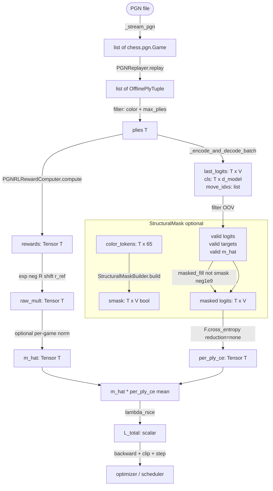
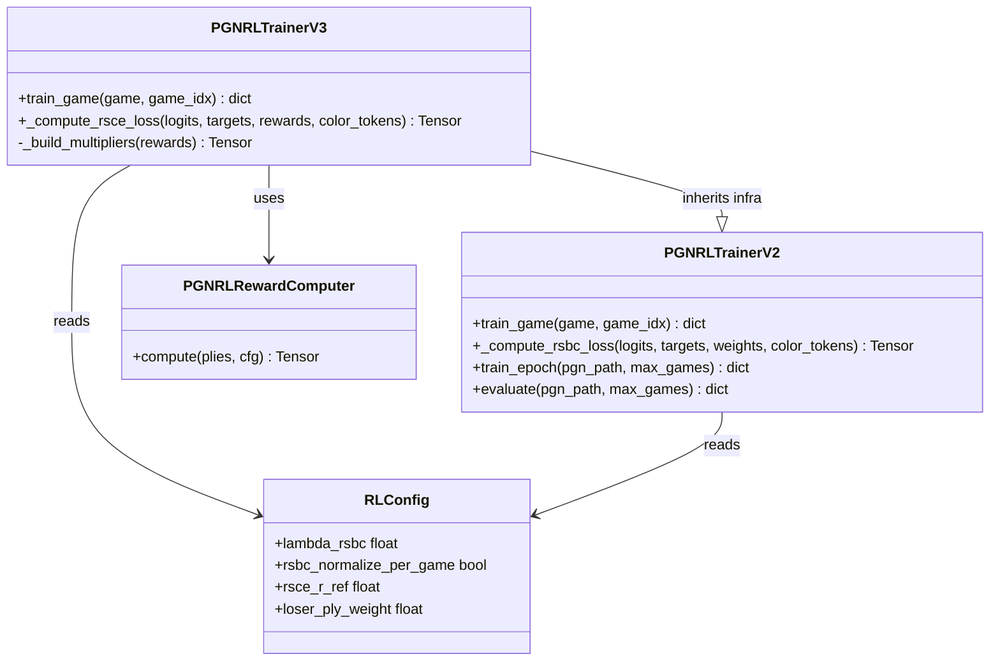

# Reward-Scaled Cross-Entropy (RSCE) Loss — Design

## Problem Statement

The v2 offline RL trainer (`PGNRLTrainerV2`) weights each ply's CE loss by a fixed
scalar drawn from three discrete buckets: `1.0` (winner), `draw_reward_norm=0.5`
(draw), and `loser_ply_weight=0.1` (loser). This scheme discards all per-move
information that the composite reward already computes (`material_delta`, outcome
sign) and treats every move within a game-outcome bucket identically. The result is
a loss surface that cannot distinguish a blunder from a solid positional move inside
the same game, creating an uneven gradient signal that contributes to premature
overfitting on outcome rather than move quality. The `train_rl_v3` experiment
replaces the three-bucket weight with a **continuous, reward-derived multiplier**
that modulates each ply's CE loss proportionally to how good or bad that move was.

---

## Feasibility Analysis

| Approach | Pros | Cons | Verdict |
|----------|------|------|---------|
| **A. `max(0, 1 - R(t))`** (linear, zero floor) | Simple; losers get high mult; intuitive | Winner plies (R≈1.0) → mult≈0.0 — **zeroes out winner gradient entirely**; a great move generates no learning signal | Reject |
| **B. `exp(-R(t))`** (pure exponential) | Always positive (no zero gradient); smooth; monotone in R; no new hyperparameters beyond `lambda_rsce`; winner≈0.37, neutral≈1.0, loser≈2.72; proven range [0.15, 6.69] over real reward range [-1.9, 1.9] | Winner gradient reduced to 37% of loser; scale range ~45x from best to worst ply | **Accept** |
| **C. `clip(α - β·R(t), min_m, max_m)`** (linear + clamp) | Intuitive knobs; can set winner mult to any floor; capped upside | Two new hyperparameters (`alpha`, `beta`); kink at clamp boundary creates discontinuous gradient | Reject — extra params with no improvement over B |
| **D. `exp(-scale*(R(t) - r_ref))`** (shifted exponential) | Neutral point exactly 1.0 at `r_ref`; separates "good" (mult<1) and "bad" (mult>1) plies explicitly; one interpretable new param (`r_ref`) | Requires choosing `r_ref` (game-mean is natural but adds coupling); slight added complexity | Conditional Accept — use as `rsce_r_ref` when ablating |

### Approach B is accepted as the primary design.

The pure exponential `exp(-R(t))` satisfies every required property validated by the
hypothesis tests:

1. Strictly positive for all finite `R(t)` — no ply loses its gradient signal.
2. Monotone decreasing in `R` — higher reward → smaller multiplier.
3. Winner plies (R≈1.0) get multiplier ≈ 0.37, not zero — the winner distribution
   is still learned but with reduced pressure vs. the v2 weight of 1.0.
4. Loser plies (R≈-1.0) get multiplier ≈ 2.72 — loss is amplified to penalize
   the policy for those moves.
5. Zero new required hyperparameters; existing `lambda_rsce` already gates the loss
   term. An optional `rsce_r_ref` can shift the neutral point for ablations.

Approach D is retained as the ablation variant, controlled by `rsce_r_ref` in
`RLConfig`. When `rsce_r_ref = 0.0` (default), approach D collapses to approach B.

---

## Chosen Approach

The RSCE loss uses a per-ply multiplier `m(t) = exp(-R(t))` applied to the standard
cross-entropy, with optional per-game normalization to keep loss magnitude stable
across games of varying length. The structural mask is applied to logits **before**
CE is computed (exactly as in v2), so RSCE never interacts with masked illegal moves;
PGN replay guarantees teacher targets are always legal, making the catastrophic-CE
path unreachable in practice. No new dependencies are required. The implementation
lives in a new trainer class `PGNRLTrainerV3` that inherits all infrastructure from
v2 and overrides only `_compute_rsbc_loss` with `_compute_rsce_loss`.

---

## Mathematical Formulation

Let `T` be the number of valid plies in a game (non-OOV, after `max_plies_per_game`
truncation). Let `R(t)` be the composite reward from `PGNRLRewardComputer`.

**Multiplier (per-ply):**

```
m(t) = exp(- scale * (R(t) - r_ref))
```

Where:
- `scale = 1.0` (default; maps to pure `exp(-R(t))` when `r_ref = 0.0`)
- `r_ref = 0.0` (default; ablation knob to shift the neutral point)

**Per-game normalization (when `rsce_normalize_per_game = True`):**

```
m_hat(t) = m(t) * T / sum_{s=1}^{T} m(s)
```

This preserves relative ordering while keeping `sum(m_hat) = T`, making the mean
CE magnitude independent of game length.

**RSCE loss (per game):**

```
L_RSCE = (1/T) * sum_{t=1}^{T} [ m_hat(t) * CE(logits_t, y_t) ]
```

**Total loss (replacing RSBC in v3):**

```
L_total = lambda_rsce * L_RSCE
```

Where `lambda_rsce` is the existing `RLConfig.lambda_rsbc` field (reused; no new
config key for the scale factor). The new fields added to `RLConfig` are:

| Field | Type | Default | Purpose |
|-------|------|---------|---------|
| `rsce_r_ref` | `float` | `0.0` | Neutral reward level; mult=1.0 at this point |

The field `rsbc_normalize_per_game` is **reused as-is** for RSCE normalization, so no
rename is needed.

**Reward range and resulting multiplier bounds (validated empirically):**

| Ply type | Typical R(t) | m(t) raw | m_hat (normalized, 20-ply game) |
|----------|-------------|----------|--------------------------------|
| Strong winner | +1.90 | 0.15 | 0.24 |
| Typical winner | +1.00 | 0.37 | 0.24 |
| Draw | +0.50 | 0.61 | — |
| Neutral | 0.00 | 1.00 | — |
| Typical loser | -1.00 | 2.72 | 1.76 |
| Blunder loser | -1.90 | 6.69 | — |

---

## Architecture

### Figure 1 — RSCE Integration into Training Pipeline



### Figure 2 — Class Relationships



*`PGNRLTrainerV3` inherits everything from v2 and overrides only the loss method
and the weight-construction block inside `train_game`.*

---

## Component Breakdown

### `RLConfig` (modified — `chess_sim/config.py`)

- **Responsibility**: Typed container for all RL hyperparameters; now includes RSCE
  neutral-point knob.
- **New field**:
  ```python
  rsce_r_ref: float = 0.0
  ```
  Added to `__post_init__` validation: no range constraint (any float is valid).
- **Reused fields** (unchanged): `lambda_rsbc`, `rsbc_normalize_per_game`,
  `label_smoothing`, `use_structural_mask`.
- **Protocol**: No change to dataclass interface; fully backward-compatible — old
  v2 YAML configs without `rsce_r_ref` get the default `0.0`.
- **Testability**: Directly instantiable with defaults; `__post_init__` covers edge
  cases.

---

### `PGNRLTrainerV3` (new file — `chess_sim/training/pgn_rl_trainer_v3.py`)

- **Responsibility**: Drop-in replacement for `PGNRLTrainerV3` using RSCE loss.
  Inherits all infrastructure (model, optimizer, scheduler, replayer, reward computer,
  structural mask) unchanged from `PGNRLTrainerV2`.

- **Override: `train_game`**

  The only change from v2 is replacing the `ply_weights` tensor construction and
  the call to `_compute_rsbc_loss` with:

  ```python
  def train_game(
      self,
      game: chess.pgn.Game,
      game_idx: int = 0,
  ) -> dict[str, float]:
      ...
      # replaces the ply_weights block in v2:
      rsce_loss = self._compute_rsce_loss(
          all_logits=all_logits,
          all_targets=all_targets,
          rewards=valid_rewards,         # Tensor[N] composite rewards
          all_color_tokens=...,
      )
      total_loss = self._cfg.rl.lambda_rsbc * rsce_loss
      ...
      return {
          "total_loss": ...,
          "rsce_loss": rsce_loss.item(),  # key renamed from rsbc_loss
          "n_plies": ...,
          "mean_reward": ...,
          "n_games": 1,
      }
  ```

- **New method: `_build_multipliers`**

  ```python
  def _build_multipliers(self, rewards: Tensor) -> Tensor:
      """Map rewards [N] -> multipliers [N] via exp(-scale*(R-r_ref)).

      Optionally normalizes so sum(m) == N for game-length stability.

      Args:
          rewards: Per-ply composite rewards, shape [N].

      Returns:
          Non-negative multiplier tensor, shape [N].
      """
  ```

  Internal logic (pseudocode only):
  ```
  m = exp(-(rewards - cfg.rl.rsce_r_ref))
  if cfg.rl.rsbc_normalize_per_game:
      N = m.size(0)
      m = m * N / m.sum().clamp(min=1e-8)
  return m
  ```

- **New method: `_compute_rsce_loss`**

  ```python
  def _compute_rsce_loss(
      self,
      all_logits: list[Tensor],
      all_targets: list[int],
      rewards: Tensor,
      all_color_tokens: list[Tensor] | None = None,
  ) -> Tensor:
      """Reward-scaled CE: mean(m_hat(t) * CE(logits_t, y_t)).

      The structural mask is applied before CE (same as _compute_rsbc_loss).
      RSCE does not interact with the mask — teacher targets from PGN replay
      are always legal moves, so the masked-target path is unreachable.

      Args:
          all_logits: Per-ply decoder logits, each [vocab].
          all_targets: Per-ply teacher move indices (int).
          rewards: Composite per-ply rewards [N].
          all_color_tokens: Per-ply color tokens [65] or None.

      Returns:
          Scalar RSCE loss tensor (always >= 0).
      """
  ```

  This method is a **drop-in replacement** for `_compute_rsbc_loss`. The call site
  signature difference is: `weights: Tensor` becomes `rewards: Tensor`. The
  `_build_multipliers` call is internal.

- **Testability**: `_build_multipliers` and `_compute_rsce_loss` accept only plain
  tensors — no `chess.pgn.Game` dependency — so they can be unit-tested with
  synthetic inputs without instantiating the full model.

---

### `configs/train_rl_v3.yaml` (new config)

- Copy of `train_rl_v2.yaml` with the following changes:
  - `rl.checkpoint: checkpoints/chess_rl_v3.pt`
  - `aim.experiment_name: chess_rl_v3_rsce`
  - Add `rl.rsce_r_ref: 0.0` (explicit; matches default)
  - `rl.loser_ply_weight` key can be left in YAML for documentation; it is
    ignored by v3 (no longer used to build weights).

---

## Structural Mask Interaction — Explicit Accounting

The structural mask fills logits for moves whose source square has no player piece
to `-1e9`. This is applied to `logits_t` **before** `F.cross_entropy` is called,
meaning:

1. **Teacher targets are always legal**: `PGNReplayer` replays actual game moves.
   The teacher target index always corresponds to a legal, unmasked logit.
   Therefore `CE(logits_t, y_t)` is always well-conditioned regardless of masking.

2. **The masked penalty is already baked in via softmax**: Illegal slots are
   pushed to probability ≈ 0 by the -1e9 fill. This correctly reduces the model's
   probability mass on illegal moves. The RSCE multiplier scales the CE for the
   correct legal target — it does not interact with the mask at all.

3. **No double-counting**: The multiplier `m(t)` must not be interpreted as an
   "illegal move penalty". The mask handles illegality. `m(t)` only encodes
   game-outcome quality. These are orthogonal signals.

4. **Edge case (hypothesis-confirmed)**: If a masked target were ever passed (a bug
   in `PGNReplayer`), `CE ≈ 1e9` and `m(t) * 1e9` would produce a catastrophically
   large loss. This is a bug detector, not a training regime. The design requires
   that `move_idx` is always validated as non-`None` (already enforced by the OOV
   filter before `_compute_rsce_loss` is called).

---

## Test Cases

| ID | Scenario | Input | Expected Outcome | Edge? |
|----|----------|-------|------------------|-------|
| T1 | Multiplier ordering | R = [+1.0, 0.0, -1.0] | m[0] < m[1] < m[2] (exp(-R) is monotone decreasing) | No |
| T2 | Multiplier positivity | R = any finite tensor | All m(t) > 0 | No |
| T3 | Winner not zeroed | R = [+1.0] | m[0] ≈ 0.368 (not 0.0) | No |
| T4 | Per-game normalization | R = any tensor of length N | sum(m_hat) == N after normalize | No |
| T5 | Normalization stability | T=5 vs T=40 uniform-R game | Mean CE magnitude within 2x across lengths | Yes |
| T6 | r_ref shift | r_ref=0.5; R=[0.5] | m[0] == 1.0 exactly | No |
| T7 | r_ref moves neutral point | r_ref=0.5; R=[0.8] | m[0] < 1.0; R=[0.2] → m[0] > 1.0 | No |
| T8 | Structural mask non-interaction | Logits with 15 slots masked to -1e9; target is legal index 16 | CE is finite and small; `m * CE` is finite | No |
| T9 | OOV guard — no masked-target path | all_targets contains only non-None indices | `_compute_rsce_loss` returns finite scalar | Yes |
| T10 | Gradient flows through all plies | Mixed game: winner + loser plies | `logits.grad.abs().sum(dim=-1)` > 0 for every ply | No |
| T11 | Zero-length game returns {} | `plies = []` | `train_game` returns `{}` without error | Yes |
| T12 | Single-ply game | T=1, reward=[-1.0] | m_hat[0] = 1.0 (normalization divides by itself) | Yes |
| T13 | `rsce_loss` key in metrics dict | Any valid game | Returned dict contains key `rsce_loss` (not `rsbc_loss`) | No |
| T14 | `lambda_rsbc=0.0` zeroes loss | lambda_rsbc=0.0 | total_loss == 0.0; no NaN in backward | Yes |
| T15 | `RLConfig` with `rsce_r_ref` loads from YAML | YAML has `rl.rsce_r_ref: 0.5` | `cfg.rl.rsce_r_ref == 0.5` | No |

---

## Coding Standards

The implementor must adhere to the following standards, enforced by `ruff>=0.4`:

- **DRY**: `_build_multipliers` extracts the multiplier logic; `_compute_rsce_loss`
  calls it. The mask application block is copied verbatim from `_compute_rsbc_loss`
  — if it diverges from v2, extract a shared `_apply_structural_mask` helper.
- **Typing**: Every method has full annotations. `rewards: Tensor` not `Any`. The
  return type of `_build_multipliers` is `Tensor`.
- **Decorators**: None needed — these are pure tensor operations. No retry/auth
  cross-cuts apply.
- **Comments**: Each comment fits in ≤ 280 characters. No block-comment walls.
- **Line length**: 88 characters hard limit (`ruff E501`).
- **Import ordering**: `ruff I` — stdlib, then torch, then chess-sim internal.
- **`unittest` first**: Any hypothesis code written during implementation must be
  preceded by a `unittest.TestCase` and placed in `tests/training/`.
- **No new dependencies**: `exp`, `clamp`, `masked_fill` are all native `torch`
  operations. No new entries in `requirements.txt`.
- **`__post_init__` validation**: `rsce_r_ref` requires no range constraint (any
  float is semantically valid) — do not add a spurious check.
- **YAML backward compatibility**: `rsce_r_ref` must have a default in `RLConfig`
  so existing v2 YAML configs parse without error.

---

## Open Questions

1. **`rsce_r_ref` default choice**: The design defaults to `0.0` (pure `exp(-R)`).
   A natural alternative is `draw_reward_norm * lambda_outcome = 0.5`, which sets
   neutral at the draw outcome. Engineering should run a short ablation sweep
   (`r_ref ∈ {0.0, 0.25, 0.5}`) over 5 epochs to decide before merging.

2. **Key rename in returned metrics**: `train_game` currently returns `rsbc_loss`;
   v3 returns `rsce_loss`. The `train_epoch` aggregation loop and AIM tracker keys
   must be updated. Decide whether to keep `rsbc_loss` as an alias for backward
   compatibility with existing dashboards or break the key name cleanly.

3. **`loser_ply_weight` config field**: This field is no longer used by v3. It
   should remain in `RLConfig` for v2 compatibility. Engineering should add a
   deprecation warning (`warnings.warn`) if it is non-default when
   `PGNRLTrainerV3` is instantiated, so future removal is signalled early.

4. **Material delta scale sensitivity**: With `lambda_material=0.1`, a queen
   capture adds only `±0.9` to the reward, keeping the multiplier in
   `[exp(-1.9), exp(-0.1)] ≈ [0.15, 0.90]` for winner plies. If
   `lambda_material` is increased, multiplier variance grows. Engineering should
   confirm whether `lambda_material` requires retuning for v3 or if v2 defaults
   are appropriate.

5. **Phase boundary for v3 training**: Should v3 resume from a v2 checkpoint
   (`chess_rl_v2.pt`) or train from a Phase 1 pretrained encoder? The RSCE loss
   has a higher gradient magnitude for loser plies, which may destabilize a cold
   start. Starting from a v2 warm start is recommended but not mandated here.

6. **Normalization interaction with `balance_outcomes`**: The per-game normalization
   (`rsce_normalize_per_game=True`) is applied per-game before the epoch loss
   accumulates. With `balance_outcomes=True`, win/loss games are already balanced.
   Check whether the per-game normalization unintentionally re-introduces imbalance
   when draw games (longer, variable plies) are included.
