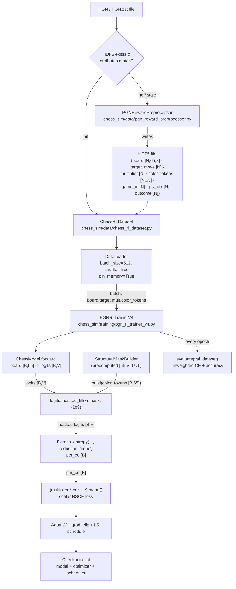
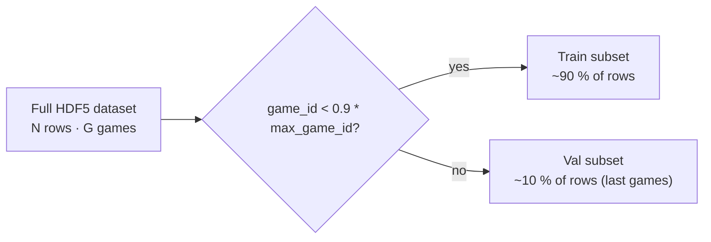

# RSCE V4 Batched Training Pipeline — Design

## Problem Statement

`PGNRLTrainerV3` processes games one at a time in a sequential loop. Each game
produces a forward pass over its plies (typically 30–80 positions), but those
passes are batched only within a single game. Across games the GPU sees a new,
unrelated batch at every optimizer step, yielding GPU utilization well below
10 % for a 1 k-game epoch (~14.5 min) and an estimated ~150 min/epoch for 10 k
games. Because RSCE rewards are derived entirely from PGN outcome labels and
material deltas — never from model predictions — they are static scalars that
can be computed once, stored on disk, and reused across all epochs. Eliminating
per-epoch reward computation and replacing the sequential game loop with a
standard `DataLoader` minibatch loop is the fastest path to acceptable GPU
utilization without changing the loss semantics.

---

## Feasibility Analysis

### Per-game normalization in the batched setting

| Approach | Pros | Cons | Verdict |
|---|---|---|---|
| **A — Pre-normalize in HDF5**: compute `m_hat(t)` per game during preprocessing; store the normalized multiplier directly | Zero runtime grouping; `DataLoader` shuffle works unmodified; no custom collate; negligible extra storage (float32 per row) | Normalization is baked in — cannot be changed without regenerating the file | **Accept (primary)** |
| **B — Store raw rewards; normalize per-game in collate_fn using `game_id`**: group batch rows by `game_id`, compute per-group `m_hat` | Faithful to original semantics at runtime; allows `rsce_r_ref` sweeps without re-preprocessing | Custom `collate_fn`; grouping inside a DataLoader worker is non-trivial; a batch may contain partial games, violating per-game normalization | Reject (future option) |

Option A is strictly simpler. The normalization contract is identical to V3
(`m * N / sum(m)` per game) — it is just applied offline instead of online.

### HDF5 I/O bottleneck

| Approach | Pros | Cons | Verdict |
|---|---|---|---|
| **h5py with chunked datasets + `pin_memory=True`**: standard h5py reads, DataLoader workers pull independent chunks | No additional dependencies; `h5py` already used in the RL preprocess pipeline; chunk-aligned reads minimize partial reads | Worker processes each open the file independently; max 4–8 workers recommended | **Accept** |
| **Memory-map entire file into RAM**: `numpy.memmap` or h5py SWMR | Zero syscall overhead after first epoch | Requires RAM >= file size; files for 10 k games ≈ 1.5 GB — acceptable on most training hosts but not guaranteed | Reject (future option if I/O is still a bottleneck after profiling) |

### Structural mask in batched setting

`StructuralMaskBuilder.build(color_tokens: Tensor [B, 65]) → Tensor [B, V]`
already operates on a batch of color tokens. The only requirement is that
`color_tokens` is stored per-ply in the HDF5 and batched normally by the
DataLoader. No architectural change is needed.

### Idempotency / cache invalidation

| Approach | Pros | Cons | Verdict |
|---|---|---|---|
| **Checksum header in HDF5** (SHA-256 of first 1 MB of PGN + `max_games` + key RL config fields stored as HDF5 attributes): skip generation if attributes match | Cheap; deterministic; mirrors existing shard-cache strategy | Config fields that affect reward (e.g. `lambda_outcome`, `rsce_r_ref`) must be included in the hash | **Accept** |
| **Always regenerate** | Simple | Defeats the purpose of offline preprocessing | Reject |

---

## Chosen Approach

The preprocessor computes per-game-normalized RSCE multipliers offline
(`m_hat = m * N / sum(m)`) and stores them as float32 scalars alongside the
board tensor and target move index in a single chunked, gzip-compressed HDF5
file. `ChessRLDataset` wraps the file with standard h5py indexing and exposes
`(board, target_move, multiplier, color_tokens)` tuples. `PGNRLTrainerV4`
wraps the dataset in a PyTorch `DataLoader` with `pin_memory=True` and
configurable worker count, then runs a standard minibatch loop: forward pass,
per-sample CE with `reduction="none"`, element-wise multiply by `multiplier`,
scalar mean, backward. The structural mask is applied to `logits` before CE
using the batched `color_tokens` already present in each item. All existing
reward hyperparameters (`lambda_outcome`, `lambda_material`, `rsce_r_ref`,
`rsbc_normalize_per_game`) are consumed during preprocessing; no reward
computation occurs during training epochs.

---

## Architecture

*Figure 1 — Full data and training flow for V4 batched RSCE pipeline.*



*Figure 2 — Validation split: last 10 % of dataset by game_id (no random
shuffling into the val fold).*



---

## Component Breakdown

### `PGNRewardPreprocessor`
- **File**: `chess_sim/data/pgn_reward_preprocessor.py`
- **Responsibility**: Stream a PGN file, replay each game via `PGNReplayer`,
  compute per-ply composite rewards via `PGNRLRewardComputer`, apply per-game
  normalization, encode the board state, and write all rows to HDF5. Returns
  the path to the generated (or cached) file.
- **Idempotency**: On `generate()`, open the target HDF5 (if it exists), read
  stored attributes (`pgn_checksum`, `max_games`, `lambda_outcome`,
  `lambda_material`, `rsce_r_ref`, `draw_reward_norm`,
  `rsbc_normalize_per_game`), and skip regeneration if all match.
- **Key interface**:
  ```
  class PGNRewardPreprocessor:
      def __init__(self, cfg: PGNRLConfig) -> None: ...
      def generate(self, pgn_path: Path) -> Path: ...
      def _write_batch(
          self,
          hf: h5py.File,
          rows: list[RLRewardRow],
          cursor: int,
      ) -> int: ...
      def _compute_checksum(self, pgn_path: Path) -> str: ...
  ```
- **HDF5 schema** (datasets, all `N`-length along axis 0):

  | Dataset | dtype | shape | notes |
  |---|---|---|---|
  | `board` | float32 | (N, 65, 3) | Channels: board_tokens, color_tokens, traj_tokens |
  | `color_tokens` | int8 | (N, 65) | Stored separately for mask building |
  | `target_move` | int32 | (N,) | Vocab index from `MoveTokenizer.tokenize_move` |
  | `multiplier` | float32 | (N,) | Pre-normalized m_hat per ply |
  | `game_id` | int32 | (N,) | Source game index |
  | `ply_idx` | int16 | (N,) | 0-indexed ply within game |
  | `outcome` | int8 | (N,) | +1 / 0 / -1 from side-to-move perspective |

- **Chunked writes**: rows are buffered in memory until `chunk_size` (default
  1024) are ready, then written together. Datasets are pre-allocated or
  resizable (`maxshape=(None, ...)`).
- **Protocol**: none (concrete class); injected into entry script.
- **Testability**: inject a minimal fake `PGNReplayer` and
  `PGNRLRewardComputer` to test write logic in isolation.

---

### `RLRewardRow`
- **File**: `chess_sim/types.py` (append to existing file)
- **Responsibility**: Immutable intermediate container passed between replay
  and HDF5 write. No torch tensors — plain Python / NumPy types only.
- **Key interface**:
  ```
  class RLRewardRow(NamedTuple):
      board: np.ndarray          # shape (65, 3) float32
      color_tokens: np.ndarray   # shape (65,) int8
      target_move: int
      multiplier: float          # pre-normalized m_hat
      game_id: int
      ply_idx: int
      outcome: int               # +1 / 0 / -1
  ```

---

### `ChessRLDataset`
- **File**: `chess_sim/data/chess_rl_dataset.py`
- **Responsibility**: `torch.utils.data.Dataset` wrapping an open HDF5 file.
  Returns one sample per `__getitem__` call as a typed tuple. Supports
  `__len__`. Lazy: the HDF5 file is opened once in `__init__` and held open;
  h5py handles OS-level buffering.
- **Key interface**:
  ```
  class ChessRLDataset(Dataset):
      def __init__(self, hdf5_path: Path) -> None: ...
      def __len__(self) -> int: ...
      def __getitem__(
          self, idx: int,
      ) -> tuple[Tensor, int, float, Tensor]: ...
          # returns: board [65,3], target_move, multiplier, color_tokens [65]
      def close(self) -> None: ...
  ```
- **Val split**: the implementor slices indices where
  `game_id >= val_game_id_threshold`. `val_game_id_threshold` is passed at
  construction from `int(max_game_id * (1 - val_split_fraction))`. This
  produces a `Subset`-compatible index list, not a separate file.
- **Protocol**: `torch.utils.data.Dataset[tuple[Tensor, int, float, Tensor]]`.
- **Testability**: construct with a small synthetic HDF5 written by the test
  fixture; no real PGN required.

---

### `PGNRLTrainerV4`
- **File**: `chess_sim/training/pgn_rl_trainer_v4.py`
- **Responsibility**: Minibatch RSCE training loop. Does not inherit from V2 or
  V3. Owns the model, optimizer, scheduler, and structural mask. Accepts
  `ChessRLDataset` and wraps it in a `DataLoader` internally.
- **Key interface**:
  ```
  class PGNRLTrainerV4:
      def __init__(
          self,
          cfg: PGNRLConfig,
          device: str = "cpu",
          total_steps: int = 10_000,
          tracker: MetricTracker | None = None,
      ) -> None: ...

      def train_epoch(
          self,
          dataset: ChessRLDataset,
      ) -> dict[str, float]: ...
          # keys: total_loss, rsce_loss, n_samples, mean_reward, n_games

      def evaluate(
          self,
          dataset: ChessRLDataset,
      ) -> dict[str, float]: ...
          # keys: val_loss, val_accuracy, val_n_samples

      def save_checkpoint(self, path: Path) -> None: ...
      def load_checkpoint(self, path: Path) -> None: ...

      @property
      def model(self) -> ChessModel: ...
      @property
      def current_lr(self) -> float: ...
  ```
- **`train_epoch` internals**:
  1. Set `self._model.train()`.
  2. Create `DataLoader(dataset, batch_size=cfg.rl.batch_size,
     shuffle=True, num_workers=cfg.rl.num_workers,
     pin_memory=(device != "cpu"))`.
  3. For each batch `(board [B,65,3], target [B], mult [B], ct [B,65])`:
     - Split board channels: `bt = board[:,:,0].long()`,
       `ct_tok = board[:,:,1].long()`, `tt = board[:,:,2].long()`.
     - Forward: `logits = self._model(bt, ct_tok, tt, prefix, None)`
       where `prefix` is a minimal `[B, 1]` SOS token (the decoder needs at
       least a SOS to produce the first-position logits — see note below).
     - Build structural mask: `smask = self._struct_mask.build(ct [B,65])`.
     - Apply: `logits.masked_fill_(~smask, -1e9)`.
     - `per_ce = F.cross_entropy(logits, target, reduction="none")`.
     - `loss = (mult * per_ce).mean()`.
     - `loss.backward()`, `clip_grad_norm_`, `opt.step()`, `sched.step()`.
  4. Accumulate running stats; return averaged dict.
- **Decoder prefix note**: in V3, each ply carries a full `move_prefix` (SOS +
  prior game moves). In V4, storing per-ply prefixes in HDF5 would double the
  file size and require variable-length padding. Instead the design stores only
  the first-position logit (the "next move from scratch" prediction). The
  preprocessor feeds a `[1, 1]` SOS-only prefix during the decode step, and
  stores the resulting logit's target index. This preserves the RSCE loss
  semantics (CE on the teacher's move) while keeping HDF5 schemas fixed-width.
  The implementor must confirm this matches V3 semantics and document the
  choice in an inline comment; see Open Questions.
- **LR schedule**: identical three-phase schedule to V2/V3: linear warmup →
  constant → cosine decay, parameterized by `warmup_fraction` and
  `decay_start_fraction`.
- **Protocol**: none (concrete); depends on `MetricTracker` protocol for
  logging.
- **Testability**: inject a minimal synthetic `ChessRLDataset` backed by an
  in-memory HDF5 fixture; mock `ChessModel` to return fixed logits.

---

### `scripts/train_rl_v4.py`
- **Responsibility**: Entry point. Orchestrates config loading,
  `PGNRewardPreprocessor.generate()`, `ChessRLDataset` instantiation, trainer
  construction, and epoch loop with val + checkpoint.
- **Key interface**:
  ```
  def main(config_path: Path) -> None: ...
  ```
- **Epoch loop**:
  1. Call `preprocessor.generate(pgn_path)` → `hdf5_path`.
  2. Build `train_dataset` and `val_dataset` (index subsets by `game_id`).
  3. For each epoch: `train_epoch(train_dataset)` → log → `evaluate(val_dataset)` → checkpoint.

---

### `configs/train_rl_v4.yaml`
- Extends `train_rl_v3.yaml`; adds the new `rl` fields listed in the Config
  Changes section below.

---

## Config Changes

The following fields are added to `RLConfig` in `chess_sim/config.py`. No
existing fields are removed. All new fields have safe defaults so existing V3
configs remain valid.

| Field | Type | Default | Meaning |
|---|---|---|---|
| `hdf5_path` | `str` | `""` | Path to write/read the preprocessed HDF5. Empty string triggers auto-name from PGN path. |
| `batch_size` | `int` | `512` | Minibatch size for `DataLoader`. |
| `num_workers` | `int` | `4` | DataLoader worker processes. Set to 0 for debugging. |
| `val_split_fraction` | `float` | `0.1` | Fraction of games (by `game_id`) reserved for validation. |
| `hdf5_chunk_size` | `int` | `1024` | HDF5 write buffer size (rows per chunk). |

Validation additions to `RLConfig.__post_init__`:
- `batch_size >= 1`
- `num_workers >= 0`
- `0.0 < val_split_fraction < 1.0`
- `hdf5_chunk_size >= 1`

---

## Test Cases

| ID | Scenario | Input | Expected Outcome | Edge? |
|---|---|---|---|---|
| TC01 | HDF5 generation: row count matches plies | 3-game PGN with known ply counts | `len(dataset) == sum(train_color_plies_per_game)` | No |
| TC02 | HDF5 generation: idempotency on re-run | Call `generate()` twice with identical config | Second call returns same path without writing; file mtime unchanged | No |
| TC03 | HDF5 generation: cache invalidation on config change | Change `lambda_outcome`; call `generate()` again | File is regenerated; attributes updated | Yes |
| TC04 | `ChessRLDataset.__len__` returns correct count | Pre-built HDF5 with 200 rows | `len(dataset) == 200` | No |
| TC05 | `ChessRLDataset.__getitem__` shape and dtype | Access index 0 | `board.shape == (65, 3)`, `multiplier` is float, `color_tokens.shape == (65,)` | No |
| TC06 | `ChessRLDataset.__getitem__` out-of-bounds | Access index `len(dataset)` | `IndexError` raised | Yes |
| TC07 | Per-game normalization correctness | 1 game, 4 plies with rewards `[1.0, 0.0, -1.0, 0.5]` | `sum(multipliers) == 4.0` (mean multiplier == 1.0) | No |
| TC08 | Per-game normalization with all-zero rewards | 1 game, all R(t) == 0.0 | No NaN or Inf in multipliers; values are all 1.0 (uniform) | Yes |
| TC09 | Batched RSCE loss: correct scalar shape | Mock dataset; single batch of 8 samples | `loss.dim() == 0` and `loss >= 0` | No |
| TC10 | Batched RSCE loss: high-reward samples get lower gradient weight | Batch of 2 — one with high reward, one low | `multiplier[low_reward] > multiplier[high_reward]` | No |
| TC11 | Structural mask applied in batch | Batch of 4 with different board positions | Logits at illegal from-squares are `-1e9` for each item | No |
| TC12 | Val split: no game_id leakage | Dataset with 10 games; `val_split_fraction=0.2` | Val indices all have `game_id >= 8`; train indices all have `game_id < 8` | No |
| TC13 | Val split: empty val set when fraction too small | Dataset with 1 game; `val_split_fraction=0.1` | Val dataset length is 0; `evaluate()` returns zero metrics without crash | Yes |
| TC14 | Checkpoint round-trip | Save then load; run one train step | Loss before and after load are bit-identical for same batch | No |
| TC15 | DataLoader shuffle reproducibility | Set `generator=torch.Generator().manual_seed(42)` | Two DataLoaders with same seed yield same sample order | No |

---

## Coding Standards

The engineering team must follow all project conventions enforced by `ruff>=0.4`
(rules E, W, F, ANN, I; 88-char line limit). Specific reminders for this
component:

- **Typing**: every method signature carries complete type annotations. `h5py`
  datasets are typed as `h5py.Dataset`; no bare `Any` except where h5py's own
  API forces it, in which case a `# type: ignore[...]` comment with an
  explanation is required.
- **No new dependencies without justification**: `h5py` is already present in
  `requirements.txt` (used by `rl_hdf5_pipeline`). Verify with
  `python -m ruff check .` before opening a PR.
- **`unittest` before hypothesis scripts**: any implementation uncertainty must
  be explored in a throwaway script under a virtualenv; delete the script
  before committing.
- **DRY**: the three-phase LR schedule construction (warmup / constant /
  cosine) is duplicated across V2, V3. The implementor should extract it to
  `chess_sim/training/training_utils.py` as `build_lr_schedule(opt, cfg, total_steps)
  -> SequentialLR` and call it from V4. V2/V3 may be refactored opportunistically.
- **Decorators**: use the existing `@torch.no_grad()` pattern for `evaluate`;
  do not duplicate context manager boilerplate inline.
- **Comments**: ≤ 280 characters per comment. Explain the SOS-prefix decision
  (see Open Questions) in a single inline comment, not a multi-paragraph block.
- **HDF5 file handle lifetime**: `ChessRLDataset` opens the file in
  `__init__` and closes it in `close()`. The entry script calls `close()` in a
  `finally` block. Do not open/close per item.
- **`weights_only=True`** on all `torch.load()` calls (existing security
  convention; do not regress).

---

## Open Questions

1. **SOS-only prefix vs full move history**: V3 builds the decoder prefix from
   the full prior-move history of the game (SOS + all preceding moves up to
   ply t). V4 proposes storing only a SOS-only prefix per ply to keep HDF5
   schema fixed-width. Does this change the loss semantics enough to hurt
   training quality? The engineering team should run a short ablation (e.g.
   100-game epoch) comparing V3 (sequential, full prefix) against V4 (batched,
   SOS-only) before committing to the schema.

2. **Cache invalidation scope**: the proposed cache key includes
   `lambda_outcome`, `lambda_material`, `rsce_r_ref`, and `draw_reward_norm`.
   Should `balance_outcomes` and `skip_draws` also be included? Those flags
   affect which games are written to HDF5, so a mismatch would silently produce
   a dataset with the wrong game distribution. Recommendation: include all
   filtering flags in the checksum attributes.

3. **HDF5 file size for large corpora**: 10 k games ≈ 600 k plies. At 4 bytes
   × 65 × 3 (board float32) + 1 × 65 (color int8) + 4 + 4 + 2 + 4 + 1
   (scalars) ≈ 851 bytes/row uncompressed, the file is ≈ 511 MB before gzip.
   gzip level 4 typically yields 2–4x compression on token data. The team
   should benchmark I/O throughput at batch_size=512, num_workers=4 to confirm
   that HDF5 read speed does not become the new bottleneck before the full
   50 k-game run.

4. **Mid-epoch interrupt recovery**: the current design does not checkpoint
   mid-epoch. An epoch of 600 k samples at batch_size=512 is ~1 170 steps.
   If training is interrupted, all progress within the epoch is lost. Should
   the trainer checkpoint every N steps (configurable via `rl.checkpoint_every`
   field)? Defer to stakeholder preference.

5. **`val_split_fraction` and dataset imbalance**: splitting by `game_id`
   rather than by ply index may produce a val set with a systematically
   different outcome distribution than the train set if the PGN file is sorted
   by date (earlier games in train, later games in val). The team should verify
   the val set outcome distribution matches the train set before using val loss
   as a convergence signal.

6. **`num_workers > 0` and h5py**: h5py is not fork-safe by default when the
   file is opened in the parent process before `DataLoader` forks workers.
   `ChessRLDataset.__init__` should defer file opening to the first
   `__getitem__` call (lazy open) or use a per-worker `worker_init_fn` to
   re-open the file. The implementor should validate this on the target
   platform before setting `num_workers > 0` as the default.

7. **Accuracy metric during training**: V3 reports `mean_reward` per epoch but
   not per-step accuracy. V4 should track top-1 accuracy (`argmax(logits) ==
   target`) on the training set as a sanity signal, consistent with the
   generalization gap convention from prior phases.

---

## Future Considerations

The following items were identified during the v4 refactor pass but deferred to avoid
scope creep. Revisit once the current pipeline is validated on a full training run.

### Item 9 — Separate `outcome_sign` and `material_delta` in HDF5 (prerequisite for learnable λ)

Currently `multiplier` is pre-baked at preprocess time:
```
R(t) = λ_outcome * sign_outcome(t) + λ_material * Δmat(t)
m̂(t) = exp(-R(t)) * N / Σexp(-R(j))
```
Any change to λ_outcome or λ_material requires regenerating the full HDF5. The fix is
to store raw reward components separately and compute multipliers at batch time using
learnable scalars `α`, `β` as `nn.Parameter` on the trainer (not the model):

```
m(t) = exp(-α * outcome_sign(t)) * exp(-β * Δmat(t))  [factored; per-batch normalized]
```

This ensures material quality and game outcome each credit independently. `α >> β`
preserves outcome dominance. Learned scalars are saved under `"training_params"` in the
checkpoint but excluded from `model.state_dict()` — no inference impact.

**Schema change required**: add `material_delta: float32 (N,)` to `_DATASETS` in
`pgn_reward_preprocessor.py`; propagate through `ChessRLDataset.__getitem__` (6th
element); guard behind `cfg.rl.use_learnable_alpha` in `PGNRLTrainerV4`.

### Item 10 — `top3_accuracy` and `multiplier_std` in `evaluate`

- **`top3_accuracy`**: Whether the teacher move is in the model's top-3 predictions.
  For chess many positions have near-equivalent moves; top-3 is a softer and often more
  informative signal than exact top-1. Implement with `torch.topk(last_logits, k=3)`.

- **`multiplier_std`**: Std of m̂(t) across the batch. After per-game normalization the
  mean is always ≈1.0 by construction. If `multiplier_std ≈ 0`, every move gets the
  same weight and RSCE reduces to plain CE with no reward guidance. A low std is an
  early warning that the reward formula yields no gradient contrast.

Both are addable to `evaluate`'s return dict and `tracker.track_epoch` with no schema
changes required.
