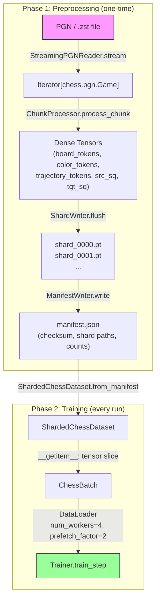
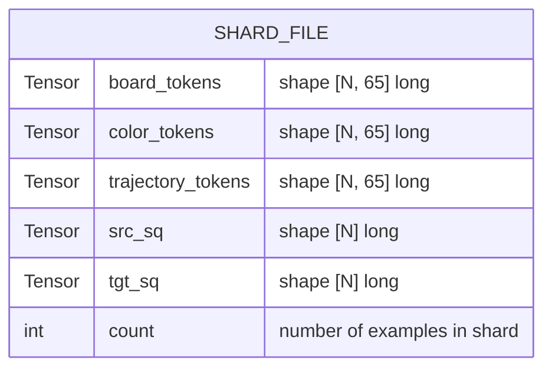
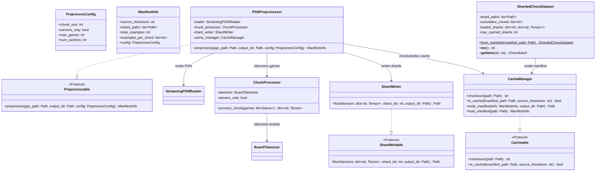
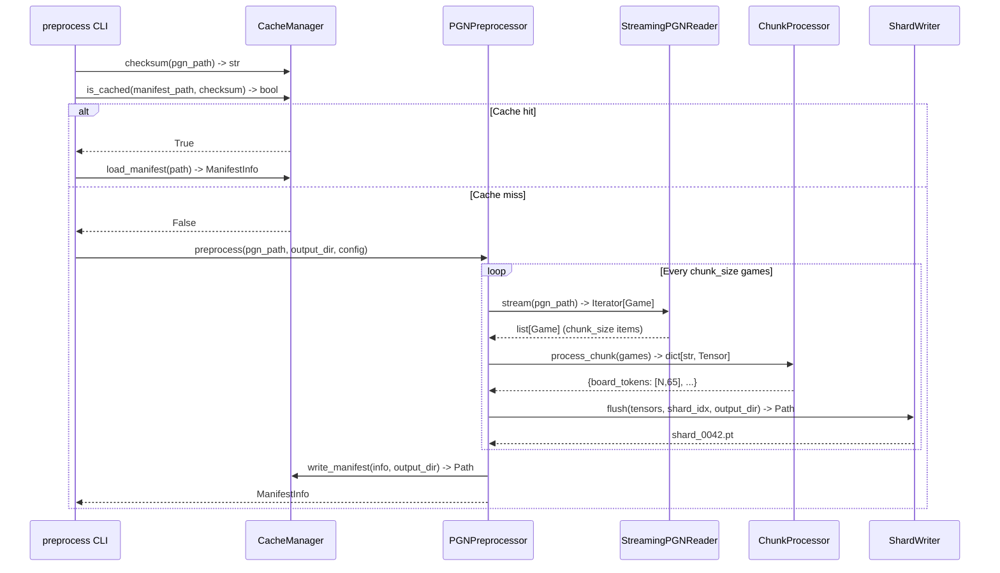
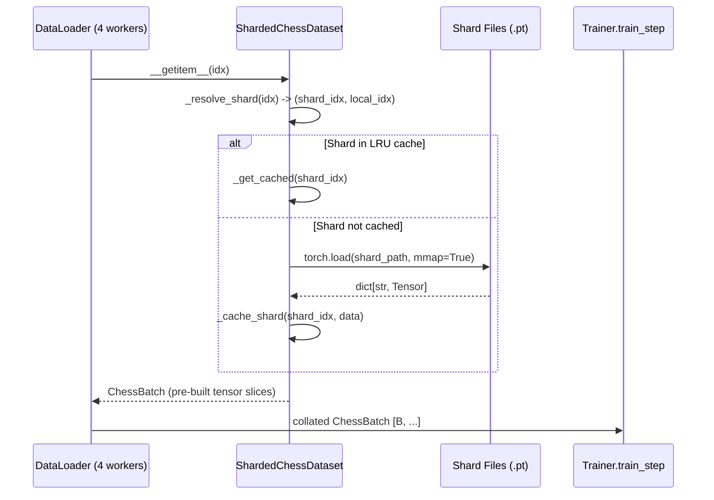

# Streaming Data Pipeline -- Design

## Problem Statement

The chess-sim training pipeline currently preloads ALL training examples into a Python `list[TrainingExample]` before training begins. Each `TrainingExample` stores five Python lists/ints, and `ChessDataset.__getitem__` creates five new `torch.tensor` objects per call. With large PGN files containing millions of games (each producing ~40 positions), this means tens of millions of Python objects consuming gigabytes of RAM, a multi-minute startup delay, zero disk caching across restarts, and single-process data loading (`num_workers=0`). The engineering team needs a streaming, memory-efficient, disk-cached pipeline that starts training within seconds of launch.

## Feasibility Analysis

| Approach | Pros | Cons | Verdict |
|---|---|---|---|
| **A. Pre-tensorized `.pt` shard files (chunked preprocessing)** | Native PyTorch; no new deps; memory-mapped via `torch.load(mmap=True)`; trivial `DataLoader` integration; shard-level parallelism; disk cache is free | Requires one-time preprocessing pass; shard files consume disk (~2x raw data) | **Accept** |
| **B. Apache Arrow / Parquet columnar storage** | Columnar access; cross-language; built-in compression | New dependency (`pyarrow`); tensor conversion overhead per batch; unfamiliar to team; overkill for fixed-width int arrays | Reject |
| **C. `IterableDataset` with on-the-fly tokenization** | Zero preprocessing; true streaming | Cannot shuffle globally (only buffer-shuffle); no disk cache; re-parses PGN every epoch; CPU-bound tokenization in the hot path | Reject |
| **D. SQLite / LMDB key-value store** | Random access; proven; LMDB is memory-mapped | New dependency; serialization overhead; index management; not a natural fit for dense tensor data | Reject |
| **E. HDF5 with chunked datasets** | Memory-mapped; chunked I/O | New dependency (`h5py`); GIL contention with multi-worker reads; file locking issues | Reject |

## Chosen Approach

**Approach A: Pre-tensorized `.pt` shard files with chunked preprocessing.** This approach splits the pipeline into two phases: (1) a preprocessing step that reads the PGN file in chunks of N games, tokenizes them, packs the results into dense `torch.long` tensors, and flushes each chunk to a numbered shard file on disk; (2) a training-time `Dataset` that loads shard metadata, memory-maps shard files, and serves pre-built tensors directly. This eliminates the full-preload bottleneck, removes per-item tensor creation, enables multi-worker `DataLoader` with prefetching, and provides a persistent disk cache keyed by a source-file checksum. No new dependencies are required -- only `torch` and the existing stack.

## Architecture

### Data Flow Overview

*Caption: End-to-end data flow from raw PGN to training batches. Phase 1 (preprocessing) runs once per dataset. Phase 2 (training) uses cached shards.*



### Shard File Layout

*Caption: Internal structure of a single shard `.pt` file. All fields are pre-tensorized `torch.long`.*



### Class Diagram

*Caption: Static structure of the new pipeline components and their protocol relationships.*



### Sequence Diagram: Preprocessing

*Caption: Runtime interaction during the one-time preprocessing phase.*



### Sequence Diagram: Training-Time Data Loading

*Caption: How ShardedChessDataset serves batches through DataLoader workers.*



## Component Breakdown

### `PreprocessConfig` (dataclass)
- **Responsibility:** Holds all preprocessing hyperparameters in one immutable structure.
- **Key interface:**
  ```
  @dataclass(frozen=True)
  class PreprocessConfig:
      chunk_size: int = 1024
      winners_only: bool = False
      max_games: int = 0
      num_workers: int = 1
  ```
- **Testability:** Pure data; no logic to test.

---

### `ChunkProcessor`
- **Responsibility:** Converts a list of `chess.pgn.Game` objects into a dict of dense `torch.long` tensors. Reuses the existing `BoardTokenizer` and `game_to_examples` logic but packs results into tensors instead of Python lists.
- **Key interface:**
  ```
  class ChunkProcessor:
      def __init__(self, tokenizer: Tokenizable, winners_only: bool = False) -> None: ...
      def process_chunk(self, games: list[chess.pgn.Game]) -> dict[str, Tensor]: ...
  ```
  - `process_chunk` returns `{"board_tokens": Tensor[N,65], "color_tokens": Tensor[N,65], "trajectory_tokens": Tensor[N,65], "src_sq": Tensor[N], "tgt_sq": Tensor[N]}`.
- **Testability:** Pass a known single-game list; assert output tensor shapes and values match manual tokenization.

---

### `ShardWriter` (implements `ShardWritable`)
- **Responsibility:** Serializes a tensor dict to a numbered `.pt` file on disk.
- **Key interface:**
  ```
  class ShardWriter:
      def flush(self, tensors: dict[str, Tensor], shard_idx: int, output_dir: Path) -> Path: ...
  ```
  - File naming: `shard_{shard_idx:06d}.pt`
  - Uses `torch.save` with the tensor dict.
- **Testability:** Write a shard to a `tempdir`; reload with `torch.load`; assert roundtrip equality.

---

### `CacheManager` (implements `Cacheable`)
- **Responsibility:** Computes file checksums, reads/writes manifest JSON, and determines cache validity.
- **Key interface:**
  ```
  class CacheManager:
      def checksum(self, path: Path) -> str: ...
      def is_cached(self, manifest_path: Path, source_checksum: str) -> bool: ...
      def write_manifest(self, info: ManifestInfo, output_dir: Path) -> Path: ...
      def load_manifest(self, path: Path) -> ManifestInfo: ...
  ```
  - `checksum` computes SHA-256 of the first 1 MB + file size (fast for large files).
  - `manifest.json` schema: `{"source_checksum": str, "shard_paths": list[str], "total_examples": int, "examples_per_shard": list[int], "config": dict}`.
- **Testability:** Create a temp file; verify checksum stability. Write and reload a manifest; assert fields match.

---

### `ManifestInfo` (dataclass)
- **Responsibility:** Typed representation of the `manifest.json` on-disk format.
- **Key interface:**
  ```
  @dataclass(frozen=True)
  class ManifestInfo:
      source_checksum: str
      shard_paths: list[Path]
      total_examples: int
      examples_per_shard: list[int]
      config: PreprocessConfig
  ```
- **Testability:** Pure data; serialization tested through `CacheManager`.

---

### `PGNPreprocessor` (implements `Preprocessable`)
- **Responsibility:** Orchestrates the full preprocessing pipeline: stream games, chunk them, tokenize, write shards, write manifest. This is the top-level entry point for Phase 1.
- **Key interface:**
  ```
  class PGNPreprocessor:
      def __init__(
          self,
          reader: StreamingPGNReader,
          chunk_processor: ChunkProcessor,
          shard_writer: ShardWriter,
          cache_manager: CacheManager,
      ) -> None: ...
      def preprocess(self, pgn_path: Path, output_dir: Path, config: PreprocessConfig) -> ManifestInfo: ...
  ```
- **Algorithm:**
  1. Compute source checksum. If cached, return existing `ManifestInfo`.
  2. Stream games via `reader.stream(pgn_path)`.
  3. Accumulate `config.chunk_size` games into a buffer.
  4. Pass buffer to `chunk_processor.process_chunk` -> tensor dict.
  5. Pass tensor dict to `shard_writer.flush` -> shard path.
  6. After all games, write manifest via `cache_manager.write_manifest`.
- **Testability:** Mock `StreamingPGNReader` to yield 3 known games with `chunk_size=2`. Assert 2 shards created, manifest total matches expected example count.

---

### `ShardedChessDataset` (extends `torch.utils.data.Dataset`)
- **Responsibility:** Maps a global index to a `ChessBatch` by resolving which shard contains that index, loading the shard (with LRU caching), and slicing the pre-built tensors. Returns `ChessBatch` with zero per-item tensor allocation.
- **Key interface:**
  ```
  class ShardedChessDataset(Dataset):
      def __init__(self, shard_paths: list[Path], examples_per_shard: list[int], max_cached_shards: int = 8) -> None: ...
      @staticmethod
      def from_manifest(manifest_path: Path) -> ShardedChessDataset: ...
      def __len__(self) -> int: ...
      def __getitem__(self, idx: int) -> ChessBatch: ...
  ```
- **Internal state:**
  - `_cumulative_counts: list[int]` -- prefix sums for O(log n) shard lookup via `bisect`.
  - `_shard_cache: OrderedDict[int, dict[str, Tensor]]` -- LRU cache of loaded shards, bounded by `max_cached_shards`.
- **`__getitem__` algorithm:**
  1. Binary search `_cumulative_counts` to find `shard_idx` and `local_idx`.
  2. If shard not in cache, `torch.load(shard_path, mmap=True)` and insert into LRU.
  3. Slice each tensor at `local_idx` (zero-copy for memory-mapped tensors).
  4. Return `ChessBatch(board_tokens=...[local_idx], ...)`.
- **Testability:** Create 2 small shards in a tempdir; construct dataset; verify `len()`, `__getitem__` at boundary indices, and LRU eviction.

---

### `Preprocessable` (Protocol)
- **Responsibility:** Defines the interface for any preprocessing pipeline.
- **Key interface:**
  ```
  class Preprocessable(Protocol):
      def preprocess(self, pgn_path: Path, output_dir: Path, config: PreprocessConfig) -> ManifestInfo: ...
  ```

### `ShardWritable` (Protocol)
- **Responsibility:** Defines the interface for shard serialization.
- **Key interface:**
  ```
  class ShardWritable(Protocol):
      def flush(self, tensors: dict[str, Tensor], shard_idx: int, output_dir: Path) -> Path: ...
  ```

### `Cacheable` (Protocol)
- **Responsibility:** Defines the interface for cache validation and manifest I/O.
- **Key interface:**
  ```
  class Cacheable(Protocol):
      def checksum(self, path: Path) -> str: ...
      def is_cached(self, manifest_path: Path, source_checksum: str) -> bool: ...
  ```

---

### Updated `train_real.py` (modifications only, not a new component)
- Replace `build_examples_from_file` call with:
  1. `PGNPreprocessor.preprocess(...)` (no-op if cached).
  2. `ShardedChessDataset.from_manifest(...)`.
- Replace `DataLoader(..., num_workers=0)` with `DataLoader(..., num_workers=4, prefetch_factor=2, persistent_workers=True)`.
- Remove `ChessDataset.split()` call; splitting is done at the shard level during preprocessing (shards 0..S-k for train, S-k+1..S for val).

## Test Cases

| ID | Scenario | Input | Expected Outcome | Edge? |
|----|----------|-------|------------------|-------|
| T1 | ChunkProcessor produces correct tensor shapes | 2 games with known move counts (e.g., 4 plies each) | `board_tokens.shape == [8, 65]`, `src_sq.shape == [8]` | No |
| T2 | ChunkProcessor tokenization matches BoardTokenizer | 1 game, first ply | Tensor row 0 matches `BoardTokenizer.tokenize(starting_board, WHITE)` | No |
| T3 | ShardWriter roundtrip | Tensor dict with 10 examples | `torch.load` returns identical tensors (allclose) | No |
| T4 | ShardWriter file naming | shard_idx=42 | File name is `shard_000042.pt` | No |
| T5 | CacheManager checksum stability | Same file read twice | Identical checksum strings | No |
| T6 | CacheManager cache miss on new file | New PGN, no manifest on disk | `is_cached()` returns `False` | No |
| T7 | CacheManager cache hit | Manifest exists with matching checksum | `is_cached()` returns `True` | No |
| T8 | CacheManager cache invalidation | PGN file modified after manifest written | `is_cached()` returns `False` (checksum mismatch) | Yes |
| T9 | ShardedChessDataset length | Manifest with shards [100, 200, 50] | `len(dataset) == 350` | No |
| T10 | ShardedChessDataset boundary access | idx=99 (last of shard 0), idx=100 (first of shard 1) | Correct shard resolved; correct local index | Yes |
| T11 | ShardedChessDataset LRU eviction | `max_cached_shards=2`, access shards 0, 1, 2 sequentially | Shard 0 evicted from cache after shard 2 loaded | Yes |
| T12 | ShardedChessDataset returns ChessBatch | Any valid index | Return type is `ChessBatch`; all fields are `torch.long` | No |
| T13 | PGNPreprocessor end-to-end | 5 games, chunk_size=2 | 3 shards created; manifest total equals sum of shard counts | No |
| T14 | PGNPreprocessor cache skip | Run preprocess twice on same file | Second call returns immediately; no new shard files written | No |
| T15 | PGNPreprocessor max_games limit | 100 games in file, max_games=10 | Only 10 games processed; shard example count matches | Yes |
| T16 | PGNPreprocessor winners_only | Game ending in draw | Zero examples produced for that game | Yes |
| T17 | DataLoader multi-worker | `num_workers=2`, 4 shards | All examples served exactly once per epoch; no duplicates | No |
| T18 | Empty PGN file | 0 games | ManifestInfo with `total_examples=0`; `ShardedChessDataset` has `len() == 0` | Yes |
| T19 | Train/val split at shard level | 10 shards, train_frac=0.9 | Train dataset uses shards 0-8; val uses shard 9 | No |
| T20 | ChessBatch compatibility | Batch from ShardedChessDataset fed to Trainer.train_step | No errors; loss is a finite float | No |

## Coding Standards

- **DRY** -- `game_to_examples` logic from `train_real.py` is reused inside `ChunkProcessor`, not duplicated. Extract shared trajectory-token logic into a module-level function.
- **Decorators** -- Use existing `@timed` decorator on `PGNPreprocessor.preprocess` and `ChunkProcessor.process_chunk` for profiling. No new decorators needed.
- **Typing everywhere** -- All function signatures fully typed. `dict[str, Tensor]` for shard data, not bare `dict`. No bare `Any`.
- **Comments** -- Each comment is at most 280 characters. If a block needs more explanation, the code is too complex.
- **`unittest` required** -- Every component above must have a `TestCase` before implementation begins. Tests use CPU tensors and small synthetic data.
- **No new dependencies** -- This design uses only `torch`, `json`, `hashlib`, `pathlib`, and `bisect` from stdlib. No additions to `requirements.txt`.
- **Protocols** -- New protocols (`Preprocessable`, `ShardWritable`, `Cacheable`) added to `chess_sim/protocols.py`. Concrete classes implement them via structural subtyping.

## Open Questions

1. **Optimal chunk_size** -- The default of 1024 games per shard is a guess. The implementor should benchmark with the target Lichess dataset to find the sweet spot between shard I/O overhead (too small) and memory spikes during preprocessing (too large). Start with 1024 and measure.

2. **Memory-mapped loading** -- `torch.load(..., mmap=True)` requires PyTorch >= 2.1. If the team is pinned to an older version, fall back to standard `torch.load` with the LRU cache. Verify the minimum `torch` version in `requirements.txt`.

3. **Multi-process preprocessing** -- Phase 1 currently runs single-process. A future enhancement could use `multiprocessing.Pool` to tokenize chunks in parallel. This is deferred because PGN parsing via `chess.pgn.read_game` is inherently sequential (stream-based). The bottleneck is I/O, not tokenization CPU.

4. **Train/val split granularity** -- The current design splits at the shard level, which is coarser than game-level splitting. With 1024-game shards and ~40 positions per game, the val set granularity is ~40K examples. Acceptable for large datasets; may need adjustment for small ones.

5. **Shard compression** -- Shards are stored uncompressed for fast memory-mapped access. If disk space is a concern, the team could add optional zstd compression to `ShardWriter`, at the cost of disabling `mmap`. Deferred until disk usage is measured.

6. **Resumable preprocessing** -- If preprocessing crashes mid-way, the current design restarts from scratch (no manifest = cache miss). A future enhancement could detect existing shard files and resume from the last complete shard. Deferred to keep the first implementation simple.

7. **Collation** -- PyTorch's default collate function stacks tensors in a batch, which produces the correct `ChessBatch` shape. Verify that the default collate correctly reconstructs the `ChessBatch` NamedTuple or provide a custom `collate_fn`.
