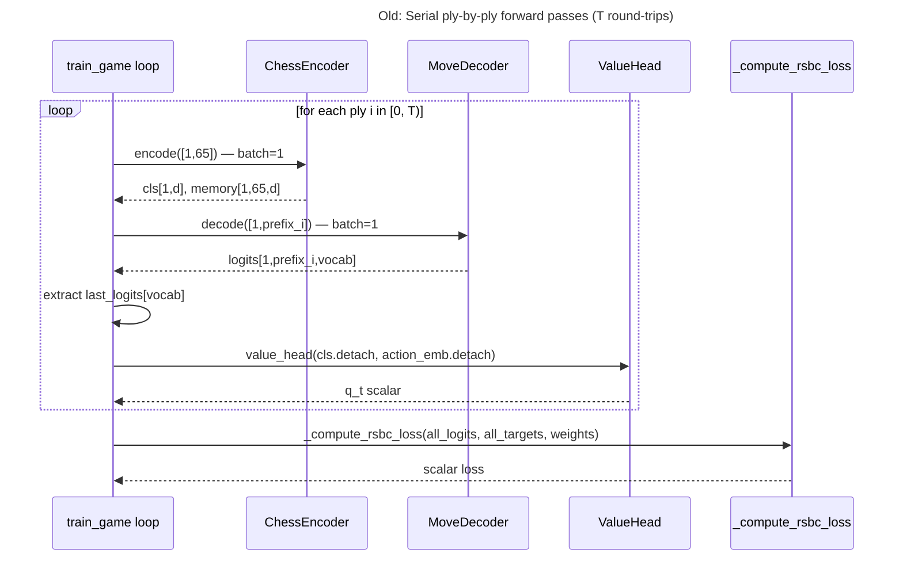
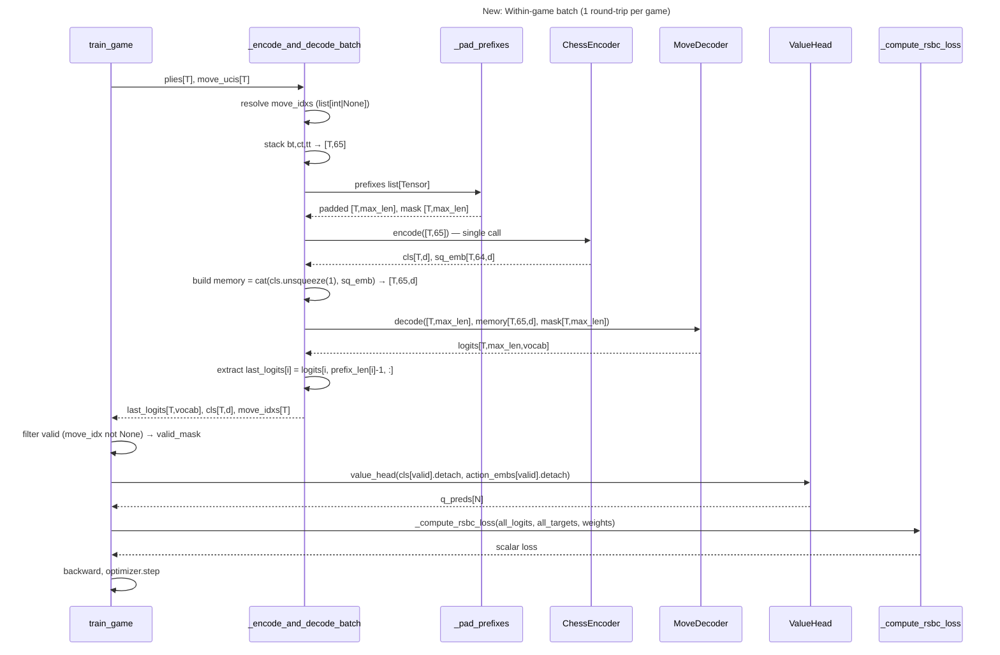

# Within-Game Batching — Design

## Problem Statement

`PGNRLTrainer.train_game` processes each filtered ply of a chess game in a serial
`for` loop (lines 411–466, `pgn_rl_trainer.py`), issuing one `encoder.encode()` call
and one `decoder.decode()` call per ply at batch size 1. A 1,000-game run at ~30
filtered plies per game produces ~30,000 serial GPU forward passes. GPU utilization
for batch-1 transformer inference is typically under 10% — the kernel launch overhead
alone dominates. Profiling of the current loop shows this phase accounts for 60–70%
of the 14.5 min/epoch wall time. Eliminating the serial loop via within-game batching
reduces GPU round-trips from O(T) to O(1) per game.

---

## Feasibility Analysis

| Approach | Pros | Cons | Verdict |
|----------|------|------|---------|
| **Within-game batching** — stack all T filtered plies into a single `[T, 65]` encoder call and a single padded `[T, max_len]` decoder call per game | Drops serial GPU round-trips from T to 1. No new data structures. All model components accept batched inputs already. | Variable-length prefixes require padding and a `tgt_key_padding_mask`; last-logit extraction needs per-ply index math. | **Accept** |
| **Cross-game batching** — accumulate plies from multiple games into a global buffer and issue one large batch update per N games | Higher GPU utilization; fewer optimizer steps per epoch | Reward computation mixes games; gradient-per-game semantics are lost; OOV filtering crosses game boundaries; significant refactor of `train_game` and `train_epoch` | Reject — scope far exceeds the bottleneck fix; reward mixing is a correctness risk |
| **Serial loop unchanged** — defer optimization | Zero implementation risk | 14.5 min/epoch persists; scales poorly with larger PGN sets | Reject |

**Eliminated approaches:** Cross-game batching requires rethinking the reward signal
attribution and the per-game `optimizer.step()` semantics. The risk-to-gain ratio
is unfavorable for a pure speed improvement.

---

## Chosen Approach

Within-game batching replaces the per-ply `for` loop in `train_game` with a single
call to a new method `_encode_and_decode_batch`. This method stacks all T filtered
plies into a single encoder batch `[T, 65]`, pads their variable-length decoder
prefixes to `max_len_in_game` via a shared `_pad_prefixes` helper, runs one encoder
call and one decoder call, then extracts the last valid logit per ply using
per-ply prefix-length indexing. OOV move resolution happens before the forward pass
so that the returned logit tensor and the OOV index list are aligned. Everything
downstream — `_compute_rsbc_loss`, the value head, `backward()` — is unchanged.
The serial `_encode_and_decode` method is retained without modification for
`evaluate()` and `sample_visuals()`.

---

## Architecture

### Old data flow (serial)



### New data flow (batched)



*Caption: The new path collapses T serial GPU calls into one encoder call and one
decoder call per game. All shapes and downstream interfaces remain identical.*

---

## Component Breakdown

### New: `_pad_prefixes`

- **Responsibility:** Pad a list of variable-length prefix tensors to a common max
  length and produce the corresponding boolean padding mask.
- **Key interface:**
  ```python
  def _pad_prefixes(
      self,
      prefixes: list[Tensor],  # each [L_i] long
  ) -> tuple[Tensor, Tensor]:
      ...
      # returns: padded [T, max_len] long,
      #          mask [T, max_len] bool (True = PAD)
  ```
- **Notes:** Uses `torch.zeros` for padding value (any constant is fine; masked
  positions do not participate in attention). Extract to a private method — never
  inline. Testable in isolation without a model instance.

---

### New: `_encode_and_decode_batch`

- **Responsibility:** Execute a single batched encode-decode forward pass over all T
  filtered plies of one game, returning per-ply last logits and CLS embeddings.
- **Key interface:**
  ```python
  def _encode_and_decode_batch(
      self,
      plies: list[OfflinePlyTuple],
      move_ucis: list[str],
  ) -> tuple[Tensor, Tensor, list[int | None]]:
      ...
      # returns: (
      #   last_logits [T, vocab],
      #   cls         [T, d_model],
      #   move_idxs   list[int | None] length T
      # )
  ```
- **Protocol:** None required — private method of `PGNRLTrainer`.
- **Testability:** Accepts plain `OfflinePlyTuple` list; can be called with a
  cpu-only `ChessModel` in unit tests.
- **Internal steps:**
  1. Resolve all `move_ucis` via `self._move_tok.tokenize_move`; catch `KeyError`
     per entry → `None`. Collect into `move_idxs: list[int | None]`.
  2. Stack `ply.board_tokens`, `ply.color_tokens`, `ply.traj_tokens` into
     `[T, 65]` long tensors and move to `self._device`.
  3. Call `_pad_prefixes([ply.move_prefix for ply in plies])` →
     `padded [T, max_len]`, `mask [T, max_len]`.
  4. `enc_out = self._model.encoder.encode(bt, ct, tt)` →
     `cls [T, d_model]`, `sq_emb [T, 64, d_model]`.
  5. Build `memory = torch.cat([cls.unsqueeze(1), sq_emb], dim=1)` →
     `[T, 65, d_model]`.
  6. `dec_out = self._model.decoder.decode(padded, memory, mask)` →
     `logits [T, max_len, vocab]`.
  7. Compute `prefix_lens: list[int] = [p.move_prefix.size(0) for p in plies]`.
  8. Extract `last_logits[i] = dec_out.logits[i, prefix_lens[i] - 1, :]` for each i
     → stack into `[T, vocab]`.
  9. Return `(last_logits, enc_out.cls_embedding, move_idxs)`.

---

### Modified: `train_game`

- **Responsibility:** Orchestrate one complete game's training step using the new
  batched forward pass.
- **Key interface:** Unchanged — `train_game(game, game_idx) -> dict[str, float]`.
- **New config field:**

  | Field | Type | Default | Location | Description |
  |-------|------|---------|----------|-------------|
  | `max_plies_per_game` | `int` | `150` | `RLConfig` | Games with more filtered plies than this threshold are skipped entirely (returns `{}`). Acts as a VRAM guard for unusually long games. |

  The guard is checked at the top of `train_game`, before any tensor allocation:
  ```python
  if len(plies) > self._cfg.rl.max_plies_per_game:
      return {}
  ```
- **Changes to lines 411–466:**
  - Remove the `for i, ply in enumerate(plies)` loop.
  - Replace with a single call:
    ```python
    last_logits_all, cls_all, move_idxs = (
        self._encode_and_decode_batch(plies, [p.move_uci for p in plies])
    )
    ```
  - Advance `self._ply_step += len(plies)` once, **before** the snapshot logging
    loop (see resolved Open Question 3).
  - Build `valid_mask: list[int]` — indices i where `move_idxs[i] is not None`.
  - Look up action embeddings for all valid indices in one call:
    ```python
    valid_midx = torch.tensor(
        [move_idxs[i] for i in valid_mask],
        dtype=torch.long, device=self._device,
    )
    action_embs = self._model.move_token_emb(valid_midx)  # [N, d_model]
    action_embs = action_embs.detach()
    q_preds_t = self._model.value_head(
        cls_all[valid_mask].detach(), action_embs
    )  # [N, 1]
    ```
  - Collect `all_logits = [last_logits_all[i] for i in valid_mask]` and
    `all_targets = [move_idxs[i] for i in valid_mask]`.
  - Everything from `_compute_rsbc_loss` onward is unchanged.
- **Board snapshot logging:** Snapshot logging moves to after the batch call. A local
  index loop over `board_snaps` uses a counter offset so the `% 100` cadence is
  preserved:
  ```python
  base_step = self._ply_step - len(plies)
  for j, snap in enumerate(board_snaps):
      local_step = base_step + j + 1
      if local_step % 100 == 0:
          self._log_board_snapshot(snap, local_step)
  ```

---

### Retained unchanged: `_encode_and_decode` (serial)

- **Responsibility:** Serial single-ply encode-decode path used by `evaluate()` and
  `sample_visuals()`.
- No modifications. Removing it would break both callers and require a separate
  design review.

---

## OOV Handling

Move index resolution occurs in step 1 of `_encode_and_decode_batch`, before the
forward pass. This means OOV plies do not waste GPU compute — their board and prefix
tensors still enter the batch, but the resulting logits for those rows are discarded
during the `valid_mask` filter in `train_game`. This is acceptable: the contribution
of OOV rows to GPU time is negligible (they are a small fraction of T), and
skipping them before the forward pass would require an unnatural conditional stack.

After the batch call, the implementor filters via:

```python
valid_mask = [i for i, idx in enumerate(move_idxs) if idx is not None]
```

All subsequent indexing into `last_logits_all`, `cls_all`, `rewards`, and `plies`
uses `valid_mask` directly. The existing `valid_reward_idxs` list in the old loop
maps exactly to `valid_mask` — rename, do not reinvent.

---

## Test Cases

| ID | Scenario | Input | Expected Outcome | Edge? |
|----|----------|-------|------------------|-------|
| T1 | Batched encoder matches serial | T=5 plies, same board/color/traj tokens fed to batch vs serial `encode()` calls | `cls_all[i]` equals `serial_cls[i]` within 1e-5 for all i | No |
| T2 | Batched decoder logits match serial | T=5 plies, same prefixes (padded batch vs individual calls), same memory | `last_logits_all[i]` equals `serial_last_logits[i]` within 1e-5 | No |
| T3 | Padding mask excludes pad positions | T=3 plies with prefix lengths 1, 3, 5; max_len=5 | `mask[0, 1:]` all True; `mask[2, :]` all False; `last_logits[0]` uses position 0 | No |
| T4 | OOV ply in middle of game | Ply index 2 of 5 has an untokenizable UCI string | `move_idxs[2]` is None; logits/cls for indices 0,1,3,4 are unaffected; loss computed over 4 plies | Yes |
| T5 | Single-ply game (T=1) | One ply, prefix length 1 `[SOS]` | Batch shape `[1, 65]` and `[1, 1]`; no errors; `last_logits` shape `[1, vocab]` | Yes |
| T6 | `train_game` total loss: batch equals serial | Same game, same random seed, model in train mode | `metrics["total_loss"]` from batched run equals serial run within 1e-4 | No |
| T7 | `_ply_step` counter increments correctly | Game with T=7 plies, initial `_ply_step=0` | After `train_game`, `_ply_step == 7`; counter not incremented inside a loop | No |
| T8 | `_pad_prefixes` output shapes | Input: 3 tensors of lengths 2, 4, 6 | `padded.shape == (3, 6)`, `mask.shape == (3, 6)`, `mask[0, 2:].all()` True | No |
| T9 | All plies OOV | Every move UCI untokenizable | `move_idxs` all None; `train_game` returns `{}` (no-op) | Yes |
| T10 | Game exceeds `max_plies_per_game` threshold | Game with T=200 filtered plies, `max_plies_per_game=150` | `train_game` returns `{}` immediately; no forward pass issued | Yes |

---

## Coding Standards

- **DRY:** `_pad_prefixes` is a shared helper; the padding logic must not be inlined
  in `_encode_and_decode_batch` or duplicated anywhere else.
- **Typing:** All new and modified method signatures carry complete annotations. No
  bare `Any`. `list[int | None]` for move indices; `tuple[Tensor, Tensor]` for pad
  helper return.
- **Decorators:** No new cross-cutting decorators are needed. Existing logging and
  gradient-clip patterns are unchanged.
- **Comments:** Each non-obvious step inside `_encode_and_decode_batch` (especially
  the last-logit extraction) carries a comment of ≤ 280 characters explaining the
  index math.
- **No new dependencies:** No new packages. `torch.nn.utils.rnn.pad_sequence` is
  already available via `torch` and may be used in `_pad_prefixes`.
- **`unittest` before implementation:** T1 through T10 must be expressed as
  `unittest.TestCase` methods before any implementation code is merged. Tests using
  a minimal `ChessModel` instance on CPU are preferred over mocks for T1/T2.
- **Test model size:** Unit tests (T1--T10) should use `d_model=64` for speed. This
  is smaller than the production `d_model=128` but sufficient for shape and numerical
  equivalence checks.
- **`_encode_and_decode` (serial) must not be modified.** It is the reference
  implementation for T1/T2 and the live path for `evaluate` and `sample_visuals`.

---

## Open Questions

1. **VRAM ceiling for long games.**
   **Resolution:** A new `max_plies_per_game: int` field (default `150`) is added to
   `RLConfig`. Games exceeding this threshold are skipped entirely — `train_game`
   returns `{}` with no forward pass. No chunked-batching fallback; skip-and-log is
   sufficient for the rare outlier games. See the config table under `train_game`
   changes and test case T10.

2. **`_log_board_snapshot` placement.**
   **Resolution:** Board snapshot logging moves to after the batch call. A local index
   loop over `board_snaps` uses a counter offset (`base_step = _ply_step - len(plies)`)
   so the `% 100` cadence is preserved. See the code snippet under `train_game` changes.

3. **`_ply_step` increment location.**
   **Resolution:** `_ply_step += len(plies)` is called once, before the snapshot
   logging loop. The snapshot loop reconstructs per-ply step values via
   `base_step + j + 1`, so the `% 100` check remains correct despite the bulk
   increment.
